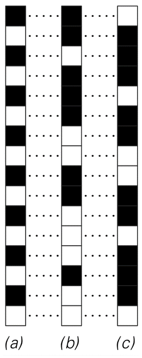
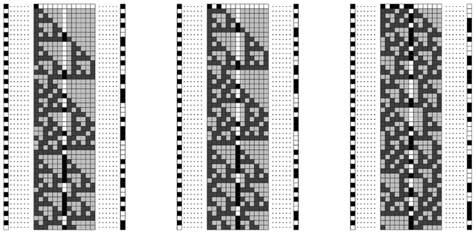
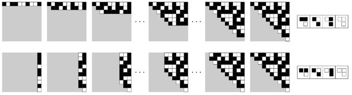
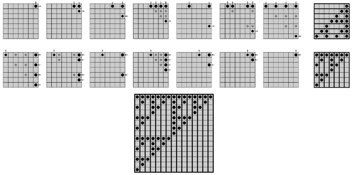
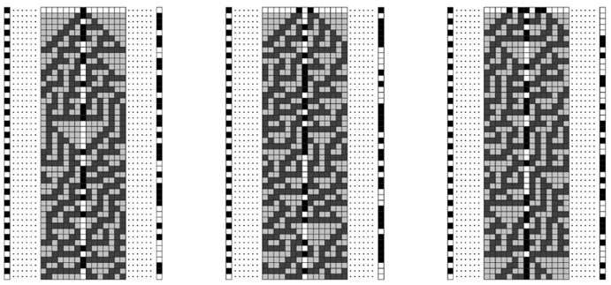
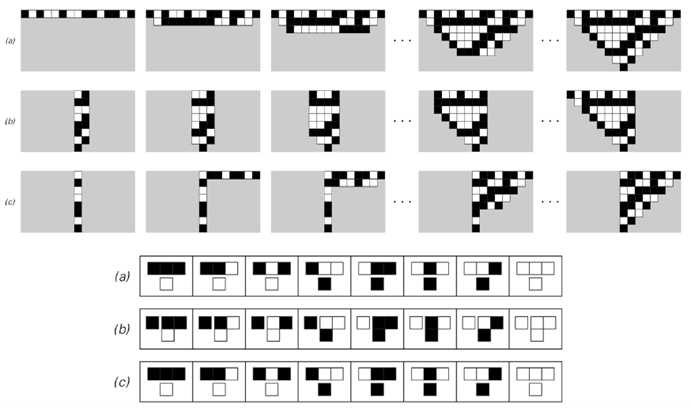
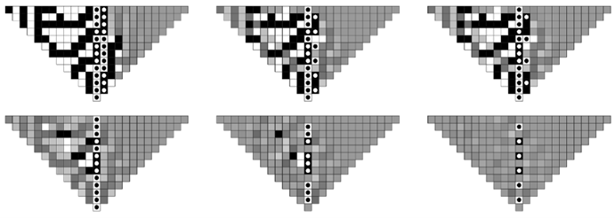

### 10.10  密码学和密码分析

密码学的目的是通过加密信息来隐藏其内容，使其无法被识别，除非某人拥有特殊的解密密钥。而密码分析的目的是通过找到解密信息的方法，而无需密钥，从而破解密码。

下图展示了一种用黑白方块序列表示的信息加密的标准方法。基本思想是有一个加密序列，如左侧列（b）所示，然后将原始信息（a）中的每个方块的颜色反转，对于加密序列（b）中对应方块为黑色的情况，从而得到加密后的信息版本（c）。

那么，如果收到加密信息（c），如何恢复原始信息（a）呢？如果知道加密序列（b），那么就很简单了。因为只需要重复加密时使用的过程，将（c）中每个方块的颜色反转，对于（b）中对应方块为黑色的情况。

但是，如何安排只有信息的预期接收者知道加密序列（b）呢？在某些情况下，可能可以通过某种安全的方式传输整个加密序列。但更常见的是，只能以安全的方式传输一些简短的密钥，然后必须从这个密钥生成加密序列。

那么，可以使用什么程序从密钥中获取加密序列呢？对面页顶部的图片展示了一种非常简单的方法，这种方法在实际密码学中直到不到一个世纪前还被广泛使用。这个想法只是通过反复循环密钥中的元素来形成一个加密序列。如图所示，将其与原始信息结合，可以得到一个加密信息，其中原始信息中的至少一些结构被掩盖了。

但也许并不奇怪的是，在这种情况下进行密码分析相当容易。因为如果能找出加密序列中任何足够长的段是什么，那么就可以立即得到密钥，并且从密钥中可以立即生成加密序列的其余部分。

>加密方案的示例。从原始信息（a）开始，通过反转加密序列（b）中对应方块为黑色的每个方块的颜色，生成加密信息（c）。这个方案基本上是所有实用流密码的基础。

(p 598)

那么，要找到加密序列的一个段，需要进行什么样的分析呢？在一个极端但实践中常见的情况下，人们可能会碰巧知道原始信息的某些部分——也许是标准化的问候语或类似的内容——并且通过将这些部分的原始形式和加密形式进行比较，人们可以立即推断出加密序列的相应部分必须是什么。

而且，即使人们所知道的只是原始信息是用某种确定的语言编写的，这通常也足够好了。因为这意味着将会有某些块——比如英语中的“the”这样的词——在原始信息中出现的频率远高于其他词。而且，由于这些块在加密序列的重复周期中的相同位置出现时必须以相同的方式加密，它们将在加密信息中导致偶尔的重复——这种重复的间距总是重复周期的某个倍数。所以，这意味着仅仅通过观察重复之间间距的分布，人们就可以确定加密序列的重复周期。

一旦知道了这一点，找到实际的密钥通常就相当直接了。因为人们可以从加密信息中挑选出在加密序列的重复周期中的某个点出现的所有方块，这些方块因此是使用密钥中的特定元素进行加密的。然后，人们可以问这样的方块是黑色的多还是白色的多，并将其与通过观察原始信息语言中的字母频率而得到的结果进行比较。如果这两个结果相同，那么这表明密钥中对应的元素是白色的，如果它们不同，那么这表明它是黑色的。一旦找到了一个候选密钥，就很容易通过尝试使用它来恢复原始信息的某个相当长的部分来检查密钥是否正确。因为除非拥有正确的密钥，否则人们恢复的内容在原始信息的语言中有意义的机会是绝对可以忽略不计的。

>这是一个简单的加密系统示例，其中加密序列是通过重复循环密钥中的元素来获得的。展示了使用两个不同的密钥进行加密。在每种情况下，原始信息在左边，加密信息在右边，加密序列对应于突出显示的单元格列。该系统本质上是一种维吉尼亚密码，这种密码在16世纪到20世纪初被广泛使用。

(p 599)

那么，如果使用更复杂的规则从密钥生成加密序列，会发生什么呢？事实证明，像上面这样的方法仍然允许找到加密序列的特征。因此，为了使密码学发挥作用，必须满足即使知道加密序列的某些特征或部分，仍然难以推断出原始密钥或以其他方式生成序列的其余部分。

下面的图片展示了电子密码学早期广泛使用的一种生成加密序列的方法，这种方法至今仍有时被使用。基本思想是观察有限宽度寄存器中加性元胞自动机的演化。密钥为元胞自动机提供了初始条件，然后通过例如对连续步骤中的特定元胞进行采样来提取加密序列。

>使用规则60加性元胞自动机进行加密。这本质上等同于线性反馈移位寄存器。

(p 600)

那么，给定这样一个加密序列，有没有简单的方法来进行密码分析，逆向操作并找出密钥呢？

事实证明，是有的。因为如下图所示，在像这里考虑的加性元胞自动机中，底层规则允许人们不仅可以从上一行推断出特定行的形式，还可以从右边的列推断出特定列的形式。这意味着，如果人们拥有加密序列的一段，对应于列的一部分，那么人们可以立即使用它来推断出一系列其他列的形式，从而找出元胞自动机中一行的形式——进而找到原始密钥。

但是，如果加密序列并不包含某一列中的每一个单元格，会发生什么呢？那么人们就不能立即使用上述方法了。但事实证明，底层规则的加性性质仍然使得相对直接的密码分析成为可能。

下一页的图片展示了这是如何工作的。由于加性，人们可以通过观察顶部行中某些特定位置的黑色单元格数量是奇数还是偶数，来推断出给定列中向下一定步数的某个单元格是否为黑色。然后，人们可以立即对此进行反向操作，从而得到一种方法，即从给定列中某些单元格组合的颜色推断出给定行上单元格的颜色。

>这是一个加性元胞自动机密码分析的基础示例。第一组图片展示了规则60元胞自动机的普通演化，其中每一行都是根据上一行推断出来的。第二组图片展示了一种侧向演化，其中规则被重新解释，以便可以从其右侧的列推断出一列单元格。请注意，在这两种情况下，如果不了解比所示更多的初始单元格的颜色，就无法确定左下角区域中单元格的颜色。

(p 601)

一列中哪些单元格是已知的，将取决于加密序列是如何形成的。但是，几乎在任何方案中，最终都有可能确定有限宽度寄存器中任何位置的单元格的颜色。因此，再一次，一个相当简单的过程就足以找出原始密钥。

那么，如何才能构建一个不易受到密码分析的系统呢？实践中经常使用的一种方法是，将上述类型的规则组合起来，然后希望这种规则的复杂性能够在某种程度上使密码分析变得困难。

但正如我们在这本书中多次看到的，更复杂的规则并不一定会产生本质上更复杂的行为。相反，我们发现，即使在极其简单的规则中，也有一些规则似乎能产生在某种意义上与任何事物一样复杂的行为。

>加性的另一个后果：规则60元胞自动机中行和列上单元格颜色之间的对应关系。在每种情况下，指定用圆点标记的单元格的颜色会立即确定用菱形标记的单元格的颜色。如果用点标记的单元格中有奇数个是黑色的，那么最后一个菱形单元格就是黑色的，否则就是白色的。右边的图片显示了顶行中的哪些单元格和右列中的哪些单元格分别决定了右列和顶行中连续位置的单元格。这些图片可以被视为矩阵，每个黑点位置为1，其他位置为0。将这些矩阵模2乘以与元胞自动机的一行相对应的向量，就可以得到一个列向量，反之亦然。这意味着第二行图片中的矩阵是第一行中矩阵的模2逆矩阵。

(p 602)

那么，这样的规则可以用于密码学吗？我强烈怀疑它们可以，而且事实上，它们允许人们构建的系统至少在密码分析方面与已知的任何系统一样安全。

下面的图片展示了一个简单的例子，基于我在本书中多次讨论过的规则30元胞自动机。这个想法是从由密钥定义的初始条件开始，通过对元胞自动机的演化进行采样来生成加密序列。

在前一页所示的加性元胞自动机的情况下，其嵌套结构使得可以使用本章讨论的许多感知和分析方法来识别规律。但是，对于规则30，即使从简单的初始条件开始，生成的大多数序列在迄今为止讨论的所有感知和分析方法看来都完全是随机的。

那么密码分析呢？这是否也找不到规律，或者它是否提供了一种特殊的方法——至少在下图所示的设置中——来识别任何必要的规律，以便人们能够推断出初始条件并从而确定密钥？

有一种方法原则上总是有效的：人们可以枚举每一种可能的初始条件，然后看看哪一种能产生所需的序列。但是，随着元胞自动机宽度的增加，可能的初始条件的总数迅速变得巨大，测试所有初始条件变得完全不可行。

>使用规则30的一列作为加密序列进行加密。我在1985年首次提出了这种方法。

(p 603)

那么还有其他方法可以使用吗？事实证明，如下图所示，规则30具有一种类似于前两页讨论的加性元胞自动机的特性：除了允许从上一行推断出一行之外，它还允许从右边的列推断出列。但是，与加性元胞自动机不同，它不是只需要一列，而是需要两列相邻的列才能实现这一点。

那么，如果加密序列对应于单列，如何找到相邻的列呢？下面的最后一行图片展示了一种方法。人们为顶行的右半部分选择一些单元格序列，然后向下演化。令人惊讶的是，事实证明，给定一列中的单元格，相邻列的可能性相当少。因此，通过对顶行上有限数量的序列进行采样，通常可以找到第二列，然后可以确定左边的列，从而找到候选密钥。

>规则30中的侧向演化。(a)显示了一行到下一行的普通演化。(b)显示了从一对相邻的列开始向左演化。(c)显示了如何从右边的一行单元格中填充第二列。如果加密序列由一整列单元格组成，那么(b)的可能性是规则30中单侧加性的结果；它会导致一定程度的密码分析。

(p 604)

但是，破坏这种特定的密码分析方法相当容易：所要做的就是不要在形成加密序列时采样给定列中的每一个单元格。因为如果没有每个单元格，似乎就没有足够的信息让任何局部规则能够从其他列推断出一列。

下面的图片显示了这一点的证据。用点标记的单元格的颜色是给定的，然后根据从所有可能的初始条件开始获得的平均值填充其他单元格的颜色。

如果给出两列完整的单元格，那么左边的所有单元格都被确定为黑色或白色。如果给出一列完整的单元格，那么仍有大片单元格的颜色是确定的。但是，如果一列中只给出每隔一个单元格，那么关于其他单元格的颜色几乎没有什么明确的结论。

那么，第602页的方法呢？这里不能用吗？事实证明，该方法严重依赖于底层规则的加性。由于规则30不是加性的，所以它根本不起作用。发生的情况是，从附近列中单元格的颜色确定特定单元格颜色的函数迅速变得极其复杂——因此，该方法可能最终本质上并不比仅仅枚举可能的初始条件更好。

>在考虑了所有可能的初始条件（这些条件再现了用点表示的单元格中的颜色排列）之后，由规则30生成的图案。如果一个单元格完全是黑色或完全是白色，那么这意味着它的颜色是由给定的约束唯一确定的。如果单元格显示为灰色，那么这意味着它有一定概率是黑色，也有一定概率是白色。请注意，当指定了两个完整的相邻列时，左侧的所有单元格都被确定了。但是，当指定的单元格较少时，被确定的单元格数量迅速减少，这表明密码分析可能会变得困难。

(p 605)

因此，结论是，至少使用标准的密码分析方法以及其他几种方法，似乎没有简单的方法可以从任何适当选择的加密序列中推断出规则30的密钥。但是，如何确定真的没有简单的方法可以做到这一点呢？在第12章中，我将讨论这类问题的一些基本方法。但作为一个实际问题，可以说，不仅直接尝试找到推断规则30中密钥的简单方法失败了，而且尽管付出了一些相当大的努力，但在解决任何与这个问题等价的问题上，几乎没有取得什么进展。

