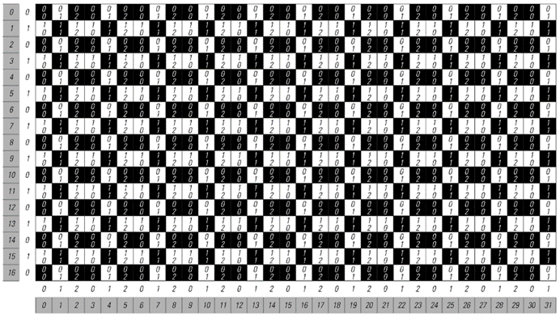
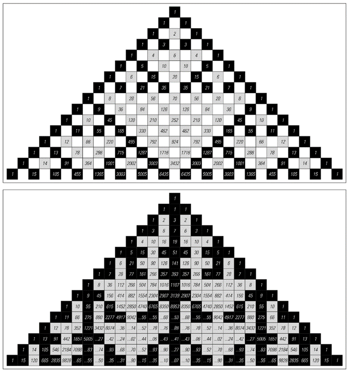
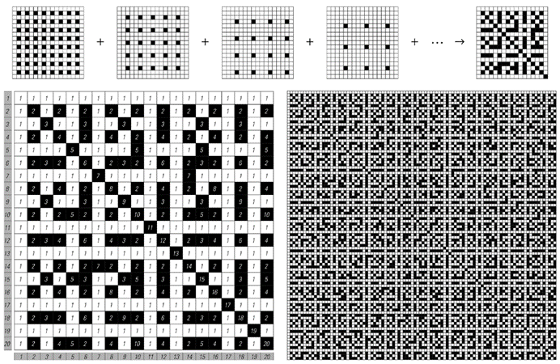
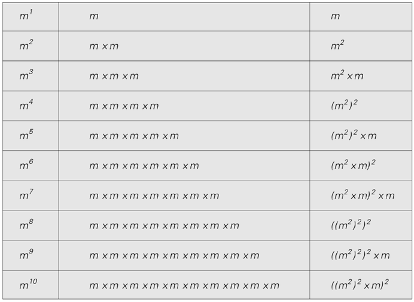
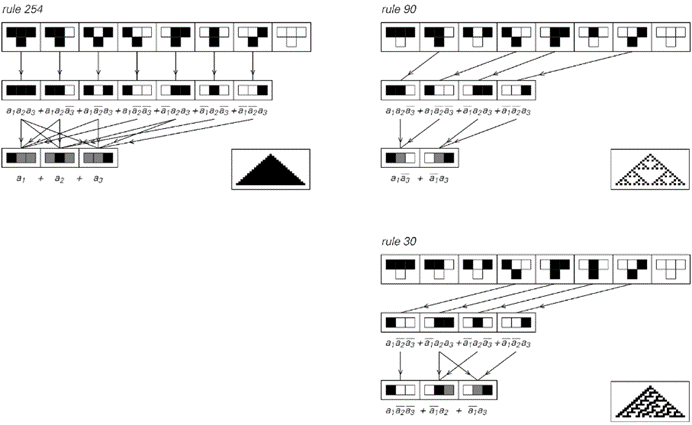

### 10.11  传统数学和数学公式

长期以来，传统数学一直是理论科学中使用的主要分析方法。它的目标通常可以被认为是试图找到一个数学公式来总结一个系统的行为。因此，在一个简单的情况下，如果有一个黑白方格的数组，人们通常会寻找一个公式，该公式接受指定特定方格位置的数字，并据此告诉人们该方格是黑色还是白色。

>这是一个例子，说明如何通过简单的数学程序从其坐标找到重复模式中任何方格的颜色。该程序获取方格的x和y坐标，并分别计算它们除以3和2后的余数。使用这些余数（每个方格内显示），可以通过左下角显示的重复块中的简单查找来确定特定方格的颜色。整个程序可以使用涉及Mod函数或更传统的Sin函数等函数的数学公式来表示。

(p 606)

对于纯重复性的模式，公式总是很直接，正如对面页底部的图片所示。因为人们所需要做的只是计算出特定方格的位置除以基本重复块大小后的余数，然后这个余数就会立刻告诉人们如何查找所需的颜色。

那么嵌套模式呢？事实证明，在传统数学的大多数领域中，这样的模式已经被视为相当高级。但是，只要方法得当，最终找到它们的公式仍然相当直接。

关键的想法——与第4章中的想法非常相似——是不要从数字的大小去思考，而是要从它们的数位序列去思考。有了这个想法，下一页的图片就展示了一个如何为嵌套模式构造实际上是一个公式的例子。

人们要做的是查看给出某个方格垂直和水平位置的数字的数位序列。然后在所展示的特定情况下，比较这两个序列中对应的数位，如果这些数位分别是0和1，那么方格就是白色的；否则就是黑色的。

那么为什么这个方法有效呢？

正如我们在本书中多次讨论过的，任何嵌套模式都必须——几乎根据定义——能够通过一个邻域无关的替换系统来再现。而在下一页所展示的情况下，这个系统的规则是这样的：它们将每一步中的每个方格替换成一个2×2的新方格块。所以正如图片所示，这意味着新方格的位置总是涉及包含额外一位数的数字。在所展示的特定规则下，新方格的颜色总是与旧方格相同，除了一个特定的情况：当一个黑色方格被替换时，出现在右上角的新方格总是白色的。但这个方格具有这样的特性：其垂直位置以0结尾，其水平位置以1结尾。因此，如果与特定方格位置相对应的数字在任何位置包含这种数位组合，那么就可以推断出这个方格必须是白色的。

(p 607)

那么，其他的嵌套模式呢？事实证明，通过使用上述论证的扩展，总是可以采用生成特定嵌套模式的替换系统的规则，并根据这些规则构建一种程序，以便在给定位置的情况下查找模式中方格的颜色。下面的图片展示了几个例子，在所有情况下，这些程序都相当直接。

>这是一个例子，展示了如何通过相当简单的数学程序根据嵌套模式中任何方格的坐标来找到其颜色。该程序的工作原理是查看坐标的二进制数位序列。如果特定方格的y坐标中的任何数位在x坐标中对应的数位为1时为0，则该方格为白色；否则为黑色。右下角的有限自动机给出了这一规则的表示。从黑色方格开始，沿着与在y和x坐标中遇到的连续数位相对应的连接序列前进。在有限自动机中最终到达的任何方格都会给出所需的颜色。左侧的图片说明了为什么这个程序有效。嵌套模式可以通过具有所示规则的二维替换系统构建。在这个替换系统的演化过程中，每一步都会得到一个更精细的方格网格，每个方格实际上都由其坐标中的一个额外数位指定。

(p 608)

>在各种嵌套模式中确定给定位置方格颜色的程序。在每种情况下，整个模式都可以通过反复应用所示的替换系统规则来生成。同样，也可以通过将特定方格的y和x坐标的数位序列输入到所示的有限自动机中来找到其颜色。所示的第一个例子对应于元胞自动机规则60；最后两个例子分别对应于规则90和150。在示例的顶部一行中，替换系统的初始条件是一个单独的黑色方格，有限自动机的起始状态也是其黑色状态。在示例的第二行中，初始条件由一个浅灰色方格旁边的一个黑色方格组成。在这些情况下，可以通过从有限自动机中的浅灰色状态开始来找到中心左侧方格的颜色；可以通过从黑色状态开始来找到右侧方格的颜色。

(p 609)

然而，尽管这些程序可以很容易地作为程序来实现，但在某种意义上，它们并不是基于传统上被认为是普通数学函数的东西。那么，事实上，是否有可能得到只涉及这类函数的方格颜色的公式呢？

在对面页面顶部所示的一个特定情况下，这实际上相当容易。因为这个特定的模式（它等同于前一页每行开头的模式）可以通过将帕斯卡三角形格式中的数字对相加来获得，然后在出现奇数的地方放置一个黑色方格。

如下表所示，帕斯卡三角形中的项只是展开(1 + x)的幂时出现的二项式系数。因此，要确定模式中的特定方格是黑色还是白色，只需计算相应的二项式系数，并查看它是否为奇数。这意味着，如果黑色用1表示，白色用0表示，那么就可以给出位于第y行第x个位置的方格颜色的明确公式：它就是(1 - (-1)^Binomial[y, x])/2。

那么对面页面底部的图片呢？与顶部图片一样，可以给每个方格分配数字，但现在这些数字是通过连续相加三个数字而不是两个数字来计算的。同样，这些数字作为系数出现，但现在是在展开(1 + x + x^2)的幂中，而不是在展开(1 + x)的幂中。

>对面页面上的模式的代数表示。每行上的xn的系数给出了每个方格的值。这些系数也可以通过给出的二项式（Binomial）和盖根保尔多项式（GegenbauerC）的公式来获得。如果方格的值a是奇数，则该方格被着色为黑色。这可以通过Mod[a, 2]或等效的(1 - (-1)^a)/2或Sin[π/2 a]^2来确定。上面的多项式序列可以通过展开生成函数1/(1 - (1 + x)^y)和1/(1 - (1 + x + x^2)^y)来获得。Binomial[m, n]是普通的二项式系数m!/(n!(m-n)!)。GegenbauerC是一个所谓的正交多项式，即一种高等数学函数。

(p 610)

那么，这些系数是否有明确的公式呢？如果只局限于固定数量的基本数学函数，以及阶乘和多项式系数，那么似乎没有。但是，如果也允许使用更高等的数学函数，那么事实上可以发现这样的公式：如上表所示，每个系数都由一个所谓的盖根保尔函数或超球面函数的特定值给出。

>使用算术运算构造的嵌套模式。顶部的例子是帕斯卡三角形，它是通过将每个数字设置为其正上方一行中左侧和右侧数字的和而形成的。底部的例子是帕斯卡三角形的一种推广，其中每个数字都是其正上方一行中左侧、上方和右侧数字的和。在这两种情况下，当方格中出现的数字是奇数时，方格被着色为黑色。颜色的极限排列对应于嵌套模式。对于顶部的图片，模式是遵循规则90的加法元胞自动机生成的；对于底部的图片，模式是遵循规则150的加法元胞自动机生成的。顶部图片中的数字是二项式系数；底部图片中的数字是特定的三项式系数。

(p 611)

那么，其他嵌套模式的情况如何呢？前一页上所示的两个模式都相当特殊，因为它们不仅可以通过替换系统生成，还可以通过具有简单加法规则的一维元胞自动机逐行演化生成。事实上，上面使用的方法可以看作是这种加法规则在普通数字领域的直接推广。

对于其他一些嵌套模式，存在与加法元胞自动机和类似系统相当简单的联系，尽管通常是在更多维度或更多邻居的情况下。但是，对于大多数嵌套模式，似乎没有明显的方法将它们与普通数学函数联系起来。尽管如此，我还是猜测，最终事实上有可能用适当推广的超几何函数，或者可能是传统数学中使用的函数的其他直接推广，来得到任何嵌套模式的公式。

然而，考虑到嵌套模式往往看起来如此简单和规则，将它们表示为传统数学公式如此困难可能会让人感到惊讶。当然，如果这个例子有任何借鉴意义，那么我们开始认为，本书中多次看到的更复杂类型的模式实际上不可能用这样的公式来表示。

但是，事实证明，至少有一些情况下可以找到传统的数学公式，尽管从视觉上看或者从其他感知和分析方法来看，一个模式可能非常复杂。

对面页面顶部的图片就是一个例子。一个模式是通过叠加一系列重复的网格构建起来的，从视觉上看，这个模式非常复杂。但事实上，每个方格的颜色都有一个简单的公式：给定指定方格水平和垂直位置的数字之间的最大公约数，当这个公约数为1时，方格为白色，否则为黑色。

(p 612)

那么，像元胞自动机这样具有明确演化规则的系统呢？是否存在这样的情况：由这些系统生成的模式在视觉上看起来很复杂，但实际上可以用简单的数学公式来描述？

我知道有一类这样的例子，下一页的图片将对此进行说明。这个想法是设置一行细胞，对应于某个基数下的数字的各个位数，然后在每一步中将这个数字乘以某个固定的因子。

这样的系统具有许多立即让人联想到元胞自动机的特征。但是，至少在基数为2时乘以3的情况下，乘法过程中的进位数字使得这个系统并不完全是一个普通的元胞自动机。然而，事实证明，在基数为6时乘以3，或者在基数为10时乘以2或5，永远不会导致进位数字，因此在这种情况下，可以将该系统视为遵循第二组图片中所示的那种纯局部元胞自动机规则。

>这是一个看起来复杂但仍然可以用简单的数学公式来表示的模式示例。给定水平和垂直位置x和y，当GCD[x, y] = 1时，一个方格为白色，否则为黑色。条件GCD[x, y] = 1等价于说x和y是互质的，或者说不需要约分就可以将分数x/y化为最简形式。可以证明，如果模式扩展得足够远，那么任何可能的黑色方格局部排列最终都会出现，尽管不一定以相同的频率出现。

(p 613)

>通过连续乘以一个固定因子生成的各种基数下的数字模式。第120页讨论了这样的系统。乘以因子m时，第t行对应于幂mt。因此，从第t行末尾开始第n个位置上的细胞的值是mt的第n位数字，即Mod[Quotient[mt, kn], k]。尽管这些模式的外观很复杂，但它们包含的每个方格的颜色都有一个相当简单的数学公式。

>与各种基数下的数字序列乘法等价的元胞自动机规则。图片的左半部分显示了基数为6、乘数为3时的规则的显式形式。数字数组总结了这种情况和其他情况的规则。请注意，只有某些特定的基数和乘数的选择才会导致普通的元胞自动机；其他选择会导致任意远距离的传播进位。（见第661页。）

(p 614)

如对面页顶部的图片所示，在所有情况下产生的整体模式往往看起来很复杂，并且在许多方面都是随机的。但关键在于，由于系统的构建方式，每个细胞的颜色仍然有一个简单的公式：它仅仅是由将乘数提升到等于步数的幂所得到的数字中的一个特定数字给出的。因此，尽管它们看起来很复杂，但对面页上的所有模式实际上都可以用简单的传统数学公式来描述。

但是，如果有人考虑实际使用这样的公式，他们可能会首先怀疑它们到底有什么好处。因为如果要通过明确执行t次乘法来计算幂mt的值，这将与明确遵循元胞自动机演化的t步非常相似。但关键在于，由于幂的某些数学特性，如下表所示，可以用远少于t次的操作来找到mt；实际上，例如，对于t中的每个基数2数字，总是只需要一次或两次操作就足够了。

那么，元胞自动机和类似系统产生的其他模式呢？最终是否所有这样的模式都可以用简单的数学公式来描述呢？我不这么认为。事实上，正如我将在第12章中论述的那样，我坚信在绝大多数情况下，由于一些根本性的原因，不可能找到任何这样的简单公式。但是，即使不存在简单的公式，原则上仍然总是可以用至少某种形式的公式来表示元胞自动机演化的任何过程的结果。

>这些例子展示了如何比连续乘法更有效地计算幂。在所示的案例中，在计算mt时，每一步是选择平方还是再乘以一个m的因子，是基于数字t的基数2表示中的连续数字来决定的。

(p 615)

下面的图片展示了在三个基本元胞自动机演化过程中的单个步骤中如何实现这一点。基本思想是将给定元胞自动机的规则转换为一个依赖于三个变量a1、a2和a3的公式，这三个变量的值对应于三个初始细胞的颜色。该公式由一系列项的和组成，除非三个细胞的颜色匹配规则产生黑色细胞的情况，否则每一项都为零。

首先，可以设置每一项以直接对应于原始规则中的一个情况。但通常这会导致一个比必要的更复杂的公式。因为图片展示了，通常可以通过忽略一些变量的值来将几个情况组合成一个项。

对面页顶部的图片展示了如果考虑元胞自动机演化的两个步骤会发生什么。现在总共有五个变量，但至少对于像规则254和90这样的规则，各个项最终并不依赖于这些变量中的大多数。

>三个基本元胞自动机规则的布尔表达式表示。第一行显示了原始的元胞自动机规则。第二行显示了根据每个规则产生黑色细胞的细胞组合。第三行显示了一个最小化版本，其中引入了灰色细胞来表示黑色或白色。在第二行和第三行下的公式中，变量ai表示第i个细胞的颜色。ei ej类似于ei ∧ ej，ei + ej类似于ei ∨ ej，而¬ei表示非ei。给出的公式是所谓的析取范式（DNF）。它们的设置方式是，对于任何特定的颜色配置，每个公式中最多只有一个项是相关的。

(p 616)

那么，如果考虑更多的步骤会发生什么呢？正如下一页的图片所示，像254和90这样行为相当简单的规则所导出的公式也保持相当简单。但对于规则30，公式迅速变得更为复杂。

因此，这强烈表明不存在简单的公式——至少是这里使用的类型——能够描述像规则30这样的系统中通过大量演化步骤产生的模式。

但其他类型的公式呢？我们迄今为止使用的公式可以被认为总是由变量乘积的和组成。但如果我们允许具有更一般结构的公式，而不仅仅是两级固定的运算呢？

事实证明，任何由黑白细胞块组成的规则都可以表示为仅一种类型运算的组合——例如数字电子中常用的所谓与非（Nand）函数。鉴于此，人们可以想象为任何特定规则找到涉及最少数量与非函数的公式。

>以下是三个基本元胞自动机演化过程中两个步骤的结果的布尔表达式表示。在每个案例的顶部显示了32种可能的初始细胞配置中每一种的明确结果数组。中间部分显示了产生黑色细胞的配置。底部是这些可能性集合的最小表示。

(p 617)

>三个基本元胞自动机演化过程中第1至第5步的结果的最小布尔表达式表示。规则254和90的整体行为相当简单，并产生了相对较小的布尔表达式。规则30的行为更为复杂，并产生了布尔表达式，其大小从一步到下一步迅速增长。（对于第1至第6步，表达式分别涉及3、7、17、41、102和261项。）在每种情况下，给出的布尔表达式都是所使用的析取范式（DNF）中可能的最小表达式。

(p 618)

下面的图片展示了一些结果的示例。我们再次看到的是，对于行为相当简单的规则，公式通常也相当简单。但在像规则30这样的情况下，即使只经过两步，得到的公式也已经相当复杂。

>与对面页相同的元胞自动机演化过程中前两步的与非（Nand）函数的最小表示。在每种情况下，所示的网络和公式都是涉及绝对最小数量运算的。有效地找到这些需要搜索数十亿种可能性。左上方的图片展示了一个与非函数的作用。接下来的三张图片展示了如何从与非函数中构建DNF公式中使用的运算。

(p 619)

因此，即使允许相当一般的结构，证据表明，最终没有办法建立任何简单的公式来描述像规则30这样的系统的演化结果。

而且，即使满足于复杂的公式，在特定情况下找到最不复杂的公式也会迅速变得极其困难。事实上，对于第618页上所示的公式类型，难度可能已经在每一步都翻倍了。而对于前一页上所示的更一般的公式，难度可能在每一步都以几乎是指数级的因子增加。

因此，这意味着就像我们考虑过的其他所有分析方法一样，我们别无选择，只能得出结论：传统数学和数学公式最终无法真实地告诉我们太多关于像规则30这样的系统所产生的模式的信息。

