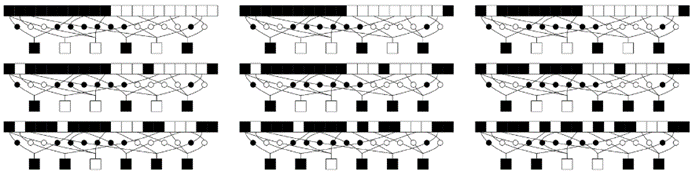

### 10.12  人类思维

当我们接触到新数据时，我们总能做的一件事就是运用我们的人类思维的一般能力来处理它。当然，这使我们能够以相当适度的努力来很好地处理我们在日常生活中选择与之交互的各种数据。但是，对于我在这本书中讨论过的那类系统生成的数据呢？人类的一般思维对此表现如何？

肯定有一些局限性，因为毕竟，如果人类的一般思维能够轻易地找到例如这本书中所有各种图片的简单描述，那么我们永远不会认为其中任何一个是复杂的。

过去，人们可能会认为，如果某些数据存在简单的描述，那么通过适当的思考和智慧，通常不会太难找到它。但这本书中的结果所确立的是，事实上这远非如此。因为在这本书中，我们看到了许多系统，它们的底层规则非常简单，但整体行为却非常复杂，以至于即使我们非常努力地思考，也无法识别出它们简单的起源。

(p 620)

通常，少量的思考就能让我们识别出至少一些规律性。但这些规律性通常也可以通过本章前面讨论的许多标准感知和分析方法相当容易地发现。

那么，人类的思考最终要贡献什么呢？它与其他感知和分析方法最明显的区别在于它对记忆的大规模使用。

我们讨论过的所有其他方法实际上都是通过获取每一块新数据并分别对其应用某种固定程序来运作的。但在人类思考中，我们通常会利用我们从接触数十亿块先前数据所积累的大量记忆。

有时，结果可能非常令人印象深刻。因为很常见的是，尽管没有其他方法对某块特定数据有太多可说，但我们可以通过记住之前遇到过的某块类似数据，立即为其提供一个描述。

因此，例如，由于我自己已经看过数千张由元胞自动机产生的图片，我可以立即从记忆中识别出几乎任何由基本规则生成的模式——尽管每当这些模式稍微复杂一些时，其他感知和分析方法都无法取得太大的进展。

但是，就人类记忆所能做的复杂事情而言，这种复杂性仅仅来自存储在记忆中的经历，还是某种程度上来自记忆机制本身呢？

在实际计算中，根据各种标准存储大量数据并检索它的想法在数据库中当然是非常熟悉的。但典型的数据库操作方式与人类记忆操作方式之间至少存在一个重要的区别。因为在标准数据库中，人们往往只能找到符合某些精确规范的数据，例如包含与特定文本字符串完全匹配的内容。然而，人类记忆似乎通常能够根据更一般的相似性概念来检索数据。

(p 621)

一般来说，如果一个人想找到具有某种特性（无论是精确的还是近似的）的数据，那么一种方法就是扫描自己存储的所有数据，并逐一测试它们。但即使进行了各种并行处理，这种方法最终也会变得相当不切实际。

那么，一个人能做什么呢？在完全匹配的情况下，实际中有几种广泛使用的方法。

可能最熟悉的是在典型字典中所做的：所有条目都按字母顺序排列，这样当查找某个条目时，就不需要扫描每一个条目，而是可以快速定位到想要的条目。

实用的数据库系统几乎普遍使用一种称为哈希的稍更有效的方案。基本思想是有一些明确的程序，它接受任何单词或其他数据，并从中派生出一个所谓的哈希码，该哈希码用于确定数据存储的位置。关键是，如果正在查找特定数据，那么可以对该数据应用相同的程序，获取数据的哈希码，并立即确定数据存储的位置。

但是，为了使这起作用，是否需要一种复杂的哈希程序，该程序经过精心调整以适应正在处理的特定类型的数据？事实并非如此。实际上，真正必要的是哈希程序生成足够的随机性，这样即使原始数据中可能存在规律性，所产生的哈希码仍然最终在所有可能性中大致均匀分布。

正如人们可能从这本书的结果中所期望的那样，即使使用非常简单的程序，也很容易实现这一点——无论是基于数字，就像大多数实用的数据库系统那样，还是基于像元胞自动机这样的系统。

因此，这意味着无论存储什么类型的数据，都只需要一个非常简单的程序来设置一个哈希方案，该方案可以让人们非常高效地检索数据。我怀疑人类记忆的运行中至少涉及这种机制的某些方面。

(p 622)

但是，我们经常从记忆中检索的不仅仅是完全匹配的数据，还有仅仅是相似的数据，这一事实又该如何解释呢？普通的哈希方法无法让我们做到这一点。因为哈希程序通常会将不同的数据放在完全不同的位置——即使这些数据在某种程度上是相似的。

那么，是否有可能建立一种哈希形式，实际上能将相似的数据放在一起呢？从某种意义上说，人们需要的是一种哈希程序，其中生成的哈希码仅依赖于真正有差异的数据特征，而不是其他特征。

一个实际的例子是，经常用于按声音而不是拼写查找名称的简单程序。在其典型形式中，该程序通过删除所有元音并将听起来相似的字母（如“d”和“t”）分组来工作，其结果是，至少在某种程度上，保留的唯一特征是那些在单词发音方式上有所不同的特征。

那么，一般来说，如何实现这一点呢？

在许多方面，所有形式的感知和分析的主要目标之一正是挑选出被认为相关的数据特征，并丢弃所有其他特征。

因此，正如我们在本章前面所讨论的，例如，人类的视觉系统似乎是基于只有对某些特定图像特征作出反应的神经细胞。这意味着，如果只看这些神经细胞的输出，那么就会得到一个视觉图像的表示，在这个表示中，仅在某些细节上不同的两个图像将被赋予相同的表示。

因此，如果以这样的表示作为将数据存储在记忆中的基础，那么结果将是，人们不仅能够轻松地检索完全匹配的数据，还能够检索仅仅是相似到足以具有相同表示的数据。

在实际的大脑中，相当清楚的是，所有各种感觉系统接收到的输入首先由神经细胞集合进行处理，这些神经细胞实际上会提取某些特定特征。而且，似乎很有可能的是，特别是在较低级的生物中，通常是直接由这些特征形成的表示被存储在记忆中。

(p 623)

但至少在人类身上，情况可能更为复杂。因为我们经常能够立刻认出之前遇到过的某个特定物体，即使它在表面上呈现的方式完全不同。这表明，来自我们感官系统的完全不同的原始数据模式，至少在某些情况下，仍然可以在记忆中形成本质上相同的表示。

那么，这是如何实现的呢？一种可能是，我们的大脑可能被设置为提取某些特定的高级特征，比如三维空间中的拓扑结构，这些特征恰好能够成功地描述我们传统上处理的特定类型的物体。

但我强烈怀疑，实际上有一种更简单、更通用的机制在起作用，它基本上只在任意数据元素的层面运作，而不直接参考这些数据元素的来源或意义。

人们可以想象出用神经细胞建立这种机制的多种方式。

下面图片中展示了一个特别简单方案中的一个步骤。基本思路是有一系列神经细胞层，就像人们知道大脑中存在的那样，每一层中的每个细胞都只在它从上一层中某个固定的随机细胞集合中获得的输入形成某种确定模式时才会作出反应。

>这是一个非常简单模型中的一个步骤，展示了大脑中的神经细胞层如何为任意数据生成哈希码。图中显示了一层理想化的神经细胞对一系列逐渐不同的输入的反应。每个神经细胞只有在它从某些固定位置获得的输入与特定模板匹配时才会触发并产生黑色输出。所有神经细胞的输出序列可以用作哈希码，其值对于只有微小变化的输入往往是相同的。

(p 624)

从某种意义上说，这是对本章前面讨论的视觉感知方案的直接推广。但关键是，在这样的设置中，输入到第一层细胞的详细变化很少会对最后一层细胞的输出产生影响。

不难找到这样的系统：不同的输入往往产生相同的输出。事实上，这正是我们在第6章中讨论的吸引子这一普遍现象的本质，它出现在绝大多数元胞自动机中，事实上也出现在几乎任何遵循明确规则的系统中。

但上述设置的特殊之处在于，产生相同输出的输入往往是那些可以合理地认为是相似的输入，而产生不同输出的输入则往往是显著不同的。

因此，例如，单个输入细胞的变化通常不会有很大可能影响输出，而大部分输入细胞的变化则会影响输出。

因此，无论原始数据的哪些特征对应于哪些输入细胞，这种基本机制都提供了一种简单的方法来获得一种表示——从而是一种哈希码——这种表示对于在某种程度上具有足够相似特征的数据片段来说往往是相同的。

那么，这样的表示最终将如何使用呢？在像上面这样的方案中，输出细胞可能会连接到实际执行某种动作的细胞——也许导致肌肉移动，或者只是为进一步的神经细胞提供输入。

但是，我们的记忆的实际内容究竟存在于这一切的哪个环节呢？几乎可以肯定的是，它在某种程度上被编码在神经细胞之间的连接的细节中。

但是，这样的细节是如何建立的呢？

有证据表明，由于周围神经细胞的行为，单个神经细胞可以发生永久性的变化。当大脑接收到数据时，这种变化至少在一些细胞中会发生。但是，如果观察视觉系统早期阶段的神经细胞，那么一旦大脑成熟到一定程度，这些细胞的特性似乎就很少发生变化。很可能在执行类似于生成哈希码的一般过程的许多神经细胞中也是如此。

(p 625)

这种缺乏变化的原因可能仅仅是因为，在相关层面上，与典型经验相对应的数据流的总体特性保持相当稳定。但也可能是因为，如果一个人希望可靠地检索记忆元素，那么别无选择，只能进行设置，以便所使用的哈希过程始终保持基本相同。

如果存在这样一个固定的方案，那么这意味着，虽然某些数据片段之间的相似性会立即得到识别，但其他相似性则不会。

那么，这与我们对人类实际记忆的了解相比如何呢？有许多种相似性，我们可以毫不费力地识别出来。但也有我们无法识别的相似性。因此，例如，给定一个有些复杂的视觉图像——比如一张脸或一个元胞自动机模式——我们通常甚至无法立即识别出与这个图像上下颠倒后的相似性。

那么，这些限制最终是人类记忆内在机制所固有的，还是仅仅反映了我们从对世界的典型实际经验中偶然建立起来的记忆的特征呢？

我猜想，这在某种程度上是两者的混合。但鉴于更重要的限制往往是我们记忆系统相当低层次的方面造成的结果，即使这些方面在原则上可以改变，实际上也几乎不可能做到。因为我们的记忆系统的低层次会接触到庞大的数据流。因此，为了造成任何实质性的改变，人们可能必须插入具有所需特殊属性的相当数量的数据。但对于与正常环境互动的人来说，这实际上绝对是不可能的。

因此，我最终强烈怀疑，人类记忆的基本规则几乎总是可以被视为基本上是固定的，而且，我认为，相当简单。

(p 626)

但人类思维的整个过程又是怎样的呢？它最终涉及哪些方面？我强烈怀疑，记忆的使用实际上是人类思维几乎每个主要方面的基础。

像概括、类比和直觉这样的能力，似乎立即与基于相似性从记忆中检索数据的能力密切相关。但是，像逻辑推理这样的能力呢？它们也许对应于一种更高层次的人类思维方式？

过去，人们常常认为逻辑可能是所有人类思维的理想化。在很大程度上由于这个原因，实际的计算机系统一直把逻辑视为某种相当基础的东西。但我强烈怀疑，事实上逻辑远非基础，特别是在人类思维中。

因为除其他事情外，在思维过程中，我们通常几乎能立即从记忆中检索出惊人的联系，而我们往往只能通过费力地一步一步地进行才能进行逻辑推理。我强烈怀疑，当我们这样做时，我们实际上只是再次使用记忆，检索我们从经验中学到的逻辑论证模式。

在现代，人们常常认为计算机语言提供了精确的方式来表示原本可能由人类思维执行的过程。但事实证明，今天使用的几乎所有主要语言都是基于建立程序的，而这些程序本质上是逐步逻辑论证的直接类比。

然而，碰巧的是，一个显著的例外是Mathematica。事实上，在设计Mathematica时，我特意尝试模仿人类似乎对许多类型的计算进行思考的方式。而我最终为Mathematica设计出的结构，可以被视为与人类记忆操作的精确理想化不无相似之处。

因为Mathematica的核心是存储规则集合的概念，其中每条规则都指定了如何转换所有与单个Mathematica模式匹配得足够相似的数据片段。而Mathematica的成功为这种方法的力量提供了相当有力的证据。

(p 627)

但最终，与其他计算机语言一样，Mathematica主要倾向于为相当明确的计算设置相当简短的规范。然而，在日常的人类思维中，我们似乎反而使用大量的存储数据来执行任务，而这些任务的定义和目标往往相当模糊。

过去，人们往往认为，鉴于其明显的复杂性，人类思维必然是一个从根本上来说相当复杂的过程，在任何层面上都无法用简单的解释或有意义的理论来阐述。

但从本书中的发现来看，我们现在知道，即使是非常简单的基本规则，实际上也可能产生高度复杂的行为。由此，人们立刻可以想象到，实际上可能存在相当简单的机制来支撑人类思维。

当然，大脑的构造有许多复杂的细节，毫无疑问，人类思维的某些特定方面依赖于这些细节。但我强烈怀疑，人类思维现象有一个明确的核心，它在很大程度上独立于这些细节，并且最终将被证明是基于相当简单的规则。

那么，我们如何才能判断这是否属实呢？对大脑及其运作的详细直接研究可能会提供一些线索。但我的猜测是，只有在实际构建出能够成功模拟人类思维的技术系统时，才能真正获得令人信服的证据。

而事实上，到目前为止，我们在实际计算方面的经验并没有提供太多鼓励，认为这有可能实现。当然有一些任务，比如下棋或做代数，曾经被认为是人类思维的标志，但现在计算机已经可以常规地完成这些任务。然而，当涉及到看似更加平凡和日常的思维类型时，现有的计算机和程序往往几乎荒谬地不足。

那么，为什么我们没有做得更好呢？毫无疑问，部分答案与计算机和存储系统的各种实际问题有关。但我怀疑，更重要的部分与方法论问题有关。

(p 628)

因为人们几乎总是认为，要在一般意义上模拟像人类思维这样复杂的过程，必然需要一个极其复杂的系统。因此，大多数情况下，人们所做的只是尝试构建只能执行相当特定任务的系统。

然而，为了确保能够实际执行适当的任务，系统的设置往往像传统工程一样，使它们的行为可以很容易地预见，通常是通过标准的数学或逻辑方法。而这几乎总是意味着，它们的行为被迫相当简单。事实上，即使系统具有一定的学习能力，它们的行为通常也倾向于表现得非常简单和可预测，就像古典小说中的机器人一样，与典型的人类思维相去甚远。

因此，基于传统的直觉，人们可能会认为，解决这个问题的方法必须是使用具有更复杂底层规则的系统，这些规则可能更紧密地基于人类心理学或神经生理学的细节。但从本书中的发现来看，我们知道事实并非如此，事实上，非常简单的规则就足以产生高度复杂的行为。

然而，如果有人坚持执行特定且明确界定的任务的目标，那么可能仍然存在问题。因为只要所得到的行为是复杂的，通常就很难将其引导到特定的任务上——这是一个在处理实际人类时相当熟悉的问题。所以这意味着，在某种程度上，再现一般的人类思维可能比仅为特定任务设置某种特殊版本的人类思维要容易得多。

最终，我强烈怀疑，大多数用于一般人类思维的核心过程都将能够通过相当简单的规则来实现。

但关键的一点是，仅凭这些过程本身很可能不足以创建一个人们会轻易认为表现出人类思维的系统。因为为了能够与实际人类进行有意义的交流，该系统几乎肯定必须建立起一个人类般的经验基础。

(p 629)

毫无疑问，从实际操作的角度来看，这在一定程度上可以通过大规模记录实际人类的经验来实现。但似乎很可能的是，为了获得足够准确的经验基础，系统本身必须以与实际人类非常相似的方式与世界互动——因此，必须包含模拟人类生物结构和其他结构的许多复杂细节的元素。

然而，一旦我们拥有了一个成功模拟人类思维的明确系统，我们就可以想象逐步去除其中的一些复杂性，并观察人类思维的哪些特征最终得以保留。

那么，例如人类语言呢？这是纯粹从人类经验的细节中学习而来的吗？还是其中有一些特征反映了人类思维更根本的方面？

当一个人学习一门语言时——至少是作为一个小孩子时——他往往会潜移默化地推断出简单的语法规则，这些规则实际上是他所遇到的例子的特定概括。我怀疑，在这样做的过程中，一个人所做的概括类型本质上与一个人在从记忆中检索数据时容易识别的相似类型相对应。

实际的人类语言通常有许多简单的语法规则的例外。而且，似乎只要我们付出足够的努力，事实上我们可以学会几乎任何结构的语言。但是，大多数现代计算机语言都是专门设置为遵循简单的语法规则的，这似乎使它们的结构特别容易为我们所学——也许是因为它们与人类思维的低级过程非常契合。

但是，在一个进行人类式思考的系统中，语言的概念究竟在多大程度上是必要的呢？当然，在实际人类中，语言似乎对于沟通至关重要。但可以想象的是，如果某类系统中不同个体的底层细节足够相同，那么沟通就可以通过直接传递低级的活动模式来实现。然而，我的猜测是，一旦不同个体的经验变得不同，这种方法就行不通了，因此将需要某种形式的一般中间表示或语言。

(p 630)

但是，我们真的需要一种具有普通人类语言那种顺序语法结构的语言吗？计算机系统的图形用户界面当然经常使用略有不同的方案。在简单的情况下，这些方案可以很好地工作。但我的一致经验是，如果想以一种合理易懂的方式指定任何具有重大复杂性的过程，那么唯一现实的方法是使用一种语言——比如Mathematica——它基本上具有普通的顺序语法结构。

我不确定这究竟是为什么。也许这只是因为我们熟悉传统的人类语言。或者，也许这是因为我们显然只能一次专注于一件事。但如果这最终反映了人类思维的相当基本的特征，我也不会感到惊讶。

事实上，我们在思考本书中系统产生的许多模式时遇到的困难可能与此不无关系。因为虽然普通的人类语言在描述重复甚至嵌套的模式方面没有什么困难，但它似乎对更复杂的模式无能为力——从某种意义上说，这就是为什么这本书如此依赖视觉呈现的原因。

一开始，人们可能会想象，人类思维必须涉及从根本上特殊的过程，与我们讨论过的所有其他过程完全不同。但正如过去几个世纪以来，人们已经清楚地认识到，人类的基本物理组成部分并不是特别特殊，所以——特别是在本书中的发现之后——我相当确定，最终将证明，人类思维所涉及的基本过程也没有什么特别之处。

事实上，我强烈怀疑，尽管人类思维看似复杂，但其背后的大多数重要过程实际上非常简单——就像我们在本章中讨论过的所有其他类型的感知和分析过程中所涉及的过程一样。

(p 631)

