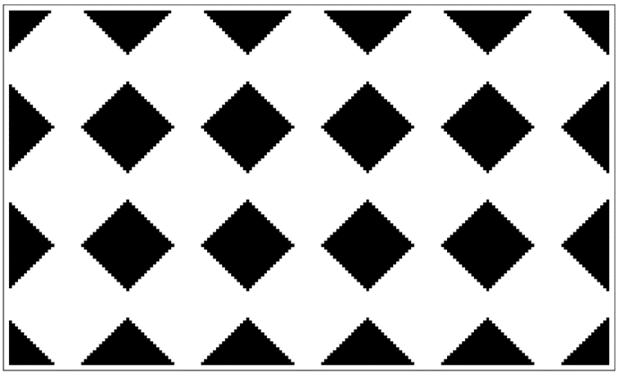
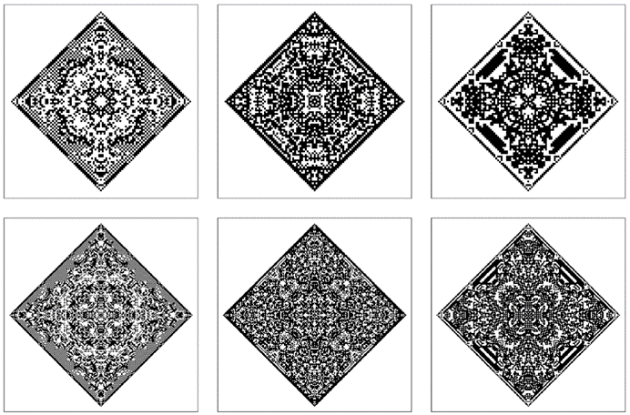

### 10.2  感知和分析的作用

在日常生活中，我们不断受到大量数据的轰炸，这些数据以图像、声音等形式存在。为了利用这些数据，我们必须将其减少到更易于管理的比例。这正是感知和分析所尝试做的事情。它们的作用实际上是处理大量的原始数据，并从中提取出我们可以使用的概要信息。

在原始数据层面，例如对面页面顶部的图片，可以被视为由成千上万个单独的黑白单元组成。但是，凭借我们的视觉感知和分析能力，我们可以立即看出，这幅图片可以简单地通过说它基本上由一系列重复的黑色菱形形状组成来概括。(p 548)

一般来说，数据可以通过感知和分析以两种方式减少。首先，对于任何目的都不相关的数据方面，我们可以简单地忽略它们。其次，我们可以利用所看到的规律性来避免明确指定数据中的每个元素。

因此，例如，在概括下面的图片时，我们选择忽略一些细节，然后用其简单重复的整体几何结构来描述剩余部分。

每当数据中存在规律性时，实际上就意味着部分数据是冗余的。例如，如果某个特定模式被重复，那么人们无需多次指定该模式的形式——因为原始数据可以通过重复该模式的副本来再现。而且，一般来说，规律性的存在使得有可能用基于数据再现过程的较短描述来替代数据的字面描述。

感知和分析有多种形式。有些在我们的眼睛、耳朵和大脑中相当自动地发生——我们通常称之为感知。其他则需要明确的意识努力和数学或计算工作——我们通常称之为分析。但在所有情况下，基本目标都是相同的：将原始数据减少到有用的摘要形式。

每当人们想要高效地存储或传输数据时，这样的摘要都非常重要。如果人们想要将新数据与旧数据进行比较，或者基于数据做出有意义的推断或预测，那么这样的摘要也很重要。在现代信息技术中，数据压缩、特征检测、模式识别和系统识别等问题实际上都围绕着寻找数据的有用摘要而展开。

>例如，有一幅图片，我们的感知和分析能力使我们能够很容易地以简单的几何术语非常简洁地对其进行概括。然而，在最底层，这幅图片由24,000个黑白单元组成。

(p 549)

在传统科学中，统计分析是尝试寻找数据摘要的最常见方法。一般来说，感知和分析可以视为寻找能够再现人们认为相关的数据各个方面的模型。

在许多方面，感知和分析与我们在本书中研究的大部分内容的逆过程相对应。因为通常我们是从一个简单的计算机程序开始的，然后观察这个程序产生了什么行为。但在感知和分析中，我们是从观察到的行为开始的，然后尝试推断出哪种程序或算法能够再现这些数据。

那么，这有多容易呢？事实证明，对于传统数学中使用的大多数规则来说，这实际上相当容易。但是，对于我在本书中讨论的更一般的规则来说，这似乎常常极其困难。因为即使规则可能很简单，它们产生的行为也往往非常复杂，并且完全没有其简单起源的明显迹象。

以其中一个例子来说，对面页面上的图片都是从一个单独的黑单元开始，然后应用非常简单的二维元胞自动机规则生成的。然而，如果只看这些最终的图片，没有简单的方法可以说明它们是如何制作的。我们标准的感知和分析方法当然可以确定这些图片例如是对称的。但这些方法通常都无法接近识别出实际上可以用来生成这些图片的程序的简单性。

人们可能会认为，我们无法找到这样的程序只是因为我们作为人类所发展的特定感知和分析方法的局限性所致。因此，人们可能会推测存在一种外星智能，能够观察我们的图片并立即告诉它们是由一个非常简单的程序产生的。

但事实上，我非常怀疑这种情况永远不会发生。因为我怀疑感知和分析所能做到的事情存在根本性的限制。因为似乎存在许多种类的系统，其中生成高度复杂的行为要比识别这种行为的起源容易得多。

(p 550)

正如我在这本书中所发现的那样，从简单的初始条件开始，然后遵循简单的规则集，很容易产生复杂的行为。但关键是，如果从一个特定的行为片段开始，通常没有这样简单的规则可以让人回溯并找出这个行为是如何产生的。通常，这个问题类似于试图找到满足某些约束的解决方案。而正如我们在本书中多次看到的那样，这样的问题可能极其困难。

因此，就最终使用的感知和分析的实际过程而言，如果它们相当简单，那么不可避免地会出现无法识别所观察到的行为起源的情况——即使这种行为实际上是由非常简单的规则产生的。

>从一个单独的黑单元开始，然后根据外部整体元胞自动机规则54、222和374进行50步和100步的演化所产生的图案。尽管可以对该过程进行简单的描述，但仅凭这里显示的最终图案，我们的标准感知和分析方法无法轻易地推断出这个描述。

(p 551)

