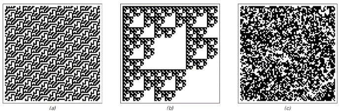

### 10.3  定义随机性的概念

在这本书中，我多次提到某个系统或另一个系统的行为似乎具有随机性。但到目前为止，我还没有给出我所指的随机性的精确定义。而我们将在这一节中发现的是，为了得出一个适当的定义，人们别无选择，只能考虑感知和分析的问题。

人们可能会认为，从传统数学和统计学中早就应该出现一些随机性的标准定义。但尽管偶尔会有人提出特定的定义，但随机性的概念实际上一直相当模糊。事实上，我认为只有随着本书中的发现，人们现在终于能够真正理解随机性是什么了。

在日常语言层面，当我们说某件事似乎具有随机性时，我们通常指的是我们无法从中辨别出显著的规律性——至少以我们使用的任何感知和分析方法而言。

因此，我们通常不会说对面页面顶部的前两张图片中的任何一张看起来是随机的，因为我们可以很容易地识别出它们中高度规则的重复和嵌套模式。但第三张图片我们可能会说它看起来是随机的，因为至少在普通的视觉感知层面上，我们无法在其中识别出任何显著的规律性。

那么，基于这种日常随机性的概念，我们如何在其基础上构建更精确的定义呢？第一步是明确无法在某物中识别出规律性意味着什么。根据上一节的讨论，我们知道每当我们发现规律性时，都意味着存在冗余，这反过来意味着可以给出更简短的描述。因此，当我们说我们无法识别出任何规律性时，这相当于说我们无法找到更简短的描述。

对面页面上的三张图片总是可以通过明确列出它们各自包含的6561个单元格的颜色来描述。但是，通过利用我们可以在前两张图片中看到的规律性，我们可以很容易地构建出这些图片的更简短但仍然完整的描述。

(p 552)

图片（a）的重复结构意味着要重现这张图片，我们只需要指定一个49×2块中的颜色，然后说这个块应该被重复适当的次数。类似地，图片（b）的嵌套结构意味着要重现这张图片，我们只需要指定一个3×3块中的颜色，然后说就像在一个二维替换系统中一样，每个黑色单元格都应该被这个块反复替换。

但是图片（c）呢？有没有关于这张图片的简短描述？或者我们别无选择，只能明确指定它所包含的每个单元格的颜色吗？

我们的视觉感知能力确实没有发现任何可以让我们构建更简短描述的显著规律性。而且，事实证明，任何标准的数学或统计分析方法也无法做到这一点。因此，从实用的角度来看，我们别无选择，只能明确指定每个单元格的颜色。

但是，我们通常的感知和分析过程无法找到简短描述的事实，并不意味着这样的描述根本不存在。事实上，图片（c）实际上允许一个非常简短的描述。因为它可以通过从一个单独的黑单元格开始，然后应用一个简单的二维元胞自动机规则250次来生成。

>图片展示了不同程度的明显随机性。图片（a）和（b）有明显的规律性，因此从不会被认为是特别随机的。但图片（c）几乎没有明显的规律性，因此通常会被认为是相当随机的。事实证明，图片（c）与（a）和（b）一样，实际上都可以通过相当简单的过程生成。但关键在于，这个过程的简单性并不影响这样一个事实：用我们的标准感知和分析方法，图片（c）在实用上被认为是随机的。

(p 553)

但是这个简短描述的存在是否意味着图片（c）不应该被认为是随机的？从实用的角度来看，如果我们永远无法通过任何可用的感知和分析方法找到这个描述，那么一个简短描述的存在可能并不太重要。但从概念的角度来看，随机性的定义依赖于我们的感知和分析方法，并且不是绝对的，这可能会令人不满意。

因此，一种可能性是定义随机性，使得只有当某物不存在任何简短描述时，它才被认为是随机的。在这本书发现之前，这样的定义可能与我们日常对随机性的概念相去不远。因为我们可能会认为，任何由足够简短描述生成的事物都必然看起来相当简单。但我们在本书中发现的情况绝非如此，事实上，即使是从具有非常简短描述的规则中，也很容易生成出我们的标准感知和分析方法无法识别出显著规律性的行为。

因此，只有当某物不存在任何简短描述时，它才被认为是随机的，这一说法实际上是对随机性的一种高度限制性的定义。事实上，正如我在第7章中所提到的，这基本上意味着，如果没有事先存在的随机性，那么基于明确规则的过程就永远无法产生随机性。因为规则本身就有简短的描述，所以任何按照这些规则生成的事物也会有相应的简短描述，因此根据这一定义，它不会被认为是随机的。

即使有人不关心随机性可能来自哪里，也还有一个进一步的问题：一般来说，无法以任何有限的方式确定某个特定的事物是否可以从简短描述中生成。有人可能会想，总是可以尝试运行所有具有越来越长描述的程序，并查看它们是否生成了想要的结果。但问题是，一般来说，人们无法提前知道需要查看多少步进化才能确定某个特定的行为是否会发生。因此，一般来说，没有有限的过程可以保证某个特定的事物不存在简短描述。

(p 554)

通过设定各种限制，比如对允许的进化步骤数进行限制，我们可以得到稍微更易于处理的随机性定义。但在这些情况下，确定某物是否应被视为随机所需的计算量通常也是极其巨大的。更重要的是，虽然这样的定义可能在概念上具有一定的意义，但它们与我们直觉中的随机性概念相去甚远。事实上，如果按照这样的定义，本书中我所说的大部分看似随机的图片——包括例如第553页的图片(c)——都不会被认为是随机的。根据第7章的讨论，我们通常认为自然界中的许多随机现象也会是如此。

事实上，我怀疑最终没有任何有用的随机性定义可以仅仅基于某物可能存在的简短描述这一问题。相反，我相信任何有用的定义都必须至少涉及到如何找到这样的简短描述。

多年来，人们提出了多种基于缺乏某些特定规律性的随机性定义。这些定义往往被描绘成某种基本的东西。但实际上，它们通常只是检查某个特定过程——通常是一个相当简单的过程——是否成功地识别出规律性，从而生成更简短的描述。

一个常见的例子（将在两节之后进一步讨论）是，比如，取一系列黑白单元格，然后计算每种颜色以及每种颜色块的出现频率。这些频率之间的任何不平等都代表了序列中的规律性，并揭示了非随机性。但尽管过去有些混淆，但仅仅检查颜色块（甚至是任意长的颜色块）的频率是否相等，并不能确保完全没有规律性存在。这一程序确实可以用来检查是否存在纯粹的重复模式，但正如我们稍后将在本章中看到的，它并不能成功地检测出某些高度规则的嵌套模式的存在。

(p 555)

那么，我们如何发展出一个既有用又精确的随机性定义呢？我们基本上需要的是本节开头那句话的精确版本：如果我们的所有标准感知和分析方法都没有成功地在其中发现任何规律性，那么某物就应该被认为是随机的。但是，我们怎么能期望找到我们各种标准感知和分析方法所做工作的任何精确的一般性描述呢？

本章将揭示的关键点是，最终，所有这些方法基本上都可以被视为基于相当简单的程序。因此，这给出了一个随机性的定义：如果基本上没有简单的程序能够成功地在其中发现规律性，那么某物就应该被认为是随机的。

通常，如果研究对象本身是由一个简单程序创建的，那么总会有一些紧密相关的程序总是能够成功地检测到规律性。但是，如果某物可以合理地被认为是随机的，那么要点是，绝大多数简单的程序都不应该能够在其中发现任何规律性。

那么，一个人真的需要尝试所有足够简单的程序来确定这一点吗？根据我的经验，答案往往是否定的。因为一旦几个对应于几种标准感知和分析方法的简单程序未能检测到规律性，那么其他任何简单程序都很难成功检测到这些规律性。

因此，这意味着我们在本节开头讨论的随机性的日常定义最终已经相当明确。因为通常我们使用哪种标准的感知和分析方法并不重要：在尝试了几种方法之后，我们几乎总是能够就某物是否应被视为随机得出相当明确的结论。

(p 556)

