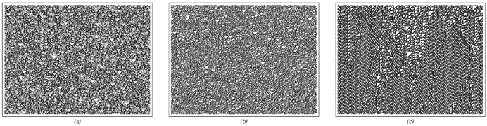

### 10.4  定义复杂性

我在这本书中所做的很多工作都在不同程度上与复杂性相关的现象有关。但就像研究生物学不需要生命的正式定义一样，到目前为止，在这本书中也没有必要对复杂性进行正式定义。然而，在上一节讨论了随机性之后，我们现在可以考虑如何正式定义复杂性的概念。

在日常语言中，当我们说某物看起来复杂时，我们通常的意思是，我们还没有找到任何简单的描述——或者至少是我们对其感兴趣的那些特征的简单描述。但感知和分析的目标正是找到这样的描述，所以当我们说某物看起来复杂时，我们实际上是在说我们的感知和分析能力在这方面失败了。

正如我们在两节之前所讨论的，感知和分析通常可以以两种方式运作。首先，它们可以丢弃我们不感兴趣的细节。其次，它们可以去除与它们设法识别的任何规律性相关的冗余。

我们在上一节讨论的随机性定义是基于这两种功能中第二种功能的失败。因为它所说的是，如果我们的标准感知和分析方法无法找到任何简短的描述来忠实地再现某物，那么该物就应该被认为是随机的。

但在定义复杂性时，我们需要考虑感知和分析的两种功能。因为我们要知道的不是是否可以为某物的每个细节找到简单或简短的描述，而仅仅是我们是否可以为那些我们碰巧感兴趣的特征找到这样的描述。

在日常语言中，“复杂性”和“随机性”这两个词有时几乎可以互换使用。例如，下一页顶部的三张图片中的任何一张都可能被称为“相当随机”或“相当复杂”。但如果一个人只选择观察整体特征，那么通常他会倾向于说第三张图片看起来比其他两张更复杂。

(p 557)

因为尽管前两张图片中黑白单元格的详细位置看起来不容易描述，但从整体上看，这些图片仍然允许一个相当简单的描述：本质上，它们只是涉及一种统一的随机性，其中每个区域看起来都与其他区域或多或少相同。但第三张图片即使在整体层面上也没有显示出这种统一性。因此，即使我们忽略其小规模的细节，也无法给出简短的描述。

当然，如果一个人走到极端，比如说，只看每张图片有多大，那么这三张图片的描述都会非常简短。一般来说，一个人能找到的某物的描述有多简短，将取决于他想要捕捉的该物的哪些特征——这就是为什么当出于不同的目的观察某物时，一个人可能会得出不同的复杂性结论。

但是，如果一个人使用特定的感知或分析方法，那么他总是可以看到这个方法能够产生多简短的描述。而且描述越简短，他就认为复杂性越低。

但是，在多大程度上可以定义一个独立于特定感知和分析方法细节的复杂性概念呢？在本章中，我认为几乎所有常见的感知和分析形式都对应于相当简单的程序。如果一个人对信息没有丢失的描述感兴趣——就像上一节关于随机性的讨论一样——那么正如我在上一节所提到的，在实践中，不同的简单程序在能够或不能找到简短描述的能力上通常都相当一致。

>以下是一些在日常层面上，人们可能会将其描述为“相当随机”或“相当复杂”的图片示例。

(p 558)

但是，当处理可能丢失信息的描述时，这一点似乎就不太适用了。因为很常见的情况是，一个系统的某些特征可能很难描述——而取决于给定的程序是否恰好对这些特征敏感，它可能会将系统描述为相当高的复杂性或相当低的复杂性。

然而，从实际出发，我们确定复杂性程度的最常见方式是使用我们的眼睛和视觉感知能力。因此，在实践中，当我们说某物看起来复杂时，我们通常指的是参与人类视觉感知的特定过程未能提取出简短的描述。

事实上，我怀疑甚至在潜意识层面，我们的大脑就已经对复杂性有了相当明确的概念。因为当我们面对复杂的图像时，我们的眼睛往往会停留在上面，可能是为了给大脑一个机会来提取简单的描述。

如果我们找不到任何简单的特征——就像完全随机的情况一样——那么我们往往会失去兴趣。但不知何故，最吸引我们——我们通常认为最具审美愉悦感——的图像是那些我们可以简单地描述某些特征，但其他特征却无法通过我们标准的视觉感知过程找到简短描述的图像。

在本书的发现之前，人们可能认为要创造出具有显著表观复杂性的任何东西，必然需要一个本身也具有显著复杂性的程序。但我们在本书中发现的是，实际上有非常简单的程序能够产生极其复杂的行为。这意味着——正如本书中的图像反复所示——最终，要制作出我们的视觉系统无法找到简单整体描述的图像是相当容易的。

(p 559)

