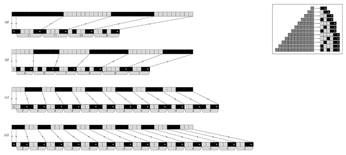
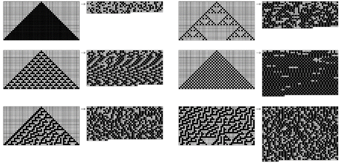
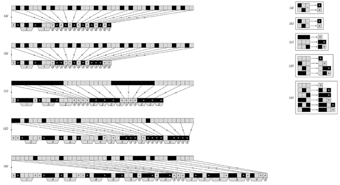
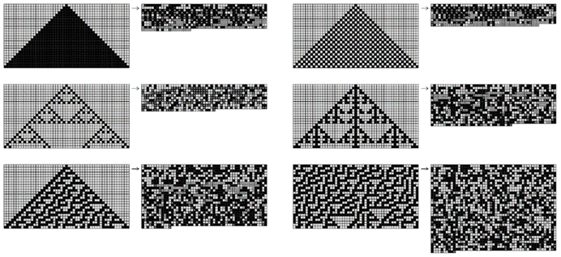
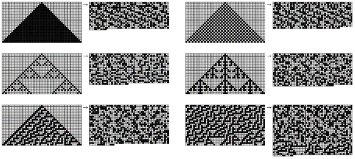

### 10.5  数据压缩

人们通常认为，感知和分析主要是为了提供直接供人类使用的材料。但在大多数现代计算机和通信系统中，当数据被压缩以进行更高效的存储或传输时，会不断发生与感知和分析等效的过程。

这种过程的一个简单例子是游程长度编码（Run-Length Encoding，RLE）——一种在实践中广泛用于压缩包含大量相同元素长序列的数据的方法，比如具有大片白色区域的文本页面位图图像。

游程长度编码的基本思想是将数据分解成相同元素的序列（游程），然后仅通过给出这些游程的长度来指定数据。这意味着，例如，不必显式列出游程中所有单元格（假设有53个相同的单元格），而只需给出数字“53”。关键是，即使“53”本身是用黑白单元格表示的，这种表示方式也可能比53个单元格短得多。

>从1到30的数字的各种表示方式。（a）是一元制，其中任何给定的数字都由一系列单元格表示，其长度等于该数字。（b）是普通的二进制或二进制基数表示法。（c）、（d）和（e）被设置为自定界，因此可以通过仅查看其中的单元格来识别数字的结尾。（c）与（b）类似，只是它在前面指定了数字的位数。（d）本质上是二进制编码的三进制，数字的末尾由一对黑色单元格表示。（e）使用从斐波那契数列派生的非整数基数，具有一对黑色单元格只能在每个数字的末尾出现的特性。

(p 560)

实际上，任何数字序列都可以被视为为数字提供简短表示的方式。但对于游程长度编码来说，普通的二进制数字序列并不完全适用。因为如果连续游程对应的数字一个接一个地给出，那么就无法判断一个数字的位数在哪里结束，下一个数字的位数从哪里开始。

然而，可以采用几种方法来避免这个问题。一种方法，如图（c）所示（位于对面页底部），是在每个数字开头插入一个说明，指出该数字包含多少位数。另一种方法，如图（d）所示，实际上是使用两个单元格来表示每个数字，然后用一对黑色单元格来表示数字的结尾。这种方法的一个变体，如图（e）所示，使用非整数基数，其中一对黑色单元格只能出现在数字的末尾。

>游程长度编码的示例。在每个示例中，输入数据显示在上方，输出显示在下方。输入和输出之间的箭头显示了数据如何被分解成相同元素的序列（游程）。然后，每个游程都通过一个数字来指定，该数字以一对黑色单元格结尾的序列表示，如图中插图和对面页的图（e）所示。对于前两组输入数据，存在足够长的游程，因此实现了压缩。但对于另外两组，则没有实现压缩。请注意，输出中的第一个单元格用于指定第一个游程是黑色还是白色。在这张图片和后续图片中，输出完全由黑白单元格组成；灰色注释仅作为解释的辅助工具。

(p 561)

对于较小的数字，所有这些方法产生的表示都至少比图（a）中显示的显式序列稍长一些。但对于较大的数字，这些表示很快就会变得更短。这意味着它们有可能用于在游程长度编码中实现压缩。

上一页底部的图片展示了当使用第560页中的表示（e）对各种数据序列进行游程长度编码时会发生什么。在前两种情况下，存在足够多的长游程，因此实现了压缩。但在最后两种情况下，短游程太多，游程长度编码的输出实际上比输入更长。

下面的图片展示了将游程长度编码应用于元胞自动机产生的典型模式的结果。当模式包含足够多的均匀颜色区域时，就会实现压缩。但当模式更复杂时——即使是以简单的重复方式——压缩效果也很小或几乎没有。

>将游程长度编码应用于元胞自动机产生的模式的示例。每个原始图像中的连续行被首尾相连地放置，以形成一维序列，然后进行游程长度编码，最后再次分割成行。每当图像的大部分由均匀颜色的区域组成时，通常就会实现压缩。

(p 562)

游程长度编码基于将数据分解成不同长度的相同元素序列的思想。数据压缩的另一种常见方法是基于形成固定长度的块，然后用特定的代码字来表示出现的任何不同块。

下面的图片展示了这种方法的几个示例。在每种情况下，输入都被分成长度为3的块。在前两种情况下，只出现了两个不同的块，因此每个块都可以用由单个单元格组成的代码字来表示，从而实现了显著的压缩。

>基于长度为3的块的霍夫曼编码示例。在情况（a）和（b）中，只出现两个可能的块，并且这些块被分配了由单个黑色单元格和单个白色单元格组成的代码字。在情况（c）中，出现3个可能的块；最常见的块被分配了一个由单个白色单元格组成的代码字，而其他块则被分配了由两个单元格组成的代码字。在情况（d）中，8个可能的块中有4个出现，而在情况（e）中有6个出现。在所有情况下，输出都以一个前导码开始，该前导码指定哪个块将由哪个代码字表示。块在这个前导码中明确出现，并用带编号的标签表示。代码字由箭头所示的单元格排列隐式表示。前导码后面是表示数据的实际代码字。代码字是自定界的，因此可以一个接一个地给出，中间不需要分隔符。

(p 563)

当出现更多不同的块时，不可避免地需要使用更长的代码字。但是，如果常见块的代码字比块本身短得多，那么仍然可以实现压缩。

分配代码字的一种简单策略是按照递减频率对所有不同的块进行编号，然后只需将得到的数字（例如，在给定的上述表示之一中）用作代码字。但是，如果考虑到不同块的实际频率以及它们的排名，那么事实证明有更好的分配代码字的方法。

下面的图片展示了基于一种称为霍夫曼编码的方法的示例。在每个示例中，输出的第一部分指定了哪些块将由哪些代码字表示，然后输出的其余部分给出了对应于数据中出现的块的实际代码字序列。如下面的图片所示，每当出现频率较高的不同块较少时，就会实现显著的压缩。

>将长度为6的块应用于元胞自动机产生的模式的霍夫曼编码。最大可能的压缩比例是6倍；这里实现的最大压缩比例大约是3倍。最后两个示例结果大小的差异主要是由于第一个示例中存在大片白色区域。

(p 564)

但最终，使用这种方法可以获得的压缩程度是有限的。因为即使在最好的情况下，输入中的任何单元格块也永远不能压缩到输出中的少于一个单元格。

那么如何实现更大的压缩呢？一种方法（事实证明，这与目前大多数高性能通用压缩系统中实际使用的方法相似）是建立一种编码，其中任何特定长度的元素序列只明确给出一次，而所有后续出现的相同序列都通过指向第一个序列的指针来指定。

下面的图片展示了当这种方法应用于几个短序列时会发生什么。在每种情况下，输出由两种对象组成，一种给出首次出现的序列，另一种给出指向之前已出现序列的指针。这两种对象都以一个指定其类型的单个单元格开始。接着是对对象所描述序列长度的说明。在第一类对象中，然后给出实际序列，而在第二类对象中，给出的是在数据中往回查找所需序列多远的一个说明。

>基于指针的编码示例，其中在数据中首次出现的序列随后仅通过指针来指定。输出的每个部分都以一个元素开始，该元素指示随后是新序列还是指向前一个序列的指针。之后是对该部分输出所表示序列长度的说明，数字以上面讨论的游程长度编码的形式给出。然后是一个文字序列，或者是一个数字，给出所需序列在数据中最后一次出现的位置偏移量。在所示示例中，指针仅用于长度至少为6的序列。基于指针的编码与广泛用于实际高性能通用压缩系统中的Lempel-Ziv算法相似。

(p 565)

对于纯粹重复的数据，这种方法实现了相当显著的压缩。因为一旦指定了要重复的基本序列，然后需要给出的就是一个指向该序列的指针，以及数据总长度的表示。

纯嵌套数据也可以实现几乎相同的压缩率。因为如下面的图片所示，嵌套的每一整层都可以看作是增加了固定数量的重复序列。

>纯嵌套数据中重复模式的示例。如这些图片所示，任何此类数据都必须对应于邻域无关替换系统的输出（见第83页）。在基于指针的编码中，表示数据所需的指针数量基本上与替换系统演化中的步数成比例增加。考虑到每个指针的表示长度，长度为n的嵌套序列的压缩形式通常会在长度上像Log[n]²那样增长。（这可以与纯重复序列的Log[n]增长进行比较。）请注意，实际的基于指针的编码算法通常会找到比这里图片中显示的稍微不那么规则的重复模式。

(p 566)

那么二维模式呢？下面的图片展示了如果取各种模式，将它们的行一个接一个地排列成一条长直线，然后对生成的序列应用基于指针的编码会发生什么。当原始模式中存在明显的规律性时，通常会实现一些压缩，但在大多数情况下，压缩量并不显著。

那么如何才能做得更好呢？基本的答案是，需要考虑模式的二维性质。过去，实践中使用的大多数压缩方案主要是为了处理一维序列而建立的。但是，建立直接在二维数据上操作的方案并不难。

下一页的图片展示了一种基于将图像分解成嵌套块集合的想法的方法，每个块具有均匀的颜色。在某些方面，该方案是游程长度编码的二维类似物，当存在大面积均匀颜色时，它可以实现显著的压缩。

同样，也很容易将基于块的编码扩展到二维：只需要将码字分配给二维块而不是一维块即可。正如对面页面底部的图片所示，此过程可以导致显著的压缩。特别值得注意的是情况（d）中的情况。尽管这个模式是由一个简单的一维元胞自动机规则产生的，尽管人们可以用肉眼看到它至少包含一些小规模的规律性，但到目前为止我们讨论的所有方案都没有成功地对其进行压缩。

>将一维基于指针的编码应用于元胞自动机产生的模式的示例。将每个图像中的连续行首尾相连，以获得可以对其应用编码的序列。指针仅用于长度至少为4的重复。在最后一个示例中，大区域不包含此类重复，因此在输出中它们与输入中的显示方式相同。

(p 567)

>通过二维递归细分进行编码的示例。这个想法是使用二维替换系统的推广，其中在每个步骤中，正方形要么保持不变，要么被细分为四个小正方形。编码指定在每个步骤中为每个正方形做出的选择。该方法类似于计算机图形学中有时使用的四叉树表示法。即使在情况（c）中看到的显著压缩也是由于存在大面积均匀白色区域的结果。

(p 568)

下面第二组图片展示了为什么二维块编码能够成功压缩它。关键在于，人们形成的二维块总是包含由元胞自动机规则连接颜色的单元格，这大大减少了可能出现的不同颜色排列的数量。

然而，在情况（e）和（f）中，从一行到下一行没有简单的规则，二维块编码——就像我们到目前为止讨论过的所有其他编码方案一样——并没有产生任何显著的压缩。

与块编码类似，基于指针的编码也可以扩展到二维。基本思想只是扫描二维数据，寻找的不是一维序列的重复，而是二维区域的重复。尽管过去这样的程序似乎没有在实践中使用过，但它的实现相当直接。对面页面的图片展示了一些结果示例。在许多情况下，事实证明，获得的总体压缩水平远高于本节中讨论的其他任何方案。但也许更令人惊讶的是，重复区域的模式似乎捕捉了我们用肉眼轻易注意到的几乎所有规律性——以及一些我们没有注意到的规律性。例如，在图片（c）和（d）中，左侧较为微妙的重复被捕捉到了，图片（e）中的四重对称性也是如此。

>二维基于块的编码示例。每个图像都被分割成3×2的块，然后使用霍夫曼方案为这些块分配码字。请注意，即使在情况（d）中也存在压缩。这是由于元胞自动机规则只允许某些块出现在模式中，如下面的图片所示。（e）是由二维元胞自动机生成的；（f）是规则30中心列出现的序列。

(p 569)

人们可能会认为，要捕捉所有这些类型的规律性，需要一整套复杂的程序。但对面页面的图片所展示的是，事实上，仅仅一个相当直接的程序就足够了。事实上，该程序在不同情况下实现的压缩量似乎与我们对存在多少规律性的直观印象相当吻合。

我们在本节中讨论的所有数据压缩方法都可以被视为与相当简单的程序相对应。但每种方法都涉及一个结构相当不同的程序，因此人们可能会认为它不可避免地会对不同类型的规律性产生敏感。

但我们在本节中所看到的是，事实上，不同的数据压缩方法具有惊人相似的特性。例如，基本上每种方法都能成功压缩大片均匀颜色的区域。而且大多数方法都能压缩重复的行为，以及至少在一定程度上能压缩嵌套的行为——这正是我们在本书中多次提到的两种简单行为。

然而，对于更复杂的行为，这些方法似乎都无法实现显著的压缩。这并不是说原则上不可能进行压缩。事实上，对面页面上的每一张图片都可以由非常短的元胞自动机程序生成。

但问题是，除非整体行为显示出重复或嵌套，否则我们在本节中讨论的所有标准数据压缩方法都无法找到如此简短的描述，甚至无法接近。因此，至少就这些方法而言，我们可以合理地说，我们所看到的行为在实际应用中似乎是随机的。

(p 570)

>基于二维指针的编码示例。上图中灰色矩形表示使用指针编码的重复区域。在此处使用的特定方案中，要求这些区域中的每一个都必须包含至少25个尚未使用指针编码的单元格。图像按顺序进行扫描，在每个点找到向右和向下延伸的最大矩形，该矩形是之前遇到的一个矩形的重复，并且包含最多数量的尚未使用指针编码的单元格。在许多情况下，这个最大矩形与后续点找到的重叠。

(p 571)

