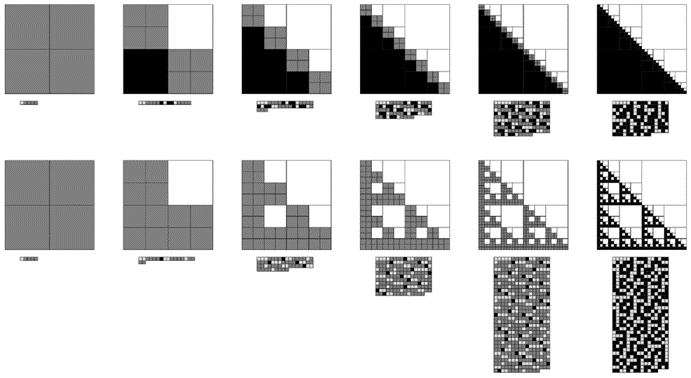

### 10.6  不可逆数据压缩

我们在上一节中讨论的所有数据压缩方法都是可逆的，这意味着从任何数据段的编码版本中，总是可以恢复原始数据的每一个细节。如果处理的是与文本或程序相对应的数据，这种可逆性通常是必不可少的。但对于图像或声音，这种可逆性通常就不再那么必要了：因为在这种情况下，最终通常重要的是能够恢复看起来或听起来正确的东西。通过忽略那些几乎没有或根本没有可察觉效果的细节，通常可以实现更高的压缩水平。

在图像的情况下，一种简单的方法就是忽略小于某个最小尺寸的特征。下面的图片展示了如果将图像分割成一组嵌套的方块，但对这些方块的大小设定一个下限，会发生什么情况。可以看到，随着下限的增加，压缩量迅速增加——尽管代价是图像质量的迅速下降。

>通过嵌套方块表示图像时包含逐渐更小的特征的效果。每个图像的编码版本显示在图像下方。当包含更小的方块时，指定图像所需的数据量迅速增加。

(p 572)

>展示了如何通过叠加由所谓的二维沃尔什（Walsh）函数构成的基本形式来构建图像的例子。左上角以所谓的序贯顺序给出了基本形式。右上角则大致重新排序，以便系统地从粗略到精细进行排列。在底部的图片数组中，每张连续的图片都是通过添加相应权重的基本形式而获得的。这里展示的基本形式具有正交性，因此可以通过将原始图像与该形式相乘来简单地推导出每个形式的权重。请注意，这些形式涉及数值-1和+1，分别对应于白色和黑色的单元格。此处显示的图像都已重新缩放，以便最小值为白色，最大值为黑色。JPEG图像压缩方法采用了与此处类似的方法，尽管其使用的基本形式具有连续的灰度级别，而不仅仅是黑白。

(p 573)

那么，是否可以在保持图像质量方面做得更好呢？实际上，人们使用了各种方案，并且几乎所有这些方案都基于传统数学中的一个理念，即通过将数据视为数字，可以将其分解为固定基本形式的和，其中一些形式可以被省略以实现压缩。

前一页的图片展示了这是如何工作的一个例子。左上角是一组基本形式，它们具有任何二维图像都可以简单地通过将这些形式以适当的权重相加来构建的属性。右上角则大致将这些形式从最粗略到最精细进行排序。给定这种排序，底部的图片数组展示了如何通过逐步添加越来越多的基本形式来构建两个不同的图像。

如果包含了所有的基本形式，那么原始图像就能被忠实地再现。但是，如果省略了一些后面的形式——从而减少了必须指定的权重的数量——那么就只能得到图像的近似表示。对页展示了当保留不同比例的形式时，各种图像会发生什么变化。

对于足够简单的图像，即使只包含非常小比例的形式——对应于非常高的压缩水平——也仍然能够被识别。但是，大多数其他图像通常需要包含更多的形式——因此不允许如此高的压缩水平。

实际上，这种情况与我在前两节给出的复杂性的定义非常吻合。无论是简单图像还是完全随机图像的相关特征，即使在相当高的压缩水平下也能轻易地被识别。但是，人们通常认为复杂的图像往往具有一些特征，这些特征只有在显著降低压缩水平的情况下才能被识别。

然而，对页上的所有图片都是根据前一页所示的基本形式的特定排序生成的。人们可能会想，是否还有其他排序方式能更容易地压缩更复杂的图像。

(p 574)

一种简单的方法就是收集大量想要压缩的典型图像，然后对这些基本形式进行排序，使得在这个集合中平均权重较大的形式先出现。下一页的图片展示了首先使用元胞自动机图像，然后使用字母图像进行这种操作时会发生什么。确实，这样可以实现稍高的压缩水平。但是，无论使用哪种排序方式，似乎都无法系统地使我们认为复杂的图像实现更多的压缩。

>只保留完整基本形式集中的某些比例部分所获得的图像示例。对于简单图像和完全随机图像，即使只有相当少的基本形式，许多特征也是可识别的——这意味着可以给出高度压缩的表示。

(p 575)

>从元胞自动机图像（上）和字母图像（下）集合中推导出基本形式的最佳排序所获得的结果。在每种情况下，基本形式的排序都显示在左侧，且都是从那些在整个图像集合中平均绝对值权重最大的形式开始。请注意，排序是针对8×8的基本形式显示的，而实际图像是32×32的。这些排序分别是从256个基本元胞自动机图像和52个大小写字母图像中推导出来的。

(p 576)

