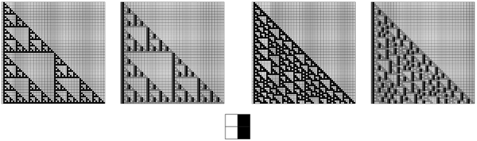
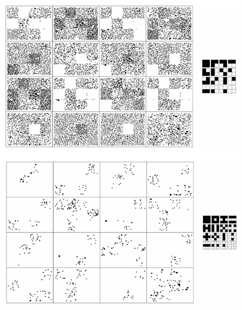
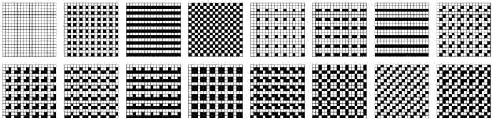

### 10.7  视觉感知

在现代，仅仅基于事物的外观来判断通常被认为是不科学的。但事实仍然是，尽管已经发展了各种数学和其他分析方法，我们的视觉系统仍然是我们拥有的最强大和最可靠的工具之一。当然，在写这本书时，我极大地依赖于我们根据视觉表现做出各种推断的能力。

那么，人类的视觉系统究竟是如何工作的？它的局限性是什么？还有许多细节有待解决，但在过去几十年里，至少该系统最低层次的工作原理已经开始变得相当清晰。事实证明，正如我们在这本书中看到的许多其他案例一样，发生的许多事情都可以被想象成极其简单的程序。

事实上，在基本上每一种人类感知中，似乎反复使用的基本方案是让特定类型的细胞对数据中的特定固定特征做出反应，然后忽略所有其他特征。

色彩感知就是一个经典的例子。我们的视网膜上有三种对颜色敏感的细胞，每种细胞基本上都会对红色、绿色或蓝色的水平做出反应。来自物体的光通常涉及整个波长的光谱。但我们只有三种对颜色敏感的细胞，这意味着我们的眼睛基本上只对这个光谱的三个特征进行采样。这就是为什么，例如，我们有这样一种印象：仅仅三种固定颜色的混合就可以成功地再现所有其他颜色。

那么图案和纹理呢？我们的视觉系统也是通过挑选出这些图案和纹理的特定特征来工作的吗？日常经验表明，确实如此。因为如果我们看，比如说，下一页的图片，我们并不会立即注意到每一个细节。相反，我们的视觉系统似乎只是挑选出某些特征，这些特征会迅速让我们将图片看作是具有特定纹理的色块集合。

(p 577)

那么这是怎么实现的呢？基本的答案似乎是，我们的眼睛和大脑中有一些神经细胞，它们会对我们眼睛视网膜上形成的图像中的特定局部模式做出反应。

这个过程的发生方式似乎非常直接。在我们视网膜上大约一亿个光敏细胞后面，是一系列的神经细胞层，首先是眼睛里的，然后是大脑里的。这些细胞之间的连接是这样的：视觉皮层中的一个给定细胞通常只会从我们视网膜上一个相当小的区域的细胞接收输入。如果这个区域的某个部分，比如说，是白色的，那么其中一些输入就是积极的，而如果是黑色的，那么其他输入就是积极的。然后，只有当视觉皮层中的细胞有足够的积极输入时，它才会做出反应，这对应于图像中存在特定的模式。

>由各种一维元胞自动机规则生成的色块。每个色块都被设置为具有大致相等数量的黑白方块。但尽管如此，我们的视觉系统很快就会注意到不同的色块具有不同的纹理。这大概是因为视觉系统会自动识别每个色块中的特定特征。当向每个人展示这张图片时，他们似乎都能立刻看到一些色块。但是看了一会儿图片之后，色块之间的边界似乎变得更加清晰了。

(p 578)

实际上，这种设置的许多细节都相当复杂。但作为一种简单的理想化，我们可以考虑视网膜上的一个方块阵列，每个方块要么是黑色要么是白色。然后，我们可以假设在视觉皮层中有一个相应的细胞阵列，每个细胞从比如说一个2×2的方块块接收输入，并遵循一个规则，即当这些方块的颜色形成某种特定模式时，它就会做出反应。

下面的图片展示了一个简单的例子。在每种情况下，第一张图片显示的是视网膜上的图像，而第二张图片显示的是哪些细胞对其做出反应。并且在这里使用的特定规则下，实际发生的是原始图像中的垂直黑色边缘被挑选出来。

神经生理学实验表明，视觉皮层中的细胞会对各种特定类型的模式做出反应。作为一种简单的理想化，下一页的图片展示了对16种可能的2×2黑白方块排列中的每一种做出反应的细胞的情况。在每种情况下，我们可以将结果视为对应于在原始图像中挑选出一些特定的局部特征。

>左下角显示的2×2模板对两个样本图像的细胞反应。在每对图片的第二张中，用较深的方块表示做出反应的细胞。每当左侧的2×2模板出现时，就会发生这种反应，对应于垂直黑色边缘的存在。通过这种简单的模板匹配来提取特征似乎是人类视觉感知的一个关键要素，同时也是技术图像处理中的常见做法。这里使用的样本图像是由具有规则60和124的基本一维元胞自动机演化生成的。

(p 579)

那么，这种非常简单的过程真的是我们看似复杂的图案和纹理感知的基础吗？我强烈怀疑在很大程度上是这样的。然而，一个重要的细节是，视觉皮层中的细胞实际上是从视网膜上更大的区域接收输入的。但是，作为一种简单的理想化，我们可以假设这些细胞最终只是对基本2×2模式的重复版本做出反应。

因此，在这个设置下，对页的图片展示了像第578页那样的图像会发生什么。结果相当显著。因为尽管整个图像中黑白方块的平均密度完全相同，但我们看到的是，在不同的色块中，最终被挑选出来的特征具有不同的密度。我怀疑，正是这一点让我们看到不同的色块具有不同的纹理。

正如我们通过红、绿、蓝的密度来区分颜色一样，似乎我们也可能通过某些局部特征的密度来区分纹理。当我们看一幅图像时，这个过程之所以如此迅速，无疑是因为挑选出这些特征的过程非常简单，可以很容易地由我们眼睛和大脑中的大量单独细胞并行执行。

>前一页样本图像中，对每种黑白方块局部排列敏感的细胞类型的反应。在每种情况下，我们可以将结果模式视为原始图像的过滤版本，其中只保留了具有特定特征的部分。这些模式也可以被视为二维块元胞自动机演化中单个步骤的输出，其中规则规定，如果一个块具有所示的细胞排列，它就会变暗，否则就会变亮。暗块相对稀疏是因为在任何给定位置，暗块只能在所示的16种情况中的一种情况下出现。在许多所示情况中没有暗块可以视为由一维元胞自动机规则构造图像时引入的约束的反映。

(p 580)

>对第578页图像的一个较小版本的所有16种可能的2×2块以及它们重复的3×3扩展的敏感细胞的反应。在原始图像中看似具有不同纹理的色块包含的这些各种块的特征密度不同。我强烈怀疑，正是这样的密度差异使我们的视觉系统能够区分纹理。

(p 581)

然而，对于图案和纹理，与颜色不同，我们总是可以超越视觉系统提供的直接印象。因此，例如，通过有意识地努力，我们可以用眼睛扫描图像，依次仔细检查不同的部分，并比较我们想要的任何细节。

但通过这种方式我们能期待发现什么呢？如下面的图片所示，通常很容易看出一张图像是否是纯重复的——即使是在重复块相当大的情况下。

但在嵌套的情况下，情况就完全不同了。对页上的所有八张图片都是由所示的二维替换系统生成的，因此对应于纯嵌套模式。但除了每行最后一张图片——它们恰好主要由大面积的基本上均匀的颜色组成——我们很难看出模式是嵌套的。这可以被视为我们视觉感知能力的一个明显局限。

正如我们在前两节中发现的那样，许多标准的数据压缩方法都有同样的局限性。但在那一节的最后，我展示了相当简单的二维指针编码过程将成功识别嵌套。所以并不是说嵌套在某种程度上从根本上难以识别；只是碰巧发生在人类视觉感知中的特定过程通常无法做到这一点。

>由2×2和3×3块阵列形成的所有不同重复模式的示例。在每一个单独的情况下，纯重复的存在都很容易用眼睛识别。请注意，在通过重复一个特定块生成的模式中，通常会有其他块以其他对齐方式出现。第215页显示了基于约束的系统中获得的模式，其中一个约束是只有某些块或块集出现。

(p 582)

那么随机性呢？下一页的图片展示了几个具有不同程度随机性的图像示例。仅仅通过查看这些图像，就很难判断其中哪一个实际上是最随机的。

基本问题在于，我们的视觉系统使我们注意到局部特征——比如黑色方块簇——即使它们的密度与完全随机数组中的密度一致。因此，与星群一样，我们倾向于在完全随机的模式中识别出看似有规律的东西。

原则上，可能存在一些图像，我们的视觉系统基本上不会注意到其中的局部特征。实际上，在每一行的最后两张图像中，所有相同颜色的方块簇，然后是所有相同颜色的方块行，都已经被明确地移除了。乍一看，这些图像在某些方面看起来更随机。但是，由于我们的视觉系统包含对方块所有可能的局部排列作出反应的元素，因此，我们在任何图像中都不可避免地会识别出某种特征。

>遵循所示的二维替换规则创建的嵌套模式示例。除了每行最后的示例外，即使相当仔细地检查，也很难用肉眼识别出这些模式中的嵌套结构。然而，第571页的基于二维指针的编码方案确实能够在所有情况下识别出结构。

(p 583)

实际上，我们的视觉系统对某些类型的局部模式的反应可能比对其他类型的更强烈。了解这种层次结构后，人们应该能够制作出在某种意义上对我们来说尽可能随机的图像。但不可避免地，这些图像将更多地反映我们视觉感知过程的细节，而不是反映实际的底层随机性。

>接近完美随机性的图像示例。每一行的第二张图像中的方块被独立选择为黑色，其概率分别为0.4、0.5和0.6。在其他图像中，添加了各种特征或移除了特征。在每一行的第一张图像中，如果任何方块被四个颜色相同的方块所包围，则该方块被迫具有相同的颜色。在第三张图像中，通过反转中心方块的颜色来打破任何颜色相同的方块簇。在第四张图像中，对颜色相同的方块行也做了同样的处理。

(p 584)

