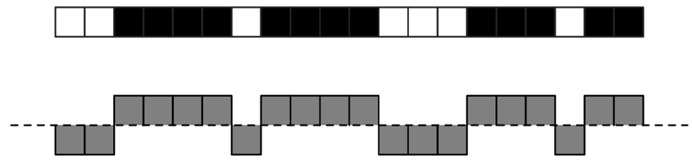
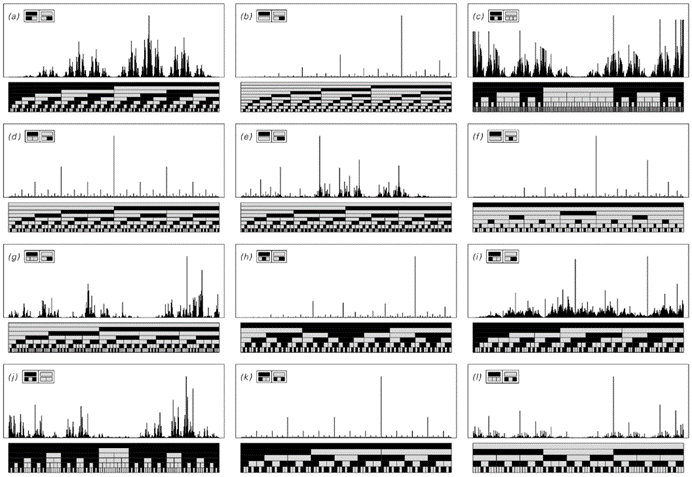
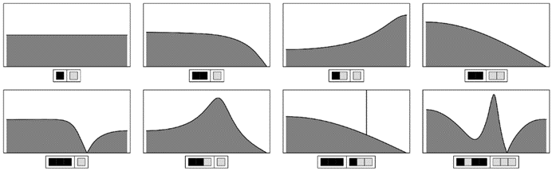

### 10.8  听觉感知

在这本书中，我大量使用了图片。那么为什么不用声音呢？除了显而易见的事实，即声音无法直接包含在印刷书籍中之外，还有一个问题是，虽然人们可以以任何想要的速度研究图片的细节，但声音在某种意义上一旦播放完毕就消失了。

然而，日常经验表明，通过倾听声音，人们仍然可以学到很多东西。那么，我们的听觉系统能够识别出声音的哪些特征呢？

从根本上说，所有声音都是由快速振动的模式组成的。我们听到声音的方式是通过这些振动传递到我们内耳的毛细胞阵列。内耳的机械结构是这样设置的：每一排毛细胞最终都会对某个特定频率的振动特别敏感。这意味着，我们往往最能感知到的是声音中所包含的频率。

音符通常只有一个基本频率，而有声语音则有两个或三个。但是，来自自然界的系统或我们在这本书中研究过的系统的声音呢？

人们可以想象用这样的系统来产生声音的方法有很多。下面说明的一种简单方法是考虑由系统产生的一系列元素，然后将每个元素对应为在两个方向之一上的短暂振动——比如说千分之一秒。

那么这样的声音听起来是什么样的呢？如果元素序列是重复的，那么人们听到的本质上是一个特定频率的纯音——很像一个音符。但如果序列是随机的，那么人们听到的只是一种无形的咝咝声。

那么在这两个极端之间会发生什么呢？如果序列的属性随着时间的推移以确定的方式逐渐变化，那么人们通常可以在相应的声音中听到这一点。但是，对于属性或多或少一致的序列呢？我们的听觉系统能在其中检测到哪些规律性呢？

>这是一系列离散元素和声音可能对应的波形。

(p 585)

答案似乎惊人地简单：我们能够轻易地识别出在一定频率下的精确或近似重复，而基本上没有其他东西。因此，例如，如果我们倾听嵌套序列，我们没有直接的方法来辨别它们是否是嵌套的，事实上，我们似乎只对出现的频率谱的一些相当简单的特征敏感。

下面的图片显示了由各种简单的一维替换系统产生的嵌套序列所获得的频谱。这些频谱的多样性相当惊人：一些具有简单的嵌套形式，主要由特定频率的几个孤立峰值所主导，而其他一些则具有相当复杂的形式，覆盖了广泛的频率范围。

>由一维邻位无关替换系统生成的嵌套序列的频率谱。规则与第83页和第84页所示相同。注意孤立峰值和复杂背景模式的存在。如果一个序列对应一个纯音并且每n个元素重复一次，那么它的频谱将由n/2个等间距的峰值组成。频谱中没有主导峰值的序列通常听起来像随机噪声，尽管有时可以听到明确的时间变化，事实上，序列（c）听起来就像是一系列理想化的蛙鸣声。强度谱或功率谱是通过将所示量平方而获得的。

(p 586)

而且，如果只给出一个替换系统的基本规则，那么即使是大致预测频谱会是什么样子也相当困难。但是，如果给出了频谱，人们可以立刻知道我们会如何感知声音。当频谱中只有一个大的峰值时，我们会听到一个明确的音调。当有两个大的峰值时，我们通常也会听到明确的音调。但随着峰值数量的增加，人们很快就会无法追踪它们，最终只会听到随机噪声——即使是在峰值恰好具有常见音乐和弦频率比例的情况下也是如此。

因此，结果是我们的耳朵对我们在许多嵌套序列的频谱中看到的复杂结构的大部分并不敏感。事实上，似乎一旦频谱覆盖了任何宽范围的频率，除了非常大的峰值之外，其他峰值都倾向于被完全掩盖，就像在日常生活中，如果声音要在背景噪声之上被听到，它就需要足够大。

那么序列中的其他类型的规律性呢？如果一个序列基本上是随机的，但包含一些短程相关性，那么这些相关性将导致频谱中的平滑变化。例如，由特定块的随机序列组成的序列可以产生下面显示的任何类型的频谱，并且听起来可能像咝咝声、咆哮声或咯咯声。

要获得具有更复杂结构的频谱，需要长程相关性，就像嵌套序列中存在的那样。但据我所知，最终对我们的听觉系统最重要的相关性类型只有那些导致某种形式重复的相关性。

>通过以随机顺序连接块来获得的长序列的频率谱。这样的频谱可以通过随机分析中的相当标准的方法来计算。第一个案例对应的是白噪声。倒数第二个案例是每个第三个位置都有一个黑色元素，因此在相应的重复频率处有一个峰值。

(p 587)

因此，最终，任何超越纯重复的系统行为特征在我们的耳朵听起来都基本上是随机的。

