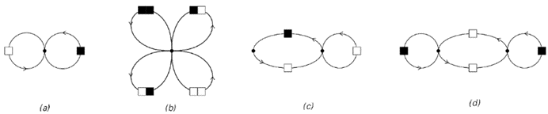
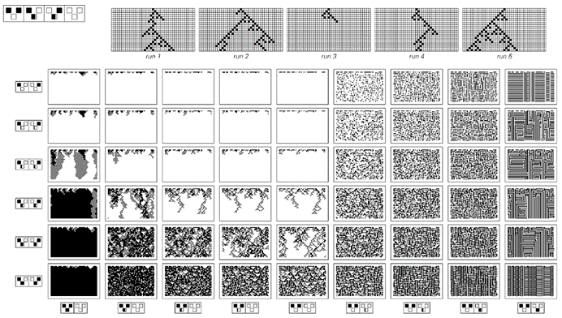
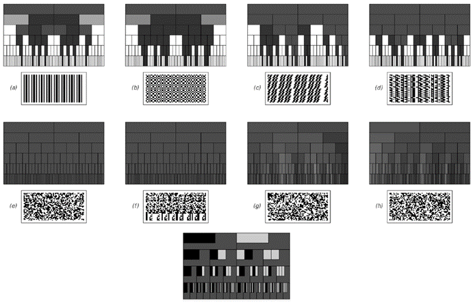

### 10.9  统计分析

当涉及到研究大量数据时，当今科学界几乎唯一使用的方法是统计分析。那么，这种分析涉及哪些过程呢？在实际操作中，通常是从原始数据中计算出各种相当简单的数量，然后可以用这些数值来评估可能提供数据摘要的模型。

大多数类型的统计分析基本上都基于一个假设，即这些模型必须是概率性的，也就是说，它们只给出行为发生的概率，而不具体说明行为将是什么。在不同的情况下，使用这种概率模型的原因略有不同，但在本书的发现之前，关键点之一是，似乎无法想象会有确定性模型能够再现实践中经常看到的复杂性和明显的随机性。

如果一个人有一个确定性模型，那么至少在原则上很容易找出这个模型是否正确：所要做的就是将模型预测的任何特定行为与观察到的行为进行比较。但是，如果一个人有一个概率模型，那么评估其有效性就更加困难了——事实上，统计学领域的大部分技术发展以及许多广为人知的问题都可以追溯到这个问题。

举一个简单的例子，考虑一个模型，其中所有可能的黑白方块序列都以相等的概率出现。通过有效地枚举所有这样的序列，很容易看出这样的模型预测在任何特定的序列中，黑色方块的比例最有可能是1/2。

(p 588)

但是，如果一个人实际观察到的序列中有9个黑色方块和1个白色方块呢？尽管这不是最可能看到的情况，但人们当然不能仅凭观察到这一点就得出模型是错误的结论。因为模型并没有说这样的序列是不可能的——它只是说这样的序列应该只出现大约1%的时间。

而且，如果没有更多的信息，就没有任何有意义的方法来推断模型正确的绝对概率。因此，在实际操作中，几乎普遍的做法是不仅考虑单个模型，而是考虑一整类模型，然后尝试找出这类模型中哪个是最佳的——比如说，根据它生成观测数据的可能性尽可能大的标准来衡量。

对于黑白方块的序列，一个简单的模型类是考虑每个方块以某个固定的独立概率p为黑色的模型。给定一组原始数据，根据最大似然等标准找出这类模型中哪个是最佳模型的程序非常简单：所要做的就是计算数据中方块为黑色的比例，这个值随即给出了最佳模型的p值。

那么，更复杂的模型呢？与让每个方块的颜色完全独立地选择不同，例如，可以让给定长度的一些方块块一起选择它们的颜色。在这种情况下，同样很容易找到最佳模型：它只需要让不同方块块出现的概率等于这些数据中出现这些方块块的频率。

然而，如果一个人没有事先决定方块块的长度，那么事情可能会变得更复杂。因为在这种情况下，人们总是可以编造一个极端模型，其中只允许一个非常长的方块块，而这个方块块恰好是数据中观察到的序列。

不用说，这样的模型在大多数情况下都不会被认为特别有用——当然，它也无法成功地提供任何关于数据的简短摘要。但是，要以系统的方式排除像这样的模型，就需要超越最大似然等标准，并且以某种方式明确考虑模型本身的复杂性。

(p 589)

对于特定类型的模型，可以根据模型中包含的独立数值参数的数量等标准来提出各种准则。但是，总的来说，对于任何给定的数据集，确定哪个模型最合适是一个极其困难的问题。事实上，正如第8章开头所讨论的，这在某种意义上是任何实证科学方法的核心问题。

然而，传统的统计分析通常远不需要面对这样的问题。因为它通常仅限于非常特定的模型类别——而且通常即使是按照本书的标准来看，这些模型也极其简单。例如，对于黑白方块的序列，最简单常见的模型就是通过给固定的方块块分配概率来工作。另一种通常被认为是相当高级的替代方法是，通过观察与这些序列相对应的路径在如下所示的网络中来给序列分配概率。

网络（a）和（b）表示的是上面已经讨论过的情况。网络（a）规定连续方块的颜色应该独立选择，而网络（b）规定连续方块对应该这样做。然而，网络（c）规定，根据路径是否已达到网络中的左节点或右节点，应使用不同的概率。但是，至少只要保持网络结构不变，即使在这种情况下，从给定的数据集中推断出网络中哪些概率提供了数据的最佳模型也是相当容易的——因为基本上所需要做的就是遵循与数据相对应的路径，并查看每个节点上每个连接的最终使用频率。

>定义概率模型的网络。每个网络中的每个连接都有一个与之相关的特定概率，并且该模型通过根据这些概率在网络中追踪路径来生成黑白方块的序列。情况（a）和（b）是所谓的马尔可夫模型，实际上它们不涉及记忆，并且与上面讨论的模型等效。情况（c）和（d）对应于所谓的隐马尔可夫模型，它们具有一些短期记忆。

(p 590)

那么，二维数据呢？根据第5章的讨论，在这种情况下，无法构建上述概率模型类型的直接类比。但作为一种替代方法，事实证明，可以使用一维元胞自动机的概率版本，如下图所示。

>概率元胞自动机的例子，其中的规则指定了在给定前一步中两个相邻细胞的颜色的情况下，生成每种颜色细胞的概率。由于规则是概率性的，因此每次运行元胞自动机时，通常会得到不同的详细演化模式，如上面图片的第一行所示。尽管如此，然而，任何特定的概率元胞自动机通常都会表现出一些特征性的整体行为模式，如上面图片阵列所示。请注意，相变的发生相当常见，其中底层概率的连续变化导致典型行为的离散变化。概率元胞自动机可以被视为所谓的有向渗流模型的推广。

(p 591)

这类元胞自动机的规则是通过为每个可能的细胞邻域分配生成每种颜色细胞的一定概率来工作的。对于任何特定的邻域形式，再次非常容易找到任何给定数据集的最佳模型。因为基本上所需要做的就是计算出在数据中每个可能的邻域下方每种颜色的细胞出现的频率。

但是，得到的结果有多好呢？如果查看诸如实际上首先用于查找模型的黑细胞的总体密度之类的数量，那么不可避免地，得到的结果似乎相当好。但是，一旦查看像下面这样的明确图片，就会立即发现原始数据与从模型中得到的数据之间存在巨大差异。

在大多数情况下，模型产生的典型行为看起来比数据更加随机。事实上，在某种程度上，这并不奇怪：因为使用概率模型在某种意义上是从随机性的假设开始的。

该模型可以引入某些规律性，但这些规律性几乎从来都不足以强制除数据的相当简单的特征之外的任何东西被正确再现。

不用说，就像大多数其他形式的感知和分析一样，统计分析的目标通常不是找到数据的精确和完整的表示。相反，其目的通常只是提取与数据有关的某些特征，以便得出关于数据的特定结论。

>普通元胞自动机生成的数据与被认为最适合它的概率元胞自动机之间的比较。虽然诸如黑细胞的密度等属性通常在数据和模型之间达成一致，但图片清楚地表明更详细的特征并不一致。

(p 592)

一个基本的例子是，尝试确定给定的序列是否可以被认为是完全随机的，或者它是否包含某种明显的规律性。

从统计分析的角度来看，如果序列在某种程度上与所有可能序列以相等概率出现的模型一致，那么该序列就是完全随机的。

但是，如何判断是否如此呢？在实际操作中，通常会取一个给定的序列，并从中计算出各种特定数量的值，然后将这些值与通过查看所有可能序列而获得的平均值进行比较。

因此，例如，可以计算给定序列中黑色方块的比例，并将其与1/2进行比较。或者，可以计算连续出现两个以上黑色方块的频率，并将其与通过对所有可能序列取平均而得到的值1/4进行比较。

如果发现从特定序列中计算出的值接近所有可能序列的平均值，那么可以将此作为该序列确实是随机的证据。但是，如果发现该值与平均值相差甚远，那么可以将此作为该序列不是随机的证据。

下一页顶部的图片显示了计算各种序列中不同区块的频率的结果，在每种情况下，每一行都显示了给定长度的所有可能区块的结果。每一行的灰度级别都设置为使所有可能序列的平均值对应于下面显示的均匀灰度模式。因此，任何偏离这种均匀灰度的现象都可能提供了偏离随机性的证据。

我们看到的是，在前三张图片中，有许多明显的这种偏离，而在剩下的图片中则没有明显的偏离。因此，由此可以相当容易地得出结论，前三个序列绝对不是随机的，而剩下的序列仍然可能是随机的。

(p 593)

事实上，序列(a)肯定不是随机的；实际上，它是完全重复的。一般来说，很容易看出，在任何完全重复的序列中，超出一定长度后，必定有许多区块的频率远不相等。

事实证明，嵌套序列也是如此。在下面的图片中，序列(b)、(c)和(d)都是嵌套的。

但是剩下的序列呢？序列(e)和(f)似乎产生的频率在每种情况下都与通过对所有可能序列取平均而获得的频率准确对应。序列(g)和(h)产生的结果相当相似，但表现出一些明显的波动。

那么，这些波动是否表明序列(g)和(h)实际上并不是随机的呢？如果查看所有可能的序列集合，可以相当容易地计算出任何特定区块的频率分布。从这个分布中，可以判断出对于一个真正随机选择的序列，其偏离平均值的概率是多少。

>各种序列的区块频率统计。在每种情况下，特定区块的频率由灰度表示，如左下角所示，连续行上显示了长度依次增大的区块的结果。原始序列被拆分成行并排列成二维形式。序列(b)、(c)和(d)分别由替换系统生成，其规则为(b)   ，  ，(c)   ,   和 (d)   ,   。请注意，这些替换系统是最简单的系统，分别产生长度达1、2和3的所有区块的相等频率。）序列(e)由线性反馈移位寄存器（本质上是加法元胞自动机）生成，其抽头位置为{2, 11}。序列(f)由连续整数的二进制数字连接而成。序列(g)是由规则30元胞自动机生成的模式的中心列。序列(h)是π的二进制数字。

(p 594)

结果证明与我们在图片(g)和(h)中看到的情况相当一致。但它与我们在图片(e)和(f)中看到的情况相去甚远。因此，尽管单个区块的频率似乎表明序列(d)和(e)是随机的，但这些频率缺乏任何分布范围，这证明它们实际上并不是随机的。

那么，序列(g)和(h)最终是否真的是随机的呢？就像本章讨论的其他序列一样，从某种意义上说，它们并不是随机的，因为它们都可以由简单的基本规则生成。但对面页上的图片表明，如果仅通过计算区块的频率来进行统计分析，那么将看不到任何表明存在这种基本简单性的证据。

有人可能会想象，如果计算其他数量，可能会立即找到这样的证据。但事实证明，人们可能会考虑计算的许多明显数量最终都相当于区块频率的各种组合。也许正因为如此，有时人们会认为，如果只需要计算所有长度的区块的频率，就可以作为一种通用的随机性测试。但对面页上的序列(e)和(f)清楚地表明，情况并非如此。

那么，在进行统计分析时，最终可以使用哪些数量呢？答案是，至少在原则上，可以使用任何数量，特别是可以使用我在本章中迄今为止讨论过的任何感知和分析过程中产生的数量。因为在每种情况下，所要做的就是计算来自特定数据序列的数量值，然后将此值与通过对所有可能序列取平均而获得的值进行比较。然而，在实际操作中，用于序列统计分析的数量类型往往相当有限。实际上，除了区块频率之外，唯一常见的其他数量是基于相关性、频谱和偶尔的游程长度，所有这些我们都在本章的前面讨论过。

然而，一般来说，人们可以想象采用任何过程并将其作为统计分析的基础。因为给定某个特定过程，可以将其应用于原始数据片段，然后查看结果与从所有可能序列中获得的结果进行比较。

(p 595)

如果这个过程足够简单，那么使用传统数学方法有时可以完全计算出所有可能序列的情况。但在绝大多数情况下，这是无法做到的，因此在实际操作中，别无选择，只能与通过对一些相当有限的可能序列集合进行抽样而获得的结果进行比较。

因此，在这种情况下，注意到与平均行为的细微偏差变得相当不切实际。事实上，通常唯一可靠的策略就是寻找特定数据片段的结果与典型序列的结果之间存在巨大差异的情况。因为这种差异提供了明确的证据，表明这些数据实际上不能被认为是随机的。

作为简单过程应用于数据时可能发生的情况的一个例子，对面页上的图片展示了根据各种元胞自动机规则演化的结果，初始条件由第594页上的序列给出。在每一行中，第一张图片展示了每个元胞自动机的典型行为。关键点是，如果用作其他图片初始条件的序列被认为是随机的，那么它们产生的行为应该是相似的。

但我们看到的是，在许多情况下，实际获得的行为截然不同。这意味着，在这种情况下，基于简单元胞自动机的统计分析成功地识别出这些序列实际上并不是随机的。

但是像(g)和(h)这样的序列呢？对于这些序列，这里展示的简单元胞自动机规则中没有一个能够产生易于与典型行为区分开来的行为。事实上，这是我在搜索所有简单元胞自动机时发现的。

因此，我们必须得出结论，就像本章讨论的所有其他感知和分析方法一样，即使进行了一些概括，统计分析也不能轻易地识别出像(g)和(h)这样的序列除了完全是随机的之外还有其他任何特征——尽管在底层，这些序列是由相当简单的规则生成的。

(p 596)

>将各种元胞自动机演化规则应用于第594页上的序列的示例。每行最左边的图片被选用来展示在任意初始条件下，每个元胞自动机的典型行为。每个元胞自动机规则实际上对应于不同的统计分析程序。规则4挑选出孤立的黑色单元格。规则60基本上为元素序列构建了一个差异表。规则57和184测试黑色单元格的总体密度。（如第136页所示，在情况(h)中，使用规则184时白色条纹占优势是一种波动。）

(p 597)

