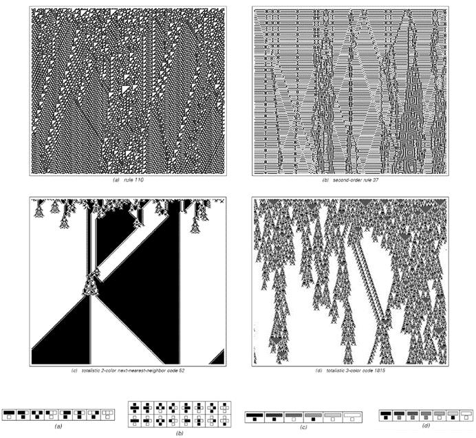

### 11.10  第4类行为与通用性

如果我们观察在随机初始条件下规则110的典型行为，那么最明显的特征是存在大量局部结构，它们以复杂的方式移动并相互作用。但正如我们在第6章中看到的，这种行为绝不是规则110所独有的。事实上，它实际上是我所说的第4类元胞自动机的共同特征。

下一页的图片展示了几个这样的第4类系统的例子。虽然每个例子的细节都不尽相同，但行为的一般特征总是非常相似。

那么，这意味着这些系统的计算能力如何呢？我强烈怀疑，一般来说，任何表现出整体第4类行为的元胞自动机，最终都会像规则110一样，被证明是通用的。

我们在第6章的结尾看到，第4类规则似乎总是会产生一系列逐渐变得更加复杂的局部结构。我预计，如果我们足够仔细地研究任何特定规则，最终总能找到一组足够丰富的局部结构来支持通用性。

(p 691)

要最终证明给定规则是通用的，无疑将涉及与规则110相同的复杂构造。

>正如第6章所讨论的，具有整体第4类行为的元胞自动机的例子。我强烈怀疑，所有第4类规则，就像规则110一样，最终都会被证明是通用的。

(p 692)

但关键是我目前所有的证据都表明，对于任何第4类规则，这样的构造最终都是可能的。

那么哪些规则表现出第4类行为呢？

在只允许每个单元格有两种可能颜色且仅依赖最近邻的256种所谓的基本元胞自动机中，唯一明确的直接例子是规则110——以及通过简单地反转左右或黑白得到的规则124、137和193。但是，一旦允许超过两种可能的颜色，或者允许依赖超过最近邻的单元格，就会立即发现各种第4类行为的进一步例子。

事实上，正如对面页面上的图片所示，在这些情况下，只需使用所谓的总体规则就足够了，在这种规则中，单元格的新颜色仅取决于其邻域内单元格的平均颜色，而不是它们的个别颜色。

在二维空间中，第4类行为可以发生在只涉及两种颜色和最近邻的规则中——如第249页所示。事实上，这样的规则的一个例子就是自20世纪70年代以来在休闲计算中广受欢迎的“生命游戏”。

在二维元胞自动机中证明通用性的策略与一维中的策略基本相同。但在实践中，二维中局部结构流相对容易地相互交叉，可以减少一些技术上的困难。事实证明，早在20世纪70年代就已经有了证明“生命游戏”二维元胞自动机是通用的概要。

回到一维的情况，我们可以问，在256种基本元胞自动机中，除了规则110之外，是否还有其他规则表现出第4类行为的迹象。我们将在下一节看到，其中一个可能是规则54。如果这条规则实际上属于第4类，那么我预计，通过研究它所支持的局部结构之间的相互作用，最终——只要付出足够的努力——就有可能证明它也表现出通用性的现象。

(p 693)

