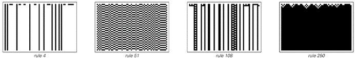
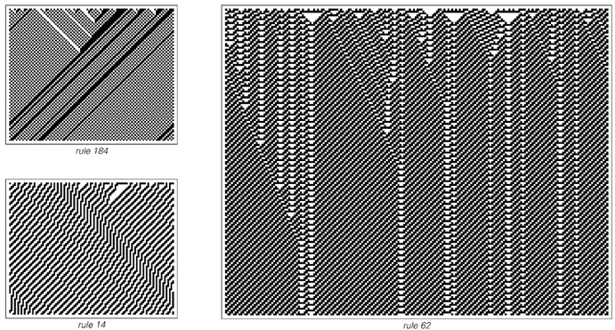
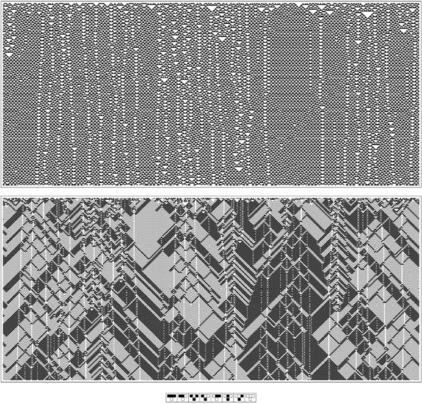
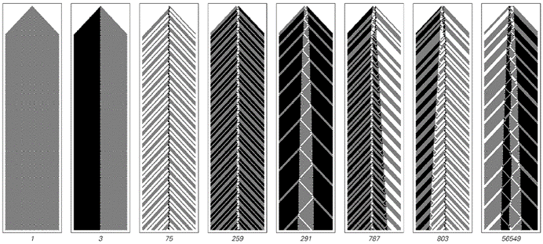
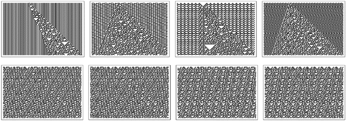
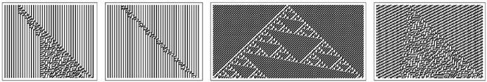
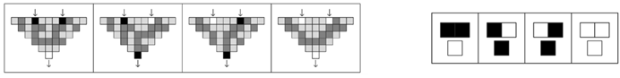

### 11.11  元胞自动机中的通用性阈值

通过证明规则110是通用的，我们已经确立了即使在具有最简单底层规则的元胞自动机中，通用性也是可能的。但仍然存在一个问题，即元胞自动机（或任何其他类型的系统）最终需要什么才能实现通用性。

一般来说，如果一个系统要是通用的，那么这意味着通过设置适当的初始条件选择，可以使系统模拟任何其他系统中可能发生的任何类型的行为。因此，像下面图片中的元胞自动机绝对不是通用的，因为无论使用什么初始条件，它们总是产生简单的均匀或重复的行为模式。

从某种意义上说，这背后的根本原因是——正如我们在第252页所讨论的——第1类和第2类元胞自动机从不允许除有限距离以外的任何信息传输。结果是，它们只能支持涉及有限数量细胞相关作用的过程。

在像对面页面顶部那样的元胞自动机中，一些信息可以在更远的距离上传输。但这种情况的发生受到高度限制，最终这些系统只能产生本质上纯粹嵌套的模式——因此，同样无法实现通用性。

那么加法规则，如90和150又如何呢？

在简单的初始条件下，这些规则总是产生非常规则的嵌套模式。但在更复杂的初始条件下，它们会产生更复杂的行为模式——如下页底部第二组图片所示。然而，正如我们在第264页看到的那样，这些模式实际上从未真正对应于初始条件的复杂转换。事实上，即使在大约1,048,576步（或任何2的幂次方步数）之后，产生的单元格阵列也总是只对应于初始条件的两个或三个移位副本的简单叠加。

>这些基本元胞自动机只表现出纯均匀或纯重复行为，因此肯定不能是通用的。这些元胞自动机必然是第1类或第2类系统。

(p 694)

>这些元胞自动机允许信息在较大距离上传输，但方式非常受限。这些元胞自动机产生的整体模式本质上是嵌套的。这种类型的元胞自动机永远不可能是通用的。

>具有加法规则的元胞自动机示例。初始条件的简单转换对应的状态重复出现，阻止了这类元胞自动机成为通用机。

(p 695)

由于存在许多种类的行为，在有限数量的步骤后不会恢复到这种可预测的形式，因此必须得出结论，加法规则不能是通用的。

在上一节的最后，我提到了规则54，它是除了规则110之外的另一种可能属于第4类的基本元胞自动机。下面的图片展示了规则54的典型行为示例。

>从典型的随机初始条件出发，规则54演化的两种视图。顶部视图显示了每一步每个单元格的颜色。底部视图将每对单元格组合在一起，并且只显示每一步的交替步骤。这里存在各种局部结构——以及第4类行为的迹象。

(p 696)

确实可以看到一些局部结构。但它们是否足以支持第4类行为和通用性呢？下面的图片展示了如果开始依次查看规则54的每个可能的初始条件会发生什么。最初，人们只看到简单的重复行为。在初始条件291下，人们看到了一种非常简单的嵌套形式。随着继续观察，人们会看到各种其他重复和嵌套的形式。但至少在达到一亿个初始条件之前，人们没有看到任何在本质上更复杂的东西。

那么，规则54能实现通用性吗？我不确定。可能是如果人们再稍微深入地查看一下初始条件，就会看到更复杂的行为。也可能是即使上面显示的结构也可以组合起来产生通用性所需的所有丰富性。但也可能是无论人们怎么做，规则54最终都只会显示出纯粹的重复或嵌套行为——而这本身并不能支持通用性。

那么其他基本元胞自动机呢？

>在规则54的前1亿个初始条件下观察到的行为形式。在初始条件291下，右侧的第n条新条纹在步骤2n2+8n-9时产生。即使在最后一种情况下，条纹的排列最终也会变得完全规则，第n条新条纹在步骤n2 + 21n/2 - {6, 5, -4, 3}〚Mod[n, 4] + 1〛/2时产生。在每张图片中，每对单元格都像对面页面底部那样组合在一起。

(p 697)

正如我将在下一章讨论的那样，我的一般预期是，任何其行为在某种程度上不是根本性重复或嵌套的系统，最终都会被证明是通用的。但我怀疑，对于某些系统来说，这一事实的确立会比其他系统容易得多——规则110就是最容易的情况之一。

一般来说，为了证明通用性，人们需要做的是在一个系统中找到一种设置初始条件的方法，以便使其模拟其他系统的一般类别。在某种程度上，主要的挑战在于，我们从编程和工程经验中获得的方法往往只限于有限的一套方法来提出这样的程序。通常，我们习惯于分阶段地构建事物。通常，我们从构建组件开始，然后逐步将这些组件组装成越来越大的结构。关键在于，在每个阶段，我们只需要直接考虑当前正在处理的结构的规模——而不是例如构成这些结构的所有部分。

在证明规则110的通用性时，我们能够基本上遵循相同的基本方法。我们首先识别了各种局部结构，然后将这些结构用作构建我们所需的越来越大结构的组件。

从某种意义上说，我们的方法至关重要的一点是，我们能够轻松地控制系统中信息的传输。因为这使我们能够将不同的局部结构视为分开且独立的对象。

实际上，在任何具有第4类行为的系统中，事物通常会以或多或少相同的方式工作。但在第3类系统中则不然。因为在这样的系统中，通常发生的情况是，即使是对单个单元的改变也会最终传播开来，影响到所有其他单元。这种信息的不受控制传播使得很难识别出可以用作构建中确定组件的部分。

那么在这样的情况下可以做什么呢？最明显的可能是，人们可能能够在特定的初始条件类别中找到可以控制信息传播的方法。而规则73就是一个可能实现这一点的例子。

(p 698)

下面的图片展示了规则73的典型行为——首先是在完全随机的初始条件下，然后是在没有偶数连续黑方格的初始条件下。

在第二种情况下，规则73表现出典型的第3类行为——即通常的信息不受控制传播。然而，在第一种情况下，存在的黑墙似乎完全阻止了信息的长距离传播。

那么，人们是否能在规则73中实现某种中间状态——即信息被传播，但仅以受控的方式？

下一页顶部的图片给出了一些可能实现这一点的迹象。因为它们表明，在适当的背景下，规则73支持各种局部结构，其中一些会移动。虽然这些结构起初可能看起来更像规则54中的结构而非规则110中的结构，但我强烈怀疑，规则73典型行为的复杂性将体现在这些结构之间更复杂的相互作用中——并且最终将提供与规则110中类似的方式来证明通用性所需的东西。

>规则73的两个例子。上面的例子使用了完全随机的初始条件；下面的例子使用了初始条件，其中永远不会出现偶数连续的黑方格。下面的例子实际上是从单个黑方格得到的图案的一部分——就在中间列的右侧，从第1000步开始。

(p 699)

那么像规则30这样的情况呢？在严格的重复初始条件下——就像任何元胞自动机一样——这必然会产生纯粹的重复行为。但是，一旦人们扰乱了这样的初始条件，通常似乎只会得到复杂且看似随机的行为，就像第二张图片的第一行所示。

然而，事实证明，仍然有可能得到局部结构——正如第二张图片的第二行所示。但这些结构似乎总是以相同的速度移动，因此永远无法相互作用。即使在搜索了数十亿个案例之后，我也从未在规则30中找到任何有用的局部结构组合。

>规则73中局部结构的例子。请注意，在最后一个例子中，两侧的背景图案是镜像的。

>规则30在重复背景下产生的图案的例子。第一行显示了将单个额外的黑方格插入各种背景中的效果。第二行显示了规则30在由多达25个单元格组成的重复背景下支持的所有局部结构，这些结构涉及多达25个单元格。请注意，这些局部结构在每个步骤中都向右移动一个单元格——这使得它们无法以非平凡的方式相互作用。

(p 700)

下面的图片展示了规则45中的情况。对重复初始条件的许多可能扰动再次产生了看似随机的行为。但在一种情况下，产生了一个嵌套模式。而保持局部的结构现在相当普遍——但就像规则30一样，它们似乎总是以相同的速度移动。

因此，尽管这意味着我们用来证明规则110的通用性的特定方法不能立即用于规则30或规则45，但这并不意味着这些规则最终不是通用的。正如我将在下一章中讨论的，我非常坚信它们最终会被证明是通用的。

那么，我们如何获得这方面的证据呢？

如果一个系统是通用的，那么这意味着通过适当编码初始条件，其演化必须模拟任何其他系统的演化。因此，这表明人们可能只是通过尝试不同的可能编码，然后观察它们允许人们模拟的其他系统的范围，来获得关于通用性的证据。

在第645页的19色通用元胞自动机的情况下，事实证明，用特定的20单元块来表示单个黑白单元的编码足以使通用元胞自动机模拟所有256种可能的基本元胞自动机——每种自动机的演化一步对应于原始系统演化的53步。

>在规则45中，将单个额外的黑单元插入重复背景所产生的图案的例子。请注意，这里出现了规则90中嵌套模式的倾斜版本。在规则45中，局部结构相当普遍——但就像规则30一样，它们似乎总是以相同的速度移动，因此可能无法相互作用以产生任何第4类行为。

(p 701)

>使用各种特定的基本元胞自动机来模拟其他基本元胞自动机的例子。在每种情况下，单个细胞都被编码为细胞块，并显示了所有不同的这种编码，其块长度最多为20。

(p 702)

因此，给定一个特定的基本元胞自动机，人们可以问它可以使用长度最多为某个值的块来模拟哪些其他基本元胞自动机。

对面页面上的图片显示了一些例子。

结果并不特别惊人。没有单一规则能够模拟许多其他规则——而且被模拟的规则往往相当简单。一个稍微令人惊讶的例子是规则45最终能够模拟规则90。但是，至少在使用长度最多为25的块时，例如规则30无法模拟任何非平凡规则。

从我们给出的通用性证明中可以得出，规则110必须能够使用一定大小的块来模拟任何其他基本元胞自动机——但根据我们讨论的实际构造，这个大小将是相当大的。当然，在对面页面上的图片中，规则110似乎并不突出。

但是，虽然用另一个元胞自动机来模拟一个元胞自动机的完整演化似乎有些困难，但事实证明，对于有限数量的步骤，模拟演化的片段要容易得多。作为一个例子，下面的图片展示了如何使规则30模拟规则90中一步的基本操作。

这个想法是在规则30中设置一个配置，以便如果在特定位置插入输入，则来自底层规则30演化的输出将完全对应于从规则90演化的一步中所得到的结果。在所示的特定情况下，这是通过在每个输入位置之间设置3个细胞宽的块来实现的。

但是，正如下一页的图片所示，通过具有适当的5个细胞宽的块，规则30实际上可以被设置为模拟256种可能的基本元胞自动机中每一种的一个演化步骤。

>规则30被设置为模拟单个异或（Xor）操作——这是在规则90演化的一个步骤中使用的。除了在两个指示位置外，规则30的初始条件是固定的，其中可以有效地给出输入。图片显示，对于每种可能的输入组合，规则30演化的结果都与异或的输出完全对应。

(p 703)

那么其他底层规则呢？

对面页面上的图片展示了对于几种不同的底层规则，哪些256种可能的基本规则可以成功地用越来越宽的块进行模拟。在底层规则的行为相对简单的情况下——如规则90和184——事实证明，永远不可能模拟超过少数几个256种可能的基本规则。但对于具有更复杂行为的底层规则——如规则22、30或110——事实证明，最终总是可以模拟所有256种基本规则。

>规则30如何被设置为模拟所有基本元胞自动机的一个演化步骤的插图。

(p 704)

然而，这里的模拟仅针对单个步骤。因此，尽管这是可能的，但它并不立即在任何普通意义上建立通用性。但它再次支持了这样一个观点，即几乎所有在我们看来行为复杂的元胞自动机都可以被设置为执行在某种意义上与人们想要的同样复杂的计算。

这表明，这样的元胞自动机最终将被证明是通用的——其结果是，在256种基本规则中，人们预计可能有多达27种实际上将是通用的。

>以下是使用对面页面上的方案，通过逐渐增加块宽度的方式，各种底层元胞自动机在模拟256种可能的基本元胞自动机各自的一个演化步骤方面的总结。

(p 705)

