### 11.12  图灵机和其他系统中的通用性

从前面几节[8, 9, 10, 11]的结果中，我们现在对元胞自动机中的通用性阈值有了一些了解。但是其他类型的系统呢？比如图灵机？为了获得通用性，规则需要多复杂？

在20世纪50年代和60年代早期，人们做了一些工作来尝试构建小型的通用图灵机。这项工作的主要成就是构建了下面所示的具有7个状态和4种可能颜色的通用机器。

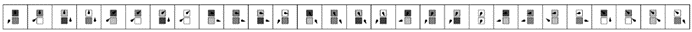

>1962年构建的具有7个状态和4种颜色的通用图灵机的规则。到目前为止，这基本上是已知的最简单的通用图灵机。请注意，规则中的一个元素可以被视为指定图灵机应该“停止”，且读写头保持在同一位置和同一状态。

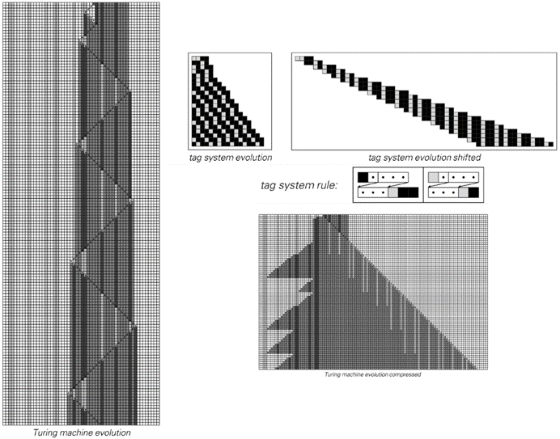

>上述图灵机如何模拟一个标签系统的示例。在标签系统中，一个黑色元素被设置为对应于图灵机中的四个细胞块，而一个白色元素对应于单个细胞。

(p 706)

对面页面底部的图片展示了在这种情况下如何证明通用性。基本思路是，通过在左侧设置适当的初始条件，可以使图灵机模拟某种类型的任何标签系统。但随后从第667页的讨论中得出，存在这种类型的通用标签系统。

找到一个像对面页面上那样相对简单的通用图灵机已经是一项成就。而且，自从这个例子被发现以来的四十年里，还没有找到明显更简单的图灵机。因此，人们可能会从这一点得出结论，认为对面页面上的机器在某种程度上是图灵机通用性的阈值。

但正如人们可能从本书中的发现所预期的那样，这远非正确。事实上，通过使用规则110的通用性，人们发现有可能提出下面这个大大简化的通用图灵机——它只有2个状态和5种可能的颜色。

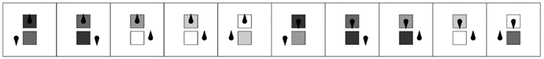

>目前已知的最简单的通用图灵机的规则，基于本书中的发现。该机器有2个状态和5种可能的颜色。

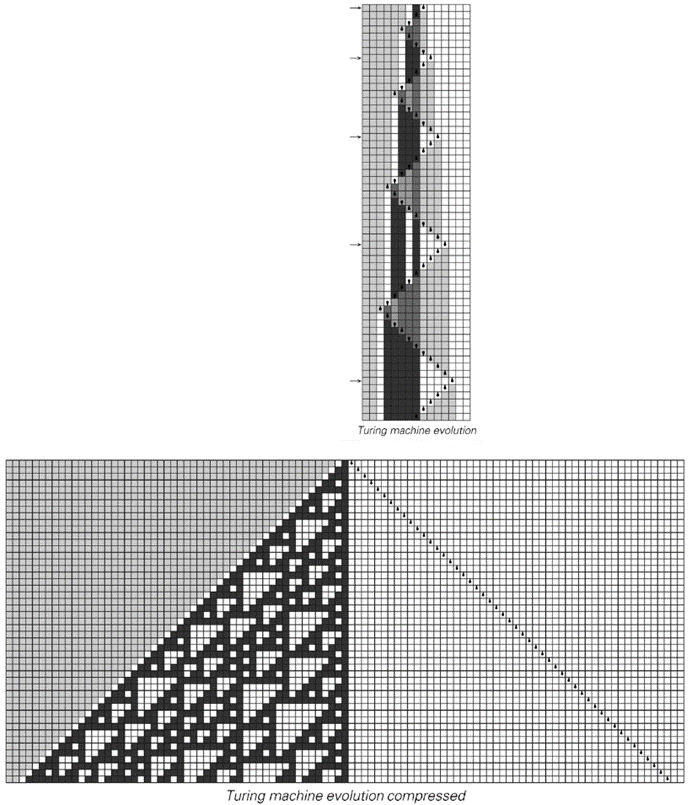

>上述图灵机如何管理以模拟规则110的示例。通过仅保留指示读写头比以往任何时候都更靠右的步骤来制作压缩图片。要获得所示图片，需要总共运行图灵机5000步。

(p 707)

正如前一页底部的图片所示，这台图灵机以相当直接的方式模拟了规则110：它的读写头系统地在前后移动，在每个完整的扫描中，根据规则110演化的一个步骤来更新所有细胞。而且，从本章前面的内容中我们知道规则110是通用的，因此可以推断出这台2状态5颜色的图灵机也必须是通用的。

那么，这是否就是最简单的通用图灵机呢？

我非常肯定地说，它不是。事实上，我预计还有一些更简单的图灵机。但是，它们究竟能有多简单呢？

如果我们看看具有2状态和2颜色的4096台图灵机，可以很容易地看出，它们的行为在所有情况下都过于简单，无法支持通用性。那么在2状态和2颜色与2状态和5颜色之间，图灵机的通用性阈值在哪里呢？

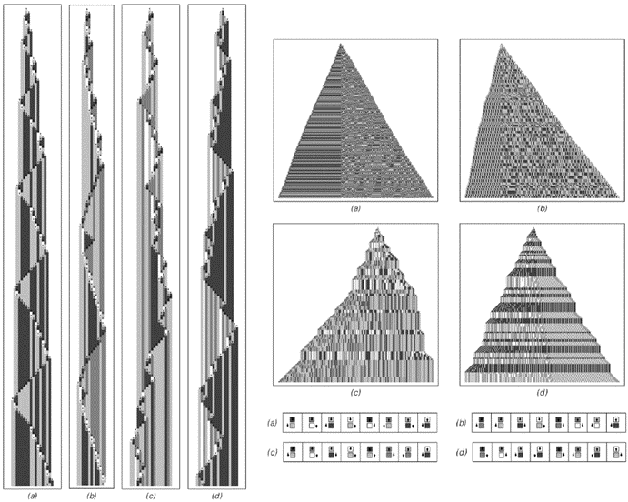

>具有2状态和4颜色且表现出复杂行为的图灵机示例。上面的压缩图片是基于50,000步的演化。在所有情况下，所有细胞最初都是白色的。

(p 708)

对面页面底部的图片给出了一些表现出复杂行为的2状态4颜色图灵机的示例。我毫不怀疑，如果不是全部的话，那么其中大多数都是通用的。

在这样的2状态4颜色图灵机中，或许每50,000台中就有一台在从空白磁带开始时会表现出复杂行为。同样，在4状态2颜色的图灵机中也观察到了这种复杂的行为——如第81页所述——但现在它可能只出现在大约200,000个案例中的一个中。

那么2状态和3颜色的图灵机呢？总共有2,985,984种。其中大多数的行为相当简单。但事实证明，其中14种——它们本质上都是等价的——即使在从空白磁带开始时也能产生相当复杂的行为。

下面的图片就是一个例子。

尽管这无疑会很难证明，但似乎很有可能这台图灵机最终会被证明是通用的。如果是这样的话，那么它很可能在大多数情况下都是最简单的通用图灵机。

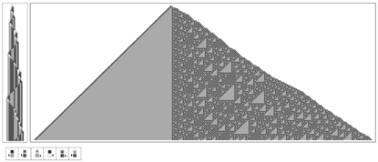

>当从空白磁带开始时，这14种本质上等价的2状态3颜色图灵机之一会产生复杂的行为。上面的压缩图片是通过取前100,000步，并只保留那些读写头比以往任何时候都更靠左的步骤来制作的。出现的图案内部类似于规则60加法元胞自动机的倒置版本；然而，边界更为复杂。在第761页的编号方案中，这是具有2状态和3颜色的总共2,985,984台图灵机中的第596,440台。

(p 709)

对于3状态和2颜色的图灵机来说，事实证明，在空白的初始条件下，这种类型的所有2,985,984台可能的图灵机都会迅速演化出简单的重复或嵌套行为。在更复杂的初始条件下，观察到的行为有时可能会更复杂，但至少会持续一段时间——如下面的图片所示。但最终，它似乎总是以简单的形式出现。

然而，尽管如此，似乎仍然可以想象，在适当的初始条件下，可能会出现更复杂的行为——并且最终可能允许3状态2颜色图灵机具有通用性。

从规则110的通用性我们知道，如果我们只是按照特定的顺序开始枚举元胞自动机，那么在遍历最多110条规则之后，我们肯定会看到通用性。而且，从本章前面的其他结果来看，我们很可能会更早地看到通用性——可能只需要遍历大约十条或二十条规则。

在图灵机中，第707页上的通用2状态5颜色规则可以被分配为第8,679,752,795,626个。这意味着在遍历了大约九万亿台图灵机之后，我们肯定会倾向于找到一个通用的例子。但很可能我们会更早地找到例子——例如，第709页上的2状态3颜色机器只是第596,440个。

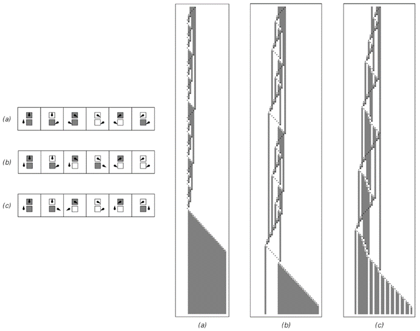

>以下是一些3状态2颜色图灵机的例子，它们的行为在一段时间内会稍微复杂一些。在更复杂的初始条件下，这些机器可以表现出更长时间的复杂行为。

(p 710)

尽管这些数字比元胞自动机要大，但事实仍然是，结构最简单的潜在通用图灵机仍然非常简单，这表明图灵机的通用性阈值——就像元胞自动机一样——在很多方面都非常低。

那么其他类型的系统呢？

我怀疑，在本书中我们之前看到的任何表现出复杂行为的系统，最终都有可能证明其具有通用性。事实上，正如我将在下一章详细讨论的那样，我认为通用性和复杂行为的出现之间通常存在着密切的联系。

之前已知的通用系统的例子通常具有过于复杂的规则，以至于我们无法清晰地看到这一点。但有一个几乎独一无二的例子，它可能很久以前就已经被注意到了，那就是所谓的组合子（combinators）。

组合子是我们在第3章第102页讨论的符号系统的一个特例。最初，它们被设计为一种理想化的方式来表示逻辑中定义的函数结构，但实际上，组合子是在1920年首次引入的——比图灵机早了十六年。尽管在过去八十年里，人们对它们进行了一些研究，但它们在很大程度上一直被视为相当模糊且无关紧要的构造。

下面给出了组合子的基本规则。

在较短的初始条件下，下一页顶部的图示表明，组合子倾向于迅速演变为简单的固定点。但是，在长度为8的初始条件（e）下，图示显示没有达到固定点，反而总规模呈指数增长——内部行为似乎相当随机。

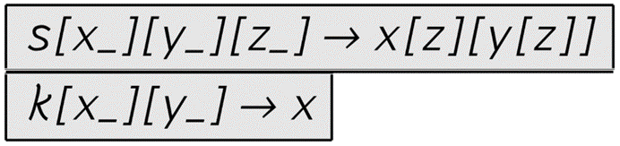

>组合子作为符号系统的规则，首次于1920年引入，并在20世纪30年代中期被证明具有通用性。

(p 711)

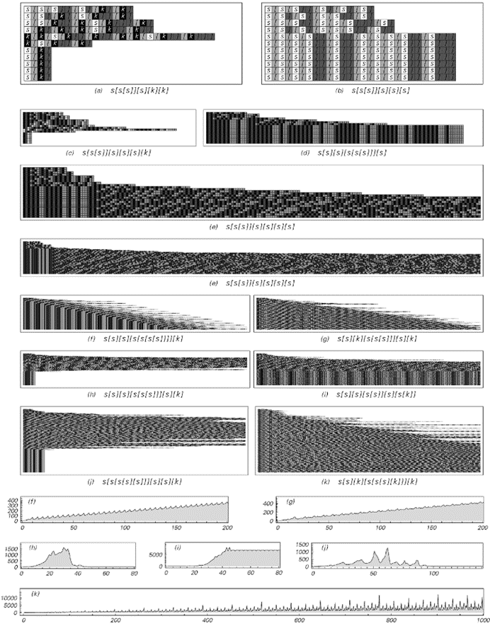

>组合子演化的例子。情况（e）中的表达式是导致无限增长的最短表达式。底部的图示显示了在连续步骤中达到的总表达式规模。请注意，尽管没有达到任何最终的固定点，但演化的详细模式可能取决于在Mathematica中按“/.”顺序应用组合子规则这一事实。

(p 712)

其他组合子会产生更复杂的行为——有时整体重复或嵌套，但通常不是。

组合子的一些特征不容易直接用图片来捕捉。但是，从像对面页面上的图片这样的图示可以相当清楚地看出，尽管组合子的基本规则相当简单，但组合子的行为可以非常复杂。

虽然典型行为的问题之前并没有真正被研究过，但自从20世纪30年代首次引入通用性概念以来，人们就已经知道组合子具有通用性。

我们现在展示这一点的方法之一是证明组合子可以模拟规则110。正如下一页的图片所示，事实证明，只需反复应用下面的组合子表达式，就可以再现规则110演化中的连续步骤。

过去，我们没有理解组合子通用性的整体背景。但现在我们所看到的表明，这种通用性在某种意义上只是与一般的复杂行为相关联。

然而，我们在第3章中看到，有些符号系统的规则甚至比组合子还要简单，但仍然表现出复杂的行为。因此，我现在怀疑这些系统也是通用的。

事实上，无论在哪里观察，通用性的门槛似乎都比人们曾经想象的要低得多。这是导致我提出计算等价原理的重要基本观察之一，我将在下一章中讨论这一点。

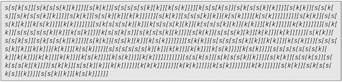

>一个组合子表达式，对应于执行规则110演化的一步操作。

(p 713)

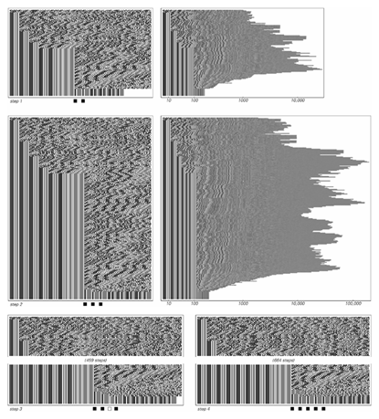

>使用组合子模拟规则110的元胞自动机。从上一页得到的规则110组合子被应用于规则110演化的每一步。初始状态被设定为包含一个黑色单元格。

(p 714)
