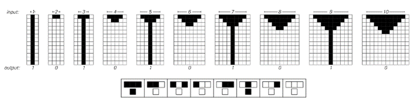
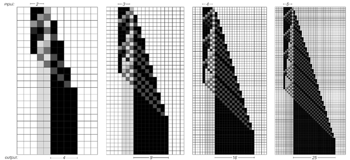
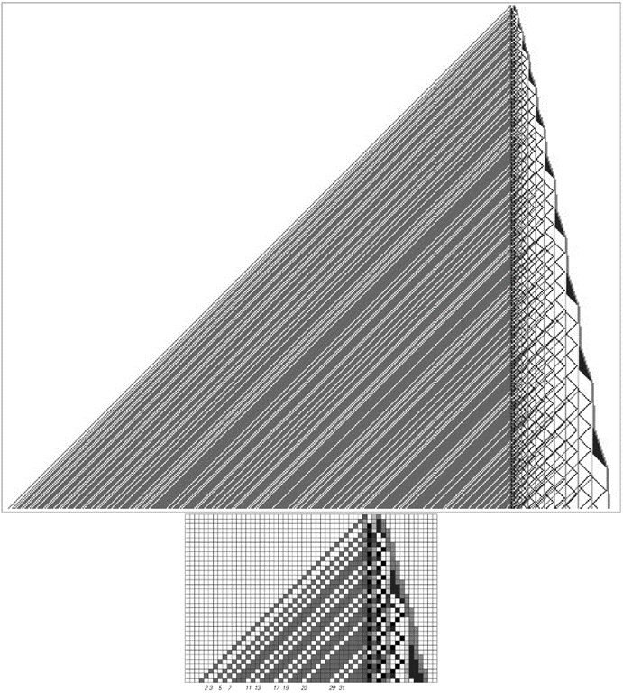

### 11.2  元胞自动机中的计算

我说过，像元胞自动机这样的系统的演化可以被视为一种计算。但这是什么类型的计算？它与我们通常在实践中进行的计算相比又如何呢？

下面的图片展示了一个元胞自动机的例子，其演化可以被视为执行一个特定的简单计算。

如果从具有偶数个黑色单元格开始这个元胞自动机，那么在经过几步演化后，就不会剩下任何黑色单元格。但如果从具有奇数个黑色单元格开始，那么就会有一个黑色单元格永远存在。因此，实际上这个元胞自动机可以被视为计算给定的数字是偶数还是奇数。

>这是一个简单的元胞自动机，其演化有效地计算了一个数除以2的余数。从一行n个黑色单元格开始，如果n是偶数，则没有黑色单元格存活；如果n是奇数，则有一个黑色单元格存活。该元胞自动机遵循左下角所示的基本规则132。

(p 638)

通过设置适当数量的初始黑色单元格，可以指定计算的输入。然后，通过观察最终存活的黑色单元格数量，可以确定计算的结果。

判断一个数字是偶数还是奇数，在大多数情况下，被认为是一种相对简单的计算。但也可以让元胞自动机执行更复杂的计算。作为例子，下面的图片展示了一个计算任何数字平方的元胞自动机。如果从5个黑色方块开始，那么在一定数量的步骤之后，元胞自动机将产生一个由恰好5×5=25个黑色方块组成的块。

一开始，一个具有元胞自动机这样简单底层结构的系统能够执行这样的计算可能会让人感到惊讶。但正如我们稍后将在本章中看到的那样，元胞自动机实际上可以执行任意复杂的计算。作为一个稍微复杂一点的计算的例子，下一页的图片展示了一个计算连续质数的元胞自动机：2、3、5、7、11、13、17等。

>计算任何数字平方的元胞自动机。这个元胞自动机实际上是通过将原始数字n与自身相加n次来工作的。这里使用的底层规则涉及每个单元格可能有八种不同的颜色。

(p 639)

这个元胞自动机的规则相当复杂——它涉及每个单元格总共可能有十六种颜色——但这个例子证明了原则上元胞自动机可以计算质数的观点。

>一个用于计算质数的元胞自动机。该系统在所有不是1的数字乘积对应的位置上，在左侧生成一条深灰色条纹。然后，在质数2、3、5、7、11、13、17等对应的位置上留下白色空白。元胞自动机实际上使用埃拉托斯特尼筛法（Sieve of Eratosthenes）的标准方法进行计算。右侧的结构以与连续奇数相对应的重复周期来回反弹。在每个周期中，它们都会生成一条向左传播的灰色条纹，因此最终会有一条与每个数字的每个倍数相对应的灰色条纹。这里显示的元胞自动机的规则涉及每个单元格可能有16种颜色。

(p 640)

那么，我们之前在这本书中讨论的元胞自动机呢？它们能执行什么样的计算？

在某种程度上，任何元胞自动机——或者任何系统——都可以被视为执行一种计算，以确定其未来的行为。

但对于我在本节中讨论的元胞自动机来说，它们所执行的计算也恰好可以用传统的数学概念来描述。

事实证明，这在我之前讨论过的一些元胞自动机中是可能的。例如，如下图所示，规则94可以有效地描述为枚举偶数。类似地，规则62可以被视为枚举3的倍数，而规则190枚举的是4的倍数。如果观察它所产生图案的中间列，那么规则129可以被视为枚举2的幂。

但是，像下面第二组图片中的元胞自动机在进行什么样的计算呢？如果我们将它们产生的图案与本节到目前为止我们所看到的图案进行比较，那么我们立刻就会怀疑，我们不能像说它们生成质数那样简单地描述这些计算。

那么我们如何才能期望描述这些计算呢？传统数学对此帮助不大，但我们将看到的是，有一系列来自实际计算的熟悉思想，它们至少提供了所需框架的开始。

>简单元胞自动机的例子，它们的演变对应于可以很容易地用传统数学术语描述的计算。与前一页类似，规则94图片底部的白色单元格位置对应偶数，规则62左侧的白色单元格位置对应3的倍数，规则190对应4的倍数，而规则129中间列的白色单元格位置对应2的幂。

>元胞自动机的例子，它们有简单的底层规则，但整体行为似乎并不对应于任何标准数学或其他术语中的简单描述的计算。

(p 641)

