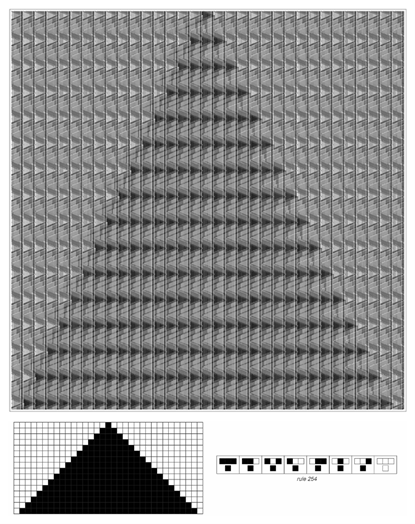
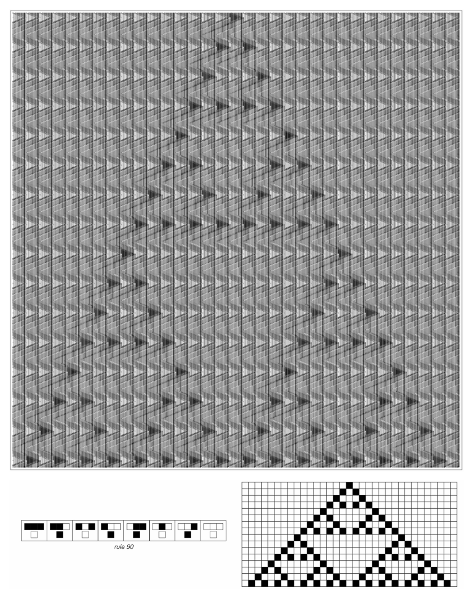
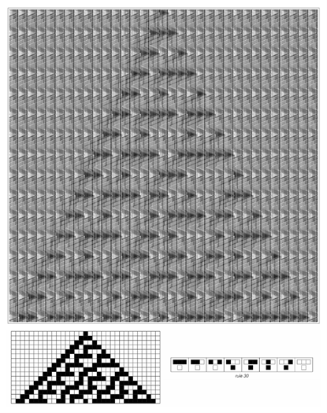
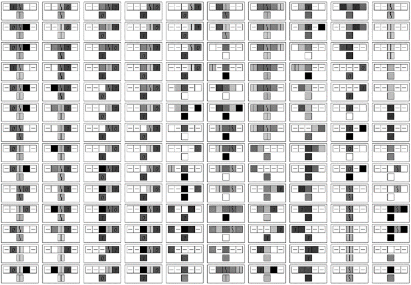
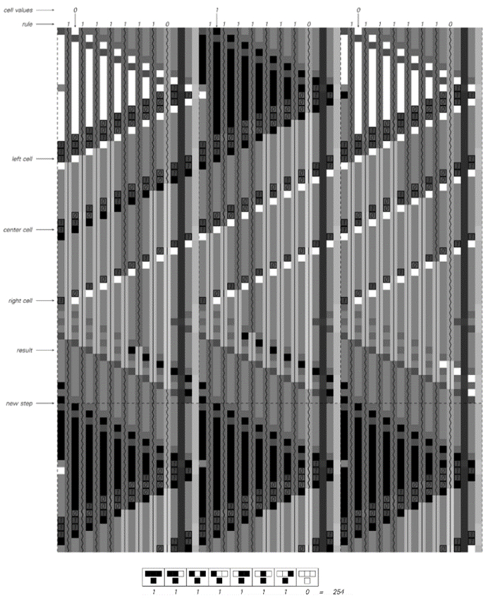
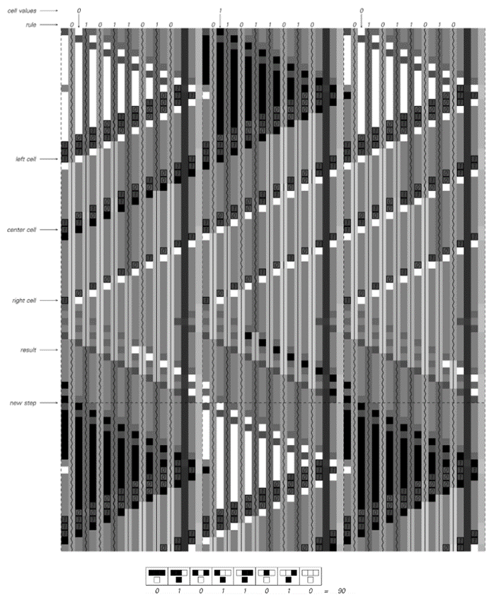
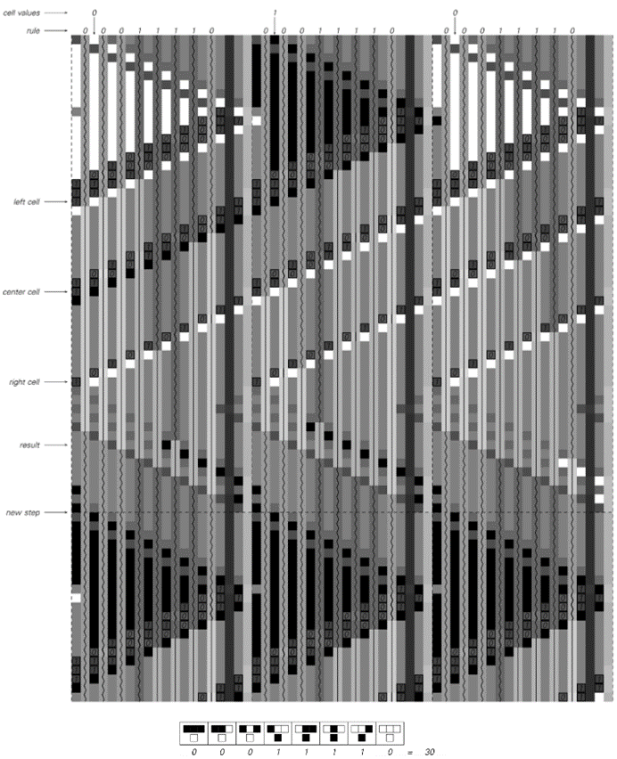
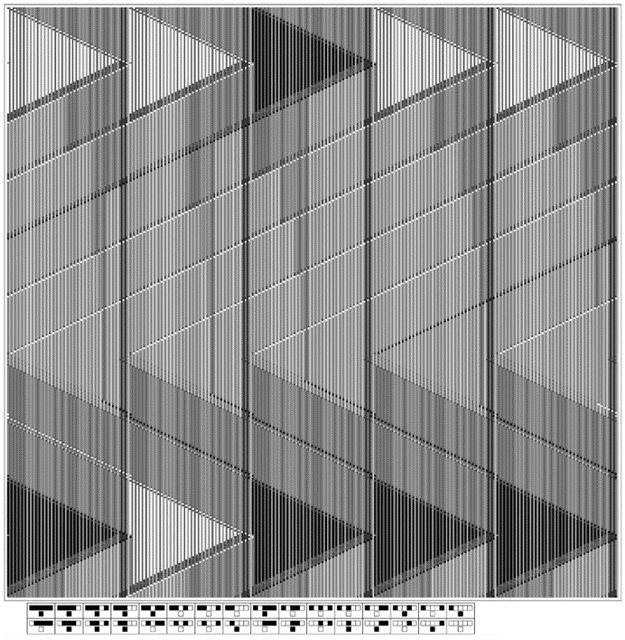
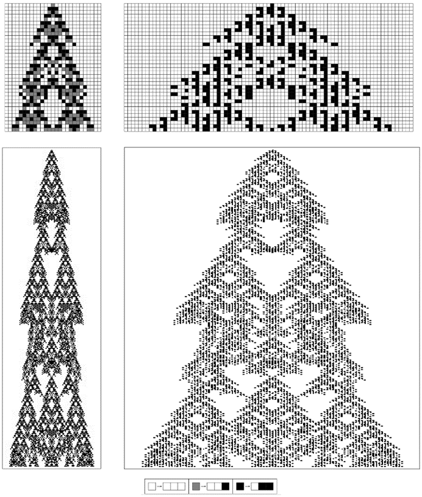

### 11.4  通用元胞自动机

作为展示通用性系统的第一个具体例子，我在本节中讨论了一个特定的通用元胞自动机，它被设计得尽可能容易跟踪其操作。

这个元胞自动机本身的规则始终是相同的。但它之所以具有通用性，意味着如果给予适当的初始条件，它可以有效地被编程来模拟任何可能的元胞自动机——无论其规则如何。

接下来的三页[645, 646, 647]展示了三个这样的例子。

(p 644)

>通用元胞自动机模拟基本规则254。在规则254中，每个细胞在通用元胞自动机中由20个细胞的块表示。这些块中的每一个都编码了它所代表的细胞的颜色以及更新此颜色的规则。

(p 645)

>通用元胞自动机模拟基本规则90。通用元胞自动机的基本规则与前一页完全相同。但初始条件中的每个块现在包含规则90的表示，而不是规则254。

(p 646)

>通用元胞自动机模拟规则30。展示了通用元胞自动机在进化过程中的总共848步，对应于规则30进化过程中的16步。

(p 647)

在每一页上，通用元胞自动机的基本规则都是完全相同的。但在第一页上，初始条件被设置为使通用元胞自动机模拟规则254，而在第二页上则设置为模拟规则90，在第三页上则模拟规则30。

接下来的页面[649, 650, 651]展示了这是如何工作的。基本思想是，在通用元胞自动机中，使用20个细胞的块来表示正在模拟的元胞自动机中的每个单个细胞。在这个20个细胞的块中，既编码了正在表示的细胞的当前颜色的规格，也编码了更新该颜色的规则。

>通用元胞自动机的规则。每个细胞有19种可能的颜色，这里用19个不同的图标来表示。由于每个细胞的新颜色取决于总共五个细胞的先前颜色，因此原则上需要覆盖2,476,099种情况。但是，通过使用   来表示具有任何可能颜色的细胞，许多情况被合并了。请注意，所示的情况是按顺序逐列读取的，更特殊的情况在更一般的情况之前给出。在使用的初始条件下，有些细胞组合永远不会发生，因此在所示规则中并未涵盖这些组合。

(p 648)

>通用元胞自动机模拟规则254的详细情况。通用元胞自动机中的每个块都代表规则254中的一个单个细胞，并编码了细胞的当前颜色以及用于更新它的规则的形式。

(p 649)

>通用元胞自动机模拟规则90的详细情况。与前一页的图示相比，初始条件的唯一区别是，现在每个块都编码规则90而不是规则254。

(p 650)

>通用元胞自动机模拟规则30的详细情况。同样地，与对面页相比，初始条件的唯一区别是，现在每个块都编码规则30而不是规则90。

(p 651)

在所示的例子中，被模拟的元胞自动机在其规则中有8种情况，每种情况都给出了一个细胞及其紧邻邻居的8种可能颜色组合之一的结果。在通用元胞自动机中的每个20个细胞的块中，这些规则都通过按顺序列出8种可能情况中的每一种的结果来以非常直接的方式编码。

为了更新由特定块表示的细胞的颜色，通用元胞自动机必须做的是确定这8种情况中的哪一种适用于该细胞。它通过连续排除不适用的情况来实现这一点，直到最终只剩下一个情况。在上一页[649, 650, 651]的图片中，可以直接看到这种排除过程。在每个大黑色或白色三角形下方，最初有8条垂直的深色线。这些线中的每一条都对应于规则中的一个情况，并且系统设置为当与其对应的情况被排除时，特定的线就会结束。

在这里讨论的通用元胞自动机中，给定细胞的排除过程总是发生在表示该细胞的块的左侧紧邻块中。但这个过程本身并不难理解，实际上，它的工作方式与人们可能期望的实际电子逻辑电路非常相似。

在图片中，可以看到三个基本阶段，它们作为三条条纹在每个块上向左移动。第一条条纹携带左侧邻居的颜色，并导致规则中该邻居没有适当颜色的所有情况被排除。接下来的两条条纹则携带细胞本身及其右侧邻居的颜色。当这三条条纹都通过后，8种情况中只有一种会存活下来，而这种情况就是给出细胞新颜色的那一种。

最后几页的图片展示了通用元胞自动机实际上如何被编程以模拟任何其规则涉及最近邻居且每个细胞有两种可能颜色的元胞自动机。但通用元胞自动机绝不限于仅模拟涉及最近邻居的规则。因此，在对面页上，例如，它展示了模拟一个涉及次近邻以及最近邻的规则。

(p 652)

>通用元胞自动机模拟了上面所示规则的演化过程中的一个步骤，该规则涉及次近邻以及最近邻细胞。该规则现在涵盖了总共32种情况，对应于细胞及其最近邻和次近邻颜色的可能排列。图片显示了根据所示规则五个细胞的演化，现在每个细胞在通用元胞自动机中由70个细胞的块来表示。

(p 653)

由于必须包含规则中的所有32种情况，因此现在表示每个细胞所需的块更大了。此外，还有五个消除阶段而不是三个。但尽管有这些差异，通用元胞自动机的基本规则仍然完全相同。

那么，对于每个细胞有超过两种可能颜色的规则呢？事实证明，有一种通用的方法来模拟这些规则，即使用只有两种颜色但邻居数量更多的规则。对面页上的图片就是一个例子。这个想法是，在双色元胞自动机中，三色元胞自动机中的每个细胞都由三个细胞的块来表示。通过查看每侧距离五个邻居的情况，双色元胞自动机可以在每一步中直接根据三色元胞自动机的规则更新这些块。

同样的基本方案可以用于任何数量的颜色规则。因此，结论是通用元胞自动机最终可以模拟具有任何一组规则的元胞自动机，无论它们可能涉及多少个邻居和多少种颜色。

这是一个重要且初看起来令人惊讶的结果。因为除此之外，它还意味着通用元胞自动机可以模拟其规则比自身更复杂的元胞自动机。如果不知道通用性的基本现象，那么人们很可能会认为，通过使用更复杂的规则，总是能够产生新的和不同的行为类型。

但是，通过研究本节中的通用元胞自动机，我们现在知道事实并非如此。因为给定通用元胞自动机，实际上总是可以编程该元胞自动机来模拟任何其他元胞自动机，并因此产生其他元胞自动机可能产生的任何行为。

因此，从某种意义上说，我们现在可以看到的是，与使用比通用元胞自动机更复杂的规则相比，我们永远无法获得任何根本性的好处。因为给定通用元胞自动机，更复杂的规则总是可以通过设置适当的初始条件来模拟。

(p 654)

>这个例子展示了如何使用只有两种可能颜色但邻居数量更多（在这种情况下，每侧五个）的元胞自动机来模拟具有三种可能颜色和最近邻规则的元胞自动机。基本思想是根据左侧给出的对应关系，在双色规则中，三色规则中的每个细胞都由三个细胞的块来表示。这里所示的三色规则是第70页上的全数码1599。

(p 655)

然而，看看我们在本节中讨论的特定通用元胞自动机，我们可能会认为，虽然通用性在原则上可能很重要，但在实践中却很少相关。因为本节中通用元胞自动机的规则相当复杂——每个细胞涉及19种可能的颜色，以及次近邻和最近邻。如果这种复杂性确实是实现通用性所必需的，那么人们就不会期望通用性在例如我们在自然界中看到的系统中是常见的。

但我们在本章稍后将发现，这种底层规则的复杂性实际上是不必要的。事实上，最终我们会看到，通用性实际上可以发生在只有两种颜色和最近邻的元胞自动机中。这种元胞自动机的操作比本节中讨论的通用元胞自动机的操作要难得多。但是，具有如此简单底层规则的通用元胞自动机的存在表明，我们在本节中获得的基本结果可能具有非常广泛的意义。

