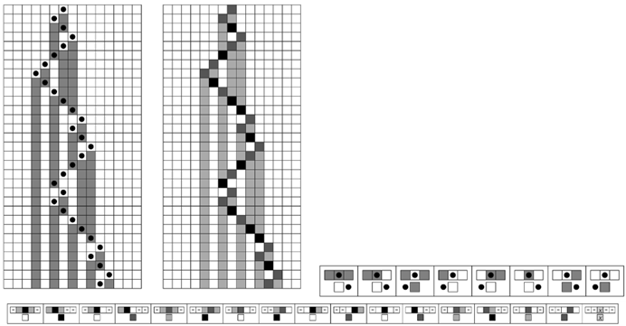
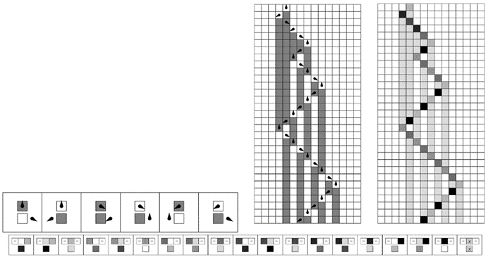
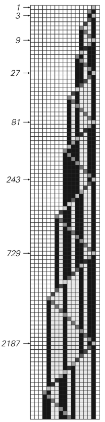

### 11.5  用元胞自动机模拟其他系统

上一节表明，特定的通用元胞自动机可以模拟任何可能的元胞自动机。但是其他类型的系统呢？元胞自动机也能模拟它们吗？

凭借其简单且相当具体的底层结构，人们可能会认为元胞自动机永远无法模拟非常广泛的其他系统。但我在本节中要展示的是，事实并非如此，最终元胞自动机实际上可以被用来模拟我们在本书中讨论过的几乎每一种类型的系统。

作为这一点的第一个例子，对面页面上的图片展示了如何使元胞自动机模拟移动自动机。

移动自动机与元胞自动机的主要区别在于，在移动自动机中，有一个特殊的活动细胞在每个步骤中移动，而在元胞自动机中，所有细胞都被视为完全相同。为了用元胞自动机模拟移动自动机，事实证明，人们所需要做的就是将元胞自动机中细胞的可能颜色分为两组：较浅的颜色对应于移动自动机中的普通细胞，而较深的颜色对应于活动细胞。然后，通过设置适当的规则并选择仅包含一个较深细胞的初始条件，人们可以在元胞自动机中精确模拟移动自动机演化的每一步——如下图所示。

(p 656)

同样的基本方法也可以用来构建一个模拟图灵机的元胞自动机，如下一页所示。同样，元胞自动机中的较浅颜色代表图灵机中的普通细胞，而较深颜色代表头下的细胞，每种可能的头状态都对应一种特定的较深颜色。

人们可能会认为，移动自动机和图灵机可以被元胞自动机模拟的原因是，它们都像元胞自动机一样，由固定的细胞阵列组成。那么，人们可能会想，对于没有固定元素阵列的替换系统（substitution systems）来说，会发生什么呢？

>一个元胞自动机模拟移动自动机（见第71页）的例子。在左侧显示的移动自动机中，每个细胞有两种可能的颜色。在右侧显示的元胞自动机中，细胞有四种可能的颜色，其中两种较深的颜色对应于移动自动机中的活动细胞。移动自动机和元胞自动机的规则如上图所示。在元胞自动机的规则中，“ ”表示任何颜色的细胞。

(p 657)

对面页面上的图片表明，这些替换系统实际上也可以被元胞自动机模拟。但是，虽然人们可以用元胞自动机的一个演化步骤来模拟移动自动机或图灵机的每一步演化，但这对于替换系统来说通常不再成立。

最终必然会出现这种情况，因为从一步到下一步，替换系统中元素的总数可以乘以一个因子，而在元胞自动机中，每个步骤中模式的大小只能增加固定的量。这意味着，为了再现替换系统演化的每一步，可能需要越来越多的元胞自动机步骤——如对面页面上的图片所示。

在顺序替换系统（sequential substitution systems）以及标签系统（tag systems）中也会出现同样的问题。但是，正如第660页上的图片所示，使用元胞自动机来模拟这些系统仍然是完全可能的。

但是，元胞自动机最终能够模拟的系统集合究竟有多广泛呢？到目前为止，我所展示的所有系统示例，在某种程度上都可以被认为涉及与元胞自动机中的细胞相当直接的类似元素序列。

>一个元胞自动机模拟图灵机的例子。在左侧的图灵机中，每个细胞有两种可能的颜色，而头有三种可能的状态。在元胞自动机中，细胞有八种可能的颜色，其中最浅的两种颜色用于表示不在头位置的细胞。图灵机和元胞自动机的规则如上图所示。在元胞自动机的规则中，“ ”表示任何颜色的细胞。

(p 658)

>元胞自动机模拟替换系统的例子。每个替换系统演化的连续步骤都在箭头指示的点处获得。请注意，元胞自动机生成的元素序列在右侧对齐，而在显示的替换系统图片中，它们在左侧对齐。这三个元胞自动机的规则仅涉及最近邻，并允许每个细胞有12种可能的颜色。

(p 659)

但是，寄存器机器（register machine）是一个没有这种直接类似性的例子。一开始，人们可能无法想象这样的系统能够被元胞自动机轻易地模拟。

但事实上，事实证明这样做是相当直接的，如对面页面底部所示。基本思想是，让元胞自动机产生一种模式，这种模式在两侧以与寄存器机中第一个和第二个寄存器中数字大小增加和减少相对应的方式扩张和收缩。然后，在元胞自动机的中心是一个细胞，其可能的颜色对应于寄存器机程序中可能的点。随着细胞从一种颜色过渡到另一种颜色，它会有效地发出信号，这些信号向左或向右移动，以遵循寄存器机程序中的每条指令的方式修改元胞自动机中的模式。

>一个设置用于模拟顺序替换系统的元胞自动机。该元胞自动机涉及28种颜色和最近邻规则。顺序替换系统产生的字符串出现在右侧元胞自动机演化过程中箭头指示的连续斜条上。

(p 660)

那么基于数字的系统呢？这些也能被元胞自动机模拟吗？作为一个例子，下面的图片展示了如何设置元胞自动机来执行以2为底的数字反复乘以3的操作。而在这个例子中，唯一真正的困难是，乘法过程中产生的进位可能需要从数字的一端传播到另一端。

那么实际的计算机呢？这些也能被元胞自动机模拟吗？从刚才讨论的寄存器机和基于数字的系统的例子中，我们已经知道元胞自动机可以模拟计算机中通常发现的一些低级操作。接下来两页（662、663）上的图片展示了如何使元胞自动机也能模拟实际计算机的其他两个重要方面。

>一个元胞自动机模拟寄存器机的例子。该元胞自动机的每个细胞有12种可能的颜色。其中，5种颜色被中心细胞用来表示寄存器机程序中已经达到的点。另外7种颜色用于实现向左右两侧传播的信号，以模拟每个寄存器的增加和减少。

>一个具有11种颜色的元胞自动机正在执行以2为底的重复乘以3的操作。

(p 661)

下面的图片展示了元胞自动机如何评估以某种形式给出的任何逻辑表达式。然后，对面页面上的图片展示了元胞自动机如何从实质上是随机存取存储器的编号位置检索数据。

>一个模拟基本逻辑电路的元胞自动机。在每个情况下，元胞自动机的基本规则都是完全相同的，涉及最近邻和每个细胞有5种可能的颜色。但是，初始条件可以表示一个逻辑表达式，该表达式涉及任意数量的变量以及“与”、“或”和“非”运算。在上面的例子中，使用了两个变量p和q，并且在每种情况下，都展示了p和q所有四种可能值组合下的行为。

(p 662)

对于任何特定情况，细节都相当复杂，但最终事实证明，原则上可以构建一个元胞自动机来模拟整个实用计算机。

因此，可以得出结论，实用计算机能够执行的非常广泛的计算中的任何计算，也可以通过元胞自动机来完成。

从“上一节”中我们知道，任何元胞自动机都可以通过通用元胞自动机来模拟。但现在我们看到，通用元胞自动机实际上比我们在“上一节”中看到的要通用得多。因为它不仅能模拟任何元胞自动机：它还能模拟一系列其他系统，包括实用计算机。

>一个设置用于模拟计算机中的随机存取存储器的元胞自动机。存储器在右侧，可以是任何大小。指令从左侧传入，存储器位置由二进制数字组成的地址指定。

(p 663)

