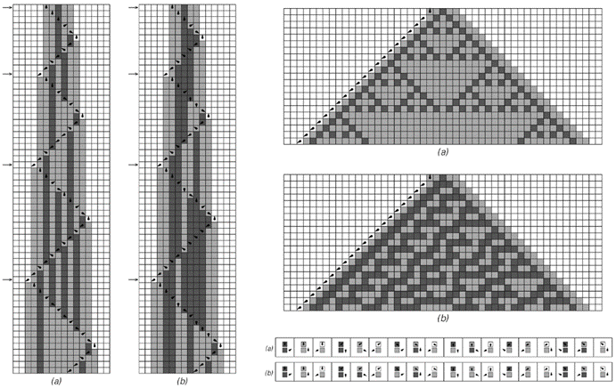
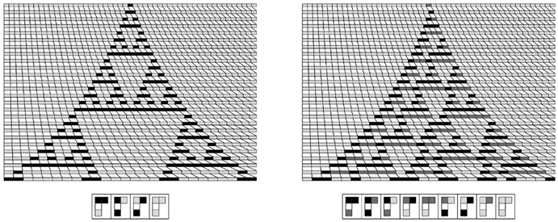
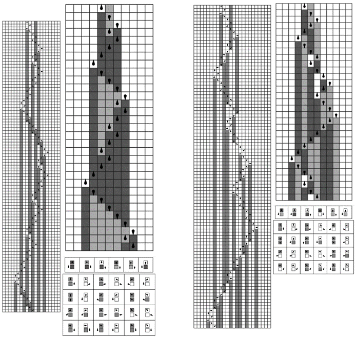
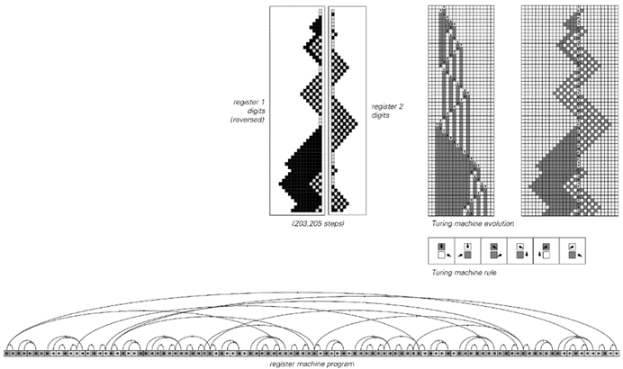
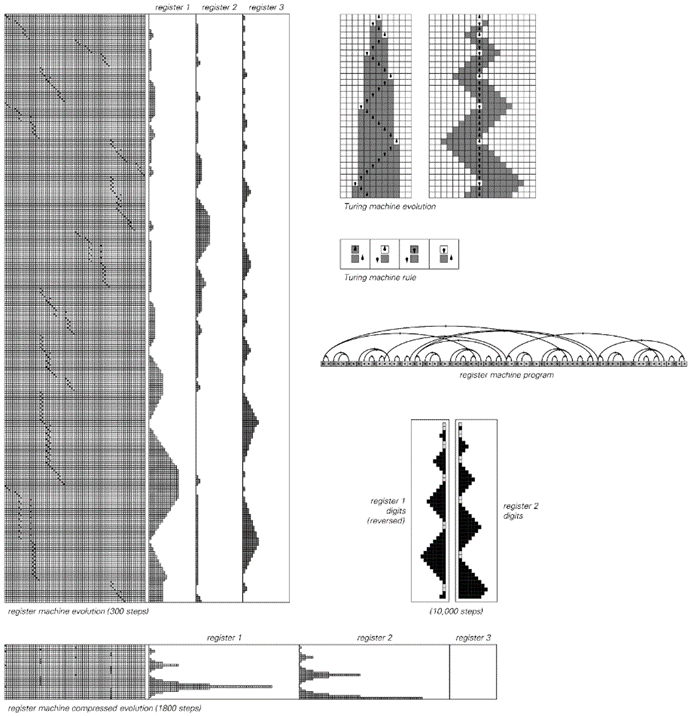
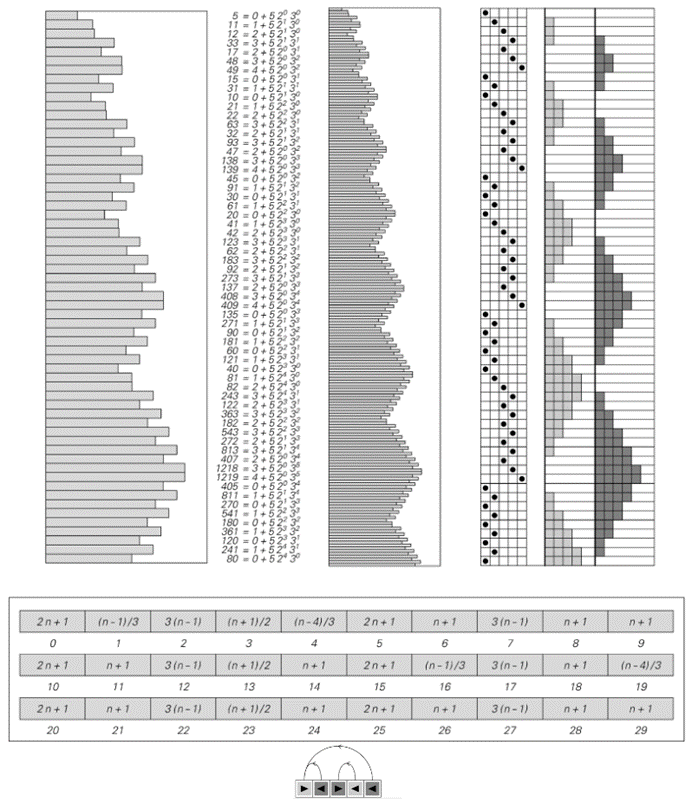

### 11.6  用其他系统模拟元胞自动机

在“上一节”中，我们发现了一个相当显著的事实，即元胞自动机可以被设置为模拟极其广泛的其他类型的系统。但这是元胞自动机的某种特殊功能，还是其他系统也具有类似的能力呢？

在“本节”中，我们将发现，事实上，我们在“上一节”以及“第3章”中考虑的大多数系统都具有相同的能力。实际上，正如我们之前所展示的，这些不同的系统都可以被元胞自动机模拟一样，现在我们将展示这些系统也可以模拟元胞自动机。

作为第一个例子，下面的图片展示了如何设置移动自动机来模拟元胞自动机。基本思想是让移动自动机中的活动单元来回扫描，在扫描过程中更新单元格，以便在每次完整扫描后，它都有效地执行了元胞自动机进化的一步。

>移动自动机模拟元胞自动机的例子。在情况（a）中，移动自动机的规则被设置为模拟规则90的基本元胞自动机；在情况（b）中，它们被设置为模拟规则30。右侧的图片是通过仅保留左侧箭头指示的步骤获得的，这些步骤对应于移动自动机中的活动单元比以往任何时候都更靠左的时间点。这里使用的移动自动机涉及每个单元格有7种可能的颜色。

(p 664)

对页底部的具体图片是针对每个单元格有两种可能颜色和最近邻规则的基本元胞自动机。但同样的基本思想也可以用于任何类型的规则元胞自动机。这意味着可以构建一个例如模拟我们之前几节中讨论的通用元胞自动机的移动自动机。

这样的移动自动机本身也必须是通用的，因为它所模拟的通用元胞自动机可以反过来模拟包括所有可能的移动自动机在内的各种其他系统。

与移动自动机类似的方案也可以用于图灵机，如下图所示。同样，通过模拟通用元胞自动机，可以构建一个通用图灵机。

但事实证明，早在1936年就已经使用略有不同的方法构建了通用图灵机。事实上，这个通用图灵机在历史上提供了在任何系统中看到的通用性的第一个明确示例。

>图灵机模拟规则90和30的元胞自动机的例子。右侧的图片是通过仅保留左侧箭头指示的步骤获得的。图灵机有6个状态和每个单元格3种可能的颜色。

(p 665)

继续上一节提到的系统类型，接下来我们讲到的是替换系统。在这里，我们首次发现，至少在最初，我们通常无法模拟元胞自动机。正如我们在第83页所讨论的，不依赖于邻居的替换系统只能生成重复或嵌套的图案——因此它们永远无法产生更复杂的图案，例如模拟规则30所需的图案。

但是，如果将替换系统推广到依赖于邻居的替换系统，那么模拟元胞自动机就变得非常直接了，如下面的图片所示。

那么顺序替换系统呢？同样，事实证明，模拟元胞自动机也相当容易——正如对页顶部的图片所示。

也许更令人惊讶的是，普通的标签系统也是如此。尽管这些系统的底层操作方式极其简单，但对页底部的图片表明，它们仍然可以相当容易地模拟元胞自动机。

那么符号系统呢？这些系统的结构与元胞自动机截然不同。但同样地——正如第668页底部的图片所示——让这些系统模拟元胞自动机是相当容易的。

>模拟规则90和30的元胞自动机的依赖于邻居的替换系统。所展示的系统是依赖于邻居的替换系统的简单示例，其规则高度统一，始终只生成一个单元格，并且与元胞自动机直接对应。

(p 666)

>模拟规则90和30的元胞自动机的顺序替换系统。上面顶部的图片是通过仅保留左侧箭头指示的步骤获得的。顺序替换系统涉及具有3种可能颜色的元素。

>模拟规则90和规则30元胞自动机的标签系统。上面顶部的图片是通过仅保留左侧箭头指示的步骤获得的。这两个标签系统都涉及6种颜色。

(p 667)

一旦知道任何特定类型的系统都能够模拟任何元胞自动机，那么就可以立即推断出，必定存在该类型系统的通用实例。

那么我们在第3章中考虑的其他类型的系统呢？其中一个我们尚未在这里讨论的是循环标签系统。事实证明，我们将在本章稍后的部分使用这样的系统，以作为通用性的一个显著例子的建立部分。

但要证明循环标签系统能够模拟元胞自动机并不像迄今为止我们所讨论的各种系统那样直接。事实上，我们将分几个阶段来完成。第一阶段，如图中下一页的顶部图片所示，是让一个循环标签系统模拟一个普通的标签系统，该系统的规则仅取决于每个步骤中出现的第一个元素。

>为了模拟具有规则90和30的元胞自动机而设置的符号系统。与第3章中仅涉及一个符号的符号系统示例不同，这些符号系统涉及三个符号，p、q和r。

(p 668)

完成了这一步之后，下一个阶段是使这样的标签系统模拟图灵机。下一页的图片说明了这是如何实现的。但是，至少就所示的具体构造而言，得到的图灵机只能具有两种可能颜色的单元格。然而，下面的第二组图片表明，这样的图灵机可以很容易地被改造成模拟具有任意数量颜色的图灵机。然后，通过第665页的构建，这最终证明了循环标签系统可以成功地模拟任何元胞自动机——因此可以是通用的。

>模拟一个仅依赖于每一步第一个元素的标签系统的循环标签系统。在扩展的标签系统演化中，通过在固定数量的白色单元格块内的连续位置上放置黑色单元格来编码元素的连续颜色。

>用两种颜色的图灵机模拟具有更多颜色的图灵机。

(p 669)

>用仅依赖于每一步第一个元素的标签系统模拟图灵机。图灵机中磁头两侧的单元格配置被视为二进制数。在箭头指示的步骤中，标签系统产生一系列长度与这些数字相对应的暗色单元格。

(p 670)

这仅剩下第3章中未讨论的一种系统类型：寄存器机器。尽管它再次略显复杂，但下一页及以下的图片展示了即使这些系统也可以被用来模拟图灵机，进而模拟元胞自动机。

那么，基于数字的系统，比如我们在第4章中讨论的那些呢？作为示例，可以考虑第122页讨论的算术系统的一个推广——其中有一个整数n，在每一步中，找到除以一个常数后的余数，然后根据这个余数的值对n执行一些指定的算术运算。

>一个寄存器机器，它模拟了一个比下一页上更复杂的图灵机。

(p 671)

>一个寄存器机器模拟图灵机的例子。这里使用的图灵机有两个磁头状态；寄存器机器程序有72条指令，并使用三个寄存器。寄存器机器的压缩演化仅保留与第三个寄存器从零开始每次递增相对应的步骤。

(p 672)

下面的图片显示，这样的系统可以被设置为模拟寄存器机器。由于寄存器机器是通用的，因此这样的算术系统也是通用的。

事实上，能够使用基本上只是普通算术运算来设置一个通用系统与第784页讨论的哥德尔定理的证明密切相关。

但是，从我们在本章中学到的知识来看，算术应该能够实现通用性这一点似乎并不再令人惊讶。实际上，考虑到我们所发现的所有能够表现出通用性的系统类型，如果算术以某种方式不支持通用性，那将是非常奇怪的。

>一个简单的算术系统如何模拟寄存器机器的例子。算术系统在每个步骤中获取值n，计算Mod[n, 30]，然后根据结果对n应用上述规则指定的算术运算之一。该规则的设置方式是，如果n的值以i + 5, 2a, 3b的形式表示，则i、a和b在连续步骤中的值分别对应于寄存器机器在其程序中的位置，以及两个寄存器的值（2和3出现是因为它们是前两个质数；5出现是因为它是寄存器机器程序的长度）。左侧图片中的n值以对数刻度表示。

(p 673)

