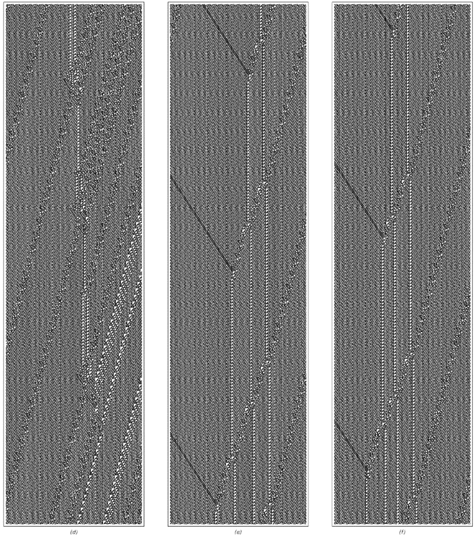

### 11.8  规则110元胞自动机

在前面的部分[4, 5, 6]中，我已经表明，原则上可以通过各种不同类型的系统来展示通用性现象。但在具体情况下，为了实现通用性，底层规则需要多复杂呢？

本章前面描述的通用元胞自动机具有相当复杂的底层规则，涉及每个细胞可能有19种颜色，这取决于次近邻以及最近邻。但构建这个元胞自动机是为了使其操作易于理解。如果不施加这种约束，人们可能会期望能够找到至少底层规则稍微简单一些的通用元胞自动机。

对本章前面展示的通用元胞自动机进行一些相当直接的修改，可以将颜色数量从19种减少到17种。事实上，早在20世纪70年代初，就已经知道具有18种颜色和最近邻规则的元胞自动机可以是通用的。在20世纪80年代末，通过一些巧妙的构思，还构建了具有7种颜色的通用元胞自动机的例子。

(p 675)

但这些规则仍然涉及343个不同的情况，并且几乎在任何标准下都非常复杂。当然，这么复杂的规则在我们在自然界中通常看到的系统类型中不太可能普遍存在。然而，从我20世纪80年代初对元胞自动机的实验中，我坚信非常简单的规则也应该表现出通用性。到20世纪80年代中期，我开始怀疑，即使在可能的最简单规则中——只有两种颜色和最近邻——也可能存在通用性的例子。

最有可能的例子是我所说的规则110——一个我们在本书中已经多次讨论过的元胞自动机。与任何256个所谓的基本规则一样，规则110可以通过给出细胞及其最近邻颜色的八种可能组合的结果来指定如下。

然而，仅从这一非常简单的规范来看，认为规则110可能是通用的，起初似乎相当荒谬。但是，一旦人们看到规则110实际行为的图片，认为它可能是通用的想法就开始显得不那么荒谬了。尽管其底层规则很简单，但规则110支持各种局部结构——这些结构以许多复杂的方式移动和相互作用。从像对面页上那样的图片来看，这些局部结构或许可以被安排来执行有意义的计算，这开始看起来并非不合理。

>本节讨论的规则110元胞自动机的底层规则。与本书中的其他地方一样，这八种情况中的每一种都显示了细胞的新颜色应该基于其自己的先前颜色以及邻居的先前颜色。尽管其底层规则极其简单，但本节将证明的是，规则110元胞自动机实际上是通用的，因此从某种意义上说，它能够产生任意复杂的行为。如果每个块中细胞的值分别标记为p、q和r，则规则110可以写为Mod[(1+p) q r + q + r, 2]或And[Not[And[p, q, r]], Or[q, r]]。

(p 676)

在我们本章前面讨论的通用元胞自动机中，其操作涉及的各种组件的属性都被明确地构建到底层规则中。事实上，在大多数情况下，每种不同类型的组件仅仅由不同颜色的细胞来表示。但在规则110中，每个细胞只有两种可能的颜色。因此，人们可能会想，如何表示不同类型的组件。

 

>规则110在随机初始条件下的典型行为示例。通过观察这些图片，人们可以开始想象，在规则110中，有可能安排局部结构以执行有意义的计算。请注意，第292页已经展示了规则110中可以出现的许多类型的局部结构。

(p 677)

关键的想法是从规则已经在某种程度上产生的局部结构的组合中构建组件。如果这可行，那么这实际上是一个非常经济的解决方案。因为它有可能让人获得大量不同类型的组件，而无需增加底层规则的复杂性。

但这种方法的问题是，通常很难看出在特定元胞自动机中偶然发生的各种结构如何组合成有用的组件。

事实上，在规则110的情况下，需要几年的工作来开发必要的想法和工具。但最终证明，规则110元胞自动机实际上是通用的。

一个具有如此简单底层规则的系统能够执行实际上任意复杂的计算，这确实令人惊讶，但这正是其通用性所隐含的。

那么，通用性的证明是如何进行的呢？

基本想法是证明规则110可以模拟某类系统中任何可能的系统，而在这类系统中已经知道存在通用性。事实证明，这样一类方便的系统是我们在第95页介绍的循环标签系统。

在本章的前面部分，我们看到可以构建一个循环标签系统来模拟任何给定的图灵机。由于我们知道至少有一些图灵机是通用的，这一事实就证明了通用循环标签系统的可能性。

因此，如果我们能够成功地证明规则110可以模拟任何循环标签系统，那么我们就成功地证明了规则110本身是通用的。对面页上的图片序列展示了所需内容的开始。基本想法是从循环标签系统的通常表示开始，然后逐步改变这种表示，以便越来越接近规则110可以直接模拟的内容。

图片（a）展示了从第95页和第96页中标准表示的循环标签系统演变的示例。图片（b）则展示了同一演变的另一个版本，但现在重新排列了，以便每个元素都保持在相同的位置，而不是在每个步骤中都向左移动。

(p 678)

>四个视图展示了如上图所示的循环标签系统，绘制得越来越接近规则110可以直接模拟的内容。图片（a）以与第95页和第96页中相同的形式展示了循环标签系统。图片（b）展示了在连续步骤中重新排列序列的系统，以便在移除第一个元素时它们不会向左移动。图片（c）是（b）的倾斜版本，其中在每个步骤中从底层规则中使用信息的方式被明确指示出来。图片（d）展示了系统演变的更明确机制，其中不同的线条有效地指示了不同信息片段的运动。

(p 679)

一般来说，循环标签系统通过从每个步骤中存在的序列中移除第一个元素来运行，如果该元素为黑色，则在序列的末尾添加一个新的元素块。循环标签系统的一个关键特征是，可以添加哪个元素块的选择与序列的形式无关。因此，例如，在上一页中，只有两种可能性，并且这些可能性在连续步骤中交替出现。

上一页中的图片（a）和（b）说明了应用循环标签系统规则的结果，但从某种意义上说，并没有给出应用这些规则的明确机制的任何迹象。然而，在图片（c）中，我们看到了这种机制的开始。

基本想法是，在系统演化的每个步骤中，都有一条从左边进来的条纹，它携带着关于在该步骤中可以添加的元素块的信息。然后，当条纹击中该步骤中存在的序列中的第一个元素时，它只有在元素为黑色的情况下才能通过。一旦通过，条纹继续向右移动，最终将其表示的元素块添加到序列的末尾。

但是，虽然图片（c）显示了系统中各种携带信息的线条的效果，但它并没有说明为什么线条会以它们那样的方式表现。然而，图片（d）展示了一个更明确的机制。从左边进来的线条集合表示在连续步骤中可以添加的元素块。每个块的开始由虚线表示，而块内的元素则由实心的黑色和灰色线条表示。

当虚线击中特定步骤中存在的序列中的第一个元素时，它会以向左传播的线条形式有效地反弹回来，并携带第一个元素的颜色。

当这条线是灰色时，它会吸收所有从左边来的其他线条，直到下一条虚线到达。但是，当线条是黑色时，它会让从左边来的线条通过。然后，这些线条继续移动，直到它们与从右边来的灰色线条相撞，在这一点上，它们会生成一个与自己颜色相同的新元素。

通过观察图片（d），人们可以开始看到循环标签系统如何通过规则110进行模拟的可能性：基本想法是让图片中的各种线条通过规则110中某些局部结构的集合来进行模拟。

(p 680)

>这些对象是由规则110中的局部结构构建的，用于模拟循环标签系统。每个显示的图片宽度为500个单元格。上面两张图片中的对象对应于第679页图片（d）中的粗垂直黑色和灰色线条。接下来两张图片中的对象对应于图片（d）中从左边来的深灰色和浅灰色线条。（请注意，在规则110中，所有结构都是左右反转的。）第三对图片对应于图片（d）中虚线的两个版本。而第四对图片则对应于图片（d）右侧向右移动的线条。上面图片中涉及的所有局部结构都在第292页上单独展示。请注意，结构之间的间距在确定它们所表示的对象时至关重要。

(p 681)

但一开始，我们完全不清楚是否能找到一些局部结构的集合，它们能以适当的方式表现。

然而，经过一番努力，事实证明我们有可能找到必要的构造，而且前一页确实展示了规则110中由局部结构形成的各种对象，这些对象可用于模拟第679页图片（d）中大部分类型的线条。

前两张图片展示了与图片（d）中粗垂直线所指示的黑白元素相对应的对象。这两个对象都恰好由相同的四个局部结构组成，但对象之间的区别在于这些结构之间的间距。

前一页的后两张图片使用了相同的想法，即利用局部结构之间不同的间距来表示第679页图片（d）中从左边来的黑色和灰色线条。

请注意，由于规则110的特定形式，前一页后两张图片中的对象向左移动而不是向右移动。实际上，在与规则110建立对应关系时，将循环标签系统的所有图片左右反转是很方便的。但是，使用前一页中的各种对象，再加上其他一些对象，我们就可以使用规则110来完整地模拟循环标签系统。

对面页面上的图表以示意图的方式展示了如何做到这一点。图表中的每条线都对应于规则110中的一个局部结构，虽然整个图表不能完全按比例绘制，但线条之间的碰撞正确地显示了结构之间发生的所有基本相互作用。

接下来的几页[684, 685, 686]则详细说明了示意图中圆圈所示每个区域内发生的情况。

区域（a）展示了一个块分隔符——对应于第679页图片（d）中的虚线——击中了序列中第一步存在的单个黑色元素。因为击中的元素是黑色的，所以必须产生一个对象，允许该步骤中块的信息通过。区域（a）中的大部分活动都涉及产生这样的对象。但结果是，作为副作用，产生了另外两个局部结构，可以看到它们向左传播。这些结构以后可能会造成麻烦，但观察区域（b）我们发现，事实上它们只是穿过它们遇到的其他结构，而没有任何不利影响。

(p 682)

>一个示意图展示了规则110如何模拟循环标签系统。该示意图中的每条线都对应于规则110中的一个局部结构。请注意，这里忠实地再现了结构的相对斜率，但没有按比例显示它们的间距。还请注意，这里以不同颜色显示的线条在规则110中往往对应于相同的结构。

(p 683)

>上一页示意图中圆圈区域的特写。每张图片的宽度为320个单元格，并显示了1200个演化步骤。

(p 684)

>（特写继续）

(p 685)

>（特写继续）

(p 686)

区域（c）展示了当一个块中某个元素的信息通过区域（a）中产生的那种对象时发生的情况。表示该元素的局部结构数量从十二个减少到四个，但这些结构的间距继续指定其颜色。然后，区域（d）展示了当来自下一步的块分隔符的开始部分到达时，区域（c）中的对象如何结束。

区域（e）展示了块中一个黑色元素的信息如何在循环标签系统产生的序列中实际上被转换为一个新的黑色元素。发生的情况是，块中元素对应的四个局部结构与向相反方向行进的另外四个局部结构发生碰撞，结果是产生了四个静止结构，这些结构对应于序列中的新元素。

区域（f）展示了与区域（e）相同的过程，但对象是白色元素。元素是白色的这一事实被编码在来自右侧的结构的更大间距中，这导致静止结构的间距更窄。

区域（g）是区域（a）的类似物，但现在是针对白色元素而不是黑色元素。该区域的开始与区域（a）非常相似，只是顶部的四个局部结构的间距更窄。然而，从该区域的中部开始，行为与区域（a）大不相同：虽然区域（a）产生了一个允许信息通过的对象，但区域（g）产生了一个阻止所有信息的对象，如区域（h）和（i）所示。

请注意，尽管区域（d）和（i）的开始方式大不相同，但它们却以相同的方式结束，这反映了在两种情况下，系统都已准备好处理新块，无论该块是什么。

前几页（683、684、685、686）的图片都是为了一个具有特定底层规则的循环标签系统而制作的。但无论底层规则是什么，都可以使用完全相同的原则。下面的图片以示意图的形式展示了选择其他几个规则时发生的情况。

(p 687)

每幅图片内部线条的相互作用方式总是完全相同的。但从一个规则转到另一个规则时发生的变化是进入图片的线条的排列方式。

在以下图片的绘制方式中，每个规则中出现的块被编码在从图片左边缘进入的线条模式中。但如果每幅图片都向左延伸得足够远，那么最终会看到所有这些线条都是从顶部开始的。这意味着线条的排列因此总是可以被视为系统的初始条件。

>四个不同底层规则的循环标签系统模拟示意图。每个图中的线条基本上对应于规则110中局部结构的集合。每幅图片内部发生的过程总是相同的；不同的循环标签系统规则通过不同的线条排列方式进入每幅图片来实现。

(p 688)

这就是规则110最终实现通用性的方式。想法只是设置初始条件，这些条件对应于要模拟的任何循环标签系统规则中出现的块。

必要的初始条件由细胞块的重复组成，其中每个块都包含一组局部结构模式，这些模式对应于循环标签系统规则中出现的元素块。细胞块总是相当复杂的——对于本节大部分内容中讨论的循环标签系统，每个块的宽度都超过3000个细胞——但关键点是，可以为任何循环标签系统构建这样的块。这意味着，在适当的初始条件下，规则110实际上可以模拟任何循环标签系统。

然而，此时应该提到，为了使规则110模拟许多循环标签系统，设置适当的初始条件时会涉及一些额外的复杂性。因为如前文中的图片所示，我们使规则110模拟循环标签系统的方式依赖于规则110中局部结构之间相互作用的许多细节。事实证明，为了确保在使用的特定构造中，适当的相互作用在每一步都继续发生，必须对被模拟的循环标签系统施加一些约束。

本质上，这些约束最终成为循环标签系统规则中出现的块必须始终是六个元素的倍数长度，并且循环标签系统序列中连续添加新元素之间可以经过的步骤数必须受到一定的限制。

然而，使用第669页讨论的想法，不难构造一个满足这些约束但模拟任何其他循环标签系统的循环标签系统。因此，我们可以得出结论，规则110实际上可以成功地模拟任何循环标签系统。这意味着规则110确实是通用的。

(p 689)

