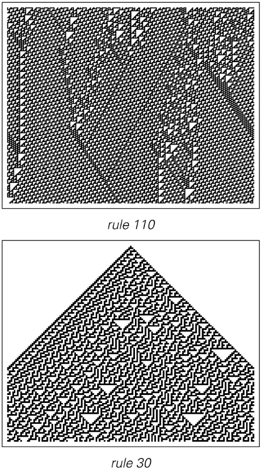

### 12.10  宇宙中的智能

我们人类是否是宇宙中唯一的智能生物，这是科学界尚未解答的重大问题之一。

关于智能应该如何定义，一直以来都没有明确的答案。但近年来，人们通常认为它与进行复杂计算的能力有关。

从传统直觉来看，要展现这样的能力，需要一个像人类一样复杂的系统，而地球上生命的整个复杂历史也应该是为了生成这样的系统而存在的。

随着计算机技术的发展，很明显，许多智能特征可以在非生物系统中实现。然而，我们的经验仍然是，建造计算机需要复杂的工程，而这种工程在某种意义上只存在于人类生物和文化发展之中。

但本书的一个核心发现是，事实上，获得复杂计算并不需要如此复杂的系统。实际上，计算等价性原则表明，大量系统——甚至是那些具有非常简单基本规则的系统——在它们所执行的计算的复杂性方面应该是等价的。

因此，如果智能与进行复杂计算的能力有关，那么它就不需要通过数十亿年的生物进化来产生——实际上，我们应该在所有类型的系统中，无论是生物系统还是其他系统，都能看到智能的存在。

当然，一些日常的措辞可能会表明我们确实如此。例如，当我们说天气有自己的想法时，我们实际上是在将类似智能的东西归因于流体的运动。然而，有人可能会争辩说，我们人类所拥有的真正智能，在本质上一定有更多的东西。

那么，这可能会是什么呢？

当然，我们可以列举出人类智能的各种具体特征：理解语言的能力、做数学运算的能力、解决谜题的能力等等。但问题是，是否存在一些更普遍的特征，这些特征能够捕捉真正智能的本质，而又不依赖于人类智能的具体细节。

(p 822)

也许，这可以是学习和记忆的能力。或者是适应各种不同和复杂情况的能力。或者是处理数据抽象一般表示的能力。

起初，这些可能都像是真正智能的合理指标。但是，一旦人们试图抛开人类智能的具体例子来思考它们，就变得不那么清晰了。事实上，根据本书中的发现，我现在非常确信，其中任何一项实际上都可以在我们通常不会认为具有任何类似智能的系统中实现。

例如，学习和记忆可以在任何具有对输入做出反应并形成结构、能够长时间持续存在并影响系统行为的系统中有效发生。这甚至可以在简单的元胞自动机中发生——或者说，在像流体在固体表面雕刻出长期图案这样的物理系统中发生。

适应各种复杂情况也发生在许多系统中。当存在自然选择时，这一点是众所周知的。但在某种程度上，也可以认为它发生在任何约束最终得到满足的时候——比如说，流体绕过复杂物体时减少其耗散的能量。

处理抽象在某种意义上也相当普遍。事实上，一旦人们将系统视为执行计算，就可以立即将这些计算的特征视为系统输入的抽象表示。

那么，鉴于这一切，是否有办法定义一个真正智能的普遍概念呢？我猜想最终是没有的，而且事实上，我们通常认为的智能的任何可行的定义最终都不得不与人类智能的各种看似相当具体的细节联系在一起。

事实证明，这与人们试图定义看似简单得多的生命概念时所发生的情况非常相似。

曾经有一段时间，人们认为任何能够自发运动并对刺激做出反应的系统都必须是有生命的。但随着具有最原始传感器的机器的发展，很明显这不是正确的。

(p 823)

热力学领域的研究使人们产生了这样的想法，即或许可以通过生物系统将无序的物质自发地组织起来的能力来定义它们——通常是将这些物质融入它们自身的结构中。然而，从晶体到火焰等各种非生物系统也都能做到这一点。而且，第6章表明，即使在具有简单规则的系统中，自组织实际上也是非常普遍的。

有一段时间，人们认为或许可以通过自我繁殖的能力来定义生命。但在20世纪50年代，人们构建了具有这种能力的抽象计算系统。然而，它们似乎需要高度复杂的规则——这与实际活细胞中的规则不相上下。但事实上，这样的复杂性并不是真正必要的。而且，正如人们现在可能从本书中的直觉所期望的那样，即使是下面这种具有惊人简单规则的系统也仍然能够表现出自我繁殖的能力——尽管它们几乎不具有其他与普通生物系统相似的特征。

如果我们观察典型的生物系统，它们最明显的特征之一就是巨大的表观复杂性。长期以来，人们一直认为这种复杂性必须是生物系统所独有的——可能需要数十亿年的生物进化才能形成。但我在这本书中所展示的是，事实并非如此，而且事实上，包括具有非常简单基本规则的系统在内的广泛系统都可以产生至少与我们在典型生物系统组成部分中所看到的同样多的复杂性。

>一个二维元胞自动机展示了几乎微不足道的自我繁殖形式，其中每次进化步骤翻倍时，任何初始模式的多个副本都会出现。所使用的规则是加法的，并且只要前一步中奇数个邻居是黑色的，就将细胞视为黑色（外部总数码204）。在基本规则90中，以及在任何维度的任何其他加法规则中，都发生了相同的基本自我繁殖现象。

(p 824)

然而，尽管如此，我们在日常经验中通常并不太难以区分生物系统与非生物系统。但原因是地球上的所有生物系统都共享着大量详细的结构和化学特征——反映了它们长期共同的生物进化史。

那么外星生命呢？为了识别它，我们需要一种独立于地球上生命细节的生命一般定义。但就像智能一样，我相信实际上无法给出这种合理的定义。

事实上，根据本书中的发现，我得出的结论是，人们可能认为能够描述生命的几乎所有一般特征，实际上也会出现在许多具有非常简单规则的系统中。我毫不怀疑，无论是在地球上还是在地球外，都可以发现各种这样的系统——而且它们的产生肯定不需要像地球上生命那样复杂的历史。

但最有可能的是，我们甚至不会认为这些系统接近生命的真实例子。事实上，我预计最终我们会毫无疑问地将一个系统视为生命的例子，唯一的方法是我们发现它与地球上的生命共享许多具体细节——可能一直深入到，比如说，由胶状材料构成，并具有与蛋白质、酶、细胞膜等相似的成分——甚至可能深入到基于水、糖、ATP和DNA等特定化学物质。

那么外星智能呢？它需要在多大程度上展示与人类智能相同的细节——甚至可能是相同类型的知识——才能被我们认为是智能的有效例子呢？

仅仅在人类中，如果没有共同的教育和文化，实际上就很难识别智能。事实上，在年幼的孩子中，智能的不同方面在何时开始活跃仍然几乎完全不清楚。

而当涉及到其他动物时，事情变得更加困难。如果有人特意训练动物解决数学难题或使用人类语言进行交流，那么通常可以识别出它所表现出的智能。

(p 825)

但是，如果人们只是观察动物的正常活动，就很难判断它们是否涉及智能。因此，作为一个典型的例子，目前仍不清楚鸟类或鲸鱼的歌唱中是否存在智能。

对我们来说，这些歌声听起来可能很有音乐性——实际上，它们甚至似乎表现出与人类音乐相同的组织原则。但是，它们真的需要智能来产生吗？

特别是对于鸟类，人们越来越有可能追踪到歌曲产生的详细过程。而且，看起来至少它们的一些复杂元素只是鸟类声道中气流复杂模式的直接结果。

但鸟类的大脑也肯定有输入。然而，在大脑中，一些负责此事的神经通路是已知的。人们可能会认为，如果所有这些通路都能被发现，那么这将立即表明没有智能的参与。

当然，如果可以看到这些通路只支持简单的计算，那么这是一个合理的结论。但是，仅仅使用确定的通路——或确定的基本规则——并不能排除智能的存在。事实上，如果人们观察人脑内部——比如在说话的过程中——无疑也会看到确定的通路和规则在使用中。

那么，我们如何判断像鸟的歌声、鲸的歌声——或者外星信号——是否是智能的反映呢？我们通常使用的基本标准是它是否有意义——或者它是否传达了任何东西。

日常经验告诉我们，这往往很难判断。因为即使我们听到一种我们不懂的人类语言，我们也几乎无法判断所说的话是否有意义。同样，如果我们接收到以我们不熟悉的格式编码的任何类型的数据，也是如此。

我们可能会首先尝试使用我们的感知和分析能力来发现数据中的规律性。如果我们发现太多的规律性，我们可能会得出结论，认为这些数据可能无法代表足够的信息来传达任何重要的内容——实际上，至少对于一些高度重复的鸟鸣来说，可能就是这样。

(p 826)

但如果我们找不到任何特定的规律性怎么办？我们日常对人类语言的经验可能会让我们认为这些数据可能毫无意义。但没有任何迹象表明，它可能不是一条完全有意义的信息——即使是用人类语言写的——只是碰巧被加密或压缩到了一定程度，以至于它显示不出任何可检测的规律性。

事实上，值得注意的是，如果我们只是听鸟鸣和鲸歌，就会发现它们与自然界中各种过程（如风吹过的钟摆的运动或地球磁层中的等离子体）产生的声音之间几乎没有根本的区别。

有人可能会想，通过观察发送者和接收者行为之间的相关性，就可以判断在特定情况下是否传达了有意义的信息。但在各种自然系统中，从一个元素传播到另一个元素的效果是极其常见的。即使是鲸歌，也从未在发送者和接收者之间发现过明确的相关性。

但是，如果有人注意到发送者身上发生了某些事件呢？如果有人以某种方式在发送者产生的信息中看到了这一事件的表示，这难道不是有意义交流的证据吗？

再一次强调，这并不一定。因为有很多情况下，系统产生的信号会反映它们所发生的事情。例如，以特定模式敲击的鼓会产生反映（并实际上代表）该模式的声音。

然而，另一方面，即使在人类中，不同的训练或文化也可能导致对同一事件的反应大相径庭。对于动物来说，还有一个问题是它们对不同感知形式的重视。因为狗可能能够感知其环境中气味的详细模式，而海豚则能够感知周围流体运动的详细模式。然而，我们作为人类，几乎肯定不会识别出用这些术语给出的描述。

(p 827)

那么，如果我们不能通过寻找有意义的交流来识别智能，那么我们是否至少可以判断给定对象是否在产生过程中涉及了智能呢？

当然，我们的日常经验是，通常很容易判断某物是否是人类创造的文物。

但其中很大一部分原因只是因为我们在实践中遇到的大多数文物都有看起来相当相似的特定元素。但很可能这主要是工程历史发展的反映——以及相同的基本几何形状和其他形式被反复使用的事实。

那么，是否有更通用的方法来识别文物呢？

在实践中，一个相当不错的方法来猜测某物是否是文物，就是观察它是否看起来简单。因为尽管有例外——比如晶体、气泡和动物角——但自然界中存在的大多数物体都具有不规则且往往非常复杂的形态，这些形态看起来比典型的文物要复杂得多。

事实上，这一事实常常被用来证明自然界中的物体必须由超越人类智能的神灵所创造。因为传统的直觉表明，如果看到更多的复杂性，那么它必然在某种意义上具有更复杂的起源。

但本书的主要发现之一是，事实上，即使在具有极其简单的基本规则的系统中，也可能产生巨大的复杂性，因此，最终我们不需要任何像人类智能那样复杂——更不用说超越它的——规则来解释我们在自然界中看到的复杂性。

但问题仍然存在，为什么当人类智能参与时，它倾向于创造看起来比自然界中出现的物体简单得多的文物。我相信这个问题的基本答案与以下事实有关：当我们作为人类创造文物时，我们通常需要能够预见它们将如何运作——否则我们就无法判断它们是否能够实现我们想要的目的。

然而，自然界似乎并不受这样的约束。事实上，我认为在自然界中出现的系统中，有许多都表现出计算上的不可约性——因此，在某种意义上，预见它们将如何运作变得不可约地困难。

(p 828)

然而，至少在其传统方法论上，工程学往往依赖于计算的可约性。因为通常它是通过构建系统的方式来进行操作的，这样每个元素的行为都可以通过简单的数学公式等方式来轻松预测。

这样做的结果是，工程学创造的大多数系统在某种程度上都被迫显得简单——在机械方面，例如，通常只基于简单的重复运动。

但是，简单性是文物的必要特征吗？或者，外星智慧或未来人类技术创造的文物是否会显得没有简单性的迹象？

一旦我们说一个系统达到了一个明确的目的，这就意味着我们至少可以通过描述这个目的来总结系统所做的一部分工作。因此，如果我们有一个简单的目的描述，那么我们必须能够给出系统所做工作的至少一部分的简单总结。

但这是否意味着系统的整个行为都必须简单呢？传统工程学可能会让人产生这样的想法。因为通常我们的经验是，如果我们能够让某种类型的系统产生特定的结果，那么通常涉及这种行为的方式是相当简单的。

但本书的一个结论是，一般来说，事情并不一定要这样运作。因此，例如，在第五章的结尾，我们看到了几个系统，其中实现特定结果的简单约束实际上只能通过相当复杂的行为来满足。

正如我将在下一节中讨论的那样，我相信在努力优化事物的过程中，为了实现相对简单的目的，更先进的技术形式几乎不可避免地会使用具有越来越复杂行为的系统。

所以，这意味着最终没有理由认为具有简单目的的文物一定会看起来简单。

那么，如果我们只是被展示某物，我们如何判断它是否有目的呢？即使是我们知道由人类创造的东西，这也可能已经很困难了。例如，有许多考古建筑——如巨石阵——其哪些特征是有意为之的，至今尚不清楚。

(p 829)

即使在当今的情况下，如果我们接触到的是我们恰好不熟悉的人类努力之外的物体或活动，我们也很难判断哪些特征是立即有目的的，哪些是无意的——或者说，主要是装饰性的或仪式性的功能。

事实上，即使我们被告知了某个目的，我们也经常无法识别它。我们通常只能通过理解一系列后果如何导致与我们自己特定的个人背景相符的目的，才会相信其有效性。

那么，考虑到这一点，我们如何才能期望一般性地识别出目的的存在——比如作为外星智能的标志？

例如，如果我们看到一个元胞自动机，我们如何能够判断它是为了某个目的而创造的？

在这本书中的元胞自动机——尤其是第十一章中的——有几个是特别为了实现特定目的而构建的。但绝大多数最初只是作为我研究最简单的基本规则会发生什么的一部分而出现的。

起初，我并没有认为它们中的大多数实现了任何特定的目的。但是，随着我在这本书中建立起整个科学背景，我意识到其中许多实际上可以被认为实现了非常明确的目的。

像下面展示的规则110这样的系统，在其行为上表现出一种局部一致性，这让人想起了传统工程系统或有目的的人类活动的运作方式。但规则30这样的系统则不然。因为虽然我们可以看到这样的系统有很多活动在进行，但人们往往会认为这些活动都不够连贯，无法实现任何明确的目的。

然而，在本书所讨论的思想背景下，像规则30这样的系统可以被视为实现了执行相当复杂的计算的目的。事实上，我们知道这种计算在实践中对于生成看似随机的序列是有用的。

但当然，我们在描述规则30的行为时，并不一定要提及目的。相反，我们完全可以只谈论机制，以及元胞自动机的基本规则如何导致我们所看到的行为。

>行为上给人以有目的感或没有目的感的元胞自动机。

(p 830)

事实上，任何系统都是如此。但作为一个实际问题，我们最终往往会用目的来描述系统的行为，因为这似乎比用机制来描述更简单。

因此，例如，如果我们能够识别出系统总是试图满足的某个简单约束，我们经常会将其称为系统的目的。事实上，我们甚至在物理系统中的能量最小化或生物系统中的自然选择等不涉及我们通常认为的智能的案例中也会这样做。

因此，我们可能能够解释一个系统是为了实现某个目的而存在的，但这并不一定意味着该系统在创建时真的考虑了那个目的。事实上，仅仅通过观察系统，我们永远无法确定它是否真的是为了那个目的而创建的。

但我们仍然经常可以猜测。给定一个特定的假设目的，一个潜在的标准是，系统在某种意义上不会显得做了太多与该目的无关的事情。

因此，例如，在查看下面的图片时，通常看起来规则254可能是为了生成均匀扩展的图案而设置的，而不是规则30。因为虽然规则30确实生成了这样的图案，但它也做了很多看起来与这个目的无关的事情。

因此，这可能表明，如果一个系统被证明是在某种意义上实现该目的的最小系统，那么我们就可以断定该系统是为了给定目的而设置的。

但一个直接的问题是，在传统工程中，我们通常根本无法获得最小的系统。然而，合理假设的是，随着技术的进步，为特定目的而建立的系统更可能是最小的，这应该会变得更加普遍。

作为这一切的一个例子，我们考虑元胞自动机，它实现了将输入图案宽度加倍的目的。下一页图片中的情况（a）是一个元胞自动机，我们可以利用传统工程的思想来构造这个自动机以实现上述目的。

但虽然这个元胞自动机看起来没有太多多余的操作，但它的运行方式是缓慢且顺序的，而且其基本规则远非最小。因为情况（b）的结果要快得多——实际上是通过并行操作实现的——而且它的规则涉及四种可能的颜色，而不是六种。

>如果目的是生成一个均匀扩展的图案，那么上面的元胞自动机似乎更有可能是为了这个目的而创建的。

(p 831)

但是，情况（b）真的是实现输入加倍目的的最小元胞自动机吗？仅仅从表面上看，人们可能无法想出更好的方案。但是，如果实际上明确搜索了所有涉及不到四种颜色的约8万亿条规则，就会发现可以找到4277条起作用的三色规则。

对面页面上的图片展示了一些典型示例。

每个示例都至少使用了略有不同的方案，但都实现了相同的输入加倍目的。然而，它们的工作方式往往看起来比大多数熟悉的制成品要复杂得多。事实上，其中一些示例可能看起来更像是自然界中存在的系统，而不像是制成品。

但重点是，随着技术的足够发展，人们可能会期望使用某种意义上的最优规则来实现输入的加倍。不同的最优性标准可能导致不同的规则，但通常它们会类似于对面页面上的规则——有时是具有相当复杂行为的规则。

但现在的问题是，如果一个人只是遇到了这样的规则，他能否猜出它是为了某个目的而创建的？毕竟，这些规则的行为中有各种各样的特征，从原则上讲都可能代表一个可能的目的。但是，像前一页上那样的规则之所以特别，是因为它们是展示特定输入加倍特征的最小规则。

>这些元胞自动机示例可以被视为实现了输入图案宽度加倍的目的。规则（a）涉及6种颜色，并顺序工作，这与典型的传统工程系统非常相似。规则（b）涉及4种颜色，并并行工作。规则（c）是通过大量搜索找到的，仅涉及3种颜色。它是生成结果所需步骤最少的3色规则。其规则编号为5407067979。

(p 832)

>这些示例是通过对所有7,625,597,484,987个可能的3色规则进行彻底搜索后实际找到的4277个规则中的一部分，它们实现了输入图案宽度加倍的目的。在大多数情况下，生成最终图案所需的步骤数随着输入宽度的增加而大致线性增加——尽管在第二行倒数第四个规则中，对于宽度为n的图案，其步骤数为2(n^2-n+1)。

(p 833)

一般来说，如果人们在系统的行为中看到某些特征，那么发现该系统的规则是产生该特征的最小或最优规则可能会使人们更倾向于认为，至少随着技术的足够发展，该系统可能是为了展示该特征而特意创建的。

计算不可约性意味着找到最小或最优规则可能是任意困难的。然而，对于任何尝试这样做的程序来说，该程序完全有可能在没有任何目的或智能参与的情况下自然发生。

事实上，对于最终用来找到上一页图片中元胞自动机规则的那种相当直接的穷举搜索来说，人们可能会认为这并非不可能。

那么，这一切对于外星智能来说意味着什么呢？

从我们自己的发展来看，我们可以预期，在足够先进的技术支持下，几乎不可避免地会在天文尺度上构建出人造物——也许，例如，以恒星等天体为部件的巨大机器。

然而，我们并不认为我们曾经看到过这样的人造物。

但我们如何能确定呢？因为我们的天文观测确实揭示了各种现象，而我们目前还没有任何非常令人满意的解释。事实上，就在几个世纪之前，大多数这种无法解释的现象通常都会被归咎于某种神圣的智慧。

但近年来，人们几乎普遍地认为，它们一定是物理过程的结果，而物理过程中并不涉及任何类似智慧的东西。

然而，本书中的发现表明，即使这样的物理过程也往往与计算相对应，这些计算至少与我们人类执行的任何计算一样复杂。

但我们相信的是，我们所看到的所有现象都没有任何类似于典型人类人造物的目的性。

(p 834)

偶尔，我们确实会看到一些简单的几何形状，这些形状与人类人造物中熟悉的形状相似，或者从太空中可以看到地球上的这些形状。但通常，我们对这些现象的解释最终都足够简短，以至于似乎没有给任何类似智慧的东西留下空间。而当我们看到复杂的图案时，比如星云或星系中的图案，我们会认为这些图案没有目的性——尽管它们可能在某种程度上让我们想起了人类艺术。

所以，如果我们没有识别出任何看似人造物的物体，那么对应信息的信号又如何呢？

如果我们从远处看地球，人类智慧的最明显迹象可能存在于无线电信号中。

事实上，过去人们常常认为，仅仅为了产生无线电信号，就必须具备智慧和技术。因此，当20世纪初发现复杂的非人类起源的无线电信号时，人们最初认为这些信号必须来自外星智慧。但人们最终意识到，事实上这些信号只是由地球磁层中的效应产生的。

然后，在20世纪60年代，当发现强烈且高度规则的脉冲星信号时，人们也曾短暂地认为这些信号也必须来自外星智慧。但很快人们就意识到，这些信号实际上可能只是由快速旋转的中子星磁层中的普通物理过程产生的。

那么，来自外星智慧的真实信号会是什么样子呢？目前，人类无线电信号的特点通常在于存在清晰界定的载波频率，这实际上对应于几乎完美的小规模重复。但这种规律性大大降低了信息传输的速率。随着技术的进步，所需的规律性越来越少。

但在实践中，迄今为止所有严肃的寻找外星智慧的努力，基本上都是基于使用射电望远镜来寻找具有清晰界定频率的信号。而且，实际上并没有发现这样的信号。但正如我们在第10章中看到的那样，即使是嵌套而非纯粹重复的信号，也不能仅仅通过寻找频谱中的峰值来可靠地识别。

(p 835)

当然，我们并不缺少来自银河系内外各个角落的无线电信号。但关键是，这些信号对我们来说通常看起来相当随机。而通常这使我们假设，它们实际上只是由几种简单的物理过程产生的某种无线电噪声。

但是，有没有可能这些信号中的一部分实际上是来自外星智慧——并且是有意义的信息呢？

外星生命之间的持续通讯似乎很可能局限于它们所需的太空区域，因此很可能我们无法接触到这些通讯。即使这些通讯中涉及的一些信号被广播出来，我猜想它们基本上也不会展现出任何可检测到的规律性。因为任何这样的规律性在某种意义上都代表了一种冗余或低效，而发送方和接收方都可以通过使用适当的数据压缩来消除这种冗余或低效。

但是，如果存在一些旨在即使人们不知道它们的存在也能被注意到的灯塔，那么这些灯塔产生的信号必须具有可识别的独特特征，因此也必然具有可检测的规律性，至少对它们的潜在用户来说是这样。

所以，也许问题只是我们作为人类所拥有的感知和分析方法还不够强大。也许，如果我们能找到合适的新方法，就会突然意识到，我们之前认为的一些随机无线电噪声实际上是外星智慧设置的灯塔的输出。

正如我们在第10章中看到的，我们目前使用的大多数感知和分析方法通常只能识别重复——有时还能识别嵌套。然而，在这本书中，我们已经看到了很多例子，其中看似随机的数据实际上可以由非常简单的潜在规则产生。

虽然我有点怀疑，但人们当然可以想象，如果有人向外星人展示像规则30的中间列或π的数字序列这样的数据，他们会立即能够推断出可以产生这些数据的简单规则。

但是，即使我们在某个时候发现，我们所检测到的看似随机的无线电噪声可以通过简单的规则产生，这又能说明什么呢？关于外星智慧？

(p 836)

在很多方面，规则越简单，它们似乎越可能与普通的物理过程相关联，而无需任何类似智能的参与。

然而，正如我们之前所讨论的，如果能够确定在某个特定情况下使用的规则是最简单的可能规则，那么这可能会表明这些规则是出于某种目的而设置的。但在实践中，如果人们只是接收到一个信号，通常无法判断产生该信号的所有可能规则中，实际上使用了哪一条。

那么，是否存在某种可以发送的信号，能够明确无误地传达智能的存在呢？

在过去，人们可能会认为，只要信号的产生涉及到复杂的计算就足够了。但本书中的发现清楚地表明，实际上，在各种不表现出我们通常认为的智能的系统中，这种计算是相当普遍的。

事实上，例如，在恒星周围的气体中，普通的物理过程如流体湍流，应该能够比人类智力史上的所有计算都更快地完成更多的计算。

在讨论外星智慧时，人们经常声称数学结构——如质数序列——在某种程度上作为智能的普遍标志。

但从本书的结果来看，这显然是不正确的。

因为虽然过去人们可能认为产生质数的唯一方法是使用智能，但现在我们知道，所需的相当直接的计算实际上可以由各种不同的系统来完成——而无需明显的智能。

然而，人们可能会想象，任何足够发达的智能都会以某种方式至少认为质数很重要。

但在这里，我再次认为这并不正确。因为即使是当前的人类技术，也很少依赖于质数的概念。我也很确定，不能从质数在当今人类数学中很受欢迎这一事实中推断出太多东西。

尽管数学因其普遍性而闻名，但我在上一节中详细论述过，我们人类历史上发展起来的整个数学领域，最终只涵盖了可能性的极小一部分——特别是忽略了我在这本书中研究过的绝大多数系统。

(p 837)

如果人们发现一种特征——比如重复或嵌套——这在许多可能的系统中都很常见，那么这种特征不仅会在智能或数学介入时出现，而且也会在所有自然发生的系统中出现，这是不可避免的。

那么，尝试设置一个能证明是出于某种目的而创建的信号呢？我上面论证过，如果一个系统的规则尽可能简单，那么这可能表明存在某种目的。但这样的标准依赖于不仅看到信号，还要看到产生信号的机制。

那么，仅仅一个信号呢？人们可能会想象，可以设置一个东西——比如一个复杂的数学问题的解——它用约束或目的来描述很容易，但用明确的机制来解释却很难。

但在某种意义上，这样的东西是不存在的。因为给定一个约束，原则上总是可以设置一个穷举搜索，从而提供一个机制来找到满足该约束的东西。

然而，这仍然可能需要大量的计算工作。但我们不能仅仅以此作为标准。因为正如我们所见，许多自然发生的系统实际上最终比我们为特定目的而明确设置的典型系统进行了更多的计算。

所以，即使我们无法找到一种抽象的方法来证明目的或智能的存在，那么使用信号发送者和接收者都存在于同一物理宇宙中的这一实际事实又如何呢？我们能否使用一种代表实际数据的信号，比如在天文学、物理学或化学中的信号？

正如我之前讨论的，表示越直接，普通物理过程就越容易生成它，而智能的迹象就越少——就像，例如，一张照片基本上只需要通过投影光线就可以制作出来，而图表或绘画则需要更多。

但一旦对数据进行了解释，识别结果就可能变得非常困难。因为不同的感知形式、不同的经验和背景会导致强调截然不同的特征。因此，例如，我们能够轻易地在石器时代人类制作的洞穴壁画中识别出动物图片，这在很大程度上取决于我们的视觉系统仍然能够挑选出相同的特定特征。

(p 838)

那么更抽象的艺术呢？

虽然人们有这种感觉，认为这涉及更多的人类输入，但很快就变得极难判断哪些东西是出于特定目的而创造的。因此，例如，如果一个人看到一幅泼墨画，没有详细的文化背景和上下文，就几乎不可能知道它是否是有意为之的艺术作品。

那么，这一切对外星智能意味着什么呢？

我的主要结论与我在第10章中关于人工智能的结论相当相似：基本问题不是找到能够进行足够复杂计算的系统，而是找到那些细节上与我们人类足够相似，以至于我们能够识别出它们的行为是智能表现的系统。

也许，这与最初识别复杂计算能力的能力有一些相似之处。因为虽然这在元胞自动机中无疑是非常普遍的，但最直接的提示来自像规则110这样的4类系统，这些系统实际上以至少与我们人类习惯的方式有些相似的方式进行计算。

那么，我们应该期待某种可识别的外星智能以百分之几的级别出现——就像4类系统一样吗？

显然，智能现象远不止于此。但是，如果我们要求某种东西遵循我们人类太多的细节，那么已经有证据表明它并不存在。因为如果这种智能在过去曾经出现过，那么根据我们自己的历史来推断，其中一些早就应该殖民了我们的银河系——至少以信号的形式，如果不是以物理物体的形式。

但我怀疑，如果我们即使只是稍微放宽对智能的定义，也会找到一些例子——至少使用足够强大的感知和分析方法可以找到。然而，它们的行为方式很可能与人类智能一样奇怪地不同，就像本书中许多简单程序与传统上在人类数学和科学中研究的系统大不相同一样。

