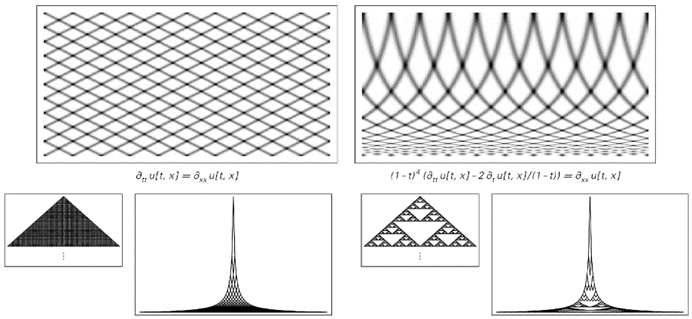

### 12.4  原理的有效性

从传统科学的直觉来看，计算等价性原则——特别是它的许多含义——可能看起来几乎荒谬。但正如我从本书的发现中发展了越来越多的新直觉一样，我越来越确信计算等价性原则必须是有效的。

但就像任何具有实际内容的科学原理一样，未来人们可能会发现，计算等价性原则的至少某些方面并不有效。因为作为自然法则，该原理可能与我们在宇宙中观察到的现象不符；作为抽象事实，它可能仅仅代表了一个错误的推论；甚至作为定义，它也可能被证明是不实用或不相关的。

(p 726)

但随着越来越多支持该原理现象的证据的积累，人们越来越有理由相信，至少在某种形式或另一种形式中，该原理本身必须是有效的。

与许多基本原理一样，计算等价性原则的最一般表述起初可能看起来相当模糊。但对该原理的几乎所有具体应用都会倾向于提出更具体、更精确的表述。

不用说，人们总是可以提出看似与计算等价性原则相关但实际上并不相同的表述。事实上，我怀疑在未来几年这种情况会多次发生。因为如果有人尝试使用传统科学和数学的方法，几乎不可避免地会得出与实际的计算等价性原则大相径庭的表述。

实际上，我猜想，除了使用本书介绍的那种科学方法外，基本上没有其他方法可以准确地表述该原理。这意味着，几乎任何可以轻易通过传统数学证明方法研究的表述，都可能与真正的计算等价性原则关系不大。

在本书中，我提出了多种可以解释为计算等价性原则的有限版本的发现。随着年月的推移，我预计会有更多此类发现。随着这些发现的被接受，我怀疑科学的普遍直觉将逐渐转变，最终计算等价性原则将变得几乎显而易见。

但到目前为止，对于那些从传统科学中获得直觉的人来说，这一原理还远未显而易见。因此，无疑会提出各种反对这一原理的意见。其中一些可能基于这样的信念：实际系统的计算复杂性低于该原理所隐含的，而另一些则可能基于这样的信念：实际系统的计算复杂性高于该原理所隐含的。

(p 727)

但从根本上讲，我怀疑反对意见最常见的单一原因是对传统系统模型中各种理想化概念的混淆。因为即使系统本身遵循计算等价性原则，也不能保证该系统的理想化也遵循这一原则。

正如我在第8章开头所讨论的，为系统找到一个好的模型主要是找到尽可能简单的理想化，但同时仍然能够捕捉系统的重要特征。问题在于，过去从未明确认识到系统的计算能力可能很重要，因此在建模时通常没有正确捕捉这些能力。

然而，我在本书中开发的基于简单程序的模型的一个特点是，它们似乎成功地捕捉了自然界和其他地方广泛系统的计算能力。在这些模型的背景下，我发现确实有各种各样的证据表明计算等价性原则是成立的。

但是，如果使用过去常见的传统数学模型，情况可能会大不相同。

例如，许多这样的模型将系统理想化到只需要通过一些简单的数学公式来描述其完整行为，这些公式涉及几个总体数值量。如果只考虑这种理想化，人们几乎不可避免地会得出结论，认为该系统的计算复杂性非常低。

传统数学模型也常常暗示过高的计算复杂性。例如，正如我在第7章末尾所讨论的，基于传统数学方程的模型通常给出行为上的约束，而不是生成行为的明确规则。

如果有人假设实际系统总是设法找到满足这些约束的方法，那么就会得出结论，认为这些系统的计算复杂性必须高于我所讨论的任何通用系统——因此必须违反计算等价性原则。

(p 728)

正如我将在本章后面更详细地描述的那样，一个普通的通用系统不可能在有限数量的步骤内保证能够判断，比如说，是否存在满足我在第5章末尾讨论的那种约束的黑白方格图案。然而，传统数学模型却常常在实际上暗示自然界的系统能够做这样的事情。

但我在第7章末尾解释过，这很可能只是一种理想化。因为虽然在简单情况下，复杂的分子可能会例如以最小化能量的方式排列自己，但有证据表明，在更复杂的情况下，它们通常不会这样做。事实上，它们实际上似乎是通过一个与计算等价性原则相当一致的明确进化过程来探索不同的构型。

元胞自动机以及我在本书中讨论的大多数其他计算系统的一个特点是，它们在某种基本意义上是离散的。然而，传统数学模型几乎总是涉及连续量。过去，这常常被解释为自然界中的系统能够进行某种比标准计算系统更复杂的计算。

但出于几个原因，我不相信这个结论。

首先，经验表明，如果人们试图构建利用连续物理过程的模拟计算机，它们通常会比普通的数字计算机功能更弱，而不是更强。

事实上，正如我在本书中多次讨论的那样，在许多情况下，连续性的整个概念只是一种理想化——尽管如果人们想利用传统数学方法，这几乎是必需的。

流体提供了一个明显的例子。因为流体通常被认为是由连续的数学方程描述的。但在底层，真实的流体由离散的粒子组成。这意味着，无论数学方程可能暗示什么，流体的实际最终计算能力必须是离散粒子系统的计算能力。

(p 729)

尽管已知自然界中的许多系统都是由离散元素组成的，但人们仍普遍相信有些东西从根本上来说是连续的——特别是空间中的位置和量子力学概率振幅的值。

然而，正如我在第9章中讨论的那样，我强烈怀疑在根本层面上，我们宇宙的每一个方面最终都将被证明是离散的。如果真是这样，那么它立即意味着在我们的宇宙中，永远不可能存在违反计算等价性原则的任何形式的连续性。

但如果有人以某种方式将自己限制在某个特定系统似乎连续的领域内呢？即使在这个层面上，人们能比在离散系统中进行更复杂的计算吗？

我猜想，从所有实际目的来看，人们都不能。事实上，我怀疑，在任何合理的假设集下，即使是理想化的完全连续系统，也永远无法从根本上进行更复杂的计算。

从某种意义上说，连续系统最基本的定义特征是它们对任意连续数进行操作。但仅仅为了表示每一个这样的数，通常就需要一个类似无限数字序列的东西。因此，这意味着连续系统实际上必须能够处理无限序列。

但这本身并不特别引人注目。因为即使是一维元胞自动机，也可以被视为在其演化的每一步中更新无限个细胞序列。但这个过程的一个特点是它本质上是局部的：每个细胞的行为完全由其周围局部邻域中的细胞决定。

然而，即使是连续数上的最基本算术运算也通常涉及显著的非局部性。例如，当将两个数相加时，数字序列中可能会出现任意远的进位。而且，如果计算像1/x这样的函数，x中的几乎每个数字通常都会对结果中的几乎每个数字产生影响，正如对面页面上的图片所示。

(p 730)

但这种详细的现象真的可以作为进行更复杂计算的基础吗？为了比较连续系统和离散系统的一般计算能力，我们需要找到一些基本方案来构造输入和解码输出，这些方案可以在两种类型的系统中使用。而最明显且实用的方法是要求这总是通过有限的离散过程来完成。

但至少在这种情况下，看起来很清楚的是，下面所示的任何简单函数都不可能得出超出普通离散系统演化所能轻松生成的结果。如果处理的是通常被认为是标准数学函数的任何函数，情况可能也是如此。但是，如果我们假设可以建立一个系统，该系统不仅可以找到这些函数的值，还可以找到包含这些函数的任意方程的解，那么会发生什么呢？

对于纯多项式方程，我们可以从代数结果中推断出，不可能进行更复杂的计算。但是，一旦允许使用三角函数等函数，就会发现可以构造出求解这些方程等价于找到像元胞自动机这样的系统演化中无限多步结果的方程。

>数字运算结果，这些数字具有相似的数字序列。每幅图中连续的每一行都给出了通过使用x的值获得的数字序列，其中连续的一个数字已经被反转。图片顶部一行的x值从重复的基准2数字序列3/5开始；底部一行的x值从π/4开始。每幅图中连续数字序列之间缺乏连贯性，反映了当应用于数字序列时数学运算的非局部性。

(p 731)

虽然这些特定类型的方程从未被认真提出作为自然界或其他地方实际过程的理想化模型，但结果表明，在微分方程中可能会出现一种相关的现象——微分方程是大多数传统科学领域数学模型最常见的基础。

我们在第4章末尾讨论的微分方程在某种程度上有点像元胞自动机。因为给定系统的状态，它们提供了确定系统后续状态的规则。但是，元胞自动机总是只在离散的步骤中演化，而微分方程则经历了一个连续的演化过程，其中时间仅作为一个参数出现。

通过简单地改变时间进入微分方程的方式，我们通常可以像下面的图片那样安排，使通常需要无限时间的过程实际上只发生在有限的时间内。

>指示了如何在像偏微分方程这样的连续系统中，在有限时间内原则上可以执行无限量的计算工作。左上图显示了波动方程的解。右上图显示了通过根据t->1-1/t变换时间变量从波动方程获得的方程的解。底行显示了相同的变换对由简单元胞自动机生成的图案类型的影响。可能可以构造出偏微分方程，这些方程同时给出这些图案的原始版本和变换版本。

(p 732)

因此，如果这样的过程可以与元胞自动机之类的系统的演化相对应，那么至少在形式上可以推断，微分方程应该能够在有限时间内完成计算，而像元胞自动机这样的离散系统则需要无限时间才能完成。

但正如模拟计算机很难忠实地再现离散计算中的许多步骤一样，似乎也很难建立微分方程，以便在任意长的时间内成功地模拟像元胞自动机这样的系统的精确行为。事实上，我怀疑要使这项工作成功，需要采取的限制与跟踪微分方程无限时间演化的限制非常相似。

因此，我猜想，即使在传统连续数学的形式主义中，实际过程的现实理想化也永远不会最终能够执行比计算等价原理所暗示的更复杂的计算。

但是，人类思考的过程呢？它也遵循计算等价原理吗？还是它设法执行了比计算等价原理所暗示的更复杂的计算？

我们很容易认为人类思维中必定存在极其复杂的东西。而当今计算机系统甚至无法模仿人类思维最明显的某些特征，这一事实似乎也在支持这一观点。但正如我在第10章中，特别是根据本书中的发现所讨论的那样，我坚信人类思维的基本机制最终将证明与相当简单的计算过程相对应。

因此，所有这些都表明，自然界中的系统不会执行比计算等价原理所允许的更复杂的计算。但仅凭这一点还不足以确立完整的计算等价原理。因为该原理还暗示了计算复杂性的下限——即断言几乎任何非显而易见的简单过程都将在其计算复杂性上趋于等价。

(p 733)

这一原理的一个后果是，它暗示了大多数行为看似复杂的系统都应该是通用的。然而，到目前为止，我们只知道少数几个系统是通用的，尽管包括像规则110这样规则极为简单的系统。毫无疑问，会有人提出反对意见，认为其他行为看似复杂的系统可能并不具有通用性。

特别是，人们可能会认为，像规则30这样的系统的行为——虽然至少在某种程度上计算上很复杂——但可能过于随机，无法被利用以实现完全的通用性。虽然在第11章中我确实给出了一些证据表明规则30可能是通用的，但直到这一点得到确凿证明之前，仍然会存在疑问。

在数学逻辑中，有一个特别深奥的结果，它可能表明存在某些系统，这些系统展现出任意复杂计算的一些特征，但并非通用。因为在20世纪50年代末期，构造出了一整套具有所谓中间程度的系统层次结构，这些系统的特性是，关于它们演化最终输出的问题通常不能通过有限计算来回答，但这些输出的实际形式又不够灵活，无法模拟其他所有系统，因此不支持通用性。

但是，当我们检查这些系统的已知示例（所有这些系统都有非常复杂的底层规则）时，我们发现，尽管它们被确定为输出的特定行为部分受到足够限制以避免通用性，但它们行为的几乎所有其他部分都表现出通用性——这正如计算等价原理所预期的那样。

那么，为什么像规则30这样的系统可能不是通用的呢？我们从第11章知道，行为纯粹是重复性或纯粹是嵌套性的系统不能是通用的。因此，我们可能会想，是否可能存在其他形式的规律性，从而阻止像规则30这样的系统成为通用的。

当我们观察这些系统产生的图案时，它们确实似乎没有任何大的规律性；事实上，在大多数方面，它们看起来比我们已经知道是通用的规则110等系统产生的图案更加随机。

(p 734)

但是，我们如何确定我们没有受到我们感知和分析能力局限性的误导——例如，外星智能可能不会立即识别出表明通用性不可能的规律性？

正如我们在第10章中看到的，我们通常使用的感知和分析方法无法检测到除重复或最多嵌套之外的任何形式的规律性。因此，这意味着即使确实存在某种更高形式的规律性，我们作为人类也可能永远无法发现。

在科学和数学的历史上，重复和嵌套都占据重要地位。如果存在某种共同的更高形式的规律性，其发现无疑将在科学和数学领域带来各种重要的新进展。

当我最初开始研究像元胞自动机这样的系统时，我实际上隐含地假设了必须存在某种形式的规律性。因为我确信，即使我看到的行为在我看来很复杂，但底层规则的简单性最终必然会在其中导致巨大的规律性。

但随着时间的推移——随着我调查了越来越多的系统并尝试了越来越多的分析方法——我逐渐得出结论，任何大类系统中都不存在隐藏的规律性，而计算等价原理所暗示的才是正确的：除了像重复和嵌套这样具有明显规律性的系统之外，大多数系统都是通用的，并且在计算复杂性上是等价的。

