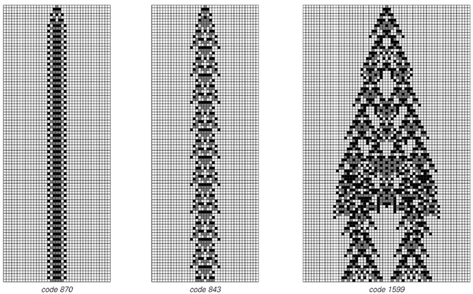
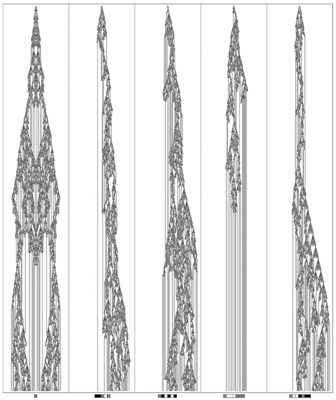
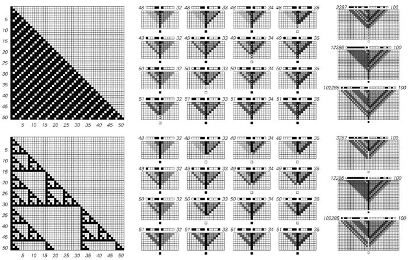
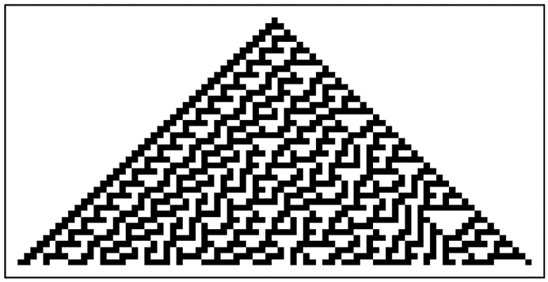
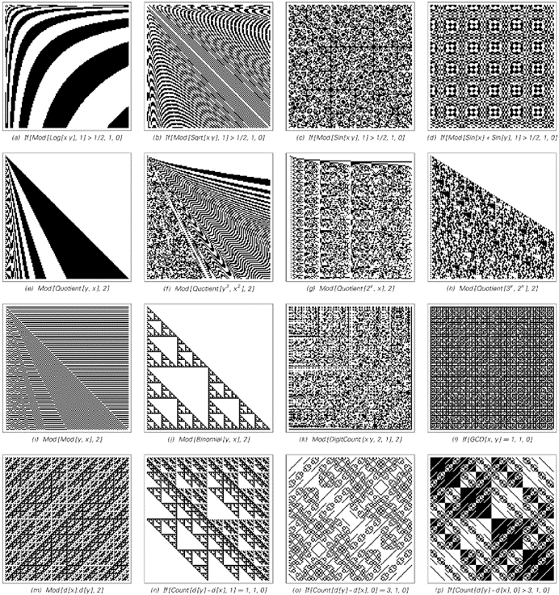
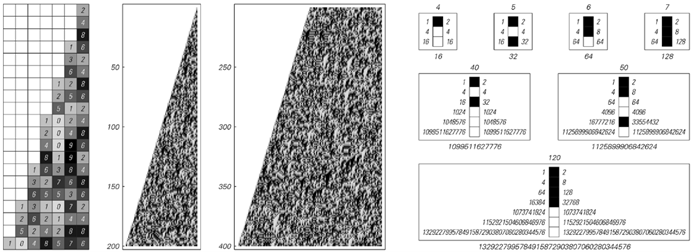

### 12.6  计算不可约性

从计算的角度来看，理论科学历史上的大多数伟大成就，在基本特征上都显得惊人地相似。因为从某种程度上说，它们几乎都基于寻找减少计算工作量的方法，以便预测某个特定系统的行为。

大多数情况下，这个想法是推导出一个数学公式，使人们能够确定系统演化的结果，而无需明确追踪其步骤。

例如，理论科学早期的一个伟大成就是推导出了一个公式，用于计算围绕恒星运行的单个理想化行星的位置。有了这个公式，人们只需插入数字就可以计算出行星在未来任何时间点的位置，而无需明确追踪其运动轨迹。

但是，我开始致力于在这本书中发展这种新型科学的部分原因是我意识到，对于许多常见系统来说，人们从未找到过能够轻松描述其整体行为的传统数学公式。

(p 737)

起初，人们可能认为这只是一个暂时的问题，可以通过足够的聪明才智来解决。但根据本书中的发现，我得出的结论是，事实并非如此，这反而是计算等价原理所带来的一种非常基本现象的结果之一，我称之为计算不可约性。

如果将系统的演化视为计算，那么演化中的每一步都可以看作是系统需要付出一定计算努力的过程。但传统理论科学在某种意义上隐含地依赖于这样一个事实：即其中很多努力在某种程度上是不必要的——而且实际上应该有可能以更少的努力来找到演化的结果。

当然，在以下前两个例子中，情况确实如此。就像理想化行星的轨道一样，实际上存在一个直接的公式，可以给出每个系统在任何数量步骤之后的状态。因此，尽管系统本身通过一系列步骤来产生其行为，但我们可以轻松地简化这个过程，并以更少的努力找到结果。

>元胞自动机演化中计算可约性和不可约性的例子。前两个规则产生了简单的、重复性的、计算上可约的行为，其中许多步骤之后的结果可以在不追踪每一步的情况下轻松推断出来。第三个规则产生了看似计算上不可约的行为，因此其结果实际上只能通过明确追踪每一步来有效找到。这里显示的元胞自动机都遵循3色总量规则。

(p 738)

但是，对面页面上的第三个例子呢？在这种情况下，要找到结果需要什么呢？总是可以通过实验来明确运行系统一定数量的步骤，并观察其行为。但要形成任何形式的传统理论，就必须找到一种涉及更少计算的捷径。

然而，从对面页面的图片来看，显然并不明显如何做到这一点。而看下一页的图片，开始觉得在这个系统的演化中找到任何显著的捷径似乎都不太可能。

因此，虽然对面页面上前两个系统的行为很容易看出是计算上可约的，但第三个系统的行为却似乎是计算上不可约的。

在传统科学中，人们通常认为，如果能够成功地为一个系统找到明确的潜在规则，那么就意味着最终总会有一种相当简单的方法来预测系统的行为。

几十年前，混沌理论指出，为了拥有足够的信息来进行完全预测，人们通常不仅需要知道系统的规则，还需要知道其完整的初始条件。

但现在，计算不可约性给预测带来了一个更加根本的问题。因为它意味着，即使原则上人们拥有预测某个特定系统行为所需的所有信息，实际上仍然需要不可约的计算量来完成这项工作。

事实上，每当系统中存在计算不可约性时，就意味着实际上除了几乎与系统本身演化一样多的计算步骤外，没有其他方法可以预测系统的行为。

在传统科学中，人们很少意识到需要考虑用于预测的系统是如何实际运行的。但导致计算不可约性现象的原因是，用于预测的系统和人们试图预测其行为的系统之间实际上总是存在着根本的竞争。

(p 739)

>从第738页的第三个系统开始，经过5000步演化，从几个初始条件开始。行为的复杂性使得人们似乎无法想象会有一种程序能够立即找到其结果。

(p 740)

如果要有意义的普遍预测成为可能，那么在某种程度上，进行预测的系统必须能够超越它所预测的系统。但要做到这一点，进行预测的系统必须能够执行比它所预测的系统更复杂的计算。

在传统科学中，这似乎从未造成过太大问题。因为人们通常默认，凭借我们的数学能力和一般思维能力，我们用来进行预测的计算几乎无限地比自然界和其他地方我们试图预测其行为的大多数系统所发生的计算更为复杂。

但计算等价原理的一个显著断言是，这一假设并不正确，而且事实上，几乎任何其行为不是明显简单的系统所进行的计算，在复杂性方面最终都是完全等价的。

这意味着，人们用来进行预测的系统所进行的计算，不应期望比我们在各种可能试图预测其行为的系统中看到的计算更复杂。由此可以推断，对于许多系统来说，无法进行系统的预测，因此没有一般的捷径来简化它们的演化过程，因此它们的行为必须被视为计算上不可约的。

如果一个系统的行为显然很简单——比如说是重复的或嵌套的——那么它总是可以计算上可约的。但根据计算等价原理，几乎在所有其他情况下，它都将是计算上不可约的。

我相信，这就是传统理论科学在研究大多数行为最终不是非常简单的系统类型时始终未能取得深远进展的根本原因。

因为关键在于，在基础层面上，这种科学始终试图依赖计算可约性。例如，其使用数学公式来描述行为的整个理念，只有在行为是计算上可约的情况下才有意义。

(p 741)

因此，当存在计算不可约性时，传统理论科学的常用方法就不可避免地会失效。事实上，我怀疑过去它们的失败不那么明显的唯一原因是，理论科学通常倾向于特别定义其领域，以避免那些不够简单以至于无法计算上可约的现象。

但我所发展的新型科学的一个主要特征是，它不必做出任何此类限制。事实上，我在这本书中研究的许多系统无疑都是计算上不可约的。这就是为什么——与大多数传统的理论科学著作不同——这本书中数学公式很少，但系统演化的明确图像却很多。

在过去的几十年里，通过明确的计算机模拟来研究系统已成为实践中越来越普遍的做法。但通常人们认为，这样的模拟最终只是一种方便的替代方式，用于完成那些本可以用数学公式来完成的工作。

但我现在关于计算不可约性的发现意味着，事实并非如此，相反，有许多常见的系统，其行为最终只能通过类似于明确模拟的东西来确定。

知道通用系统的存在就已经告诉我们，这至少在某些情况下是真实的。试想试图超越通用系统的演化。由于这样的系统可以模拟任何系统，它特别可以模拟任何试图超越它的系统。由此可以推断，没有任何东西可以系统地超越通用系统。因为任何能够这样做的系统实际上也必须能够超越自己。

但在本书发现这些之前，人们可能认为这与实际情况关系不大。因为人们认为，除了特别构建的系统外，普遍性很少见。而且还认为，即使存在普遍性，如果要进行任何类似于大多数预测方法所涉及的复杂计算，也需要非常特殊的初始条件。

(p 742)

但计算等价原理断言事实并非如此，实际上，几乎任何其行为不是明显简单的系统都会表现出普遍性，并且即使在典型的简单初始条件下也会进行复杂的计算。

因此，结果是计算不可约性最终可能是常见的，因此实际上不可能超越各种系统的演化。

在考虑计算不可约性时，一个稍微微妙的问题是，对于任何给定的系统，人们总是可以至少在名义上想象通过设置一个规则来加速其演化，例如一次性执行几个演化步骤。

但这样的规则本身可能更复杂，因此最终可能并不会真正减少计算量。更重要的是，事实证明，当存在真正的计算可约性时，其效果通常要明显得多。

下一页的图片展示了基于元胞自动机的典型示例，这些示例表现出重复和嵌套行为。在左侧的模式中，每个单元格在任何给定步骤的颜色实际上是通过追踪元胞自动机到该步骤的明确演化来找到的。但在右侧的图片中，特定单元格的结果是通过计算量小得多的程序找到的。

这些程序再次基于元胞自动机。但现在，元胞自动机的作用是接收细胞位置的规范，然后直接从这些规范中计算出细胞的颜色。

这些元胞自动机的初始条件设置方式为数字序列，给出位置。然后，通过演化与输入数字序列长度相等的步数，来确定特定细胞的颜色。

这意味着，例如，左侧任一元胞自动机的一百万步演化结果现在仅由20步演化决定，其中20是数字1,000,000的二进制表示的长度。

这实际上与传统理论科学中典型数学公式的运作方式非常相似。因为这类公式的目的通常是允许人们将数字作为输入，然后直接计算出与某个系统演化中该数字步数的结果相对应的东西。

(p 743)

在传统数学中，人们通常认为，一旦有了涉及标准数学函数的显式公式，就可以立即评估该公式。

但评估公式——就像其他任何事情一样——是一个计算过程。除非某些数字实际上永远不重要，否则这个过程通常不能比输入中的数字位数少。

事实上，从原则上讲，这个过程可能需要与输入数值成比例的步数。但如果真是这样，那就意味着评估公式所需的努力与仅仅追踪原始过程（该公式的结果应该给出该过程的结果）的每一步一样多。

>计算可约性的实例。左侧的图片展示了由基本规则188和60的元胞自动机普通演化产生的图案。右侧的图片展示了如何以更少的计算量找到这些图案中特定细胞的颜色。在每种情况下，细胞的位置都由一对数字指定，这些数字作为元胞自动机初始条件中的二进制数字序列给出。然后，元胞自动机的演化迅速确定左侧图案中该位置细胞的颜色。对于规则188，执行此操作的元胞自动机涉及12种颜色；对于规则60，则涉及6种颜色。一般来说，要找到经过t步规则188或规则60演化后细胞的颜色，大约需要Log[2, t]步。请参考第608页。

(p 744)

事实证明，传统理论科学之所以取得巨大成功的关键基础在于，事实上，大多数标准数学函数都可以在远小于其输入数值的步数内进行评估，并且这些步数通常仅随其输入数字序列长度的增加而缓慢增长。

因此，如果有一个描述过程结果的传统数学公式，那么这几乎总是意味着该过程必须表现出巨大的计算可约性。

然而，在实践中，已知的传统数学公式所涉及的绝大多数情况最终都表现出均匀或重复的行为。实际上，正如我们在第10章中看到的，如果仅使用标准数学函数，那么即使是重现许多嵌套的简单示例也相当困难。

但是，正如对面页面和第10章中的图片所示，如果允许更一般类型的底层规则，那么建立程序以非常小的计算量找到任何嵌套图案中任何元素的颜色就变得相当直接了。

那么更复杂的图案呢，比如页面底部的规则30元胞自动机图案？

当我第一次生成这样的图案时，我花了大量时间试图分析它们，并试图找到一个程序，该程序可以直接计算出每个细胞的颜色。而事实上，正是我在这方面一直无法取得太大进展，才让我首先考虑到了可能存在计算不可约性这样的现象。

现在，计算等价原理意味着，事实上，几乎任何行为不明显的系统都会倾向于表现出计算不可约性。

但是，特别是当底层规则简单时，通常仍然存在一些表面的计算可约性。因此，例如，在下面的规则30图案中，只需进行非常简短的计算，测试该位置是否位于图案中心三角形区域之外，就可以判断给定位置的细胞是否有可能是非白色的。而在像规则110这样的4类元胞自动机中，如果碰巧只有少数几个分离良好的局部结构存在，则可以轻松地简化演化过程，至少能简化有限数量的步骤。

>这是一个难以直接计算特定细胞颜色的图案示例。

(p 745)

事实上，一般来说，我们在系统行为中设法识别的任何规律性都倾向于反映这种行为中的某种计算可约性。

如果将行为模式视为数据的一部分，那么正如我们在第10章中讨论的那样，其中的规律性允许找到一种压缩描述。但是，压缩描述的存在本身并不意味着计算可约性。对于任何具有简单规则和简单初始条件的系统（包括例如规则30），都将始终具有这样的描述。

但是，只有当从压缩描述中找到实际行为的任何特征仅需要短时间的计算时，才存在计算可约性。

事实证明，我们通过实践和在第10章中讨论的感知和分析方法所获得的压缩描述类型，在本质上都具有这一特性。因此，这就是为什么我们通过这些方法识别的规律性确实反映了计算可约性的存在。

但正如我们在第10章中看到的那样，在几乎所有不仅仅具有重复或嵌套行为的情况下，我们的正常感知和分析能力只能识别出极少数的规律性——尽管在某种程度上，我们观察到的行为可能仍然是由极其简单的规则生成的。

这支持了一个断言，即除了可能存在的一小部分表面的计算可约性之外，绝大多数系统最终都是计算不可约的。事实上，这一断言至少部分地解释了为什么我们的感知和分析方法不可能在识别规律性方面走得更远。

但是，如果我们看到的行为对我们来说看起来很复杂，这是否一定意味着它不能表现出计算可约性呢？一种尝试了解这一点的方法是构建模式，其中我们明确地将每个细胞的颜色设置为由其位置数字通过一些简短的计算来确定。

(p 746)

>这些模式示例的设置方式使得可以通过表示其位置的数字进行简短计算来确定每个细胞的颜色。大多数这样的模式对我们来说看起来相当简单，但这里展示的例子是特意挑选出来看起来更复杂的。其中大多数使用了相当标准的数学函数，但组合方式不同寻常。在每张图片中，x和y都从1运行到127。d[n]代表IntegerDigits[n, 2, 7]。（h）相当于以2为底的3的幂的数位序列（见第120页）。（j）本质上是帕斯卡三角形（见第611页）。（l）在第613页有讨论。（m）是第583页上看到的嵌套模式。唯一已知可以通过简单的局部规则沿页面向下演化得到的模式是（j），它对应于规则60的基本元胞自动机。

(p 747)

当我们看这些模式时，大多数看起来相当简单。但正如前一页的图片所示，事实证明，也有可能找到一些例子，其中情况并非如此，相反，这些模式对我们来说至少有些复杂。

但是，为了使这些模式成为计算可约性的有意义示例，还必须能够通过某种演化过程（比如通过反复应用元胞自动机规则）来产生它们。然而，对于这里展示的大多数情况来说，至少没有明显的方法来做到这一点。

然而，我发现了一类系统——已在第10章中提及——其行为看起来并不简单，但事实证明它是计算可约的，就像对面页面上的图片所示。但是，我强烈怀疑这样的系统非常罕见，而且在绝大多数情况下，我们在自然界和其他地方看到的复杂行为最终确实与计算不可约性相关。

那么，这对科学意味着什么呢？

过去，人们通常认为科学所能做的事情没有终极限制。当然，近几个世纪以来科学的进步是如此令人印象深刻，以至于人们普遍认为它最终应该为几乎所有事物提供一个简单的理论——或许是一个数学公式。

但是，计算不可约性的发现现在意味着这从根本上来说永远不可能发生，而且事实上，对于任何看似复杂的行为，都不可能有简单的理论。

这并不是说不能找到这种行为背后的规则。事实上，正如我在本书中所论述的，特别是当它们以程序的形式表述时，我怀疑这些规则往往极其简单。但关键在于，要推导出这些规则的后果可能需要不可约的计算量。

人们总是可以通过实验来观察想要研究的任何系统的实际行为。但是，人们通常无法找到一个简单的理论，该理论能够毫不费力地告诉人们这种行为的各个方面。

(p 748)

那么，鉴于这一点，理论科学还有用吗？

答案当然是肯定的。因为即使在其最传统的形式中，它也能很好地处理那些恰好足够简单、可以计算可约的行为方面。由于人们永远无法提前知道在某个特定系统中计算可约性会走多远，因此至少尝试应用理论科学的传统方法总是值得的。

但最终，如果存在计算不可约性，那么这些方法将会失败。然而，人们仍然经常有很多理由想要使用抽象的理论模型，而不是仅仅在自然界和其他地方的实际系统上进行实验。正如本书的结果所表明的，通过使用正确类型的模型，我们可以取得很多成就。

任何能够准确模拟具有计算不可约性系统的模型，都必然会在某种程度上涉及到与该系统本身一样复杂的计算。但正如我在本书中所展示的，即使具有非常简单基本规则的系统，仍然可以进行与任何系统一样复杂的计算。

>一个系统的行为看似复杂，但实际上却是计算可约的。这个系统是一个元胞自动机，每个细胞有10种可能的颜色。但它也可以被视为一个基于数字的系统，其中连续的行是2的连续幂的10进制数字序列。事实证明，仅从n的2进制数字序列中就可以快速计算出第n行，如右图所示。这个过程是基于标准的重复平方法，从2开始找到2的n次方，然后依次对得到的数进行平方，如果n中对应的2进制位是1，则乘以2。使用这个过程，人们可以通过大约n Log[n]3次操作来计算第n行上任何单元格的颜色，而不是像显式执行元胞自动机演化那样需要n2次操作。

(p 749)

这意味着，即使是对于行为非常复杂的系统，也足以使用具有极其简单基本结构的模型来捕捉其基本特征。给定这些模型，通常只能通过运行它们来找出它们的功能。但关键在于，如果模型的结构足够简单，并且与可以在实际计算机上有效实现的内容足够吻合，那么通常仍然完全有可能找出模型的许多结果。

从某种意义上说，这本书的大部分内容都是关于这一点的。

