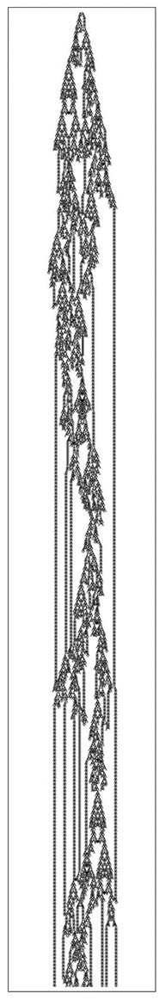

### 12.7  自由意志现象

自古以来，宇宙如何遵循确定的定律，而我们人类却常常能够做出似乎完全不受明显定律约束的行为决策，一直是一个巨大的谜团。

但是，根据本书中的发现，现在终于有可能对此给出解释了。我相信，关键在于计算不可约性现象。

这个现象意味着，即使一个系统可能遵循确定的底层定律，其整体行为仍然可能包含一些从根本上无法用合理定律来描述的方面。

因为如果系统的演化对应于一个不可约的计算，那么这意味着要计算出系统将如何表现，本质上就必须执行这个计算——结果是，从根本上讲，不可能存在允许人们更直接地计算出系统行为的定律。

我相信，这正是人类意志自由表象的最终根源。即使我们大脑的所有组成部分都遵循确定的定律，我强烈怀疑它们的整体行为对应于一个不可约的计算，其结果实际上永远无法通过合理的定律来找到。

事实上，人们已经可以在像下面的元胞自动机这样的简单系统中看到非常相似的情况。即使这个系统的底层定律是完全确定的，其整体行为却变得足够复杂，以至于它的许多方面似乎完全不遵循任何明显的定律。

>一个元胞自动机，其行为似乎表现出一种类似于自由意志的特质。尽管它的底层定律是确定且简单的，但其行为却复杂到足以使许多方面看起来并不遵循任何确定的定律。（这里使用的规则与第740页上的相同。）

(p 750)

事实上，如果要谈论这个元胞自动机似乎如何表现，人们很可能会说它只是决定这样做或那样做——从而有效地将其归因于某种自由意志。

但这可能是合理的吗？因为当人们观察元胞自动机中的单个细胞时，可以清楚地看到它们只是遵循确定的规则，完全没有自由可言。

但在某种程度上，我们大脑中的单个神经细胞可能也是如此。然而，不知何故，我们的大脑作为一个整体仍然能够表现出某种明显的自由。

传统科学很难理解这是如何发生的。因为通常它假设，如果能找到系统组成部分的底层规则，那么从某种意义上说，这些规则就告诉了我们关于系统的一切重要信息。

但我们在本书中反复看到的是，这甚至远非正确，而且事实上，一个系统的行为可能比仅仅通过观察其底层规则所能预见的要多得多。从根本上说，这是计算不可约性现象的一个结果。

如果一个系统是计算不可约的，这意味着系统的底层规则与其整体行为之间存在实际上的明显分离，而这种分离与从前者到后者所需的不可约计算量密切相关。

我相信，正是这种分离，构成了我们在各种系统中看到的明显自由的基本起源——无论这些系统是抽象的元胞自动机还是实际的大脑。

但最终，是什么让我们认为系统的行为中存在自由呢？在实践中，主要的标准似乎是我们无法轻易预测系统的行为。

因为如果我们可以预测，那么这将表明行为必然以某种确定的方式被决定，因此不可能是自由的。但至少以我们正常的感知和分析方法，我们通常需要相当简单的行为，才能实际识别出让我们能够对其做出合理预测的总体规则。

(p 751)

然而，事实上，即使在生物体中，这种行为也相当普遍。例如，在低级动物中，经常可以看到对各种刺激做出非常简单和可预测的反应的情况。但关键是，这些通常只是被认为是无法避免的反射，没有留下任何决策或自由的余地。

但一旦我们看到的行为变得更加复杂，我们很快就倾向于认为它必须与某种潜在的自由有关。因为至少从传统直觉来看，一个仅仅遵循确定底层规则的系统中出现任何真正的不可预测性，似乎都是相当不可信的。

因此，为了解释人类所表现出的行为，人们经常假设必然有更深层次的东西在起作用——也许是人类独有的东西。

过去，人们普遍认为必须存在某种形式的外部命运影响——可能与超自然力量的干预有关，也可能与天体结构有关。而最近，人们提出了对初始条件的敏感性和量子随机性作为更合适的科学解释。

但正如我们在第6章讨论随机性时所说，实际上并不需要这样的解释。因为正如我们在本书中多次看到的那样，即使具有相当简单和明确的潜在规则的系统，也可能产生出如此复杂的行为，以至于看起来并不受明显规则的约束。

关键的一点是，这种情况仅通过系统的内在演化而发生——不需要任何来自外部或任何形式的显式随机性源的额外输入。

我相信，正是这种我们现在知道在大量系统中发生的内在过程，主要是我们大脑运作中表现出自由感的原因。

但这并不是说我们大脑中的一切都有内在的起因。实际上，从实际情况来看，通常发生的情况是，我们接受外部输入，从而导致一系列思考，这些思考会持续一段时间，但随后会消失，直到我们获得更多输入。而且，这种思考序列的实际形式往往受到我们从过去输入中发展出来的记忆的影响——即使输入完全相同，它也不一定能够重复。

(p 752)

但似乎每一系列思考中的各个步骤都遵循着相当明确的潜在规则。而关键在于，我怀疑应用这些规则所进行的计算往往足够复杂，以至于在计算上是不可约的——其结果是，它本质上会产生出看起来不受明显规律约束的行为。

