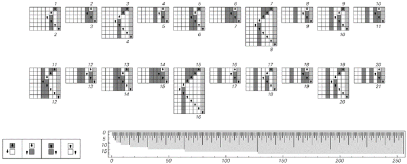
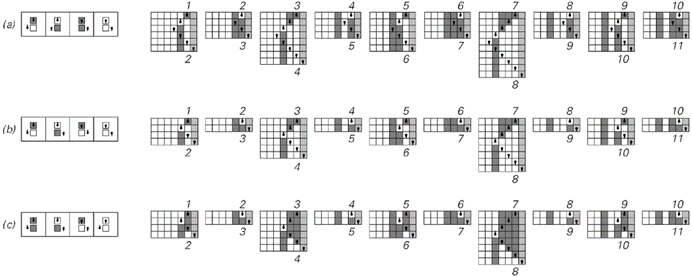
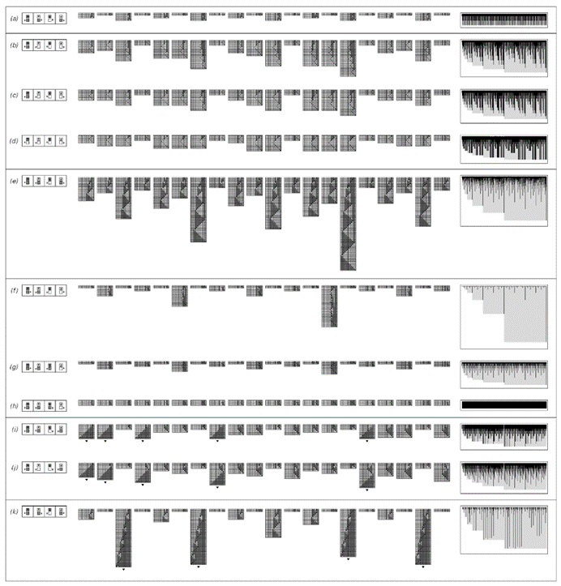
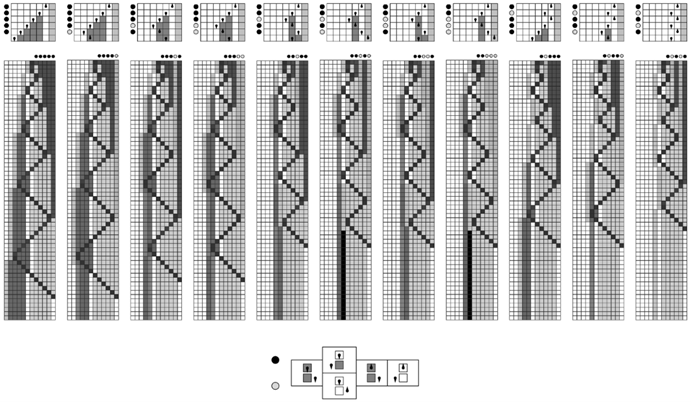
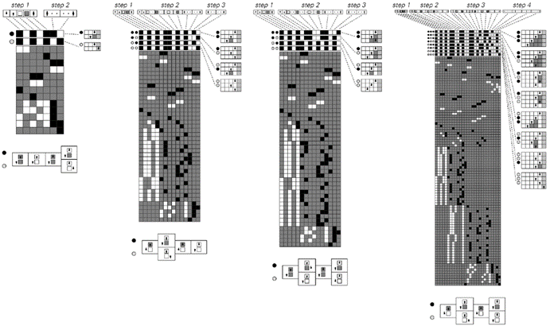
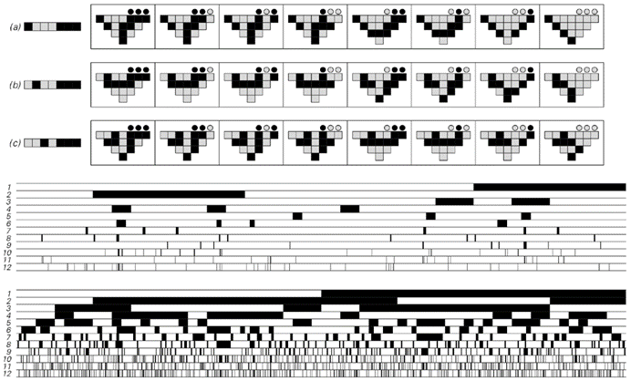

### 12.8  不可判定性与难解性

计算不可约性是一个非常普遍的现象，具有许多后果。在这些后果中，有许多现象在抽象计算理论中得到了广泛的研究。

过去，人们通常认为这些现象只发生在非常特殊的系统中，而不是例如具有简单规则或可能在自然界中看到的那种典型系统中。但我现在关于计算不可约性的发现表明，这些现象实际上应该非常普遍，并且应该例如发生在自然界和其他地方的许多系统中。

到目前为止，在本章中，我主要关注的是正在进行的计算过程，这与自然界和其他地方系统的持续行为相类似。但从理论上讲，人们可以问计算的最终结果是什么，也许是在无数步骤之后。如果这样做，就会遇到20世纪30年代发现的不可判定性现象。

下一页的图片给出了一个例子。在每种情况下，知道最终结果都相当于决定元胞自动机演化产生的模式最终会发生什么。它会消失吗？它会稳定下来并变得重复吗？还是会以某种方式永远增长下去？

你可以通过让系统运行一定数量的步骤来观察结果，尝试找出答案。实际上，在示例（a）中，这种方法效果很好：仅在36步后，你就发现图案消失了。但在示例（b）中，情况就没那么简单了。你可以运行1000步，但仍然不知道接下来会发生什么。直到1017步后，才终于明确图案实际上会消失。

(p 753)

>这些元胞自动机演化展示了不可判定性的现象。图案（a）在36步后消失；图案（b）则需要1017步。但即使运行了一百万步，图案（c）和（d）的最终结果仍然不明确。一般来说，似乎没有有限的计算能够保证在无限多步后确定演化的最终结果。这里使用的元胞自动机规则是一个带有代码1004600的4色总量主义规则。一个元胞自动机中的图案是否会消失，可以看作是图灵机停机问题的一个版本。

(p 754)

那么示例（c）和（d）呢？它们会发生什么？在一百万步后，两者都没有消失；事实上，它们的宽度分别是31,000和39,718个细胞。在1000万步后，两者仍在继续演化，宽度分别达到339,028和390,023个细胞。但是，即使已经追踪了这么远的演化过程，你仍然不知道它的最终结果会是什么。

在任何系统中，要能够一般性地保证知道最终结果，唯一的方法是找到某种方法来简化系统的演化过程，并能够将系统需要无限多步才能完成的计算简化为有限的计算。

但如果系统的行为在计算上是不可约的——正如我怀疑的，对面页面上的元胞自动机以及许多其他具有简单潜在规则的系统就是这样——那么关键在于，最终这样的捷径是不可能的。这意味着，从形式上讲，系统最终会做什么这一普遍问题可以被视为不可判定的，因为不存在能够确保决定这一问题的有限计算。

对于任何特定的初始条件，可能只需要让系统运行一定数量的步骤，就能判断出它会做什么。但关键是，没有保证这一定有效：实际上，不存在一个有限的计算量，可以确保总是足够回答系统在无限多步后会做什么的问题。

自20世纪30年代以来，人们就知道这种情况。但通常人们认为，除了特殊和复杂的情况外，很少会看到这种不可判定性的影响。然而，对面页面的插图所说明的是，事实上，即使是非常简单的潜在规则和非常简单的初始条件，不可判定性也可能产生相当明显的影响。

我怀疑的是，对于几乎任何在我们看来行为复杂的系统，关于系统在无限多步后会做什么的几乎所有非平凡问题都将是不可判定的。因此，例如，从某个特定的初始条件开始，系统的演化是否会生成特定的细胞颜色排列，或者是否会产生一个最终重复或最终嵌套的图案，这些问题通常都将是不可判定的。

(p 755)

如果有人问是否存在某些初始条件，例如，导致一个不会消失的图案，那么这通常也是不可判定的——尽管从某种意义上说，这只是给定一个特定的初始条件，人们无法判断它产生的图案是否会消失这一事实的直接结果。

但如果人们只是查看可能的序列（可能用作初始条件），并询问它们中的任何一个是否满足某个约束条件呢？即使约束条件很容易测试，结果也可能是不可判定的。因为人们可能无法确定需要走多远才能确保在无限多的可能序列中，确实没有一个满足约束条件。

对面页面的图片展示了这一点的简单例子。这个想法是选择一组由上下块组成的对，然后询问是否存在这样的对序列，使得形成的上下字符串最终完全对应。

当只有两种对时，回答这个问题相当直接。因为如果任何序列要满足约束条件，那么就可以证明必须已经存在一个有限长度的序列这样做——如果有必要，人们可以通过明确查看所有可能性来找到这个序列。

但是，一旦有超过两种对，事情就变得复杂得多，正如对面页面的图片所示，即使是非常短的块，为了满足约束条件，也可能需要非常长且看似随机的序列。

事实上，我强烈怀疑，即使只有三对，也已经存在计算上的不可约性，因此，实际上回答约束条件是否可以得到满足这一问题的唯一方法就是明确追踪所有任意长序列中的一部分——这使得这个问题在一般情况下是不可判定的。

事实上，每当人们的问题在某种程度上涉及到查看无限数量的步骤、元素或其他事物时，如果这个问题是针对一个表现出计算不可约性的系统提出的，那么这个问题几乎不可避免地是不可判定的。

(p 756)

>这是一类一维约束的例子，其中它们是否可以得到满足在一般情况下是不可判定的。这些约束要求以某种顺序连接显示的块，应产生相同的上下字符串。在情况（a）到（l）中，约束条件可以得到满足，并且做到了这一点的最短字符串已给出。右侧的图表给出了在添加每个新块时上下字符串长度之间的连续差异；这种差异达到零反映了约束条件得到满足的事实。情况（m）到（s）显示了无法通过任何有限长度的字符串来满足的约束条件。当约束条件涉及两个以上的块时，似乎没有上限来表明人们需要考虑多长的字符串才能判断约束条件是否可以得到满足。图片（a）、（b）、（h）和（j）显示了对于涉及元素总数为7、8、9和10的块的4096、16384、65536和262144个约束条件中的任何一个，所需的最长最短字符串。解决这里所示类型的约束条件的一般问题被称为波斯特对应问题。为了找到本页上的系统，需要通过计算机和其他方式构建大量关于特定约束条件无法满足的不可能性的证明。

(p 757)

那么有限问题呢？

这样的问题最终总是可以通过有限计算来回答的。但是，当存在计算不可约性时，这种计算可能会被迫达到一定的难度水平，有时会使它们变得相当棘手。

当人们进行实际计算时，往往会通过查看它需要多少时间、可能涉及多大的程序以及需要多少内存来评估计算的难度。

但是，通常人们无法判断自己进行特定计算的方案是否可能是最高效的。在过去，确实有过几次新算法突然让各种计算变得比以往任何时候都更加高效的情况。

事实上，尽管几十年来在计算复杂性理论领域进行了巨大努力，但几乎从未建立过关于计算难度的明确下界。但是，使用本书的方法，事实证明有可能开始至少获得一些结果。

关键是考虑非常小的程序。因为对于这样的程序，可以现实地枚举特定类型的每一个程序，然后只是明确地查看哪个程序在执行某些特定计算时最高效。

在过去，这样的方法似乎并不合理，因为人们通常认为，要使这种方法有效，程序必须足够小，而这样的程序只能做一些相当简单的计算。但是，我的发现表明，事实上，即使是非常小的程序，也完全有能力进行各种复杂的计算。

作为第一个例子——基于一个相当简单的计算——对面页面顶部的图片展示了一个图灵机，它被设置为向任何数字加1。图灵机的输入是该数字的二进制数字序列。机器的头部从该序列的右端开始，机器运行直到其头部首次向右移动——此时机器停止，留下的任何数字序列都被视为计算的输出。

(p 758)

而下面的图片显示的是，对于这台特定的机器，完成计算所需的步数在不同的输入之间差异很大。但是，如果只看任何给定长度的输入所需的绝对最大步数，就会发现这个步数与输入长度成正比增加。

那么，是否存在其他方法以不同数量的步数完成相同的计算呢？人们可以很容易地枚举出所有具有2个状态和2种颜色的4096种可能的图灵机。结果证明，其中正好有17种能够执行向数字加1的计算。

它们每一种的工作方式都略有不同，但所有这些都遵循下一页底部所示的三种方案之一——并且所有这些都最终表现出随着输入长度的增加，步数总体上呈线性增长的趋势。

那么其他计算呢？

事实证明，有351种不同的函数可以由一个或多个具有2个状态和2种颜色的4096种图灵机计算得出。而对面页面的图片显示，不同的图灵机完成它们所做的计算可能需要非常不同的步数。

>这是一个简单图灵机行为的例子，该图灵机执行向数字加1的计算。数字以二进制数字序列给出；图灵机运行直到其头部碰到右侧的灰色条纹。图表显示了这个过程所需的步数作为输入数字x的函数。结果证明是由2*IntegerExponent[x+1, 2] + 3给出的，其最大值为2n+3，其中n是x的数字序列的长度，或Floor[Log[2, x]]。对于给定长度的输入，平均值并不随n的增加而增加，而是始终精确地为5。

(p 759)

例如，图灵机（a）总是在最多5步内完成计算，与输入的长度无关。但在大多数其他所示的图灵机中，所需的最大步数通常随着输入长度的增加而增加。

图灵机（b）、（c）和（d）总是计算相同的函数。但这意味着对于给定的输入，它们每个都会产生相同的输出，但图表显示它们通常需要不同数量的步数来完成。然而，如果人们查看任何给定长度的输入所需的最大步数，就会发现这仍然总是以精确的线性方式增加——就像本页顶部所示的加1的图灵机一样。

那么是否存在增长更快的情况呢？图灵机（e）展示了一个例子，其中最大步数随着输入长度的平方而增长。事实证明，在至少具有2个状态和2种颜色的图灵机中，这是唯一计算它所执行函数的图灵机——因此，至少如果人们想使用如此简单的程序，那么没有更快的方法来进行计算。

>这是由具有2个状态和2种颜色的图灵机用来向数字加1的三种方案。所有方案都显示出在输入大小增加时，最大步数呈相同的线性增长。这种增长可以视为可能必须将进位数字从输入数字的一端传播到另一端的结果。所示的机器编号为445、461和1512。

(p 760)

>具有两个状态和两种颜色的图灵机进行计算的例子。展示了从一系列初始条件到数字1到20输入的演化过程。每组图灵机对于给定的输入都会产生相同的输出。当图灵机的头部比开始时更向右移动时，计算被视为完成。图表显示了对于长度最多为9的连续输入，这需要多少步。长度为n的输入的最大步数是：(a) 5，(b) 6n+3，(c) 4n+3，(d) 2n+3，(e) 2n² + 8n + 7，(f) 2ⁿ⁺¹ - 1（尽管平均值为n+2），(g) 2ⁿ⁺¹，(h) 3，(i) 2ⁿ⁺¹，(j) 4n-1，(k) 大约2.5n²。在情况(i)、(j)和(k)中，存在一些输入，使得头部越来越向左移动，并且图灵机永远不会停止。所示的机器编号为3279、1285、3333、261、1447、1953、1969、3517、3246、3374、1507。

(p 761)

那么是否存在需要更长时间完成的计算呢？在图灵机(f)中，最大步数随着输入长度的增加而呈指数增长。但与示例(e)不同，这台图灵机并不是唯一执行它所执行函数的机器。实际上，(g)和(h)都计算相同的函数——但分别在线性增长和恒定数量的步数中完成。

那么其他图灵机呢？一般来说，没有保证特定的图灵机甚至能在有限步数内完成计算。就像示例(i)和(j)中的几个输入所发生的情况一样，头部可能会一直向左移动得更远——而永远无法达到计算被视为完成所需的右侧点。

但是，如果忽略发生这种情况的输入，那么至少在示例(i)和(j)中，最大步数仍然随着输入长度的增加而非常系统地线性增长。

然而，在示例(k)中，增长更加不规则。但再一次，最终的最大步数只是像输入长度的平方那样增加。事实上，如果查看所有具有2个状态和2种颜色的4096台图灵机，就会发现人们所看到的唯一增长率是线性、平方和指数增长。

在出现指数增长的六个示例中，它们都像上面的示例(f)一样——因此存在另一台具有2个状态和2种颜色的图灵机，它计算相同的函数，但最大步数并不随输入长度的增加而增加。

那么，如果考虑更复杂的图灵机呢？具有3个状态和2种颜色的图灵机总共有2,985,984种可能的机器。事实证明，其中有一台或多台机器可以计算大约33,000个不同的函数。

大多数情况下，计算给定函数最快的机器再次表现出线性或至多二次增长。但对面页面显示了一些情况，在这些情况下，它表现出指数增长。

事实上，在少数情况下，增长似乎更快。示例(h)是3状态2色图灵机中最极端的：对于大小为7的输入106，它已经需要1,978,213,883步来生成输出，并且一般来说，对于大小为n的输入，它可能需要超过2²ⁿ步。

(p 762)

>展示了具有3个和4个状态的图灵机示例，其中在计算完成之前的最大步数至少随输入长度的增加而指数增长。在所有情况下，具有相同状态数量的图灵机都不能以更少的步数计算相同的函数。在示例(h)中，步数增长得如此之快，以至于在图中只看到了两个峰值。即使不能选择初始条件使每个情况的步数比大致相同的多，但图片的顶部行都被缩放到完全相同的高度。这些机器的编号是：582285、657939、2018806、2868668、2138664、2139050、132527、600720、3374234978、1806221583、1232059922、3238044559。像(c)和(d)这样的案例展示了嵌套行为，让人想起生成连续整数数字序列的计数器。

(p 763)

但是，如果允许具有更复杂规则的图灵机呢？事实证明，使用4状态2色规则可以仅在固定数量的步骤内生成与示例(c)和(d)相同的输出。但对于显示的其他3状态2色图灵机，4状态规则并没有提供任何加速。

然而，如果仔细查看示例(a)到(h)，每个示例都显示了重复或嵌套行为的大区域。这似乎反映了计算可归约性，它应该使足够复杂的程序能够在少于指数多步的情况下生成相同的输出。

但是，观察4状态2色图灵机示例(i)到(l)，它们似乎仍然表现出大致的指数增长。然而，现在——就像第3章中的4状态图灵机一样——所观察到的实际行为并没有显示出任何明显的计算可归约性。

因此，这表明尽管它们可能由非常简单的规则指定，但实际上确实存在图灵机计算，除非花费随输入长度指数增加的计算量，否则无法执行。

当然，如果仅限于4状态2色图灵机，我通过明确搜索所有约40亿条可能的规则已经能够确定，在示例(i)到(l)中的计算绝对无法加速。

但是其他类型的系统呢？

一旦有了通用系统，原则上它可以执行任何计算。但问题是速度如何。如果没有特殊的优化，通用图灵机通常只能以固定比例的速度运行，这个速度是其设置用来模拟的任何特定图灵机的速度的一部分。

如果观察不同的计算机和计算机语言，实际经验往往表明，至少在像指数增长这样的问题上，给定计算的速度在几乎所有此类系统中最终都是相当相似的。

(p 764)

但人们可能会想，在我这本书中考虑的、更广泛的计算系统范围（以及自然界中可能存在的系统）中，给定计算的速度仍然可能存在巨大差异。

然而，从我们在第11章中看到的情况来看，人们怀疑事实并非如此。因为在那一章中，很明显这本书中几乎所有非常不同的系统实际上都可以在相当数量的步骤内相互模拟。

事实上，我们经常发现，在另一个系统中，只需按照固定的步骤序列，就可以模拟特定系统中的每一步。但是，如果可以在一步中更新的元素数量差异足够大，那么这往往变得不可能。

因此，例如下面的第一张图所示，一个每次只更新一个单元格的图灵机可能需要t²步才能构建出与一维元胞自动机在t步内通过并行更新每个单元格而构建出的相同模式。

在d维空间中，一个系统通常需要t^d + 1步来模拟另一个系统t步的演化，这是很常见的。

但是，它可能需要指数级数量的步骤吗？当然，如果有一个产生指数级数量元素的替换系统，那么用普通图灵机来复制所有这些元素将需要指数级数量的步骤。同样，如果有一个产生指数级数量字符串的多路系统，那么复制所有这些字符串也将需要指数级数量的步骤。

但是，如果人们只询问输出的某些有限特征——比如说，在多路系统演化t步后，某个特定的字符串是否出现？给定像下面第二张图中那样的特定路径，普通图灵机测试该路径是否产生所需字符串所需的步骤数不会比t多太多。

但是，图灵机需要多长时间才能找出多路系统中的任何路径是否成功产生了该字符串？如果图灵机实际上必须依次检查可能存在的指数级数量的每条路径，那么这可能需要指数级数量的步骤。但是，在计算复杂性理论中著名的P=NP问题询问的是，一般来说，是否存在某种方法可以在不是指数增长而是仅像幂次方增长数量的步骤内得到这样的答案。

>模拟元胞自动机演化中的t步，图灵机需要2t² + 5t - 6步。

>图灵机可以快速测试高亮路径，但测试所有路径可能需要指数级长的时间。

(p 765)

尽管这一点尚未得到确切证实，但现在看来，在大多数情况下，可能并不存在这样的路径。因此，这意味着要回答关于多路系统t步行为的问题，任何普通图灵机所需的步骤数都会比t的任何幂次增长得更快。

那么，这种现象有多常见呢？可以将询问多路系统中可能的结果视为询问满足约束的可能方式。当然，许多实际问题都可以用约束来表述。

但这些问题是如何相互比较的呢？计算等价性原则表明，那些看似困难的问题在某种程度上应该是等价的。事实上，过去几十年里，人们发现相当多这样的问题实际上都是所谓的NP完全问题。

这意味着这些问题表现出一种类似于普遍性的特征，使得我们可以用小于指数级的努力将其中任何一个问题的任何实例转换为另一个问题的实例。例如，对面页面上的图片展示了如何将一种关于所谓非确定性图灵机的问题类型转换为关于元胞自动机的不同类型问题。

与非确定性图灵机类似，多路系统也有规则允许在每个步骤中进行多个选择，从而导致多个可能的演化路径。而NP完全问题的一个例子是，在这些路径中，是否存在任何一条路径满足约束条件，比如，在图灵机运行了特定数量的步骤后，其磁头是否曾经比起始位置更靠右。

对面页面图片的最上面一行展示了在一个特定的非确定性图灵机中通过连续选择序列获得的指数级多个可能路径中的前几个。在给出的例子中，人们可以看到，其中两条路径的磁头向右移动，从而满足了总体约束条件。

那么图片下面的元胞自动机呢？给定一个特定的初始条件，它的演化是完全确定的。但图片所展示的是，随着初始条件的连续变化，它模拟了非确定性图灵机中的每一个可能的路径。

(p 766)

这意味着，寻找是否存在初始条件使得元胞自动机产生特定结果的问题，与非确定性图灵机下面的问题是等价的——因此，它一般也是NP完全的。

那么其他类型的问题呢？

下一页的图片展示了经典的可满足性问题与非确定性图灵机问题之间的等价性。在可满足性问题中，人们首先开始于一系列黑色、白色和灰色的方格行。然后，人们询问是否存在一个仅由黑色和白色方格组成的序列，满足在每个行上至少有一个方格的颜色与序列中相应方格的颜色相同的约束条件。

>非确定性图灵机与元胞自动机之间关于NP完全问题的转换。上面一行展示了在连续选择应用规则序列的情况下，一个特定非确定性图灵机的行为。下面一行展示了在给定一系列不同初始条件的情况下，元胞自动机如何模拟这种行为。如果图灵机的磁头曾经比起始位置更靠右（如在案例6和8中所示），则元胞自动机被设置为产生一条垂直的黑色条纹。每个元胞自动机配置的左部分模拟了图灵机的实际演化；在每个步骤中应应用哪些规则的规范逐步从右侧获取并传递到磁头的位置。给定图灵机的特定初始条件，磁头是否曾经比起始位置更靠右的问题，因此等价于在给定其左侧特定初始条件的情况下，元胞自动机是否曾经产生过一条垂直的黑色条纹的问题。元胞自动机需要2t²+t步来模拟图灵机中的t步演化。它总共涉及19种颜色。

(p 767)

>非确定性图灵机停机问题的NP完全性问题与经典NP完全性问题的可满足性之间的转换。在可满足性问题中，人们设置一系列黑色、白色和灰色的方格行，然后询问是否存在任何由黑色和白色方格组成的序列，满足每行上至少有一个方格的颜色与序列中相应方格的颜色相同的约束条件。每一行都可以被视为合取范式布尔表达式中的一个项，每一列对应一个不同的变量。当特定行上的给定方格是黑色或白色时，它表示该变量或其否定出现在该项中。从图灵机问题到可满足性问题的转换是通过表述图灵机在每个步骤上关于一系列基本语句的哪些为真的行为来实现的：磁头是否处于一种状态或另一种状态，磁头下的单元格是黑色还是白色，以及磁头是否在每个可能的位置。然后，布尔表达式对这些语句中哪些可以同时为真给出约束条件。例如，在前两张图片中，第一行对应于图灵机演化第一步的约束条件，即磁头不能同时处于上和下两种状态。每个布尔表达式中的前一半项大致对应于图灵机操作的一般约束条件。然后有几个项指定了这里使用的特定初始条件，接着是给出所用图灵机规则的项。最后一个项陈述了图灵机停机。如图所示，图灵机的每条可能的演化路径都对应于与每个基本语句相关联的变量的真值分配的一种可能性。如果存在任何使图灵机停机的路径，那么布尔表达式就是可满足的。这是第一个和第四个示例所展示的情况，但另外两个示例则不是。一般来说，可以通过一个最多包含t³项和t²个变量的布尔表达式来表示非确定性图灵机演化中的t步。这里展示的转换版本是20世纪70年代初启动NP完全性研究的版本。

(p 768)

为了看到与图灵机问题的等价性，我们可以想象将图灵机的行为描述分解为一系列基本陈述：磁头在特定步骤是否处于特定状态、某个单元格是否具有特定颜色等。然后，图灵机的底层规则定义了哪些此类陈述序列可以同时为真的约束条件。而在对面页上的图片中，几乎每一行黑色、白色和灰色的方格都对应着这样一个约束条件。

然而，最后一行表示了一个额外的约束条件，即图灵机的磁头必须在某个时刻比起始位置更靠右。这意味着询问在可满足性问题中是否存在遵守所有约束条件的序列，相当于找到上述图灵机问题的答案。

从可满足性出发，我们可以证明离散数学中的各种知名计算问题都是NP完全的。此外，几乎所有涉及简单约束的不可判定问题（如第757页上的对应问题），在限制为有限情况时也都会变成NP完全的。

在过去对NP完全性现象的研究中，人们主要做的是尝试构建一些相当一般的问题的特定实例，这些实例与其他问题表现出等价性。但几乎每次实际构建出来的东西都非常复杂——当然，这不是人们期望会经常发生的事情。

然而，基于计算等价性原则的直觉，我强烈怀疑在大多数情况下，一般NP完全问题的实例已经相当简单，且难度与任何NP完全问题相当。因此，例如，我怀疑不需要像第767页上那样复杂的元胞自动机，就可以确定是否存在导致特定行为的初始条件，这本身就是一个NP完全问题。

(p 769)

实际上，我的预期是，即使对于规则30的元胞自动机，询问其t步演化的可能结果也已经是NP完全的，如下图所示。

正如第761页和第763页上的图灵机一样，会存在一定密度的情况，使得问题相对容易解决。但似乎随着t的增加，没有普通的图灵机或元胞自动机能够确保在仅与t的某个幂成比例的步数内解决问题。

然而，即便如此，在自然界中原则上仍可能存在另一种能够完成这一任务的系统。例如，如果人们能够使用指数级小的组件，那么这可能会成为可能。但我们几乎所有的证据都表明，在我们实际的宇宙中，我们能够操控的组件的大小和密度是有限制的。

>我怀疑是一个NP完全问题的简单问题示例。这个问题是确定规则30的初始条件中的右侧单元格是否可以填充，以便在t步演化后在中心列底部产生一定高度的垂直黑色条纹。顶部的图片显示，在情况（a）中可以产生高达3个条纹，在情况（b）中可以产生高达2个条纹，在情况（c）中只能产生高达1个条纹。底部图片中的黑色部分表示，对于连续的左侧序列中的2t+1个长度为t+1的单元格，分别无法获得高度为1和2的条纹。这些图案的明显随机性反映了问题的可能难度。这个问题与第603页讨论的规则30密码分析问题有关。

(p 770)

在当今物理学中，量子力学的标准数学形式主义经常被解释为表明量子系统像多路系统一样工作，可能并行地遵循许多路径。实际上，在通常的形式主义中，人们可以构建量子计算机，这些计算机可能能够至少以指数级的速度比普通图灵机更快地解决一些特定问题。

但特别是在我第9章的发现之后，我强烈怀疑，即使从形式上看是这样，它仍然不会成为对最终物理现实的真实表示，而只是会被发现反映了迄今为止使用的模型中的各种理想化。

因此，最终看起来很可能的是，从某种基本意义上来说，在给定的特定初始条件下找到系统的行为所需的计算量与解决逆问题（即确定哪些初始条件（如果有的话）会产生特定行为）所需的计算量之间，几乎存在指数级的差异。

事实上，我怀疑这种差异几乎存在于所有对我们来说行为复杂的系统中。除此之外，这还意味着我们在第10章中讨论的感知和分析过程存在许多基本限制。

这些限制最终可以看作是计算不可约性现象的结果。但一个更直接的后果是我们之前讨论过的：即使给出了特定的初始条件，在给定数量的演化步骤后找到结果也可能需要不可约的计算量。

人们可以通过给出t的数位序列来指定想要的步骤数t。对于行为足够简单的系统（比如重复或嵌套系统），第744页的图片表明，人们通常可以用与这个数字序列长度成比例的努力来确定结果。

但关键是，当存在计算不可约性时，人们实际上可能不得不明确地跟踪每一个t步的演化，这再次需要指数级的更多计算工作。

(p 771)

