### 12.9  对数学及其基础的影响

我在本书中所做的大部分工作都是出于试图理解自然现象的动机。但我所发展的想法足够普遍，不仅适用于自然。实际上，在本节中，我将展示它们也可以用于为数学中的基本问题提供重要的新见解。

在某种相当抽象的层面上，人们可以立即认识到自然与数学之间的基本相似性：因为在自然界中，人们知道相当简单的基本定律以某种方式导致了我们所看到的丰富而复杂的行为，而在数学中，整个领域都在某种意义上基于这样一个观念，即像对面页面上的那些相当简单的公理可以导出各种各样的丰富而复杂的结果。

那么这种相似性从何而来呢？起初，人们可能会认为这一定是自然在某种程度上内在地遵循数学的结果。因为数学在其历史早期确实是为了捕捉自然的某些简单方面而设立的。

但本书科学部分的起点之一是，当涉及到更复杂的行为时，数学实际上并不擅长解释我们在自然界中每天看到的大部分现象。

然而，在某种程度上，数学中仍然存在着各种各样的复杂性。事实上，如果你看几乎任何现代数学的介绍，它往往都会显得相当复杂。但关键是，这种复杂性通常与我们在自然界中看到的任何东西都没有明显的关系。而且，事实上，在过去的一个世纪里，数学所做的大部分工作都是越来越努力地使自己与自然的任何特定对应关系保持距离。

因此，这表明数学与自然之间的总体相似性必须有一个更深的根源。而我认为，这最终只是我在本章中讨论的非常一般的计算等价性原理的另一个结果。

因为数学和自然都涉及到可以被认为是计算的过程。然后重点是，所有这些计算都遵循计算等价性原理，因此它们在计算复杂性方面最终趋于等价——从而表现出各种相似的现象。

(p 772)

>传统数学的公理系统。数学文献中的数百万个定理最终大多是从本页和下一页的公理系统中推导出来的。请注意，在某些情况下，这里的公理系统比标准数学教科书中的要简短得多。（也请参阅下一页的定义。）

(p 773)

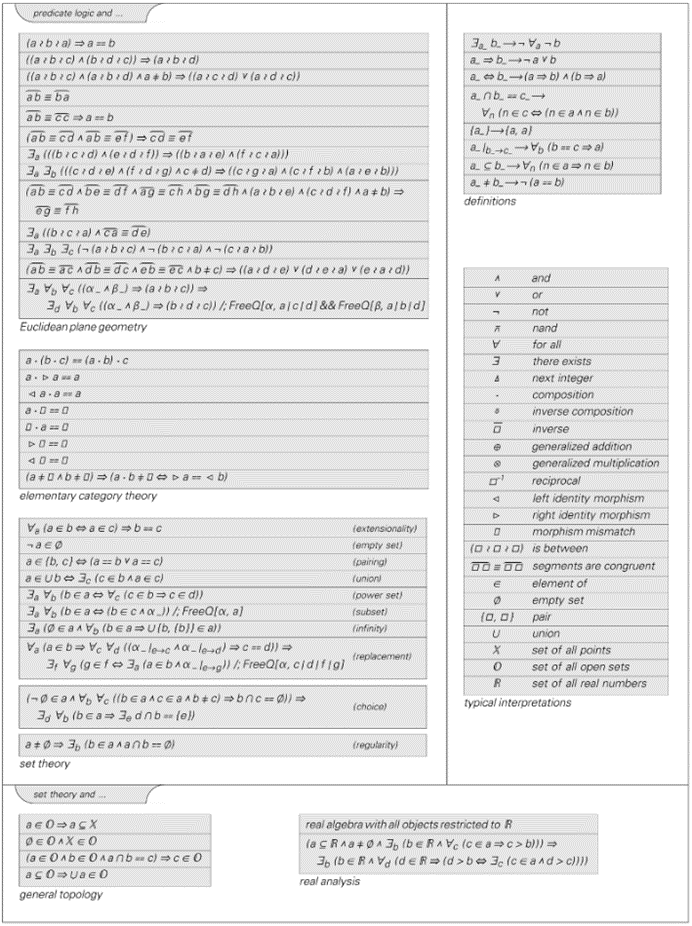

>传统数学的进一步公理系统。典型的解释对于应用来说是相关的，但对于定理的正式推导则不是。集合论中列出的最后两个公理通常被认为是可选的。

(p 774)

我们在本节中将看到的是，虽然其中一些现象对应于数学的已知特征（如哥德尔定理），但许多现象从未被成功识别。

但数学中涉及哪些基本过程呢？

自古以来，数学几乎就将自己定义为寻找定理并给出证明的过程。在数学的任何特定分支中，证明都是基于前一页[773, 774]中那样的公理的一系列步骤。

下面的图片给出了在基础逻辑中这是如何工作的一个简单例子。右上角是公理，它们指定了逻辑表达式之间的某些基本等价关系。然后，通过按照特定顺序应用这些公理，就可以形成逻辑表达式之间的等价关系(p⊼q)≡(q⊼p)的证明。

>基于第773页中简化的逻辑公理集，对定理 (p ⊼ q) ≡ (q ⊼ p) 的证明。符号 ⊼ 代表与非（Nand），有时也称为谢弗竖线（Sheffer stroke）。这里给出的公理并没有直接说明与非（Nand）是否是可交换的（即 (p ⊼ q) ≡ (q ⊼ p)）。但证明表明，这实际上是从这些公理中得出的。请注意，该证明采用了实际数学和 Mathematica 中常见的直接结构替换项的方法，而不是传统上在典型形式化数学逻辑中讨论的基于逻辑蕴含的方法。

(p 775)

在大多数数学类型中，都有各种各样的额外细节，特别是关于如何确定一个或多个先前表达式中的哪些部分实际上在证明的每个步骤中被使用。但就像我们研究自然系统一样，人们可以尝试使用一个简单的理想化模型来捕捉可能发生的本质特征。

因此，例如，人们可以想象通过一系列简单元素（如黑色和白色方块）来表示证明中的一个步骤。然后，人们可以将系统的公理视为定义从这些元素的一个序列到另一个序列的可能转换——就像我们在第5章中讨论的多路系统中的规则一样。

下面的图片展示了在这种设置下定理证明的工作原理。每个定理都定义了字符串之间的连接，而证明定理则包括找到一系列与公理相关联的转换，这些转换将一个字符串引导到另一个字符串。

但就像第5章中的多路系统一样，人们也可以考虑一个明确的演化过程，从特定的字符串开始，然后在每个连续步骤中应用所有可能的转换，以便最终构建出字符串之间的整个连接网络，如下面的图片所示。

>数学证明的简单理想化。左边的规则实际上对应于指定黑白元素字符串之间有效转换的公理。上面的证明则展示了如何使用这些公理将一个字符串（比如 ）转换为另一个字符串（比如 ）。通常，一个特定的定理可以有多种不同的证明方法；在这里，每种情况下显示的都是最短可能证明的例子。所示的系统是第497页讨论的一般替换系统的一个例子。请注意，第五个定理 -> 实际上作为第二个定理 -> 中的一个引理出现。

(p 776)

从某种意义上说，这样的网络可以被视为代表了整个数学领域，这个领域可以从人们所使用的任何一组公理中推导出来——每个字符串之间的连接对应一个定理，而每个可能的路径都通向一个证明。

但是，像下面这样的网络真的能反映数学的实际应用吗？因为显然，数学每个传统领域的常规公理都比下面使用的任何多路系统规则都要复杂得多。

但就像本书中的许多其他情况一样，即使底层规则非常简单的系统似乎也已经能够捕捉到数学的许多基本特征。

在数学中，一个显而易见的现象是证明可能很难完成。人们可能会首先假设，任何易于陈述的定理也会易于证明。但经验表明，这远非正确。事实上，有各种众所周知的例子——如费马大定理和四色定理——这些定理易于陈述，但似乎需要极长的证明。

>应用与对面页面相同的变换——但以所有可能的方式，对应于代表可以从公理中推导出的所有可能定理的多路系统的演化。使用这里使用的公理，每个步骤中字符串的总数大约以1.7的系数增长；在最后几步中，分别有237和973个字符串。

(p 777)

>三个多路系统示例，展示了长证明的类似情况。在每个例子中，最终都会生成一个由单个白色元素组成的字符串——但这分别需要12、28和34步。第一个多路系统实际上最终会生成所有字符串（因为它会产生引理 -> 和 -> ，所以至少会如此）——并且实际上，长度大于2的字符串最多在2n+7步后出现。第二个多路系统只生成黑色在白色之前的n+1个字符串——所有这些字符串在最多7n步后出现。第三个多路系统生成了一个复杂的字符串集合；长度可达8的字符串数量分别为1、2、4、8、14、22、34、45。所有生成的字符串都有偶数个黑色元素。

(p 778)

那么多路系统中是否存在类似的情况呢？事实证明，这种情况经常存在，即使一个字符串可能很短，但达到它可能需要很多步骤。

如果多路系统的规则总是增加字符串的长度，那么任何给定的字符串在生成前只能在有限数量的步骤后出现，这是不可避免的。但如果规则既能增加也能减少字符串的长度，那么情况就完全不同了，就像对面页面上的图片所示。而且人们经常会发现，即使是很短的字符串也需要相当多的步骤才能生成。

但是所有这些步骤真的都是必要的吗？还是只是因为我们使用的规则在某种程度上效率低下，而其他规则能更快地生成短字符串？

当然，我们可以采用任何多路系统的规则，并添加转换来立即生成特定的短字符串。但关键问题是，就像我在这本书中讨论过的许多其他系统一样，我怀疑存在许多多路系统，它们在计算上是不可约的——因此，无法简化它们的演化过程，也无法用一般的方法来快速生成它们的短字符串。

我相信，在数学几乎每个领域中，本质上都存在相同的现象。就像在多路系统中一样，人们总是可以添加公理来更容易地证明特定的定理。但我怀疑，最终几乎总是存在计算上的不可约性，这使得只有长证明才能证明的短定理的出现变得不可避免。

在上一节中，我们了解到计算上的不可约性往往会使无限问题变得无法判定。例如，在一个多路系统的演化过程中，一个特定的字符串是否会被生成——无论等待多长时间——在一般情况下是无法判定的。同样地，在一个具有特定公理的数学系统中，一个特定结果是否存在任何证明——无论其长度如何——也可能是无法判定的。

(p 779)

那么，这意味着什么呢？

当尝试应用传统的逻辑观念时，尤其是真和假的概念时，最引人注目的影响可能会出现。

按照我设定的方式，人们可以通过从一个代表“真”的表达式开始，然后使用公理系统的规则（就像对面页面上的图片所示），来找到在特定公理系统中可以证明为真的所有陈述。

在一个多路系统中，可以想象将“真”与由单个黑色元素组成的字符串相对应。这意味着像下面这样的网络中的每个字符串都应该对应于在所使用的公理系统中可以证明为真的一个陈述。

但这真的合理吗？在传统逻辑中，总是存在一个否定运算，它可以将任何真实的陈述变为虚假的陈述，反之亦然。在一个多路系统中，否定可能起作用的一种方式是简单地反转字符串中元素的颜色。但这会导致下面第一张图片中出现的问题。

这张图片意味着，无论是 还是它的否定 ，都可以被证明为真命题。但这是不正确的。因此，这意味着在使用这个设置时，底层的公理系统是不一致的。那么对面页面上的其他多路系统呢？至少从图片中可以看到的字符串来看，并没有出现不一致的情况。但是更长的字符串呢？对于给出的特定规则，很容易证明从未出现过不一致的情况。但一般来说，这是不可能的，因为在给定字符串出现之后，例如，该特定字符串的否定是否会出现可能是无法判定的。

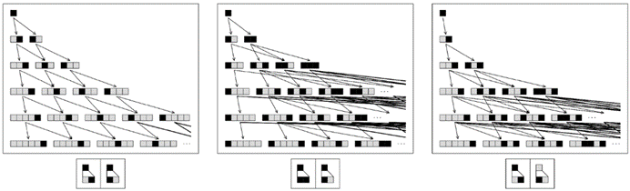

>从代表“真”的单个黑色元素开始的多路系统。所有出现的字符串都可以被视为根据多路系统规则所代表的公理为真的陈述。我们可以将否定视为交换黑白两色的操作。这意味着第一个多路系统代表了一个不一致的公理系统，因为在第2步中， 和它的否定 都出现了。其他两个多路系统是一致的，因此它们永远不会同时生成一个字符串及其否定。然而，第三个系统是不完整的，因为它例如永远不会生成 或其否定 。但第二个系统既完整又一致：它生成所有以 开头的字符串，但不会生成任何以 开头的字符串。

(p 780)

那么在实际数学中通常使用的公理系统又如何呢？第773页和第774页上的公理系统似乎都没有不一致性。这意味着可以证明为真的陈述集合永远不会与可以证明为假的陈述集合重叠。

但是，我们期望为真或为假的每一个可能的陈述最终都能被证明为真或为假吗？

>使用第775页上的逻辑公理系统可以证明为真的陈述网络。在使用Nand运算符⊼建立逻辑时，p ⊼ (p ⊼ p)是True的最简单表示。每条箭头表示通过应用一个公理建立的等价关系。在每一行中，只给出以前未出现过的陈述。陈述按最简单到最复杂的顺序排序。请注意，至少有几行没有出现一些相当简单的陈述。连续行上的陈述总数增长速度快于指数增长；前几行的数量是1、6、91、2180、76138。如果继续下去，网络最终将包括逻辑的所有可能的真陈述（重言式）（另见第818页）。第808页上的其他简单的逻辑公理系统也会产生与所示网络类似的网络。

(p 781)

20世纪初，人们普遍认为在所有合理的数学公理系统中都会出现这种情况。因为当时看来，数学的力量似乎没有极限，可以证明的定理也没有尽头。

但这一切在1931年都发生了改变，当时哥德尔定理表明，至少在包含标准算术的任何有限指定的公理系统中，必然存在无法使用公理系统的规则证明为真或为假的陈述。

这对当时关于数学基础的现有观念产生了巨大的冲击。事实上，直到今天，哥德尔定理仍被广泛认为是一个令人惊讶且相当神秘的结果。

但本书中的发现终于开始让这一结果看起来几乎是不可避免且显而易见的。事实证明，在某种程度上，它可以被视为计算等价性这一非常普遍的原则的又一个后果。

那么多路系统中的哥德尔定理的类似物是什么呢？根据第780页的设置，我们可以问一个特定的多路系统是否是完整的，即对于每一个可能的字符串，该系统最终都能生成该字符串或其否定。

我们可以看到，第三个多路系统实际上是不完整的，因为按照其规则，我们永远无法生成 或其否定 。但是，如果我们通过添加更多的变换（对应于更多的公理）来扩展规则呢？我们最终是否总能使系统变得完整？

如果我们不够小心，就会生成太多的字符串，并且不可避免地出现不一致性，即一个字符串及其否定同时出现，就像对面页面上的第二张图片那样。但是，至少如果我们只需要担心有限数量的步骤，那么总是有可能设置出一个既完整又一致的系统，就像对面页面上的第三张图片那样。

事实上，在对面页面上显示的特定情况下，找到使系统始终完整且一致的规则是相当直接的。但是，要知道如何做到这一点，需要系统的行为在某种意义上足够简单，以便我们可以预见其所有方面。

(p 782)

然而，如果一个系统是计算不可约的，那么这必然是不可能的。因为在任何一点上，系统实际上总能够做出人们没有预料到的事情。这意味着，一般来说，人们无法构建出一个有限的公理集合，保证能够导致最终的完整性和一致性。

事实上，结果表明，一旦某个特定字符串是否可达的问题变得不可判定，那么必然存在不完整性或不一致性。因为说这样一个问题是不可判定的，就是说它通常不能通过任何保证完成的程序来回答。

但是，如果有一个完整且一致的系统，那么很容易就能得出这样的程序：只需运行系统，直到找到正在查找的字符串或其否定。系统的完整性保证了总会达到其中一个，而其一致性则意味着达到其中一个就意味着永远不会达到另一个。

因此，如果多路系统的演化是计算不可约的——即关于其最终行为的问题是不可判定的——那么该系统就不能同时是完整和一致的。如果假设系统是一致的，那么必然存在既无法到达该字符串也无法到达其否定的字符串——这对应于从给定的一组公理中无法证明为真或为假的陈述必须存在的事实。

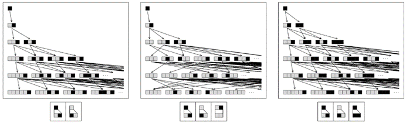

>向多路系统的规则中添加变换的效果。第一个多路系统是不完整的，因为在某些字符串上，它既不会生成该字符串也不会生成其否定。第二个多路系统产生了更多的字符串——但引入了不一致性，因为它可以同时生成 和其否定 。然而，第三个多路系统既完整又一致：对于每个字符串，它最终都会生成该字符串或其否定。

(p 783)

但要如何确定这种不完备性会在某个特定系统中实际发生呢？

实现这一目标的基本方法是证明该系统具有普遍性。

但对于像公理系统这样的东西来说，普遍性究竟意味着什么呢？实际上，这意味着关于任何其他普遍系统的行为的任何问题，都可以被编码为该公理系统中的一个陈述——如果通过观察其他普遍系统的演化过程，在有限步数内能够确定问题的答案，那么也必然能够通过在公理系统中给出有限长度的证明来确定答案。

那么，数学中有哪些公理系统是普遍的呢？

基本逻辑不是，因为至少在原则上，人们总是可以通过有限——尽管可能是指数级长的——过程来尝试该系统中所有可能的变量真值组合，从而确定任何陈述的真实性。

纯谓词逻辑本质上也是如此，它只是形式地添加了“对于所有”和“存在”的构造。但是，一旦人们还加入了一个具有多个参数的抽象函数或关系，就得到了普遍性。

实际上，哥德尔定理的基础结果是标准的基本整数算术公理支持普遍性。

集合论和其他几个标准公理系统都可以很容易地用来复制算术，因此也是普遍的。群论和其他代数系统（如环论）也是如此。

如果对所使用的公理施加足够的约束，最终可以防止普遍性——事实上，这在交换群论中就是这样，在773页和774页上的实代数和几何的简化版本中也是如此。

但是，在目前数学研究中实际使用的公理系统中，每一个都被证明是普遍的。

从第773页我们可以看出，其中许多公理系统都可以用相当简单的方式来阐述。在过去，人们可能很难相信如此简单的系统能够是普遍的，从而在某种意义上能够模拟任何系统。

(p 784)

但根据本书中的发现，这似乎几乎是不可避免的。事实上，计算等价原理意味着，除了某些很低的阈值之外，几乎可以预期任何公理系统都应该是普遍的。

那么，在算术的情况下，普遍性是如何实际运作的呢？

下一页的图示展示了一种方法。这个想法是建立一个算术陈述，如果从一个给定的初始条件开始，元胞自动机的演化使得某个细胞在给定步骤时呈现给定颜色，则该陈述可以被证明为真；如果不满足这个条件，则该陈述可以被证明为假。

通过改变这个算术陈述中的数字，人们实际上可以采样元胞自动机演化的不同方面。由于元胞自动机是普遍的，比如规则110，这意味着算术的公理可以支持普遍性。

这种普遍性进而暗示了哥德尔定理，并表明一定存在关于算术的陈述，其真实性或错误性无法从其正常公理中证明。

那么，这样的陈述有哪些例子呢？

哥德尔定理的原始证明是基于考虑特定的自引用陈述“这个陈述是不可证明的”。

起初，这样的陈述似乎并不明显可以作为一个算术陈述来设置。但如果可以，那么人们可以看到，正如该陈述所说，它立即得出——它无法被证明，否则就会出现矛盾。

事实上，哥德尔定理原始证明中的主要技术难题在于通过做相当于建立算术普遍性的工作来证明——该陈述确实可以有意义地被编码为纯算术的陈述。

但是，至少在使用原始编码的情况下，如果用第773页的符号表示出来，这个陈述将会是天文数字般的长度。从这个结果中，人们可能会想象到，不可证明性在数学的实际情况中永远不会相关。

但是，人们真的需要一个如此复杂的陈述来使其从算术的公理中不可证明吗？

(p 785)

>算术的普遍性可以通过一个整数方程来阐述，该方程的解实际上模拟了第11章中规则110的通用元胞自动机。这个方程有许多解，但它们都满足一个约束条件，即变量x1到x4必须编码规则110的可能初始条件和演化历史。如果为x1、x2和x3填入固定值，那么x4就只有一个可能的值——对应于从由x2的数字序列给出的宽度x1的初始条件开始，规则110经过x3步的演化历史。一般来说，任何关于规则110可能行为的陈述都可以编码为关于该方程解的算术陈述。因此，例如，如果为x1、x2和x4填入值，但不为x3填入值，那么该方程对于任何x3都没有解的陈述就对应于规则110在任何步数之后都无法表现出某种行为的陈述。但是，规则110的普遍性意味着这样的陈述在一般情况下是不可判定的。因此，由此可以推断出，在至少某些情况下，算术的公理永远不能用来给出该陈述是否为真的有限证明。这里所展示的构造可以视为对算术中存在不可证明陈述的哥德尔定理的一个简单证明。请注意，所显示的方程是一个所谓的指数丢番图方程，其中一些变量出现在指数中。以显著增加复杂性和使用例如2154个变量为代价，是可以避免这种情况的。然而，上面的方程已经可以被视为捕捉到了证明丢番图方程和希尔伯特第十问题一般不可解性所需本质的内容。

(p 786)

在过去的七十年里，人们构造了一些更简单的例子——大多数都没有明显的自指特征。

但是，这些例子通常都涉及相当复杂和深奥的数学结构——最常见的是以某种方式建立起来的增长极快的函数。但至少在原则上，应该可以根据特定整数方程无解这样的陈述来构造例子。

如果像x²=y³+12这样的整数方程在特定的有限整数范围内有确定的解，比如x=47, y=13，那么这一事实当然可以用算术公理来证明。因为只需要进行有限的计算来验证解，而这个计算本身总是可以被视为一种证明。

但如果方程没有解呢？为了明确地检验这一点，人们必须查看无限多个可能的整数。但关键是，即使如此，仍然有可能存在一个有限的数学证明，证明这些整数中没有一个会成立。

有时证明可能是直接的——比如基于证明方程的一边总是奇数，而另一边总是偶数。在其他情况下，证明可能更困难——比如基于确定解的最大可能大小，然后检查该大小范围内的所有整数。

关键是，一般来说，实际上可能根本无法用正常的算术公理给出证明。

那么人们如何才能看出这一点呢？

对面页上的图片显示，人们可以构造一个整数方程，其解代表像元胞自动机这样的系统的行为。这个方程的工作原理是，例如方程中的一个变量给出演化的步数，而另一个变量给出经过这么多步后的结果。

因此，利用这种设置，人们可以指定步数，然后求解该步数后的结果。但是，如果人们指定了一个结果，然后尝试找到发生这个结果时的步数解，又会怎么样呢？

如果人们通常能够判断这样的解是否存在，那就意味着人们总是可以回答诸如在给定的元胞自动机的演化中，某个特定的模式是否会消亡这样的问题。但是，从上一节的讨论中我们知道，这通常是不可判定的。

(p 787)

因此，可以推断出，某个具有特定一般形式的给定整数方程是否有解，必须是不可判定的。而根据上面的论证，这反过来又意味着，必然存在特定的整数方程，它们没有解，但这一事实无法从正常的算术公理中证明。

那么，这最终是如何发生的呢？

在某种程度上，这是无穷大参与的结果。因为至少在像算术这样的通用系统中，任何完全有限的问题最终都可以通过有限的过程来回答。

但是，对于那些以某种方式询问，比如关于可能整数的无限数量的问题，又该如何处理呢？最终，拥有一种有限的方式来处理这类问题，通常是建立典型的数学公理系统的首要理由。

因为关键在于，公理系统不是直接处理像整数这样的对象，而是给出关于它们的陈述的抽象操作规则。在这样的陈述中，人们可以通过像s这样的符号来引用，比如说，整数的无限集合。

尤其是过去一个世纪，数学上有很多成功都可以归功于这种基本的方法。但哥德尔定理揭示了一个显著的事实，那就是无论做什么，总会存在这种方法最终会失败的情况。事实证明，这背后的原因是计算不可约简性的现象。

因为像1/0或整数的总数这样的简单无穷大量可以很容易地用有限的方式总结——通常只是使用像∞和ℵ0这样的符号——但并不是所有无穷过程都能这样。特别是，如果一个无穷过程是计算不可约简的，那么一般来说，就不可能对它所做的事情进行任何有用的有限总结——因为这样的总结的存在会意味着计算可约简性。

(p 788)

因此，这意味着不可避免地会有一些问题，这些问题基于在普通计算系统中运行的公理的有限证明，通常永远无法回答。

实际上，对于整数方程，只要有一个通用的方程，就通常会存在特定的实例，其中解的缺失——或者至少是某种特定类型的解的缺失——永远无法根据正常的算术公理来证明。

几十年来，人们一直知道存在通用的整数方程。但实际上构造的例子相当复杂——就像第786页上的那个——最简单的也涉及9个变量和大量的项。

然而，根据本书中的发现，我确信存在更简单的例子——因此，事实上，最终会有相当简单的整数方程，其解的缺失永远无法根据正常的算术公理来证明。

如果你只是开始看一系列整数方程——就像下一页那样——那么在最简单的情况下，通常很容易判断一个特定的方程是否有解。但这很快就会变得非常困难。因为通常没有明显的规律可以判断哪些方程最终有解，哪些没有。即使方程有解，涉及的整数也可能相当大。例如，x² - 61y² + 1 = 0 的最小解是 x = 1766319049, y = 226153980，而 x³ + y³ = z³ + 2 的最小解是 x = 1214928, y = 3480205, z = 3528875。

像 ax + by + cz = d 这样对任何变量只有线性依赖的整数方程，即使在古代也已经被人们很好地理解了。两个变量的二次方程，如 x² = ay² + b，在19世纪前就已经被理解。但即使是像 x² = ay³ + b 这样的方程，直到20世纪80年代才被人们正确理解。而对于具有更高次幂或更多变量的方程，是否存在解的问题很快就变成了数论中未解决的问题。

几个世纪以来，人们一直知道，关于整数方程和数论其他方面的问题很容易表述，但似乎很难回答。但在实践中，人们几乎普遍认为，随着数学的不断发展，这些问题最终都可以得到解答。

(p 789)

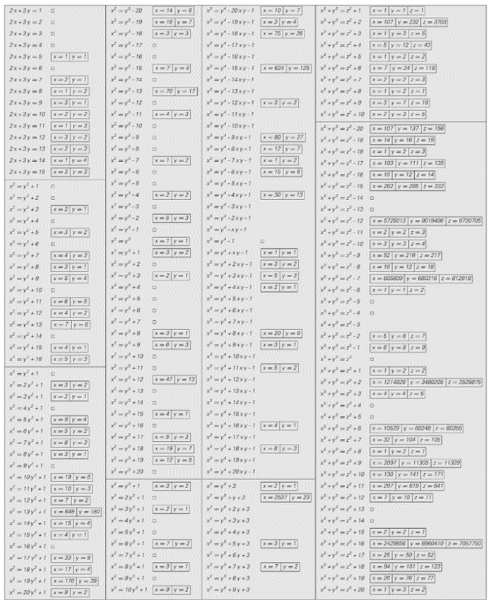

>各种整数（或所谓的丢番图）方程序列的最小解。星号（*）表示可以证明不存在解。空白表示我只知道十亿以下的范围内不存在解。第一列中某些方程的解法在古代就已为人所知；到19世纪时，所有这些方程都已被解决。直到20世纪80年代，才发展出解决第二列中所谓椭圆曲线方程的实用方法。对于给出的其他大多数方程，目前尚未发现一般性的解法——而且其中一些类别可能实际上表现出不可判定性。

(p 790)

然而，哥德尔定理表明，总会存在一些问题，这些问题永远无法使用正常的算术公理来回答。但已知的几个明确例子都极其复杂，这使得它们看起来在某种程度上与数学的实际应用无关。

但根据本书中的发现，现在可以相当肯定地说，也存在非常简单的例子。我强烈怀疑，在数论中当前所有被认真研究的未解决问题中，相当一部分最终会证明是无法使用正常的算术公理来回答的。

如果你看看数论领域的最新研究，其中大部分往往基于相当复杂的方法，这些方法显然不仅仅依赖于正常的算术公理。例如，已经发展起来的费马大定理的复杂证明，可能至少部分使用了来自集合论等领域的公理，这些公理超出了正常的算术公理。

但只要一个人保持在，比如说，第773页和第774页上提到的数学的标准公理系统之内，并且实际上并没有最终只是隐式地将自己想要证明的任何结果作为公理添加进去，我强烈怀疑，一个人最终能够走出的范围，将不会超过仅仅使用正常的算术公理所能达到的范围。

实际上，根据计算等价性原则，我坚信，一般来说，不可判定性和不可证明性几乎会在任何数学领域的实践中出现，只要人们超越了那些总是容易回答的问题的水平。

但如果真是这样，那么数学为什么还能发展到现在的程度呢？当然，数学中确实存在长期未解决的问题。我怀疑其中许多最终会涉及到不可判定性和不可证明性。但问题仍然是，为什么这些现象在日常数学工作中并没有更加明显。

(p 791)

在某种程度上，我怀疑原因是相当直接的：就像人类探究的其他大多数领域一样，数学倾向于将自己定义为只关注那些其方法能够成功解决的问题。而由于数学中传统使用的主要方法一直是围绕证明进行的，所以不可避免地会避免涉及不可判定性和不可证明性的问题。

但这真的正确吗？因为至少在过去的一个世纪里，数学一直给人留下了这样的印象，即它关注的是尽可能任意和一般的问题。

但我在这本书中所做的工作得出的一个重要结论是，这远非正确。事实上，例如，传统数学在大多数情况下甚至从未考虑过我在这本书中讨论的大多数类型的系统，尽管它们都是基于一些非常简单的规则。

那么，这是如何发生的呢？我认为，主要的一点是，数学所研究的系统和所提出的问题，远比人们通常所认识到的，更加是其历史的产物。

事实上，特别是与我在这本书中所做的相比，当今所实践的绝大多数数学似乎仍然紧密地遵循着早在巴比伦时代就已经存在的算术和几何的传统。

数学应该尝试解决任意或一般系统的观念是相当新的。因为直到一个多世纪以前，数学基本上还只是被视为对日常经验的某些方面——主要是与数字和空间相关的方面——提供精确表述的学科。

但在19世纪，随着非欧几里得几何、四元数、群论和超限数等的发展，人们开始认为数学这门学科可以成功地应用于任何抽象系统，无论这些系统多么任意或一般。

然而，如果人们看看数学中实际研究的系统类型，就会发现它们至今仍远非尽可能一般。事实上，在某种程度上，其中大多数都可以被视为是通过一种相当特定的方法得出的，即从一组已知定理出发，然后尝试找到逐渐更一般的系统，同时仍然能够满足这些定理。

(p 792)

鉴于这种方法，通常被认为是有趣的问题，都是围绕着一个系统被设立来满足的定理展开的——这使得这些问题本身很可能通过类似的定理来解决，而不会遇到不可判定性或不可证明性的问题。

但是，如果人们看看其他类型的系统呢？

我在这本书中做的主要事情之一，从某种意义上说，是引入了一种新的泛化方法，即考虑具有简单但完全任意规则的系统——这些系统并没有设定任何关于它们应该满足哪些定理的约束。

但是，如果有了这样的系统，人们如何决定要问哪些有趣的问题呢？在没有已知定理的指导的情况下，最明显的做法就是直接观察系统的行为——也许是通过绘制某种图形。

如果这样做的话，我发现人们通常会立即被引导去提出那些会遇到不可判定性等现象的问题。事实上，从我的实验来看，几乎只要人们摆脱了数学传统的束缚，不可判定性和不可证明性就会变得相当普遍。

如下一页的图所示，建立一个处理像元胞自动机这样的系统的逻辑陈述的公理系统是相当直接的。在这样的公理系统中，人们可以问一些问题，比如元胞自动机在任何步数后是否会以特定的方式运行。

但正如我们在前一节中所看到的，这类问题一般是不可判定的。这意味着，在所使用的任何公理系统中，都不可避免地会有这样的情况，即无法给出特定答案的证明。

因此，人们可能会得出这样的结论：一旦人们开始研究元胞自动机或数学中通常不研究的其他类型的系统，使用传统的数学方法取得进展就会变得实际上不可能。

(p 793)

但事实上，自从我第一次强调元胞自动机的重要性以来的大约十五年里，人们对它们进行了各种各样的传统数学研究。那么，这是如何可能的呢？

基本点是，这些工作往往集中在元胞自动机的特定方面，这些方面足够简单，可以避免不可判定性和不可证明性。通常，这可以通过两种方式之一来实现：要么只考虑已观察到或构建为简单的非常具体的情况，要么以非常一般的方式看待事物，以至于只有相当简单的属性才能存活下来。

例如，当向我展示第55页上显示的256个基本元胞自动机模式时，根据我的经验，数学家们有两种常见的反应：要么挑选出具有简单重复或嵌套形式的特定模式，要么进行概括，不看单个模式，而是看从所有可能的初始条件演化而来的总体属性。

而关于那些涉及看似复杂的模式结构的问题，几乎一致的反应是，这样的问题在某种程度上不可能具有任何真正的数学意义。

不言而喻，在本书所提出的新科学框架中，这类问题现在具有极大的兴趣。我的结果表明，如果人们想要研究自然界中出现的许多重要现象，那么也必然会遇到这些问题。但对传统数学来说，它们似乎既无趣又陌生。

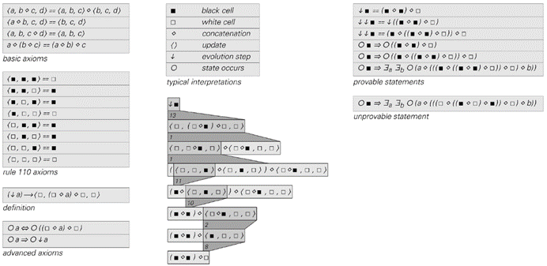

>一个关于规则110元胞自动机的陈述的公理系统。右边顶部的陈述断言，从一个单独的黑色细胞开始，经过一步演化后的结果具有特定的形式。该陈述的证明显示在左侧。顶部区块中的所有陈述都可以从公理系统中证明为真。然而，右下角的那个陈述既不能被证明为真，也不能被证明为假。所给出的公理是使用谓词逻辑建立的。

(p 794)

正如我上面所说，在某种程度上，如果某个领域的方法能够对这些问题说出一些有用的东西，那么这些问题才会被认为是有趣的，这并不奇怪。但我认为，这最终解释了为什么历史上数学中很少出现不可判定性或不可证明性的迹象。因为任何出现这种现象的问题通常都不适合基于证明的数学标准方法，因此，这些问题不可避免地被视为不属于数学应关注的有趣范畴。

那么，如何为实际中的数学建立一个合理的理想化模型呢？第一步——正如我之前在本节中讨论的那样——是不要过多地考虑可能由数学描述的系统，而是要考虑数学内部与证明相关的过程。

证明最终必须基于公理系统，人们可能会想象，随着时间的推移，数学会涵盖广泛的公理系统。但事实上，在数学的历史发展中，它通常只坚持使用少数这样的系统——每个系统基本上都对应于某个可识别的数学领域，而大多数系统都已在第773页和第774页中给出。

那么，如果我们查看所有可能的简单公理系统——就像我们之前在这本书中查看所有可能的简单元胞自动机一样，会发生什么呢？我们所看到的在多大程度上捕捉了数学的特征？将公理系统理想化为多路系统后，下一页的图片展示了一些结果。

在某些情况下，可以证明的定理总数是有限的。但通常，随着证明长度的增加，定理的数量会迅速增加——在大多数情况下，最终可以证明无限多的定理。根据数学经验，在这种情况下，一个显而易见的问题是系统在多大程度上是一致的、完备的，或者两者都是。

(p 795)

但是，为了以有意义的方式提出这样的问题，我们需要否定的概念。一般来说，否定只是一种操作，它接受一个字符串并产生另一个字符串，如果再次应用它，就会返回原始字符串。在本节的前面部分，我们讨论了否定只是简单地反转字符串中每个元素颜色的情况。作为这种情况的推广，我们可以考虑否定可以是任何保持字符串长度不变的操作。

在这种情况下，系统是否完备且一致的标准很简单，那就是如果从代表“真”的字符串开始，最终将生成给定长度的可能字符串中的正好一半。

>图表显示了在不同多路系统中前15步进化过程中哪些可能的字符串被生成。可以将生成的每个字符串视为从多路系统规则所表示的公理集中推导出的定理。点表示给定字符串首次出现的步骤——并指示该字符串所代表的定理的最短证明。在大多数情况下，许多字符串从未产生——因此有许多可能的陈述仅仅不是由给定的公理得出的。例如，在第一个示例中，只产生了包含黑色元素的字符串。

(p 796)

因为如果生成的字符串超过一半，那么某个字符串及其否定都必须出现，这意味着系统必须是不一致的。同样地，如果生成的字符串少于一半，那么必须存在某个字符串，其本身及其否定都从未出现过，这意味着系统是不完备的。

下一页的图表显示了在不同多路系统中，给定长度的字符串在连续步骤中被生成的分数。一般来说，可能需要等待任意大数量的步骤才能确定给定的字符串是否会被生成。但在实践中，仅仅几步之后，人们似乎就已经能够合理地预测出最终将被生成的字符串的总体分数。

人们观察到的是，存在一个广泛的分布：从能够生成的字符串非常少的情况（对应于非常不完备的公理系统）到能够生成所有或几乎所有字符串的情况（对应于非常不一致的公理系统）。

那么，普通数学的典型公理系统在这个分布中的哪个位置呢？可以推测，没有一个是不一致的。而少数几个——如基本逻辑和实数代数——既完备又一致，因此它们实际上位于分布的正中间。但大多数都已知是不完备的。正如我们上面所讨论的，只要存在普遍性，这种情况就不可避免。

但它们究竟有多么不完备呢？答案似乎是，通常它们并不是非常不完备。因为如果人们查看数学中广泛使用的公理系统，它们几乎都足够完备，能够证明相当大一部分陈述为真或为假。

那么为什么会这样呢？我怀疑这与数学中人们通常想要的公理系统有关，这些系统可以被视为以某种方式描述特定类型的对象，并且人们期望能够对这些对象建立各种确定的陈述。

当然，如果回顾数学的历史，人们会发现大多数基本的公理系统都是通过从对象（如有限整数或有限集合）出发，然后尝试找到能够捕捉这些对象相关属性的公理集合而得出的。

(p 797)

>多路系统生成不同比例的可能字符串，实际上范围从高度不完备到高度不一致。这些图表显示了每个多路系统在前25步演化过程中，给定长度的字符串的生成比例。如果给定长度的字符串少于一半被生成，这意味着必然存在一些字符串，既无法证明其真实性，也无法证明其否定，这表示系统是不完备的。但如果生成的字符串超过一半，那么必然存在既可以证明字符串本身也可以证明其否定的情况，这表示系统是不一致的。然而，规则（f）到（i）生成的字符串恰好是给定长度字符串的一半，因此可以被认为是既完备又一致的。

(p 798)

但有一个特点是，通常得到的公理系统在某种意义上比最初的对象更为一般化。这也是为什么例如人们常常可以使用公理系统来外推到无限情况。但这也意味着，不清楚公理系统是否真的只描述了人们想要的对象，还是例如它也描述了各种其他完全不同的对象。

人们可以将公理系统（比如第773页和第774页上列出的那些）视为给出了一组约束，任何它所描述的对象都必须满足这些约束。但正如我们在第5章中看到的，通常可以通过几种完全不同的方式来满足单一的约束集。

当这种情况发生在公理系统中时，它通常表明系统是不完备的。因为只要存在两个对象都满足约束条件，但对于某个陈述，一个对象使该陈述为真，另一个对象使该陈述为假，那么立即可以推断出，至少这个陈述无法一致地被证明为真或为假，因此公理系统必须是不完备的。

人们可能会想，如果向公理系统中添加更多的公理，最终是否只能有一种类型的对象能够满足系统的约束条件。但正如我们之前所看到的，一旦存在普遍性，通常就无法避免不完备性。如果公理系统是不完备的，那么必然存在不同类型的对象能够满足其约束条件。因为对于任何无法从公理中证明的陈述，都必须存在使该陈述为真和为假的不同对象。

如果公理系统远非完备——以至于大部分陈述都无法被证明为真或为假——那么通常会有许多不同类型的对象，这些对象很容易指定，并且都满足系统的约束条件，但它们之间却存在相当明显的差异属性。但如果公理系统接近完备——以至于绝大多数陈述都可以被证明为真或为假——那么几乎不可避免地是，满足其约束条件的不同类型的对象之间只能在模糊的方式上存在差异。

这大概就是第773页上算术的标准公理系统的情况。最初，这个公理系统旨在描述普通的整数。但哥德尔定理表明它是不完备的，因此必须存在不止一种类型的对象能够满足其约束条件。然而，它相当接近完备——因为正如我们之前所看到的，在找到无法证明为真或为假的陈述之前，人们必须经历至少数百万个陈述。

(p 799)

这意味着，尽管除了普通整数外，还有其他对象满足算术的标准公理，但这些对象相当模糊——事实上，模糊到至今还没有任何一个能够以某种明确的方式被实际构造出来。这就是为什么将算术的标准公理系统基本上仅视为关于普通整数是合理的。

但是，如果不用这个标准公理系统，而是使用第773页上的简化公理系统——其中通常的归纳公理已被削弱——那么情况就大不相同了。仍然存在不完备性，但现在更为严重，因为即使是像x+y=y+x和x+0=x这样简单的陈述，也无法从公理中证明为真或为假。虽然普通整数仍然满足所有约束条件，但系统的不完备性足以让各种具有完全不同属性的其他对象也满足这些条件。因此，这意味着从某种意义上说，该系统不再涉及任何非常明确的数学对象——这大概就是它在实际数学中不被使用的原因。

在此之际，或许应该提一下，数学中许多著名的公理系统在其原始形式下也远远不是完备的。例如，第773页上给出的群论的公理系统就是一个例子。但关键在于，这个公理系统从某种意义上说只是群理论的起点。因为它只产生了那些对所有群都抽象成立的定理。

然而，在实际进行群论研究时，人们通常会添加一些公理，这些公理实际上会限制人们只处理某个特定的群，而不是所有可能的群。这样做的结果是，人们通常又会得到一个至少是接近完备的公理系统。

在基础算术中，以及通常在群论等领域中，人们设想的底层对象在某种程度上可以以相当具体的方式被操作和理解。但在集合论这样的领域中，情况就不那么真实了。然而，即使在这种情况下，历史上也有人试图通过某种方式获得一个描述特定类型对象的公理系统。但现在，这主要是通过逐步添加公理来实现的，以便更接近拥有一个完整的系统——尽管对于真正期望描述的底层对象只有相当模糊的概念。

(p 800)

在研究基本证明过程时，多向系统似乎作为最小化的理想化模型表现良好。但如果想要研究可能描述特定对象的公理系统，那么使用我所说的操作符系统似乎更为方便。事实上，第775页上使用的逻辑版本——以及第773页和第774页上的许多公理系统——基本上已经设置为操作符系统。

操作符系统的基本思想是使用诸如(p ∘ q) ∘ ((q ∘ r) ∘ p)这样的表达式，这些表达式是通过某个操作符∘构建的，然后考虑这些表达式之间可能存在的等价关系。如果有一个操作符，其值由某个有限表给出，那么确定表达式是否等价总是很直接的。就像下一页顶部的图片所示，所需要做的就是为每个变量的所有可能值评估表达式，然后查看得到的结果模式是否相同。

通过这种方式，人们可以很容易地判断，例如，第一个显示的操作符是幂等的，即p ∘ p  p，而前两个操作符都是结合的，即(p ∘ q) ∘ r  p ∘ (q ∘ r)，除了第三个操作符外，所有操作符都是可交换的，即p ∘ q  q ∘ p。原则上，人们可以使用这种方法来建立具有任何特定形式操作符的任何表达式之间存在的任何等价关系。

但是，传统数学证明方法所依赖的关键思想是，人们还应该能够通过仅使用公理系统的规则，以纯粹符号的形式操作表达式，而无需做任何像填充变量的显式值这样的事情，来推导出这样的结果。

这种方法的一个优点是，它至少原则上允许人们处理那些不是基于有限表的操作符——这在数学的许多领域中都可以找到。但是，即使是对于由有限表给出的操作符，也往往很难找到能够成功再现特定操作符所有结果的公理系统。

(p 801)

按照我的设置方式，任何公理系统本身都只是一组等价结果的集合。因此，问题是哪些等价结果需要包含在公理系统中，以便仅从这些结果中推导出所有其他等价结果。

一般来说，这可能是无法确定的——因为即使是一个单一的证明也可能需要无限长的时间。但在某些情况下，事实证明有可能确定一组特定的公理可以成功地生成给定操作符的所有等价结果——实际上，对面页面顶部的图片展示了下面图片中四个操作符中每一个的示例。

因此，如果两个表达式是等价的，那么通过应用适当公理系统的规则，必须有可能从一个表达式得到另一个表达式——事实上，第775页的图片展示了如何为上述第四个公理系统实现这一点的示例。但是，如果从上述任何一个公理系统中移除一个单一的公理，那么它们就不再起作用，例如，它们无法建立由已移除的公理所阐述的等价结果。

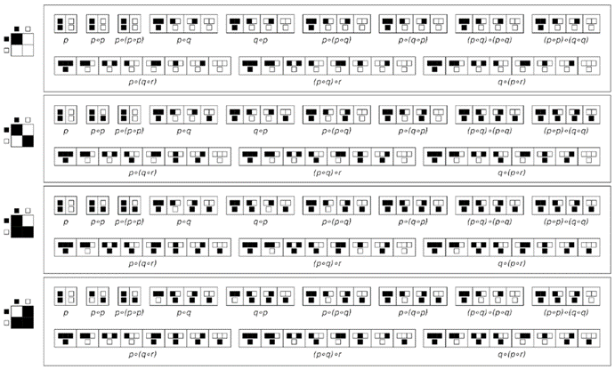

>通过使用各种形式的操作符获得的表达式值。对于每个表达式，都显示了变量值的每种可能组合的值序列。当这个值序列相同时，两个表达式是等价的。将黑白解释为True和False，这里显示的操作符形式分别对应于And、Equal、Implies和Nand。（每个操作符的第一个参数显示在左侧；第二个在顶部。）生成的值数组可以被认为是类似于真值表的。

(p 802)

一般来说，可以将操作符系统的公理视为对操作符形式的约束。如果要重现特定形式所持有的所有等价关系，那么这些约束实际上必须是这样的，即迫使该形式出现。

那么，对于任意的公理系统，一般情况下会发生什么？它们是否通常迫使操作符具有特定形式，或者不是？

接下来两页（第804页、第805页）的图片展示了各种不同的公理系统允许哪些形式的操作符。在每种情况下，连续的结果块给出了在变量具有更多可能值的情况下允许的形式。

图片底部附近标有星号的是本页底部的四个公理系统。对于这些系统，每个都只允许有限数量的形式——所有这些形式最终都等价于对面页面上显示的单个形式。

但是，其他公理系统呢？每个公理系统都必须允许至少某种形式的操作符。但是，接下来两页（第804页、第805页）的图片显示的是，绝大多数公理系统实际上都允许具有各种不同形式的操作符。

这意味着这些公理系统从某种意义上说并不是真正关于任何特定形式的操作符的。因此，它们在某种程度上也远非完整——因为它们只能证明它们允许的各种操作符中每一个都成立的等价结果。

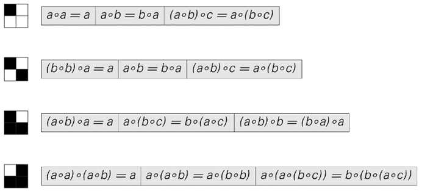

>这些公理系统可用于推导出涉及具有所示形式操作符的表达式之间的所有等价关系。每个公理都可以在两个方向上应用——如第775页的图片所示，每个变量代表任何表达式，就像Mathematica模式中的那样。所示的操作符是And、Equal、Implies和Nand。它们分别产生连接、等价、蕴含和完全命题或句子演算（普通逻辑）。

(p 803)

(p 804)

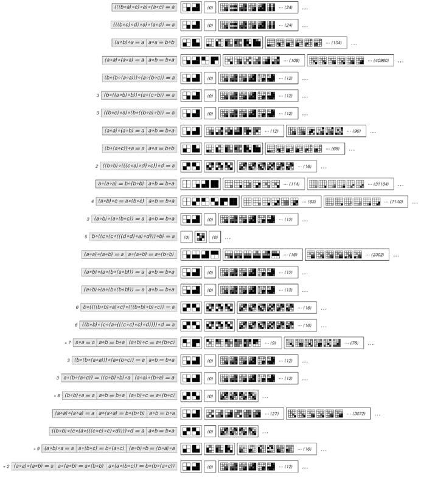

>满足一系列不同公理系统约束的二元操作符形式。在每种情况下，连续的结果块显示了操作符的允许形式，分别有2、3和4个可能的元素。请注意，在3个和4个元素的情况下，仅显示了在元素标签互换下不等价的形式。数学中著名系统的表示包括：(1) 半群理论，(2) 交换群理论，(3) 基本逻辑，(4) 交换半群理论，(5) squag理论（一种非标准或较少见的数学结构，可能指的是某种具有特定性质的代数结构，但这里可能是一个笔误或特定上下文中的术语），(6) 群论，(7) 连接演算，(8) 等价演算，和(9) 蕴含演算。在每种情况下，所显示的操作符形式都对应于具有2、3和4个可能元素的半群、交换群、逻辑系统（布尔代数）等。所显示的操作符形式可以视为给出了乘法表。在模型论中，这些形式通常被称为公理系统的模型。

(p 805)

因此，如果有人列出所有可能的公理系统——比如说从最简单的开始——那么在这样的列表中，人们应该期望在哪里看到与传统数学领域相对应的公理系统呢？

大多数教科书中给出的公理系统都足够复杂，以至于它们不会在早期出现。事实上，唯一的直接例外是为半群所知的公理系统{(a ∘ b) ∘ c  a ∘ (b ∘ c)}，讽刺的是，半群通常被视为相当高级的数学对象。

但是，传统数学领域的公理系统真的需要多复杂呢？通常看起来，它们可以比它们的教科书形式简单得多。因此，例如，如第773页所示，如果将∘操作符解释为除法，{a ∘ (b ∘ (c ∘ (a ∘ b)))  c}是交换群理论的公理系统，而{a ∘ ((((a ∘ a) ∘ b) ∘ c) ∘ (((a ∘ a) ∘ a) ∘ c))  b}是一般群理论的公理系统。

那么基本逻辑呢？人们需要多复杂的公理系统呢？教科书中对逻辑的讨论大多使用至少与第773页上第一个一样复杂的公理系统。这样的公理系统不仅涉及几个公理——它们通常还涉及三个独立的操作符：And（∧）、Or（∨）和Not（¬）。

但这真的是制定逻辑的唯一方式吗？

如下图所示，有16种不同的可能操作符，它们接受两个参数并允许两个值，比如真和假。在这些操作符中，And、Or和Not在日常语言和大多数数学中无疑是最常用的。

>两个参数的逻辑函数及其常用名称。黑色代表True（真）；白色代表False（假）。在传统逻辑中，And（与）、Or（或）、Not（非）和Implies（蕴含）被广泛使用。Equal（当且仅当）在更数学化的环境中较为常见，而Xor（异或）在离散数学中广泛应用。Nand（与非）和Nor（或非）主要用于电路设计以及少数逻辑的基础研究中。在图中，每个函数的第一个参数出现在左侧，第二个参数出现在上方。这些函数按照第53页元胞自动机规则的2-邻域类似物进行编号。

(p 806)

但至少在形式层面上，逻辑可以简单地被视为一种函数理论，该函数在给定的具有两个可能值的变量下取两个可能值。正如我们在第616页所讨论的，任何这样的函数都可以表示为And、Or和Not的组合。

但下面的表格表明，一旦超越语言和数学的熟悉传统，还有其他操作符同样可以作为原始操作符使用。事实上，早在1900年之前，人们就已经知道Nand和Nor本身就可以工作——这一事实我已经在第617页和第775页中使用过。

>可用于构建逻辑的函数。在每种情况下，都给出了再现两个参数的16个逻辑函数中的每一个所需的基本函数的最小组合。从这些组合中，可以获得具有任意数量参数的任何可能的逻辑函数。大多数逻辑教科书都使用And（与）、Or（或）和Not（非）作为基本函数。Nand（与非）和Nor（或非）是唯一可以独立工作的基本函数。

(p 807)

这意味着逻辑可以仅使用一个操作符来建立。但这样的公理系统需要多复杂呢？下图中的第一个方框显示，从第773页的标准教科书And、Or、Not公理系统直接转换而来的系统非常复杂。

但方框（b）和（c）表明，已知的逻辑替代公理系统可以减少公理系统的大小约十倍。通过对得到的公理进行进一步的处理，可以实现进一步的减少，从而得到下方和方框（d）中给出的公理系统。

但还能进一步简化吗？例如，如果仅仅尝试搜索可行的简单公理系统，会发生什么？

人们可以通过查看哪些操作符满足其约束条件来测试潜在的公理系统，如第805页所示。第一个非平凡的公理系统，它甚至允许Nand操作符，是{(a ∘ a) ∘ (a ∘ a)  a}。而对于只允许涉及两个可能值的Nand和Nor操作符的第一个公理系统，它是{((b ∘ b) ∘ a) ∘ (a ∘ b)  a}。

但如果现在考虑涉及三个可能值的操作符，那么结果是这个公理系统允许一些不等同于Nand和Nor的操作符。这意味着它无法成功再现逻辑的所有结果。然而，如果任何只有一个公理的公理系统要能够做到这一点，那么该公理必须采用{…  a}的形式。

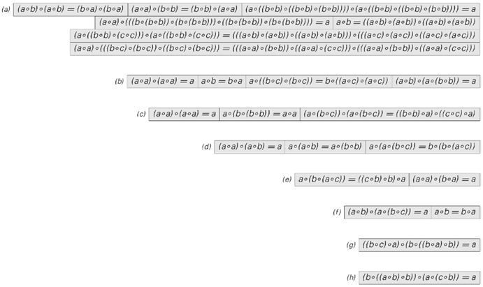

>用Nand（⊼）表示的基本逻辑（命题演算）的公理系统。这些公理系统中出现的操作符数量分别为94、17、17、13、9、6、6、6。系统（a）是将第773页中给出的标准教科书中的And、Or和Not公理系统翻译成Nand的形式。（b）基于第773页的Robbins公理。（c）是Sheffer公理系统。（e）是Meredith公理系统。其他公理系统是为本书找到的。（d）在第775页中使用过。（g）和（h）尽可能简短。给出的每个公理系统对Nor和Nand同样适用。

(p 808)

在最多包含6个Nand和2个变量的情况下，16,896个可能的这种公理系统中没有一个能够适用于3值操作符。但在6个Nand和3个变量的情况下，288,684个可能的公理系统中有296个可以适用于3值操作符，有100个可以适用于4值操作符。

而在这些非平凡等价的25个公理系统中，接下来两页（第810页、第811页）将证明，本页对面给出的（g）和（h）两个公理系统实际上可以作为逻辑的公理系统——这表明，与普通教科书中的公理系统相比，最终可以实现相当显著的简化。

如果考虑形式为{…  a, a ∘ b  b ∘ a}的公理系统，那么第一个仅允许使用2值操作符的Nand和Nor的公理系统是{(a ∘ a) ∘ (a ∘ a)  a, a ∘ b  b ∘ a}。但是，一旦总共使用了6个Nand，人们就会突然发现，在3个变量的3402种可能性中，有32个与上面情况（f）等价的公理系统最终都可以一直工作到至少4值操作符。事实上，情况（f）确实可以作为逻辑的公理系统。

这意味着，如果人们只是简单地浏览一下最简单的几千个公理系统，就很可能会找到一个能代表逻辑的公理系统。

在人类智力史上，逻辑具有重大意义。但如果仅从公理系统的角度来看，逻辑的公理系统有什么特别之处吗？我猜想，除非人们询问非常具体的细节，否则真的没有——而标准逻辑最终之所以独特，只是因为它所处的历史背景。

逻辑的一个特点是，它的公理有效地描述了一个特定的操作符。但事实证明，还有各种各样的其他公理也能做到这一点。我在第803页给出了三个例子，并在下面的图中给出了另外两个非常简单的例子。事实上，给定许多形式的操作符，总是可以找到描述它的公理系统。

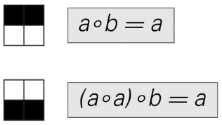

>这些公理系统再现了所示操作符形式的等价结果。

(p 809)

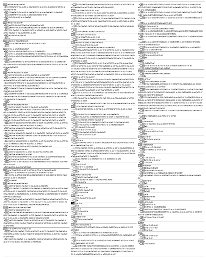

(p 810)

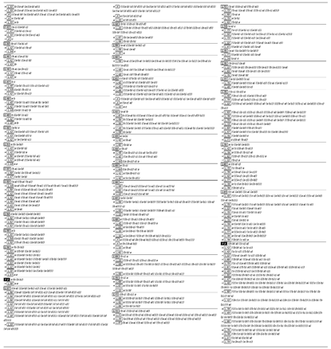

>证明第808页上作为示例（g）给出的公理系统{((b ∘ c) ∘ a) ∘ (b ∘ ((b ∘ a) ∘ b))  a}可以复现Sheffer公理系统（c），因此是一个完整的逻辑公理系统。证明过程包括取原始公理[A]并使用它来建立一系列引理[Ln]，最终可以从这些引理中证明三个Sheffer公理[Tn]。在证明的每个部分中，每一行都可以像第775页那样，通过应用指示的公理或引理从前一行获得。为了更紧凑地打印表达式，已省略了显式的⊼操作符。所示的证明总共需要343步，并且涉及中间表达式，其中包含多达128个Nand。很有可能这个证明可以大大缩短。请注意，任何证明都可以在不使用引理的情况下重新表述，但通常会更长。

(p 811)

那么定理的模式呢？当观察这些模式时，逻辑是否以某种方式脱颖而出？下面的图片显示了第805页中哪些可能的简单等价定理在系统中成立。

与第805页进行比较，可以看出，通常公理系统的约束条件允许的操作符形式越多，在该公理系统中成立的等价结果就越少。

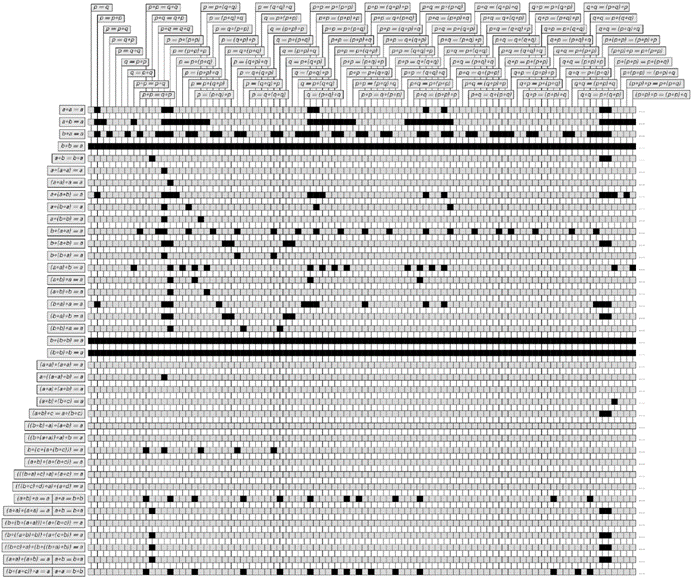

>基于第805页上的简单公理系统可以证明的定理。黑色方块表示特定定理在特定公理系统中成立。一般来说，给定定理是否成立的问题是不可判定的，但这里给出的特定定理恰好足够简单，以至于可以通过一些努力来确定其结果。

(p 812)

那么，如果基本上只允许一种形式的操作符会发生什么？下面的图片显示了第806页上16种形式的结果，从中可以看出，逻辑产生的定理最少。

>第806页上每种形式操作符都成立的定理。Nand和Nor产生的定理数量最少。

(p 813)

但是，如果考虑例如具有两个以上可能值的变量的逻辑类似物，下面的图片显示人们会立即得到定理更少的系统。

那么证明呢？在普通逻辑的情况下，这些证明有什么特别之处吗？

在第803页上的公理系统中，证明的典型长度似乎从一个系统增加到下一个系统，以至于它们最终成为最长的，这对应于逻辑。

但是，如果为逻辑选择一个不同的公理系统——比如第808页上的其他系统之一——那么特定证明的长度通常会发生变化。但是，由于人们总是可以先从证明新公理开始，所以变化只能是固定的量。而且事实证明，即使在第808页上给出的最简单的公理系统（f）似乎也允许对至少大多数短定理进行相当短的证明。

但是，当人们试图证明越来越长的定理时，似乎无论使用哪种逻辑公理系统，证明的长度都可以像指数一样快速增长。然而，一个关键点是，对于给定长度的定理，所需证明的长度总是有一个确定的上限。但是，这也不是逻辑独有的。事实上，事实证明，对于任何最终基本上只允许单一形式操作符的公理系统（如第803页上的那些），情况都必然如此。

那么其他公理系统呢？

第805页和第812页上最简单的公理系统似乎总是产生相对较短的证明。但是，当人们查看稍微复杂一点的公理系统时，除了最简单的结果之外，其他结果的证明可能会变得更长——这实际上往往很难判断给定结果是否真的可以证明。

>允许不同数量真值的逻辑类似物中的定理。像p ≡ ¬¬p这样的陈述在多于2个真值的情况下一般不成立。

(p 814)

从某种意义上说，这只是我们在本节前面部分在多向系统中看到的同一基本现象的又一个例子，这种现象在实际数学中似乎也经常发生：即使一个定理的表述很短，它的证明也可以任意长。

我相信这最终反映了计算等价性原则。因为该原则表明，大多数其后果并非显而易见的简单公理系统往往具有普遍性。这意味着它们将表现出计算不可约性和不可判定性——并且无法对任何给定结果的证明所需长度设置一般上限。

如前所述，传统数学中大多数常见的公理系统都已知是普遍的——基本逻辑是少数例外之一。但人们可能会认为，为了实现其普遍性，这些公理系统必须特别设置各种具体的复杂特征。

然而，从本书的结果——体现在计算等价性原则中——我们现在知道情况并非如此，事实上，即使在像第805页上那样的非常简单的公理系统中，普遍性也应该相当普遍。

事实上，虽然操作符系统和多向系统有许多表面上的差异，但我怀疑在普遍性方面，它们的工作方式非常相似。因此，在任何理想化的情况下，人们都不必走得太远就能找到表现出普遍性的公理系统——就像传统数学中的大多数公理系统一样。

但是，一旦人们达到了一个普遍性的公理系统，为什么从某种意义上说还需要进一步深入呢？毕竟，公理系统具有普遍性的含义是，通过建立适当的编码，原则上必须有可能使该公理系统再现任何其他可能的公理系统。

但关键在于，数学中通常使用的编码类型在实践中相当有限。例如，虽然将几何问题重新表述为代数问题是常见的做法，但这几乎总是通过在正在描述的对象之间建立直接翻译来实现的——通常只是通过重新命名用于操作它们的运算符来实现。

(p 815)

然而，要充分利用普遍性，就必须不仅考虑对象之间的翻译，还要考虑完整证明之间的翻译。如果这样做，确实完全有可能，比如说，通过编程算术来再现集合论中的任何证明。事实上，人们所需要做的只是将集合论的公理编码成像第786页的算术方程系统那样的东西。

但值得注意的是，除了哥德尔定理之外，这些类型的编码在数学中通常并不使用。因此，这意味着即使存在普遍性，数学的现实理想化也必须仍然区分不同的公理系统。

那么，最终是什么决定了哪些公理系统实际上被用于数学中呢？在本节中，我讨论了一些标准。但最终，历史似乎是唯一真正的决定因素。因为对于像第773页和第774页那样的公理系统中可以挑选出的几乎任何一般属性，通常似乎都有各种各样的操作符和多向系统——包括一些相当简单的系统——具有完全相同的属性。

因此，这导致了一个结论，即传统上用于数学的特定公理系统从某种意义上来说并没有什么根本上的特殊性——事实上，还有各种各样的其他公理系统，它们完全可以作为实际上是新数学领域的基础——与传统领域一样丰富，但没有历史联系。

那么现有的数学领域呢？正如我在本节前面提到的，我坚信即使在这些领域中，也存在着对实际研究内容隐含的基本限制。而最常发生的情况是，只有某些类型的问题或陈述被认为具有真正的数学意义。

对面页面的图片展示了这一点的相当直接的版本。它按顺序列出了基本逻辑中的大量定理，仅突出显示了那些被典型的逻辑教科书认为足够有趣而给予明确名称的定理。

(p 816)

>这些基本逻辑的定理按照复杂性递增的顺序写出。那些在典型教科书中被认为足够有趣而被命名的定理已被突出显示。这些定理分别是：(1)，(2) 与和或的幂等性（重言式定律），(3)，(4) 与和或的交换性，(5) 双重否定定律，(6)，(7) 吸收（冗余）定律，(8) 不矛盾定律（假的定义），(9) 排中律（真的定义），(10) 德摩根定律，(11)，(12) 与和或的结合性，(13)，(14) 分配定律。除了第二个分配定律外，事实证明，被突出的定理正是那些不能从列表中前面的定理推导出来的定理。分配定律在列表中的位置是2813和2814；要从前面的定理推导出第二个分配定律需要很长的证明过程。

(p 817)

但是是什么决定了这些定理会是这样的呢？有人可能会认为这纯粹是历史问题。但实际上，查看定理列表时，似乎有趣的定理在某种意义上都是那些显示出最少不必要复杂性的定理。

事实上，如果人们从列表的开头开始，就会发现大多数定理都可以很容易地从列表中较早的较简单的定理推导出来。但也有一些不能推导出来，因此它们在某种意义上提供了真正新信息的最简单表述。令人惊讶的是，我发现这些定理几乎完全与上一页上传统上被认为是有趣的、被突出的定理相同。

那么，如果在其他情况下应用相同的标准会发生什么呢？下面的图片展示了基于与非门的上述逻辑表述的定理作为示例。

>以与非门为基础的逻辑定理。那些不能从列表中前面的定理推导出来的定理已被突出显示。最后一个被突出的定理在列表中是第539个。由于所显示的定理构成了一个完整的公理系统，可以从中推导出任何逻辑定理，因此后面没有定理会被突出显示。然而，最后一个被突出的定理是一个遵循公理但难以证明的示例。

(p 818)

现在没有特定的历史传统可以依赖。但标准似乎仍然与人类的判断相当吻合。就像在第817页的图片中一样，人们看到的是在列表的开始部分就有几个被认定为有趣的定理。但在这之后，人们需要走很远的路才能找到其他的。

那么，如果人们继续深入，最终会找到更多的吗？事实证明，根据我们使用的标准，人们不会。原因是仅仅这六个被突出的定理就已经构成了一个公理系统，从中可以最终推导出关于与非门的任何可能的定理。

事实上，每当人们处理可以从有限公理系统推导出的定理时，标准就意味着只有有限数量的定理应该被认为是有趣的——一旦在某种意义上获得了足够的定理，能够重现公理系统的某种表述，就结束了。

但这本质上就像是说，一旦知道了系统的规则，那么关于它的其他任何东西都不应该被认为是有趣的。然而，这本书的大部分内容正是关注于，即使知道了系统的规则，也可能出现的所有有趣的行为。

重点是，如果存在计算不可约性，那么从某种程度上说，关于系统行为的各种信息只能通过做大量不可约的计算工作才能从其规则中找到。在公理系统中，与此类似的是，有些定理只能通过某种方式在极长的证明过程中才能被推导出来。

因此，这表明一个定理之所以被认为是有趣的，不仅是因为它不能从更简单的定理中推导出来，还因为它除了通过一些长的证明之外，不能从更简单的定理中推导出来。事实上，在基本逻辑中，第817页上被认定为有趣的最后一个定理——或的分配性——就是一个原则上可以从前面的定理中推导出来，但只能通过一个看起来比其他相当大小的定理长得多的证明来推导的示例。

然而，在逻辑中，所有证明在最终效果上都是有限长度的。但在任何具有普遍性（因此具有不可判定性）的公理系统中，情况就不同了。如上所述，我怀疑实际上会经常出现各种只有极长证明的短定理。

(p 819)

毫无疑问，许多这样的定理在实践中证明起来都非常困难。但即使它们能被证明，它们会被认为是有趣的吗？当然，它们会提供本质上的新信息，但我强烈怀疑，在当前的数学实践中，它们很少会被认为是有趣的。

而最常被提及的原因是，它们似乎并不符合任何数学结果的通用框架，而只是看起来像孤立的随机数学事实。

在数学研究中，人们常用“困难”、“强大”、“惊人”和“深奥”等词汇来描述定理。但这些词汇到底意味着什么呢？如上所述，任何数学领域在某种程度上都可以被视为一个由陈述组成的巨大网络，其中连接对应着定理。我怀疑我们对定理的直观描述实际上只是我们对这个网络结构各种特征的感知的反映。

事实上，我怀疑，通过研究诸如给定定理如何容易地使人们从一个网络部分到达另一个网络部分等问题，我们可以将数学实践中许多直观的概念形式化——就像本书前面我们能够将复杂性和随机性等日常经验的概念形式化一样。

不同的数学领域可能具有特征上截然不同的网络。因此，例如，通常被视为更成功的纯数学领域可能具有更紧凑的网络，而那些似乎包含各种孤立事实的领域——如初等数论或特定元胞自动机理论——可能具有更稀疏、有更多分支的网络。

这些差异将反映在给定的证明中。例如，在更稀疏的网络中，某个定理的证明可能不包含许多可用于证明其他定理的部分。但在更紧凑的网络中，可能存在可用于一系列不同定理的中间定义和概念。

(p 820)

实际上，在极端情况下，甚至可能实现类似于在计算符号积分中所做的那样，并设置某种统一程序来找到基本上任何短定理的证明。

一般来说，当单个证明或不同证明之间存在足够的重复元素时，这表明存在计算可约性。然而，尽管这意味着每个被证明的定理实际上包含的新信息较少，但事实证明，在数学的大多数领域中，这些定理通常被认为是有趣的。

普遍性的存在意味着在某种程度上必然存在计算不可约性——因此必然存在无法通过任何简短程序达到的定理。但问题是，数学倾向于忽略这些定理，而只是专注于所有可能定理的网络中实际上有限的计算可约性区域。

但从某种意义上说，这与物理学中发生的情况并无不同，例如，传统上研究的现象大多只是那些表现出足够的计算可约性，从而可以通过传统理论物理学的分析方法进行分析的现象。

但在物理学中，人们只需观察自然界就能发现其他更复杂的现象，而数学中通常的方法却几乎不提供任何类似现象的线索。

然而，使用本书中基于明确实验的新方法，现在可以很清楚地看出，计算不可约性等现象出现在抽象数学系统中。

事实上，计算等价性原则意味着这样的现象几乎在每个方向上都应该近在咫尺：尽管数学因其普遍性而闻名，但它在过去却隐性地倾向于将自己定义为避免这些现象。

因此，这意味着在未来，当本书的思想和方法被成功吸收后，今天存在的数学领域将被视为实际上可能性的一个小而惊人的不典型样本。

