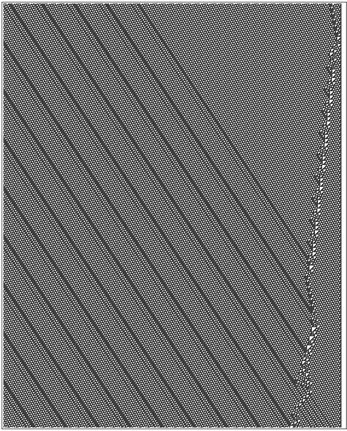

### 2.1  简单程序如何表现？

科学中的新方向往往是从确定的中心观察或者实验开始的。而我在本书中描述的科学关注的是简单程序的行为。

在每日和计算机的实验中，我们遇到的程序通常被设定为完成某项确切的任务。但是我在二十年前的关键想法——也是最终引导本书整个新科学的思想，却是要求仅仅选择一个简单程序而不是考虑其任务目的，这样的程序会是什么表现？

在过去支配理论科学的数学方法并没有能够帮助回答这个问题。但是一台计算机却可以直接通过实验来研究。你唯一需要做的只是设定程序，运行它然后观察。

任何程序在一定程度上都能被认为是由一套指定了每一步该做什么的详细规则组成的。这些规则有很多种可行方法——确实在本书的课程中我们只会学其中一小部分，但现在，我要先考虑其中特殊的一类，叫做元胞自动机，这是早在上世纪八十年代我研究的第一批简单程序。

（p23）

元胞自动机的一个重要特点是它们的行为能够很容易以可视化的形式呈现。下面的图展示了一个元胞自动机在十步中所做的。

一个元胞自动机可视化行为的代表，其中每一行元胞代表一步，在第一步，中间的元胞是黑的周围是白的，在之后连续的每一步，黑色的临近元胞都变成黑的。这个图片演示了一个简单的膨胀模式，均匀填充黑色。

元胞自动机由一行元胞组成，每一个元胞或是黑色或是白色，每一步都有一个明确的规则，其颜色由其左右的元胞前一步的颜色所决定。

比如该元胞自动机规则的详细说明——如下图所示——一个元胞在其左右邻有黑色的任何情况都会变为黑色。

上面元胞自动机的规则说明：上面的三个元胞给出了一个元胞近邻的所有可能的颜色组合，下面的一行指定每种情况的下一步中心元胞颜色。在第三章描述的编号方案中，这是元胞自动机规则254。

本页最上面的图从中间一个单独的黑色元胞开始，然后根据规则产生了一个简单的增长式黑色填充模式。但是稍微修改规则就会得到完全不同的模式。

作为第一个修改的例子，下一页的图中演示了在当临近的元胞都是白色时变白色（即使它本来是黑色）的规则下，会发生什么。它不再是产生一种填充黑色的模式，这个规则现在给出了一种黑白交替的模式，就像棋盘一样。

（p24）

这个模式当然很简单。我们可能会假设，至少我们考虑的这种元胞自动机中，选择任何的规则都会出现简单的模式，但是现在我们要迎来第一次惊喜了。

下面的图演示了一个类型和之前相同，但规则稍有不同的元胞自动机。这次的规则是当元胞左右近邻有一个为黑时变黑，当左右近邻全黑时变白。对这个规则来说是相当简单，但是这个图片所演示的其产生的模式似乎并不简单。

（p25）

如果把这个元胞自动机跑更多步，就像下面图片所示，一个相当复杂的模式出现了。但是有人可能会发现这个模式是有规律的。即使它很复杂，我们能从其中看到它是由许多嵌套的三角碎片组成，都有一样的形式。如图所示，每一个碎片本质上都是整个模式的一个复制品，其内部的小碎片也是同样的规律。

我们目前看到的三个元胞自动机都有高度的规律性：第一个是统一的模式，第二个是重复的模式，第三个复杂但依然是嵌套的模式。我们可能会假定规则类似我们遇到的三个一样的元胞自动机的行为都会很简单。

（p26）

但是事实告诉我们并非如此。

下面的图就举了一个例子。我们使用规则30，规则和之前类似，可以描述为：首先，查看每个元胞自己和右近邻，如果二者前一步都是白色，则将其新颜色改变为左近邻的颜色，否则，将颜色改为与左近邻相反。

这个图片演示了在从一个元胞开不断应用规则会发生的现象。所看到的现象令人瞩目，或许这是最令人吃惊的科学发现。不再是预期的简单规则，这个元胞自动机表现出的模式极度的不规律和复杂。

（p27）

但这种复杂性从何而来？我们的确没有在设定时将任何复杂性直接纳入系统。我们只是简单地构造了一个规则，从一个简单的初始条件黑色元胞开始。

而这图像说明，尽管如此依然产生了很强的复杂行为。事实上我们所看到的是第一个关于极度通用和基本的现象，是本书所阐述的新科学的核心。我们将一次次看到同样的情况：即使一个系统潜在的规则是简单的，即使系统从一个简单的初始条件开始，其显示的行为也可以是高度复杂的。我会认为这种基本现象是我们看到的大部分自然界复杂现象的成因。

接下来的几页会更进一步展示30号自动机的更多步数。我们可能会认为在上千步后它会变得简单，但这两页的图告诉我们这并没有发生。

然而，一些规律可以被发现。例如在左侧，有很明显的对角线。而且其中零散地出现了一些白色三角形等结构。在简单的潜在规则下，我们可能会期望得到更多规律，或许在两页后的图像看到的失败会归结于人类视觉的缺陷。

但其实用数学和统计学的方法也没多大差别。比如说，我们能看到在初始条件后的颜色序列，在几百万步后都没有重复，事实上我没有做出任何显示出其与真正随机有意义的偏差。

（p28）

其实在某种意义上，这种完美的随机有一种确定的简易性。尽管不太可能预测任何一步的颜色是什么，但我们依然知道黑色和白色的出现是均衡的。

对27页的30号元胞自动机数百步后的图像。这个模式依旧往左右膨胀，但是限于页面只能展示这些。图像左右的不对称是潜在的自动机规则不对称的直接后果。

（29）

30号元胞自动机五百步后的图像。一些规律很明显，特别是在左侧。但是即使这么多步后，依然没有整体的规律性——确实即使百万步后，这个模式的许多方面在数学和统计测试下都有相当好的随机性。这幅图演示了一共不到两百万个元胞。

（30）

但事实证明，元胞自动机的行为实际上更为复杂——甚至这种黑白均衡都很难预测。接下来几页的图像给出了相当戏剧性的例子。规则基本形式和之前相同，但这种规则——我称之为规则110——在除了前步自身及左右近邻颜色相同或是左近邻为黑色自身和右近邻为白色的情况外，新元胞都变为黑色，否则变白色。这个模式得到的规则呈现出一种明显的规律性和不规律性的混合。整个过程内，有一个七步重复的规则纹理，由一系列小三角形组成。从左边缘开始，每隔八十步有一条斜条纹。

但是在右侧，模式的规律就很少了。事实上，在最初一百步有一个区域看上去是基本随机的。但在第一页底部，这个区域就只有相当简单的重复结构的三个副本。

但从第二页顶部开始，左侧斜条纹的到来使得复杂行为再次发生。随着系统进程，产生了各种确定性区域的结构。

一些结构保持稳定，就像第一页底部，还有一些以稳定速度左行或右行。在它们自己的基础上，每一种结构都以一种相当简单的方式运作，但正如图所示，它们之间的交互会产生复杂的影响。

元胞自动机会使得结果几乎不可预测——即使是近似的。

所有的结构最终会互相毁灭，留下唯一规则的模式吗？或者说出现更多的结构，使得看上去完全随机？

一个既不是规律的也不是随机的元胞自动机。这幅图显示了从一个黑色元胞开始的前150步。注意这里的规则产生的模式向左膨胀而不向右。第三章中它被编号为110.

下面是一些更多步数的图像。每一页出示大约700步，模式继续向左膨胀，限于页面只展示了部分。长时间过去，右侧模式最终情况并不清楚。但在2780步后，相当简单的重复结构出现了。注意要生成这样的图需要对元胞应用约1200万次规则。

唯一回答这些问题的方法似乎就是运行元胞自动机尽可能多的步数，然后观察会发生什么。事实证明，在2870步后结果明了：一个结构存活了下来，这个结构与左边的周期性条纹相互作用，产生了重复240步的行为。

上面几页图应该彻底消除“简单程序只能产生简单行为”这种观念。而事实上，最奇怪的可能是在自动机简单的规则下，图像最终是如何产生如此小的轨迹的。

有人可能会想，元胞遵从同一个规则意味着后几页的元胞在做同样的事。但事实是，它们在做完全不同的事。比如说，一些元胞是规律的背景，而其他的是一些局部的结构。这说明即使有同样的规则，不同颜色的元胞序列组合会产生不同的行为。

如果只看原始的规则，就没有现实是方法来预见这些。但是进行合适的计算机实验能够轻易找出确实发生的——事实上这开始了一段与简单程序显著相关的新世界的探索。
