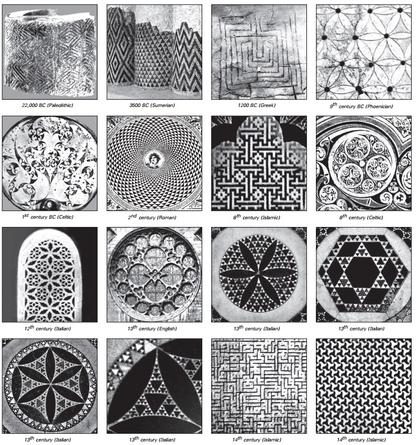

### 2.2  一个新直觉的需要

前面部分的图片坦率地演示了简单规则产生复杂行为的现象。最初这个可能很难理解，因为它违背了我们对正常工作方式的一些直觉。

（p39）

日常的经验让我们认为一个看起来复杂的事物一定是从复杂的方式构造的。比如说，当我们看见一个复杂的机械设备，我们通常都设想那个设备的建造计划也相应的复杂。

但是前几部分的结果展示了至少有时候这种设想是错误的。从我们看到的几个用简单方案构建的模式——就告诉我们只用一个黑色元胞开始，不断应用元胞自动机规则就行了。从这个方案产生的展示出相当量级的复杂性。

所以我们的一般直觉是错在哪里呢？最重要的一点似乎是因为来自建立事物和工程学的经验，这种情况下，人们会避免遇到前面那种复杂系统。

一般来说，我们会从我们想要的行为开始，然后试图构建起一个能够产生这个行为的系统。为了实现它，我们需要将自身限制到系统中从而理解和预测系统的行为——如果不能预测系统的行为，我们不能确定系统是否能做到我们想要的。

但和工程学不同，大自然的操作是没有这种约束的。所以没有什么能够阻止像上一节所展示的那样的情况。其实本书最重要的一个结论就是这样的系统在自然中是非常常见的。

但是因为我们通常对规则或整体行为的感知都是基于构建事物或工程学的，我们没有任何像上一节那样的系统的直觉。

所以有什么日常经验能够对我们这方面的系统中的现象一点启发吗？或许最接近的就是实用计算的特点。

我们知道计算机能够胜任复杂任务。在基本的硬件上，一台经典计算机能够执行数十种简单逻辑、运算和其他指令。其实在某种程度上，执行大量的指令我们能够得到一系列类似我们看到的元胞自动机那样的复杂行为。

（p40）

但是有一点重要的不同。单个的机器指令交由计算机执行会非常简单，但是指令串所组成的程序就会冗长复杂。确实就像一些工程领域那样，想要开发出能让计算机做复杂任务的程序，就需要让程序有相应的复杂度。

像元胞自动机这样的系统，其规则就有些类似计算机指令，其初始条件就类似计算机程序。而我们之前认识到的元胞自动机不仅仅是潜在的规则简单，其初始条件也可以非常简单——仅仅由一个黑色元胞组成——但其行为却能产生高度的复杂。

因此虽然实用计算给出了我们前面看到的一部分内容，但整个现象更大更强。从某种意义上来说，令人困惑的是这似乎涉及从一无所有中获得什么。

对我们设置的元胞自动机是用简单的方法来描述，但当我们运行它们，然后以一个复杂的模式结束时，它们复杂到似乎完全不符合任何简单的描述。

我们可能会希望能够唤起一种现有的直觉来理解这种基本现象，但是事实是似乎没有这样一种经验提供给我们。所以我们别无选择，只能去尝试开发出一种新的直觉。

唯一合理的一种方法就是让我们自身经历大量的例子。我们现在看了一小部分例子，都是元胞自动机。但是在接下来几个章节我们将会看到更多例子，不止是元胞自动机还有其他一系列的系统。通过吸收这些例子，我们最终能够开发出一种新的直觉，这种直觉会明显和不可避免地发现我曾发现的基本现象。

（p41）

为什么之前没有这些发现？

这一章的主要结果——基于简单规则的程序产生复杂结果——似乎相当基础，我们可能会假定它很久之前就被发现了。但事实并非如此，而理解其原因是有用的。

在科学史中，新技术是推动基础科学发展是相当普遍的。因此，就像望远镜的技术引导现代天文学，显微镜的技术对现代生物学，现在，同样的，计算机技术引导了本书中描述的新科学。

确实，本章和随后几章都可以当做一系列简单的用计算机实验的描述。但是为什么这种简单的实验从前没有过？

其中一个原因就是，它们并非现有科学或者数学领域里的主流。但更重要的一个原因是，传统科学的标准直觉没理由认为这些实验的结果会很有趣。

确实，如果认为它们是值得的，许多实验在计算机发明之前就会存在了。尽管会有些沉闷，但手工模拟元胞自动机的行为还是可能的。事实上，做这样的事需要绝对的不复杂的思想，比如从数学中或者其他领域中的思想，只需要做的就是理解如何重复应用简单规则。

请看下页关于装饰艺术的历史例子，似乎没理由认为元胞自动机在几世纪甚至几千年前就不存在了。说不定有一天巴比伦使用27页30号元胞自动机规则的手工艺作品就会被发掘。但我很怀疑，如果真的有类似27页那样的古代发现，那么科学就会走完全不同的一条道路。

（p42）

历史上一些装饰艺术的例子。我们可以看到重复的模式和一些嵌套模式，但是本章中讨论的更多复杂的模式并没有被使用过。注意倒数第二张图不是抽象设计，而是高度程式化的阿拉伯文字书写的。

（p43）

即使早在远古遗物中，都可以看见简单抽象的能描述自然系统的规则。但是目前为止，我们能说出的几种规则只与标准的几何和算法相关。使用这几种规则，只能得到相当简单的行为——充分解释了宇宙中的一些规律，但是不能捕获自然中其他的细节。

或许正因如此，人们通常认为自然界许多事物是人类无法理解的。但是在17世纪末开始的微积分的胜利，推翻了这种信条。在微积分的基础上，我们成功运用了人类的思想创造抽象规则，并使用它们来重现自然界各种现象。但是发现的特定的规则在特点的数学方程上会工作得十分复杂。从这些规则的复杂程度来看，开始产生一种隐含的信息：即在几乎没有任何重要的情况下，更简单的规则在重新产生自然系统的行为方面是有用的。

在18世纪19世纪间，有许多基于数学方程应用规则分析物理现象的成功。在20世纪早期，物理学在数学方程式上取得了惊人的成就，人们几乎普遍认为，自然界的每一个方面都可以用这样的方程式来解释。

不用多说，肯定会有现象不符合这个方法，但是人们总普遍认为只要采取必要的计算方法就能找到合适的数学方程的解释。

从二十世纪40年代开始，电子计算机的发展极大地扩展了能够计算的范围。但令人失望的是，大多数计算没有产生新的见解。结果许多人认为——甚至许多今天都这么认为——计算机不能对基础科学做出贡献。

（p44）

但关键是，计算机不仅仅局限于计算数学方程。确实，我们在这章看到的发现是一个人只需要研究简单程序就能做出来的。

回想起来，用简单程序作为自然系统的模型这个想法并没有在早期出现，或许这是一种讽刺。类似元胞自动机的系统能够在早期计算机上比数学方程更容易运行。但问题是计算机时间是很昂贵的商品，所以与其冒险实验不如建立数学模型。

但在70年代，情况发生了改变，计算机时间变得很容易获取。这使得我在1981年开始了元胞自动机的实验。

我所提及的这些，原则上并不一定要用计算机进行元胞自动机的研究。但是从事实来说，很难想象在现代有人有耐心去手画那些元胞自动机的图形。手画27页的图形大概需要一个小时，而画29页的图大概要好几周。

即使是在早期的计算机，这些图片的数据都可以在几秒钟和几分钟生成。但关键是不太可能通过只看一两幅图就发现基本现象。事实上，对我来说，确实在相当数量的不同元胞自动机上进行了大规模的计算机实验。

如果对一个特定现象的基本特征有了清晰的想法，就可以进行实验获得更多细节。但以我的经验来看，唯一发现尚未发现的现象的方法是进行有体系和一般性的实验，然后不带任何先见地去观测其结果。虽然只需要几个相当基础的计算机技术来就能制作单个元胞自动机图像，但要进行大尺度系统实验还需花更多时间。

（p45）

事实上，我对元胞自动机的许多发现都是使用了更加好的计算机技术。

举一个例子，当我在高分辨率的显示器上看到大量元胞自动机产生的图像时，我发现看在第六章开始描述的随机初始条件的分类方案。同样的，当我在一台早期的并行计算机上设定了大量的仿真时，我发现了规则30的随机性（27页）。最近几年，我发现了大量新的现象，这是由于能很容易在Mathematcia中进行大量实验。

毋庸置疑的是，我在本章中的发现在80年代之前没有提出的一个主要原因就是计算机技术不足以达到各类探索性实验的要求。

但除了实施实验的可行性之外，还必须有一种想法：这种实验一开始就是值得做的。计算机技术在这里又扮演了一个关键角色。因为在使用计算机的过程中我开发出了许多必要的直觉。

一个简单例子：一个人可以想象一个元胞自动机一样的系统由离散的元胞组成，但想象不到它能产生现实的自然的形状。但对计算机的显示器很了解就不会这样了。一个计算机显示器，就像一个元胞自动机，由一系列规律的离散元胞或者像素组成。实际经验告诉我们它会显示出逼真的图像，即使元胞数量相当少。

一个更加明显的例子：一个人可能会想到，简单结构的元胞自动机程序会产生可以预见的行为。但是实际经验中我们知道很难预测一个简单程序会发生什么。事实上，这就是为什么程序中的bug这么常见。如果都能立即预见到程序将要做什么，很容易就可以让程序不包含任何bug。

（p46）

如找出程序bug这样的难度并没有和传统科学中的问题有太多相似。或许这样的结果是，即使计算机已经使用了数十年，基本上还是没有这种实践计算的直觉在基础科学中找到出路。但是在1981年，我用了好几年深入实践计算和基础科学，我因此找到了独特的方式将实践计算应用于基础科学。

尽管如此，我对元胞自动机的发现依旧包含了一定的幸运成分。我在19页提及的，我真正第一次的元胞自动机实验演示出很简单的行为，只是因为做更多的实验在技术上是很简单的我才坚持下去。

即使在我第一次看到元胞自动机的复杂图像后，我花去了更多的几年来发现本章中给出的整个例子范围，才意识到了元胞自动机的复杂性会怎样产生。

其中一个我花去这么长时间的原因是它的实验包含了越来越多复杂的计算机技术。但是跟更重要的原因是它需要开发出一种新的直觉。几乎在每一步，传统科学的直觉总把我引向错误的方向。但是我发现实践计算的直觉能够做的更好。尽管有时候也会产生误导，但最终总把我导向正确的轨迹。

因此对于为什么在达到80年代计算机技术前很难做出本章的发现这个问题，有两个不同的原因。首先，必要的计算机实验的不能一种可能的尝试心态下进行。其次，各类计算直觉在没有充分的实践计算下不能很容易的开发。

（p47）

但如今本章的结果众所周知了，我们能够回顾过去有许多次，都是几乎接近发现。

事实证明二维版本的元胞自动机已经在20世纪50年代被考虑为生物的理想模型。但直到80年代，我所作工作才算对元胞自动机的研究的完成，这些由相当复杂的规则组成的结构可以在特定情况下导致简单的行为。

复杂行为是否会发生在元胞自动机中的问题偶尔被提出，但是基于工程的直觉都认为需要复杂的潜在规则。结果是，研究简单规则元胞自动机的想法从未出现，没有任何像本章描述的实验。

然而在其他领域，基于简单规则的系统经常被研究，而且常常见到复杂行为。但是没有一个能理解其含义的框架，这种行为更可能被忽略或是被当做一种没多少意义好奇。

事实上，在历史上早期的数学，就有了基本复杂现象的迹象。一个例子是在大约两千年前对质数分布的关注（132页）。产生质数的规则很简单，而其分布似乎是随机的。但几乎没有数学工作关注其随机性，大都去试图证明其分布存在的规律。

另一个早期复杂性现象的迹象是一些数字比如π≈3.141592653....（136页），它们看上去是随机的。但是这个事实却被当做新奇的事物，似乎没有人产生可能存在一种普遍现象，能让简单计算规则产生复杂的结果。

（p48）

在20世纪初期，数学好几个领域都构建了许多明显的例子，简单规则重复地应用于数字、序列或者几何模式。有时候会看到嵌套的或者分形的行为。一小部分案例上，更复杂的情况也会被发现。但是非常复杂的行为通常与数学工作无关——通常只是娱乐的兴趣。

当电子计算机从40年代开始使用起，可以有更多机会看到复杂环境。事实上，往回看，有意义的复杂会发生在许多科学计算中。但是这些计算总是基于传统的数学模型，由于以前对这些模型的分析没有显示出复杂性，总认为计算机中的复杂性是使用近似的虚假结果。

50年代人们注意到一种复杂系统，叫做迭代地图。我们会在149页讨论，传统数学来分析这些系统时最终只集中关注确定的特点，完全忽视了本章中发现的主要现象。

在实践计算中产生一系列近似随机的数字是有用的。在40年代，就发明了几个产生随机数的程序。但或许是这些程序看起来很特别，没有关于随机性和复杂性的一般结论。

类似的一种方法，与本章中的元胞自动机不同，在50年代用来产生随机数以供加密使用。大多数结果仍是军事机密，但我不相信会有本章中的发现。

（p49）

一般来说，在主流科学的环境下，其开发出的标准直觉很难让人想到研究本章讨论的简单程序产生复杂行为是有价值的。但在主流科学外，一些研究是这样做的。比如在60年代，早期计算机的爱好者试图运行大量的简单程序，然后发现在特定例子下这些程序成功产生了嵌套模式。

然后在70年代早期，相当一部分娱乐性的计算开发出了特别的二维元胞自动机，这就是为人所知的生命游戏，其行为在某些方面类似于本章中讨论的110号规则元胞自动机。为了找出充分简单和可预测的结构我们做了大量工作，这些结构能用作工程中的理想化模型。尽管这些复杂行为被当做妨碍，总想尽力避免。

在某种意义上，令人惊讶的是在生命游戏上，没有人做更简单的一维元胞自动机的工作。毫无疑问的是，缺乏与基础科学的连接至少是一种原因。

但无论是什么原因，事实如此，尽管过去的数个世纪有许多暗示，但是本章描述的基本现象从未有过。

在科学史上，一个通用的现象被发现，就会有更早的证据证明了这一点。但关键是没有从普遍现象得出的框架，一般都会被忽略。

这也是科学进程中的一种讽刺，尽管有许多现象暗示得十分明显，却在后来的一段时间里让人感到十分意外：这些结论居然被忽略了。与这章的结论共生了二十余年，现在很难让我想象事物会按别的方式运转。但是我在这一部分概述的历史——比如其他科学领域的发现——给出了一记醍醐灌顶：那些可能发光的金子，多么容易被忽略。

（p50）
