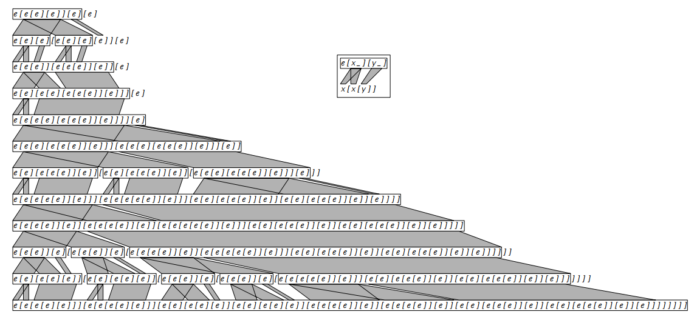
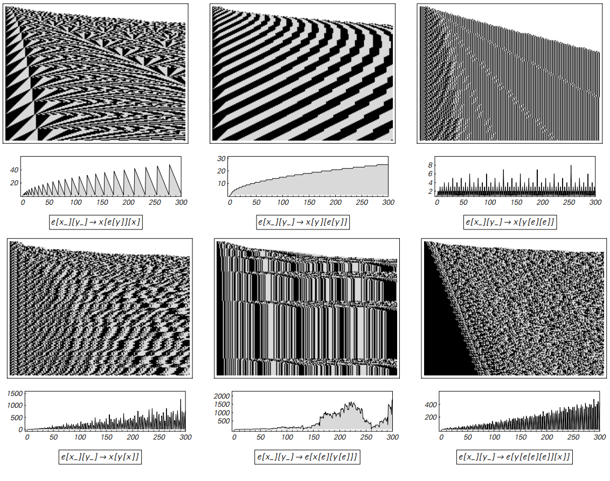

### 3.10  类型系统

寄存器机提供了对典型底层计算机语言的一种简单理想化模型。但对Mathmatica呢？如何建立起对Mathmatica中类型表达式的理想转化？一种在20世纪20年代产生的结合器的想法考虑了这样一种形式的表达式：e[e[e][e]][e][e]，然后使用规则比如e[x_][y_]->x[x[y]]，其中x_和y_代表任何规则。

下面的图片给出了一个例子。在每一步从左到右进行扫描，然后应用可能的不重叠的规则。

一个简单类型系统的进化步骤序列。在每一步的各自区域被通过显示的规则转换。这个转换符合Mathmatica中的操作符 /. 的规则。

（p102）

上一页的表达式的结构仅仅由其括号的序列决定。将左括号和右括号用黑白格子代表，下面的图片演示了生成的整个模式的行为。

上一页的进化的更多步数，将括号用黑色和白色代替。在每一个例子中，超过右侧的都被截断。在上一页初始条件下，系统包含了264步到一个固定的包含了256左括号以及256个右括号的配置。在右上侧初始条件下，系统达到了固定配置，但是经历了65555步，包含65536个括号对。注意这些演化规则是高度非局部的，完全不像那些元胞自动机。事实证明特定的系统总是会进化到一个固定的配置，但是对于初始条件尺寸为n的大概需要2的n次方（或者是 2^2^2...）来完成。

（p103）

对于上面的特定的规则，行为最终都会稳定——尽管有时候需要很长的时间。

但很可能找到不会发生这个的类型系统，就像下面的图片。有时候这种系统产生的行为有一个简单重复的或者嵌套的形式。但是通常——就像许多其他类型的系统——行为不是复杂和随机的。

初始条件为 e[e[e][e]][e][e] 的类型系统的行为。顶部的线段图演示了在连续步骤中获得的表达式大小的不同。

（p104）
