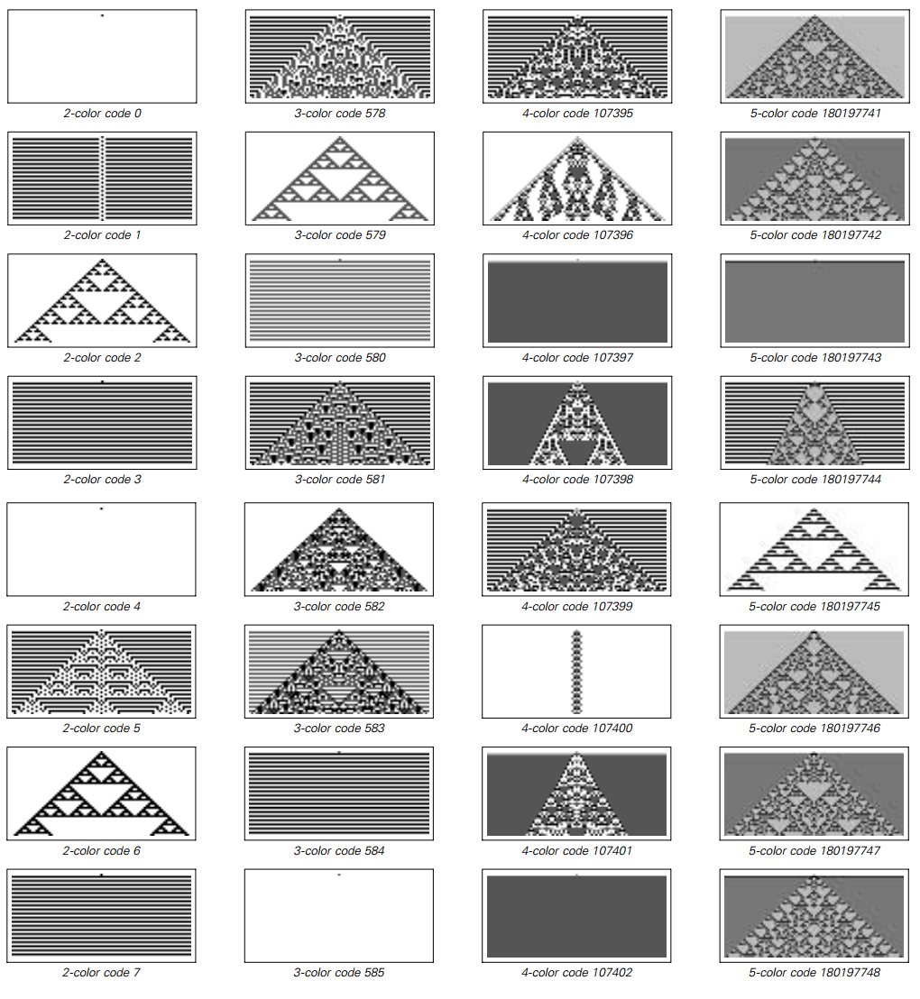

### 3.11  一些结论

在前一章，我们发现一个明显的事实：即使潜在的规则极端简单，特定的元胞自动机也会产生很大复杂性的行为。

尽管在一开始，我们对这超出一般经验的情况似乎有些意外，倾向于假定是元胞自动机有一种特殊稀有的特点，而不会出现在其他系统中。

确实，元胞自动机有许多特殊特点。比如说，它们所有的元素都是在固定的阵列中，会在每一步更新一行。而且我们可能会认为这些特点是简单潜在规则产生复杂行为的关键。

但通过我们对前面章节中替代系统的研究，我们发现了，比如实际上并不需要保持固定的阵列。而通过对移动自动机的研究，我们知道了对一行的更新也不是关键。

的确，我在这章特别选择了一系列的系统，想看看当在拿走元胞自动机的一些特性后会发生什么。很明显的结论就是，这些特点都不重要。对于本章中每一个单类型系统最终都被证明可以产生类似于元胞自动机的复杂性。

因此这意味着实际上复杂性的现象是很普遍的——与特定系统的细节无关。

但是什么时候会发生一般的复杂性现象呢？

本章中的例子暗示着如果特定系统的规则充分简单，系统会表现出单纯的重复模式。如果规则稍微复杂一点，嵌套就出现了。但是要得到系统全局的复杂行为，需要达到一个潜在规则的复杂性阈值。

（p105）

然而，我们做出的一个明显的发现就是，这种阈值非常低。确实在本章我们看到的内容中，讨论的每一个系统，最终只需要很简单的规则就产生复杂的行为。

有人可能认为如果增加规则的复杂性，行为也能相应复杂。但在下一页的图片中我们看到这并没有发生。

反之，一旦达到了复杂性阈值，通常能发现增加复杂性不会导致在整体行为上产生任何预期的增长。

复杂行为的关键要素似乎是出现在简单规则的系统中，而且结果是，规则更加复杂基本上没有新的东西出现。确实，就像下一页所展示的，在行为复杂度和规则复杂度之间通常没有清晰的相关性。这意味着，比如即使是高度复杂的规则，简单的行为也常常发生。

这章还能发现的是一个系统的行为看起来不复杂，它倾向于重复或者嵌套。其实，重复、嵌套、随机和局部结构的基本主题在前面章节的元胞自动机中已经看到了，十分普遍，事实上这是很多不同的系统中主要的主题。

一个特定系统的潜在规则的细节当然能够影响其产生的行为。但是我们在这章中看到的是，在整体层面上的行为是相当通用的，几乎与潜在的细节无关。

（p106）

具有不同复杂性规则的元胞自动机的例子。所使用的规则是第60页所述的所谓的极端类型。在两种可能的颜色的规则中只需要指定4种情况，总共有16种可能的规则。但是随着颜色数量的增加，规则也变得越来越复杂。三种颜色时，有7种情况需要指定，有2187种可能的规则;有五种颜色时可以指定13种情况，1,220,703,125种可能的规则。但是，即使潜在的规则在复杂性上迅速增加，我们所看到的整体行为形式也没有多大改变。有了两种颜色，事实证明，除了重复或嵌套的行为之外，没有任何规则可以产生任何东西。但只要三种颜色被允许，立即可能有更复杂的行为。然而，允许四种或更多种颜色不会进一步增加行为的复杂性，并且如图所示，即使具有五种颜色，仍然可以发生简单的重复和嵌套行为。

（p107）

而这一事实对于我开发本书所描述的那种统一的科学的努力至关重要。 因为这意味着有一些普遍的原则来管理广泛系统的行为，而不依赖于每个系统的精确细节。

这就是说，即使我们不了解自然界某个特定系统内部的所有细节，仍然可以对其整体行为作出基本的陈述。 事实上，在大多数情况下，这种行为的重要特征将成为我们已经看到的与本章讨论的各种非常简单的规则。

#### 我们在本章中做出的发现怎么样？

本章和上一章描述了我对一些简单的程序通常做的一系列令人惊讶的发现。而在做出这些发现的时候，我最终开发出了一种新的方法 —— 我期望这将成为本书所描述的新型科学几乎所有基础性研究的核心。

传统的数学和现有的理论科学会建议使用一种基本的方法，从一个想要研究的行为开始，然后试图构造出这样的行为的例子。但是我确信，如果我使用这种方法，我不会有太大的帮助。因为我只会看到我已经相信可能存在的行为类型。在研究元胞自动机时，这可能意味着我只会寻找重复和嵌套。

但是，让我发现更多的是，我使用了一种基于计算机实验的方法。

在传统的科学实验中，人们设置了一个系统，然后观察它的行为。同样，可以在电脑上设置一个程序，然后观察它的行为。这种实验方法的巨大优势在于，它不需要事先知道究竟会发生什么样的行为。这就是真正发现人们所不期望的新现象的原因。

（p108）

然而，传统实验科学的经验表明，实验总是从根本上不准确。因为当一个人在自然中处理系统时，通常不可能以完美的精度进行设置或测量 —— 甚至使传统的实验完全可以重复也是一个挑战。

但是对于本书所做的计算机实验来说，没有这个问题。因为在几乎所有情况下，它们都涉及程序，其规则和初始条件可以以完美的精度进行指定，以便无论何时何地运行都能完全相同。

在很多方面，这些计算机实验都能把理论和实验两种方法的优点结合起来。因为他们的结果具有理论或数学表述所要求的那种精确度和清晰度。尽管，这些结果可以纯粹通过观察发现。

然而，与所有类型的实验一样，要知道如何建立一个能产生有意义结果的计算机实验，就需要相当的技巧和判断力。事实上，在过去的二十多年里，我自己做这样的实验的方法已经变得好多了。

一遍又一遍，我学到的一个最重要的原则是：最好的计算机实验是尽可能简单直接的实验。这个原则既适用于研究的实际系统的结构，也适用于研究它们的程序。

在某种程度上，以最简单的结构来看系统的原则可以被看作是一种抽象的审美。但事实上也有一些非常具体的结果。

首先，结构越简单，它就越有可能出现在各种不同的地方。这意味着通过研究具有最简单可能结构的系统，人们往往会得到具有最广泛和最根本意义的结果。

此外，查看具有更简单的基础结构的系统，可以让人更好地分辨出对于所见到的任何现象的真正原因 —— 因为这些功能已经投入到系统中，并且可能导致误入歧途。

（p109）

在纯粹的实践层面上，研究具有更简单结构的系统也是有优势的。因为这些系统通常更容易在计算机上实现，因此通常可以用给定的计算资源更广泛地研究。

但是一个显而易见的问题是，我们应该研究一个最简单的结构体系，但这样的体系可能就不能展现人们可能认为有趣的那种行为，或者是发生在自然界的行为。

事实上，传统科学和数学的直觉总是倾向于表明，除非增加各种复杂因素，否则绝大多数系统将永远不能表现出任何很相关的行为。但是，本书迄今为止的研究结果表明，这种直觉远不是正确的，实际上即使是规则极其简单的系统也会导致非常复杂的行为。

这个事实对于计算机实验的后果是相当深刻的。因为这意味着从来没有直接的理由用简单之上的基本规则研究系统。但吸收这一点并不是一件容易的事情。实际上，根据我的经验，在做计算机实验时最常犯的一个错误就是要看比复杂得多的系统。

通常情况下，这种情况发生的原因是，一个简单的系统可以展示有趣的行为的任何方式。所以人们决定看一个更加复杂的系统 —— 通常会插入特定的功能来产生一些特定的行为。

很久以后，人们可能会回头看看更简单的系统。而这往往是一个令人谦卑的经验，因为通常发现该系统确实能够产生有趣的行为 —— 但却是一种没有想像力的猜测。

所以看了这么多次，我现在总是试图遵循这样一个原则，即永远不可能从一个简单的系统开始。因为在最坏的情况下，人们只会建立一个有趣的行为发生所需要的下限。但更经常的是，人们会发现一个从未想过的行为。

但是应该强调的是，即使在一个实验中，发现人们所不期望的现象也不是完全简单的。为了建立实验，必然要对可能发生的行为进行假设。如果事实证明，有一些行为不符合这些假设，那么实验通常不会注意到。

（p110）

但是，根据我的经验，在计算机实验中发现新现象的最好方法是尽可能简单直接地设计实验。例如，对大量可能的情况进行盲目搜索，通常要好得多，而不是精心搜索一个较小的范围。为了缩小搜索范围，不可避免地要做出假设，而这些假设最终可能会忽略最感兴趣的事例。

按照类似的思路，我总是发现明确地看待系统的实际行为要好得多，而不是从某种总结中进行工作。因为做一个总结，不可避免地只能挑出某些特征，这样做可以消除或模糊最有趣的效果。

但是，直接实验的问题之一就是它们经常会产生大量的原始数据。而我发现的是，如果能够以图片的形式呈现这些数据，那么仅仅用眼睛就可以快速地进行分析。事实上，根据我的经验，通过这种方式比通过使用任何类型的自动化程序进行数据分析更容易识别意外的现象。

相当幸运的是，一维元胞自动机是我研究过的简单程序的第一个例子。因为在这些系统中，人们通常可以通过查看大约10,000个元胞的阵列来获得整体行为的良好概念 —— 这可以容易地在几平方英寸内显示。

而且由于256个基本元胞自动机规则中的几个已经产生了很大的复杂度，所以研究像本章开始部分那样的几页图像原则上应该允许发现元胞自动机中复杂性的基本现象。

但实际上我并没有以这样直截了当的方式做出这个发现。我有一开始就想看元胞自动机进化的图片。但是制作这些照片的技术难度使我想尽可能地减少它们的数量。所以起初我只看了左右对称的32条规则，并使空白背景保持不变。

（p111）

在这些规则中，我发现了重复和嵌套的例子。随机的初始条件，我发现更复杂的行为。但是由于我没有想到在简单的初始条件下任何复杂的行为都是可能的，所以我没有试图去寻找其他的规则来寻找它。尽管如此，我在1983年发表的关于元胞自动机的第一篇文章实际上包含了第27页规则30的图片，作为非对称规则的一个例子。但是图片只显示了20个进化步骤，当时我没有仔细观察，当然也不了解它的意义。

几年来，我对元胞自动机进行了越来越复杂的计算机实验，在这个过程中我设法阐明了它们的许多特性。但是最后，当技术发展到几乎微不足道的地步时，我回过头来创建了从简单的初始条件演化而来的所有256条基本规则的简单图片。而当看到这些图片时，我终于开始欣赏像规则30那样的系统中出现的显着现象。

七年后，我通过像规则30那样查看元胞自动机来吸收了一些基本的直觉后，决定是否其他类型的系统也出现类似的现象。我研究的第一个这样的系统是移动自动机。

在某种意义上，移动自动机相对于元胞自动机演进得非常缓慢，所以为了制作更高效的图片，我想出了一个以压缩形式展示其演变的方案。然后，我通过生成前百，然后第一千，然后第一万，移动自动机的图片开始。但在所有这些图片中，我发现除了重复和嵌套的行为之外没有任何东西。

然而，由于相信更复杂的行为必须是可能的，我决定坚持下去，于是我编写了一个程序，自动搜索大量的移动自动机。我根据我预期的移动自动机的行为，为搜索设置了各种标准。不久之后，我就让这个程序搜索了一百万个移动自动机，然后是一千万个。

（p112）

但是我仍然什么都没有发现。

于是我回去开始用大量的随机选择的规则眼睛看着移动自动机。一段时间后，我意识到，在我使用的压缩方案中，可能会有移动自动机，根据我的搜索标准将被丢弃，但仍然有一些有趣的行为。为了解决这个问题，我在一个小时内修改了我的搜索程序，结果我发现了74页的例子。

然而即使在这之后，我的搜索程序中仍然隐含着许多假设。并且花费一些时间来识别和移除它们。但是这样做的话，找到第75页上的例子就相当简单了。

本章描述的大多数其他系统都有一些类似的模式。主要的挑战是避免假设，建立简单直接的实验，不要错过重要的新现象。

在很多情况下，需要进行大量的迭代来完成正确的实验。如果我不能轻松地用Mathematica建立新的实验，那么我很可能在调查本章所讨论的大部分系统的时候都不会有太大的进展。但是最终，在运行总共几年计算机时间的程序（相当于超过一亿次的逻辑运算）并创建相当于数万页的图片之后，我终于能够找到所有的本章介绍的各种示例以及后面的示例。

（p113）
