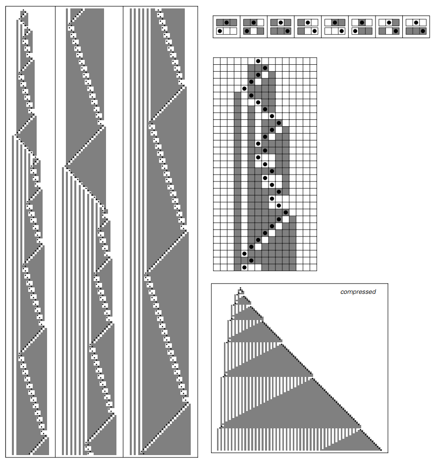
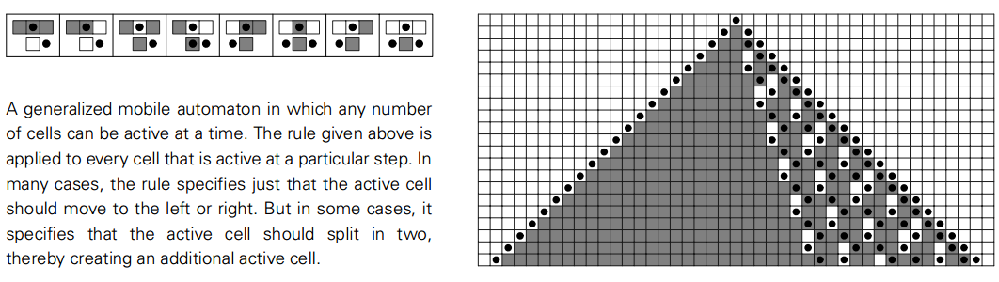
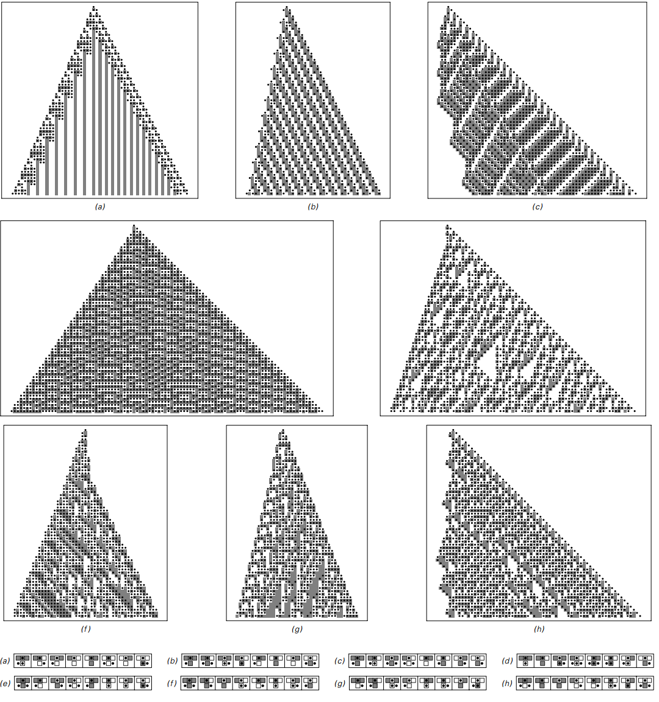

### 3.3  移动自动机

元胞自动机的一个基本特征就是所有元胞包含的颜色每一步都是并行更新的。

但这个特征在决定整个将发生的行为中有多重要呢？为了解决这个问题，在这一部分我考虑了一类系统，称之为“移动自动机”(mobile automata)

移动自动机和元胞自动机相似，除了不再是并行更新。它们有一个独立的“活跃元胞”在每一步进行更新，并且有一个规则来指定这个活跃元胞在下一步如何移动。

下面的图展示了一个移动自动机的例子，活跃元胞由一个黑色点表示。这个规则仅对活跃元胞应用，它关注活跃元胞所在位置以及其近邻的颜色，然后对当前元胞新的颜色做出指示，以及活跃元胞往左还是往右移动。

一个移动自动机的例子。就像元胞自动机，一个移动自动机由一行元胞组成，每一个有两种可能的颜色。但和元胞自动机不同的是，移动自动机在每一步有一个活跃元胞（黑色圆点）。移动自动机的规则指示了活跃元胞如何更新，以及该向左还是向右移动。在大量步数运行后的结果见下页。
 

对元胞自动机我们能枚举出可能的所有规则种数，一共有65536种。下一页顶部的图片演示了这些规则的典型行为。在(a)和(b)中，活跃元胞约束在一个小区域中，其行为是简单重复的。(c)和(f)是类似的，整个模式向右移动，在(e),(f)中，整个往左移动。
（p71）

移动自动机的几个规则示例。在a和f中活跃元胞纯粹是重复的，在g和h中则不是，模式的宽度在t步的增长近似为√2t。
 

但在整个65536中的218种，我们能得到不同的行为。就像下面(g)和(h)所示。活跃元胞并不是严格重复的，而是前后扫的，每次扫得更宽。

虽然，整个模式的产生依旧很简单。而且事实上在下面的压缩表格中，它是纯粹重复的。

 g和h的压缩版，如果只显示最左或最右的活跃元胞得到的。
 

在65536种可能的元胞自动机中，目前为止没有一个显示出更复杂的行为。那么下面这种行为也会发生在其中吗？

我们可以扩展规则，不再是活跃元胞本身的颜色，也包括其近邻都在每一步更新经过这种扩展，一共得到4294967296种可能的规则。

如果对这些规则进行随机取样，我们能发现99%的都产生了简单重复的行为。但是在少数一千种规则中，我们能看到类似下面的行为：不是纯粹的重复，而是一种嵌套的结构。

一种产生了嵌套模式的有着更加复杂规则的移动自动机。图中每一列演示了200步的进化。压缩形式的模式基于一共8000步。
 
（p73）

尽管如此，整个模式还是很规则。但我们会发现下面的规则在50000步后，其压缩模式展示出一种类似完全随机的现象，就像规则30。

一种产生看上去随机特性的移动自动机。活跃元胞的移动是相当规律的，就像图中所示。整个模式的颜色看上去在很多方面都是随机的。每一列展示出200步的进化，压缩模式演示了50000步。
 

但即使上图中活跃元胞最后剩下的模式看上去是随机的，活跃元胞本身还是规律的。所以存在一种移动自动机其活跃元胞是随机的吗？一开始我觉得可能没有，但在数百万规则中寻找后，最终我发现了下页这个例子。

（p74）

一种移动自动机，其活跃元胞的位置是一种近似随机的方式。每一列有400步，压缩模式显示了50000步。为了找到这种复杂行为的自动机找了数百万种。
 

（p75）

尽管实际上移动自动机每一步只更新一个元胞，但是其行为依然产生了相当的复杂性。但我们发现这种行为虽然在元胞自动机中十分常见，却在移动自动机中十分少见。

我们可以通过研究一类广义移动自动机来了解这种差异的起源，感觉上这种广义自动机介于一般的移动自动机和元胞自动机之间。

这种泛化的移动自动机的基本想法是允许不止一个元胞在每一步进行活动。潜在的规则是在特定的环境下，一个活跃元胞能够分裂成两个，或是完全消失。

例如下面的图片，每隔几步就会产生新的元胞。

一种泛化的移动自动机，每一步有任意个活跃元胞。上面的规则应用到每个活跃元胞的特定一步。在许多情况下，规则明确规定活跃元胞应该向左或是向右。但是在一些情况下，它会分裂成两个，因此增加了活跃元胞数量。
 

如果我们随机选择泛化的移动自动机，大多数还是会产生简单行为，就像下一页演示的那样。但是在一小部分情况中，行为更为复杂了。一般活跃元胞是规律的，但有时不是。

看更多的例子，一个确定的主题浮现：复杂行为大多数情况不能发生，除非同时有大量的活跃元胞。事实上，这意味着整体的活动和复杂行为的可能性具有显著的相关性。这就是为什么复杂行为在元胞自动机中比移动自动机更为常见。

（p76）

泛化移动自动机的例子。情况a中，只有有限个元胞活跃，但是在其他情况中活跃元胞不断扩散。d中，所有元胞都是活跃的，系统基本上就像元胞自动机。剩下的几种，有些复杂模式的元胞是活跃的。注意不像一般的移动自动机，这些复杂行为的例子是相对容易找到的。
 

（p77）
