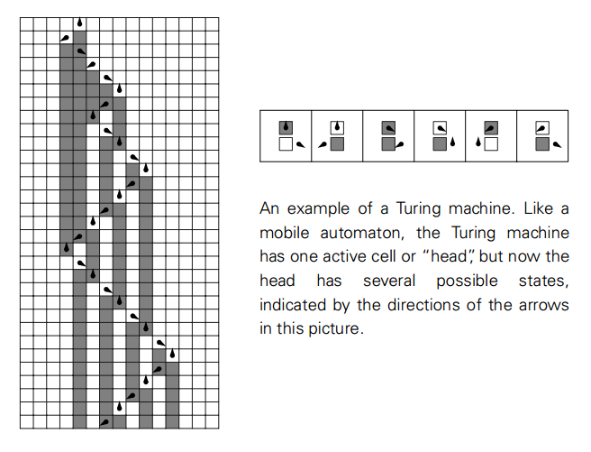
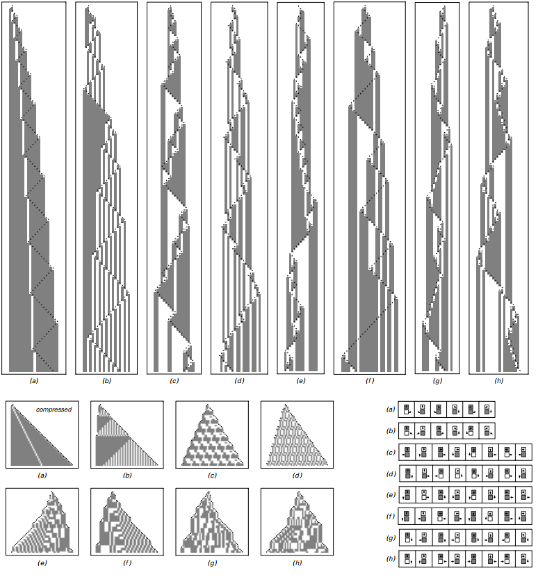

### 3.4  图灵机

在计算的历史上，曾构造的最早广为人知的理论程序基于一类被称作图灵机的系统。

图灵机和移动自动机类似，它们都由一条元胞组成，即“磁带”，有一个活跃元胞，即“磁头”。但是和移动自动机不一样的是，图灵机的头可以有许多种可能的状态，就像下图，有许多种可能的方向。

此外，图灵机的规则可取决于磁头的状态，以及磁头处元胞的颜色，但与近邻元胞的颜色无关。

一个图灵机的例子，就像一个移动自动机，图灵机的活跃元胞是一个磁头，但是这个头有许多种可能的状态，就像这幅图中箭头指示的几个方向。
 

图灵机至今仍广泛用于理论计算科学中。但是在几乎所有的情况中，我们都能想象得到，构建出能完成特定的任务的例子，需要通过大量可能的状态以及可能的元胞颜色数量。

实际上，有一种非平凡的图灵机，有两种可能的状态以及两种可能的元胞颜色。下一页演示的4096号就是这类。虽然没有更复杂的情况，重复和嵌套的行为都能看到发生。

（p78）

一个有两种磁头状态的图灵机的例子，共有4096种可能规则。这里只能看到重复嵌套的模式，没有更复杂的情况发生。

 

有了我们在移动自动机的经历，我们可能期望存在图灵机能够有更复杂的行为。

三种状态的磁头下，大概有三百万种可能的图灵机。但这些中的部分行为似乎在细节上更为复杂，就像下一页的案例a和b，但最终都产生了重复嵌套的模式——至少是从所有元胞为白色开始。

四种状态下，更加复杂的行为立即变得可能。事实上，大概一百万规则里有五种都产生了近似随机模式的特征，就像下下页展示的那样。

如果允许磁头超过四种状态会发生什么？结果是几乎没有什么行为上的变化。表面上的随机变得更为寻常，但除此之外结果都是一样的。

我们再一次看到了似乎存在一个复杂行为的界限——在四种状态就达到了。就像元胞自动机里，添加更复杂的潜在规则，而最终不会产生更复杂的行为一样。

（p79）

三种和四种状态下的图灵机。在三种可能状态时，至少在全白色元胞开始时，最终都只有重复和嵌套的模式。最上面的一组图演示了不同规则下150步的进化，均从同一个状态开始（箭头向上），所有元胞均为白色。最下面的一组图是压缩形式，每张图包含了50步磁头达到当前最左或最右的情况。

（p80）

一个在各种意义上展示出随机行为的图灵机。这个图灵机有四种可能的磁头状态，每条磁带上的元胞有两种可能的颜色，以黑白表示。每一列有演示了250步的进化。下面的压缩形式一共演示了20000步。
 
（p81）
