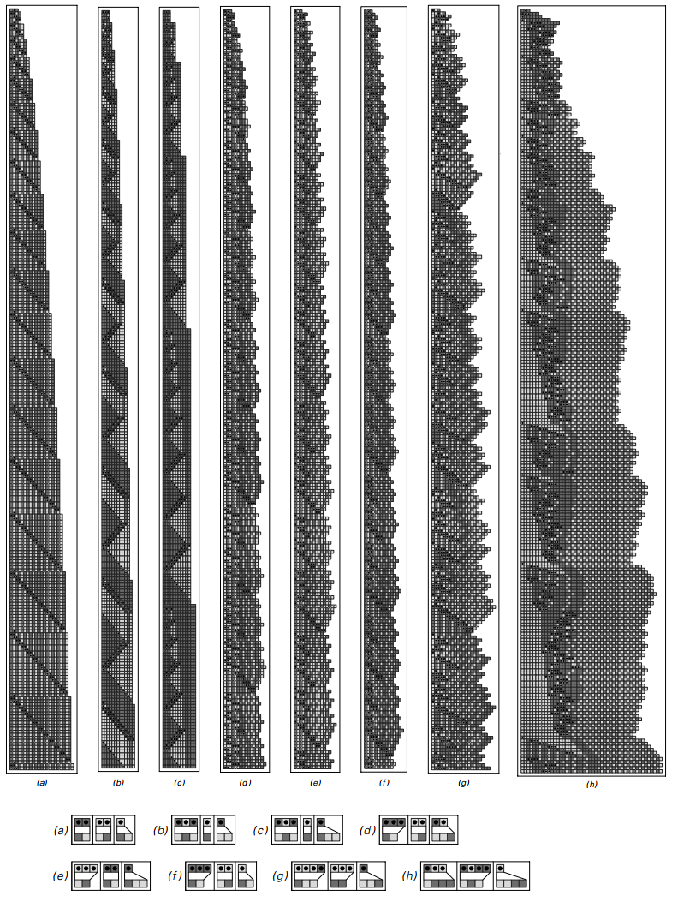

### 3.6  有序替代系统

我们目前讨论的系统都看起来不像我们平时用的程序。但接下来的一个替代系统的变形的例子，基本上就像一个文本编辑器。

理解这种相似一致性的第一步是要将替代系统中对元素序列里颜色的操作考虑成对字符串中字符的操作。比如说，替代系统某一步的字符串为ABBBABA，A代表白色B代表黑色。

前面我们所考虑的替代系统，都是在每一步将每个元素替代为新的一个或几个元素，因此在某种意义上来说就是每一步对现有字符串进行并行操作。

但我们同样可以考虑这样有序的替代系统，不再是并行操作，而是从左到右扫描字符串，发现特定的元素序列，对第一个出现的序列进行替代。这种设定就像典型的文本操作中的查找并替换函数。

（p88）
下图演示了一个简单的有序替代系统，它的规则指示每一步将查找到的第一个序列BA替换成ABA。

一个简单有序替代系统的例子。其中的亮色格可以当成A，暗色格可以当成B。其规则指示对每一步的字符串进行从左往右的扫描，将首次发现的字符串BA替换成ABA。在图中，黑色的圆点指示将要被替代的元素。在这个例子中，初始状态是BABA。产生的结果是每一步对字符串增加一个A。

这个例子的行为非常简单，每一步只是在不断增加相同形式字符串的长度。但我们可以让它变得复杂，只要使用不止一种替代规则。这个想法就是重复扫描字符串，尝试替代方案，直到有一种匹配就进行替换。

下一页的图片演示了有两种替代规则｛ABA→AAB，A→ABA｝的替代系统。初始条件是BABA，第一步应用规则将其ABA替换成AAB，此时字符串为BAAB，不包含字符串ABA，无法应用第一个规则。但是，字符串包含字符A，可以应用第二个规则。

尽管在两种替代中交替，然而最终出现的模式还是规律。事实上，如果只给两种替代方式和两种可能的颜色，没有比这图中更复杂的情况出现了。
（p89）

一个两种替代规则的替代系统的例子。在每一步，整个字符串扫描中，尝试应用第一个替换，如果必要就尝试应用第二个替换。

所以可能有人会总结有序替代系统不会出现潜在的复杂性。但根据我们遇到的一系列系统来看，我们觉得有序替代系统也是有可能的。

如果我们使用更多可能的替代，事实上可以得到更多复杂的行为。下一页的图片就演示了几个例子。在许多情况中，产生了均匀规律重复或者是嵌套模式。

在一万种随机选择的规则中，我们获得了相当不同的行为。事实上，就如下面图片所演示的那样，模式能够产生各方面意义上的随机，就像我们在其他系统的元胞自动机看到的那样。

所以这引出了一个相当明显的结论，即使是在一个基本的文本编辑器中使用简单的操作，最终都可能产生巨大的复杂行为。

（p90）

具有三种可能替代规则的有序替代系统的例子。每个案例中，字符串均从BAB开始。黑色圆点指示每一步需要被替代的字符串。

（p91）

一个产生近似随机行为的有序替代系统的例子。在每一列的图像演示了250步系统的演化。压缩版本包含了一百万步，在字符串变得更长的时候才显示（规则和前一页的g一样。）

（p92）
