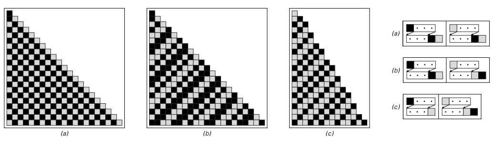
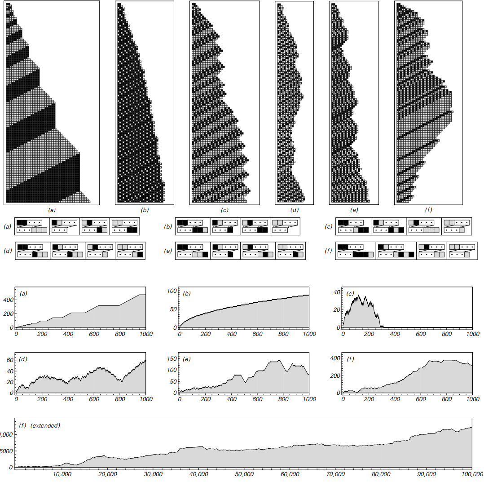

### 3.7  标识系统

本章的一个目标是找出在整个系统能够表现复杂行为时其潜在结构能有多简单。在这里我考虑其中一类系统的一个例子，广为人知，被称作标识系统。

一个标识系统有一个序列元素组成，每一个颜色为黑色或者白色。这个系统的规则指示每一步固定数量的元素需要被从序列的最开始移除。然后取决于这些元素的颜色，一个可能的标识块就会被贴在序列的尾部。

下面的图演示了标识系统的例子，每一步将一个元素移除。在这样的系统中我们已经能够看到看上去复杂的行为。

一个标识系统的例子，其规则展示为：每一步从开始移除一个元素，然后新的元素块被添加在序列尾部。因为每一步只移除了一个元素，系统很快就可以遍历玩所有元素，对每一个完成替换。在一个完整的周期后，获得的序列与83页所示的前三个近邻独立替代系统完全一样。

但是实际上结果是如果一个元素在每一步被移除，标识系统总是会表现为一个近邻独立替代系统的缓慢版本，就像83页讨论的。结果就是，其产生的模式最终会是重复嵌套的模式。

如果每一步移除两个元素，这个结论就不再正确了。实际上，就像下一页图片所描述的，其获得的行为将非常复杂。

（p93）

每一步从开头移除两个元素、然后基于这些元素，添加一些新的元素到序列的尾部（规则中的三个圆点代表序列剩下的元素）。这幅图的顶部演示了最开始一百步的演化。图片演示了每个案例序列的长度变化。注意在案例c中，所有元素最终都被从序列中移除。

（p94）
