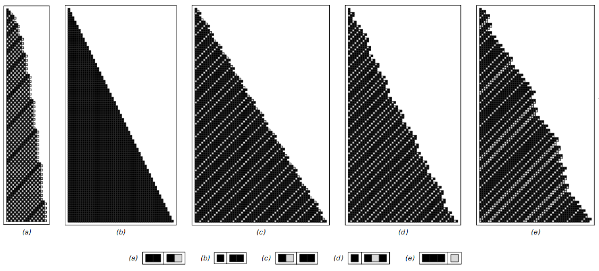

### 3.8  循环标识系统

我们在之前部分讨论的对标识系统的操作是十分简单的。但事实证明，我们只要使用一个稍微不同的设置，可以让它的操作更简单。在原本的标识系统中，我们预先每一步并不知道哪些可能的块会被添加进去。但循环标识系统的潜在规则明确指示了哪些块会被添加。

在最简单的情况下，有两个可能的块，规则简单地交替在这些块之间的连续步骤中，在第一个元素为黑色时添加一个块。下面的图演示了它是怎样工作的。

循环标识系统的例子。有两个规则，它们用圆形图标表示，这两个规则会在步骤中交替使用。在每个案例中，一个单独的元素从开始被去除，在去除颜色是黑色时在尾部添加新的块。规则可以总结成下面的小方块。

下一页演示了几个循环标识系统的例子。在a）和b）中得到了简单的行为，在c）中行为变得稍微复杂，但是模式看上去还是类似于83页近邻独立的替代系统的嵌套形式的。

而d）和e）呢？二者都在连续步骤中获得的序列越来越长，但在其增长过程中有浮动，就像图中演示的，这种浮动代表着某种意义上的随机。

（p95）

循环标识系统。每个案例的初始条件都由一个单独黑色元素组成。在c）中，最左列（即循环标识系统决定整个的行为）交替的步骤和83页的嵌套模式很像。

d）和e）的浮动增长。波动表现在平均每一步的半元的增长率上。

（p96）
