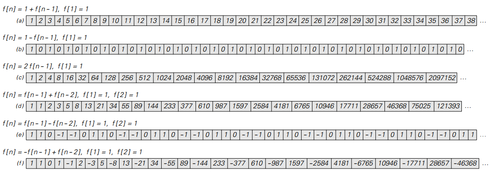
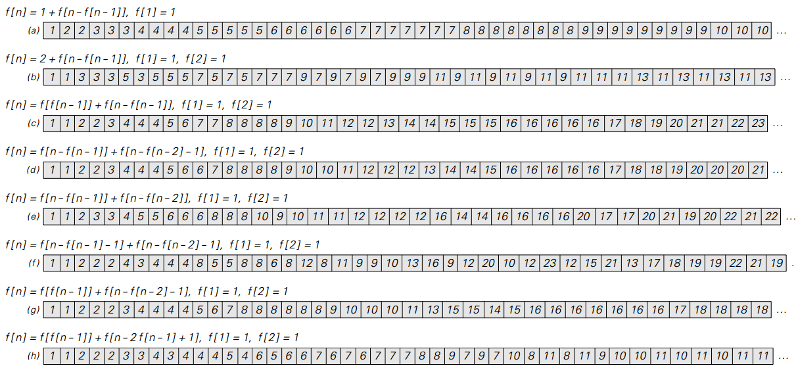
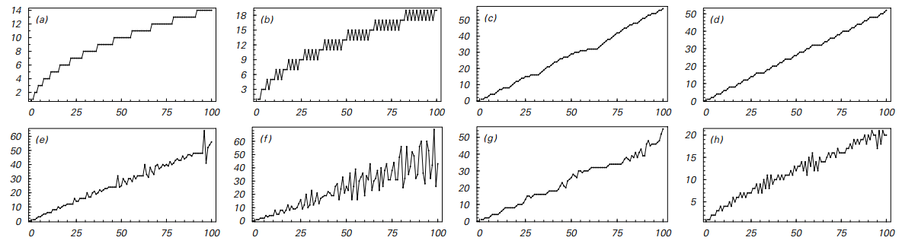
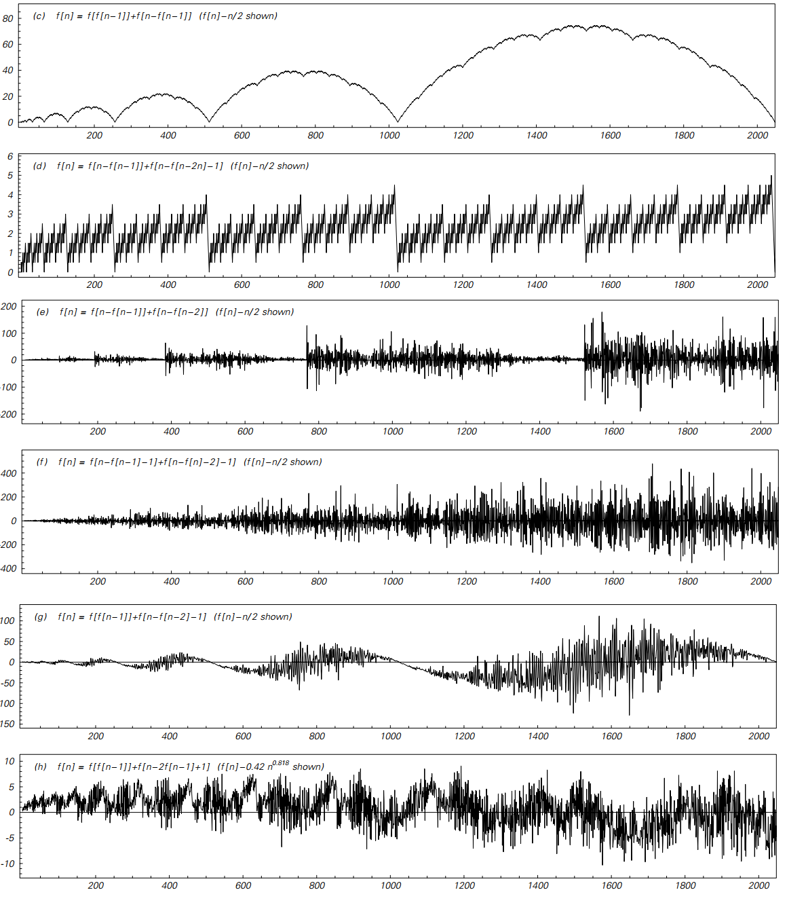

### 4.3  递归序列

在前面的章节中，我们看到，通过应用基于简单算术的各种操作，可以获得相当复杂的行为。在本节中，我将展示的是，通过恰当的设置，加减只是某种意义上的唯一操作。

基本思想是考虑一系列数字，其中有一个明确的规则来获得序列中的下一个数字。将每个序列中的第一个数字称为f[1]第二个数字f[2]，以此类推，以便表示数字nth为f[n]。用这个符号，规则的作用是规定如何从序列中之前的数字计算出f[n]来的。

在最简单的情况下，f[n]只取决于它之前f[n-1]序列号。但是也可以建立规则，不仅要依赖于f[n-1]，还要依赖于序列中更早的数字f[n-2]。

下面的表格给出了一些具体规则的结果。在所有的情况下，这些结果都是非常简单的，包括序列的增加是一致的或是以一种纯粹重复的方式波动的。

>一些简单的递归序列的例子。 每个序列中的第n个元素被表示为f[n]，规则指定如何从前面的元素确定这个元素。 按照这里显示的所有规则，连续的元素要么顺利地增加，要么以纯粹重复的方式波动。 序列（c）是二的幂; （d）是所谓的斐波那契数列，与黄金比例1.618有关。 这里显示的所有类型的规则都会导致序列f[n]用一个简单的形式的幂和来表示。

（p128）

但事实证明，使用稍微复杂的规则，可以获得更复杂的行为。
关键的想法是考虑规则，这些规则考虑的不仅是序列中的固定距离。
而这意味着，不仅仅取决于f[n-1]和f[n-2]这样的数量，而且f[n]的规则也可以取决于数量如f[n-f[n-1]]。

这里有一些微妙之处，因为从抽象的角度来说，没有什么能够保证n-f[n-1]必然是一个正数。
如果不是，那么通过应用规则获得的结果可能涉及无意义的数量，例如f[0]、f[-1]和f[-2]。

>由不依赖于固定距离的元素的规则生成的序列示例。
大多数这样的规则最终最终会涉及毫无意义的数量，
例如f[0]和f[1]，但是这里显示的特定规则都可以避免这个问题。

（p129）

>整个前一页的序列增加波动。
在情况（c）和（d）中，波动具有规则的嵌套形式，并且直接与基地2位数字序列相关。
在其他情况下，波动更加复杂，并且在许多方面看起来是随机的。
这里显示的所有规则都以f[1]=f[2]=1开始。

（p130）

对于随机写下的绝大多数规则而言，确实会发生这样的问题。
但是有可能找到他们不知道的规则，前两页的图片展示了我发现的这些规则的一些例子。
在情况（a）和（b）中，行为相当简单。 但在其他情况下，情况要复杂得多。

总体增长稳步增长，但叠加在增幅上的是波动，正如前面一页上的图片所示。

在情况（c）和（d）中，这些波动具有非常规则的嵌套形式。
但在其他情况下，波动在许多方面似乎是随机的。
因此，例如在（f）的情况下，即使经过一百万步之后，正负波动的数量平均出现相等。

但从某种意义上说，前页里最令人惊讶的特征之一是它显示的波动非常剧烈。
有人可能会认为，从这里开始只会有一点变化。
毕竟，在和之间只有0.05％的变化。

但就像我们在前一节看到的那样，事实证明，它的大小似乎并不像其代表性的各个方面那么重要。
事实上，在（c）和（d）的情况下，例如，f [n]的波动和2的基数序列之间存在直接关系。

在情况（d）中，每个波动基本上只是基数2数字序列中出现的1的数目。
并且在情况（c）中，波动由在所有数字小于的数字序列中出现的1的总数决定。

前一页上显示的其他规则没有这种简单的关系。
但总的来说，人们怀疑所有这些规则都可以被认为是像简单的计算机程序那样将一些表示作为他们的输入。

我们在本节中发现的是，即使规则最终只涉及加减，但它们仍然对应于能够产生非常复杂行为的程序。

（译者注：经测试，f、e作为音频信号波形均表现为噪声）
（p131）
