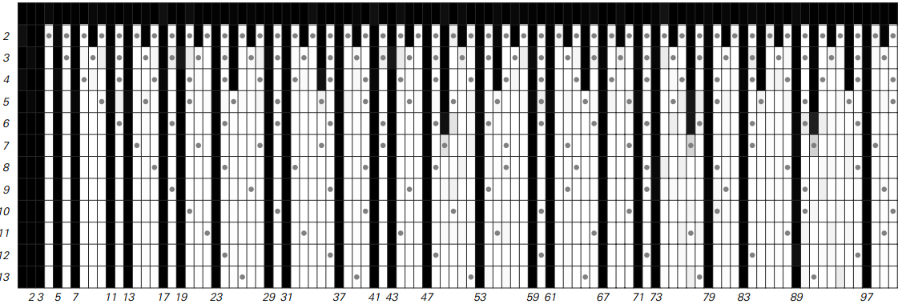
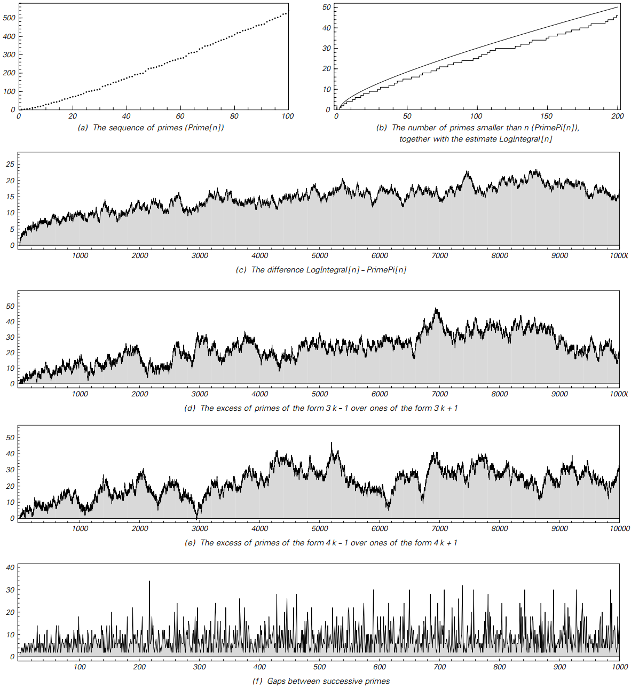

### 4.4  素数序列

在所有可能的数字序列中，1,2,3,4,5,6,7,8，...大多数可以被其他数字整除——例如6可以被2和3整除。
但是，对于每个数字都不是这样。
因此，例如5和7不能被任何其他数字整除（除了1之外）。
事实上，有两千多年的历史，有一系列所谓的素数不能被其他数字整除，前两个数字是2,3,5,7,11,13,17 ,19,23,29,31,37,...

下面的图片显示了一个简单的规则，通过这个规则可以获得这样的素数。
这个想法是从所有可能的数字开始。然后在第二行删除大于2的所有可被2整除的数字。
在第三行删除可被3整除的数字，依此类推。 随着时间的推移，剩下的数字越来越少。 
但有些数字总是保持不变，而这些数字正是素数。

>图为产生素数的过滤过程。
首先在第一行开始，所有数字在1到100之间。
然后在第二行，删除大于2的数字，可以被2整除——如灰点所示。
在第三行中，删除大于3的数字，可以被3整除。
如果这个数字永远持续下去，那么一些数字总是保持不变，而这些数字正是素数。
这个过程基本上就是公元前200年已知的Eratosthenes之筛。

考虑到这条规则的简单性，人们可以想象它产生的素数序列也相应简单。
但正如本书其他许多例子一样，事实上并非如此。
事实上，页面上的图表显示了这个序列的各种特征，表明它在很多方面都是非常随机的。

（p132）

>素数序列的特征。 尽管在生成素数的前一页上的规则很简单，但是获得的素数的实际顺序在许多方面似乎是非常随机的。

（p133）

我在本书中已经展示的复杂性的例子几乎都是全新的。
但前几百个素数无疑在古代是知道的，而且它的分布至少有一定的复杂性。

然而，如果没有我在本书中发展的整个知识结构，这个观察的意义——例如它与自然现象的潜在联系——都没有被意识到。
尽管在数百年的历史中对于素数序列进行了大量的数学工作，但几乎毫无例外，它一直关注的不是复杂性的基本问题，而是试图寻找特定类型的规律。

事实证明，事实上很少发现规律性，并且通常已经建立的结果往往只支持序列具有许多随机性特征的想法。
所以，作为一个例子，从前一页的图片可以看出，（c），（d）和（e）总是在系统上保持在轴上方。
但事实上，经过相当大的努力，已经证明它们在某种意义上是更随机的——并且最终跨越轴线无限多次，并且确实上下移动任意距离。

在每个例子中都可以看到相当程度的复杂性。

如果我们从每个数字的整体大小来看，而不是根据它的数字序列或可能的因子集，就可以理解其中的一些复杂性。
但在大多数情况下——尽管经过数百年的数论工作，往往相当复杂。

事实上，唯一合理的结论似乎就像在本书的许多其他系统中一样，这样的数字序列表现出复杂性，
以某种方式出现作为序列生成规则的基本结果。

（p134）

>基于各种简单的数字属性的序列。数论的大量工作仅仅成功地建立了这些的一些性质。
例如，（d）永远不会达到零，曲线（c）只对形式为4^r(8s+7)的数字达到零。
序列（b）在所谓的完美数字处为零。
即使是完美的数字总是有一个已知的形式，但是否存在任何奇数完美数字是一个在两千多年内仍未解决的问题。
序列（e）从未达到零的说法被称为哥德巴赫猜想（Goldbach's Conjecture）。它是在1742年制作的，但没有找到任何证明或反例。

（p135）
