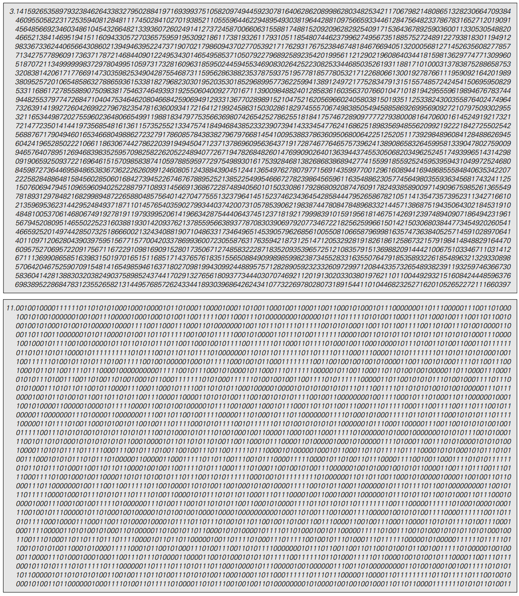
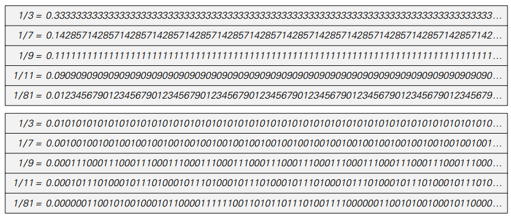
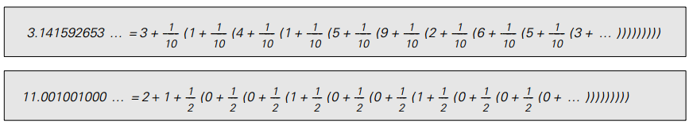
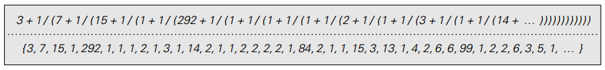

### 4.5  数学常量

最后几节表明，可以根据可能出现极大复杂性的数字设置各种系统。
事实证明，初等数学中的一些众所周知的事实已经暗示了这种复杂性的可能性。

有争议的事实涉及数字中的数字序列，如（pi）。
一个非常粗略的近似值是3.14。
更精确的近似值是3.14159265358979323846264338327950288。

但是这个数字序列如何继续？

有人可能会认为，在某种程度上，它必须非常简单和规律。
对于值π的定义是简单定义为任何圆的周长与其直径的比值。

但事实证明，即使这个定义很简单，π的数字序列根本就不简单。
面向页面显示序列中的前4000个数字，通常情况下是基数10，基数为2.下图显示了序列中前20000个数字的图形表示。

>以2为底数的前20,000位数字的图形表示。
每次数字为1时绘制的曲线上升，每次为0时下降。
复杂性非常明显。
如果曲线进一步继续下去，它会在轴上花费更多的时间，并且所看到的任何方面都没有提供任何证据表明数字序列是完全随机的。

（p136）

>π在基数10和2中的前4000个数字。尽管π的简单定义是圆的直径与圆的直径的比率，但其数字序列足够复杂，以至于实际上看起来是随机的。

（p137）

没有任何明显的规律。实际上，迄今为止计算的π的所有数字都超过了2000亿，仍然没有发现任何类型的重要规律性。
尽管其定义很简单，但实际上的数字序列完全是随机的。

但其他数字呢？π是一种特殊情况，还是说其他常见的数字常量都具有复杂的数字序列？
有些数字的数字序列的长度有限。因此，例如，基数10中的数字序列是0.375。
（严格来说，数字序列是0.3750000000 ...，但0不会影响数字的值，因此通常会被省略）

但是，很容易找到数字序列不会终止的数字。
因此，例如，基数10的确切值是0.3333333333333 ...，其中3是永远重复的。
同样，是0.142857142857142857142857142857 ...，现在数字块142857永远重复。
下表给出了通过分成整数对得到的几个有理数的数字序列。
在所有情况下，我们看到的是这些数字的数字序列具有简单的重复形式。
而事实证明，所有有理数的数字序列最终都会重复。

对于各种有理数的数字序列，以十进制（上）和二进制（下）两种方式给出。
对于形式为p / q的数字，序列总是以最多q - 1步骤的周期重复。

（p138）

通过查看执行工作流程的细节，我们可以理解为什么是这样的。
下面的图片显示了用于计算有理数p / q的基2位数序列的特定方法中的连续步骤

>计算各种有理数的连续步骤。
在每种情况下，右边的列显示数字中基数2的数字序列，而左边的数字框显示计算中每个步骤的余数。
(译注：从上往下看。如1/2的序列，r起初为1——左黑色方格，在除尽后为0——白色方格并且不再变化)

该方法基本上是标准的长除法，虽然在基数2中比在基数10的通常情况下要简单一些。
想法是有一个数字r，基本上跟踪分区中每个步骤的余数。
一开始设置r等于p。 然后在每一步中，比较2r和q的值。
如果2r小于q，则在该步骤生成的数字为0，并将r替换为2r。
否则，r被替换2r-q。 通过这个程序，r值总是小于q。
结果，获得的数字序列总是在每q-1个步骤中重复。

但事实证明，有理数是非常罕见的，具有这样简单的数字序列。
事实上，如果以平方根为例，这个故事就完全不同了

完美的平方根例如4=2*2和9=3*3，专门设置为具有整数的平方根。
但是当下一页顶部的表格显示时，其他平方根具有更复杂的数字序列。
事实上，就我们所知，除了完美平方根以外的所有整数都有平方根，其数字序列完全是随机的。

（p139）

>对于各种平方根的数字序列，以十进制（上）和二进制（下）两种方式给出。
尽管定义很简单，但所有这些序列似乎在实际上都可当做是随机的。

这个程序只比上面讨论的划分要复杂一点。
它涉及两个数字r和s，它们分别被初始设置为n和0。
在每一步中，它比较和s的值，如果r大于s，则将r和s分别替换为4(r-s-1)和2(s+2);否则替换为4r和2s。
然后，结果发现在二进制形式下的数字s完全对应于每个步骤产生一位新数字的√n。

如图所示，该程序的结果表现出相当大的复杂性。
事实上，就像我们在本书中讨论过的其他很多例子一样，生成平方根的过程是基于简单的规则，但是却产生了非常复杂的行为。

（p140）

>一个产生平方根的过程。包括两个数字r和s。
为了找到√n，开始设置r=n，s=0，每一步运用规则：
{r,s}->If[r>s,{4(r-s-1),2(s+2)},{4r,2s}}]。
结果是基数2中的数字s与√n的数字结果完全一致。
请注意，如果n不在1和4之间，则在开始此过程之前，必须乘以或除以4的适当幂。

事实证明，平方根当然不是唯一有明显随机现象的数字序列。
作为一个例子，下一页的表格给出了一些立方根和第四根的数字序列，以及一些对数和指数。
据我们所知，几乎所有这些数字都有明显的随机数字序列。

（p141）

>数字序列的立方根，第四根，对数和指数，十进制的顶部给出，二进制底部给出。再一次，这些序列在实际目的上似乎是随机的。

事实上，有理数是唯一具有重复数字序列的数字。
至少在平方根，立方体根等等，已知没有嵌套数字序列出现。
使用例如第83页上的替换系统构造一个嵌套的数字序列是很简单的，
但重点是这样一个数字序列永远不会对应于通过数学根运算可获得的数字。

本章到目前为止，我们一直使用数字序列作为表示数字的方式。
但有人可能会想到，也许这种表示方式有点不正常，
如果我们只是选择另一种表示方式，那么通过简单的数学运算生成的数字就不再显得复杂了。

在某种意义上，任何数字的表示都可以被认为是指定了构建该数字的过程。
因此，例如，下一页顶部的图片显示π的基数10和基数2数字序列表示可如何用于构建数字π。

（p142）

>用十进制和二进制分别构造π的过程

通过用其他操作替换上面出现的加法和乘法，可以得到数字的其他表示。
一个常见的例子是所谓的连续分数表示法，其中使用了加法和除法操作，如下所示。

>π的连续分数表示法。在这个过程中π的值由连续的加法和除法组合构成，而不是加法和乘法。

下一页的表格给出了各种数字的连续分数表示。
在有理数的情况下，结果总是有限的。
但对于其他数字，它们会永远持续下去。
平方根产生纯粹重复的连续分数表示。
对于e≈2.718，它和它的所有表现形式也都表现出一定的规律性。
但是对于π和其立方体根，第四根等，连续分数表示似乎基本上是随机的。

其他数字表示呢？
在某种程度上，人们总是可以使用象√2+e^(√3)这样的符号表达来表示数字。
根据定义，几乎可以通过简单的数学运算获得的数字将与简单的表达式相对应。
但问题在于，没有说明从用来表示它的符号表达式计算数字的实际值有多困难。

（p143）

>一些数字的连续分数表示。平方根产生了重复数字的序列，但立方根产生了似乎随机的序列。

在考虑数字表示时，将自身局限于从表示中找出数字的价值对于所有数字来说基本相同的情况似乎是合适的。
如果有人这样做，那么典型的经验是，在任何特定的表示中，某类数字将具有简单的形式。
但其他数字，即使它们可能是简单的数学运算的结果，也往往具有看似随机的形式。

由此可以得出结论：由简单的数学运算产生的数字通常在某种内在意义上是复杂的，与用来观察它们的特定表示无关。

（p144）
