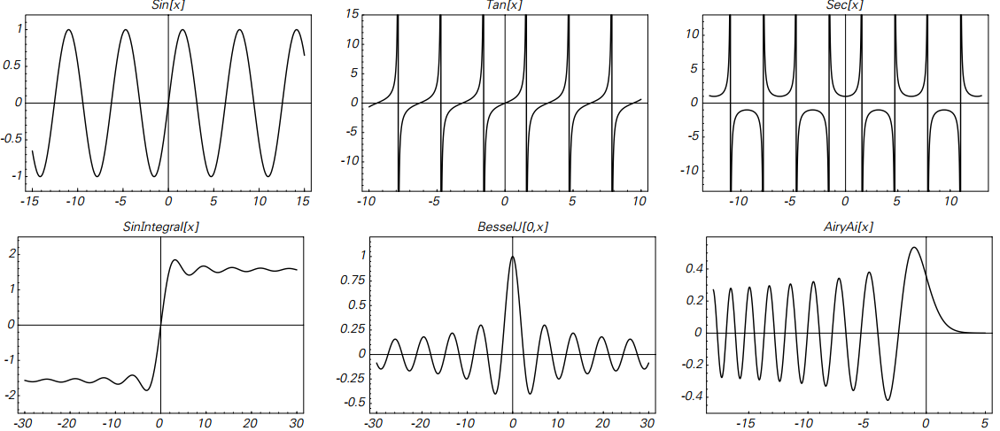
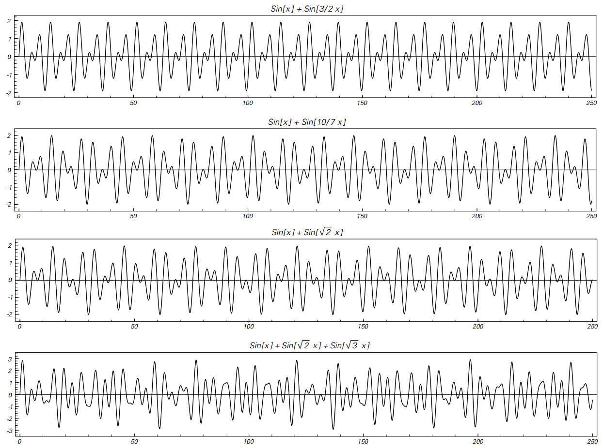
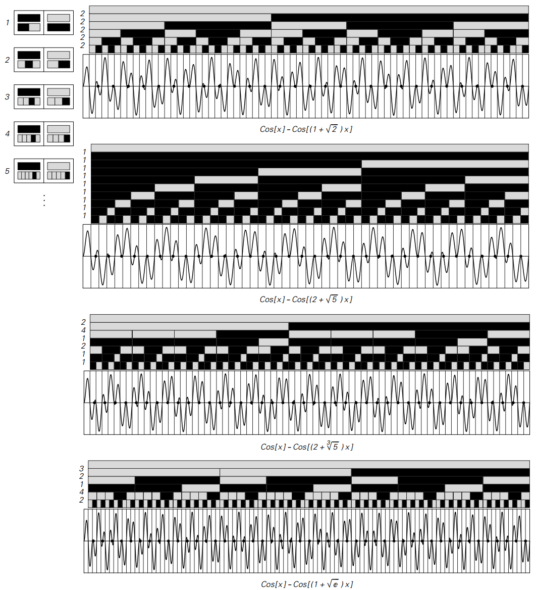
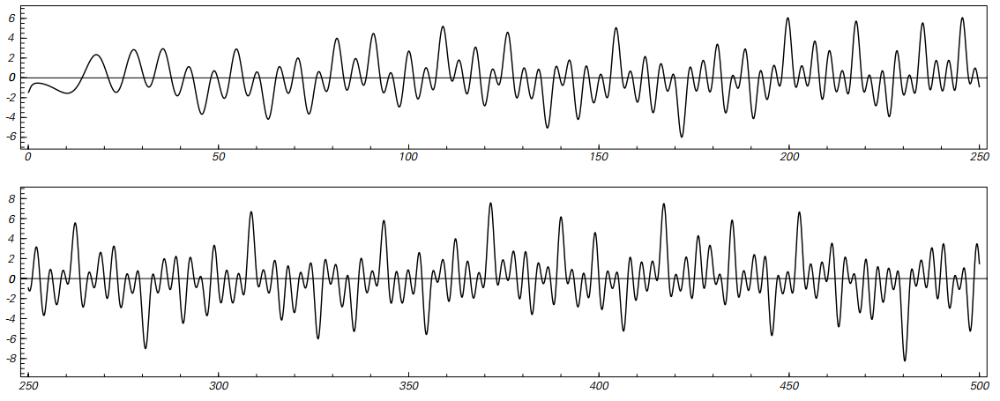

### 4.6  数学函数

上一节表明，通过应用各种简单的数学函数获得的各个数字可能具有相当复杂的特征。
但是这些函数本身呢？

下面的图片显示通过绘制标准数学函数获得的曲线。
所有这些曲线都非常简单，基本上是重复的形式。
事实证明，几乎所有在Mathematica中定义的标准数学函数都会产生类似的简单曲线。

>一些标准数学函数的图。
第一行显示了三个三角函数。
最后一行显示了数学物理学和其他传统科学领域经常遇到的三个所谓的特殊函数。
在所有情况下，所显示的曲线都具有相当简单的重复形式

但是如果我们看一下这些标准函数的组合，获得更复杂的结果相当容易。
下一页上的图片显示发生了什么，例如，如果将各种正弦函数加在一起。
在第一张照片中，曲线得到了一个相当简单的重复结构。
在第二张图中，曲线更复杂，但仍然具有整体重复结构。
但是在第三张和第四张照片中，没有这样的重复结构，并且实际上曲线在很多方面都是随机的。

（p145）

>将各种正弦函数相加得到的曲线。
在前两种情况下，曲线最终是重复的; 在后两种情况下，他们不是。
如果将其看作声音的波形，则这些曲线对应于和弦。
第一条曲线产生完美的五度音程，而第三条曲线产生减五度音程（或全音）。
（译注：音程为两个音级在音高上的相互关系。即两个音调的组合）

然而，在第三幅图中，曲线与轴线交叉的点以两个规则间隔的家族出现。
正如页面上的图片所示，对于任何曲线，例如这些交点的相对排列结果都与广义替代系统的输出有关，
其中每一步的规则都是从 (α-1)/(α+1) 的连续分数表示法得来。

（p146）

>通过加上或减去两个正弦或余弦函数获得的曲线变成具有可由广义置换系统再现的轴交叉的图案。
通常，当广义替换系统中的对应元素为黑色时，在一个区间内存在轴交叉，而元素为白色时不存在轴。
如果广义替代系统中的每个步骤都有一个规则，如左边所示的连续分数表示法中的一个术语所示。
在前两个示例中显示的是二次无理数，因此连续分数是重复的，并且获得的模式是纯粹嵌套的。
（第二个例子类似于第83页的斐波那契替换系统。）但是在最后两个例子中，没有这样的规律。
请注意，每个连续分数中的连续项与旁边的替代系统中的步骤一起显示在页面上。

（p147）

当α是一个平方根时，则如前一节所述，连续分数表示法是纯粹重复的，使生成的模式嵌套。
但是，当α不是平方根时，模式可能更复杂。
如果涉及两个以上的正弦函数，那么似乎不再与广义替换系统或连续分数有任何特别的联系。

在定义的所有各种数学函数中（如在Mathematica中的），
事实上在自然科学中也有一些（传统上不常见）产生复杂曲线，但似乎没有明确依赖于单个数字的表示。
其中很多与所谓的Riemann zeta函数有关，其中的一个版本如下图所示。

这个函数的基本定义非常简单。
但最终这个函数结果与质数的分布有关——它产生的曲线相当复杂。
事实上，尽管经过了数百年的数学努力，
但迄今为止甚至不可能建立例如所谓的黎曼假说，其实际上只是说曲线中的所有峰位于轴上方，并且所有的谷位于轴下方。

>与所谓的Riemann zeta函数相关的曲线。
zeta函数被定义为Zeta[s]=Sum[1/k^s,{k,∞}]。
这里显示的曲线是所谓的Riemann-Siegel Z函数，它本质上是Zeta[1/2+i*t]（虚数i）。
著名的黎曼假说实际上表明，在这条曲线中第一个之后的所有峰值都必须位于轴的上方。

（p148）
