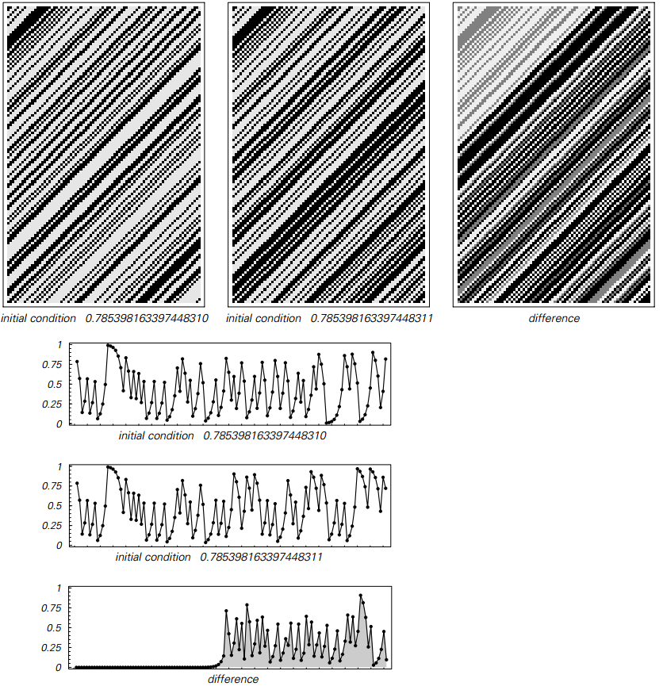
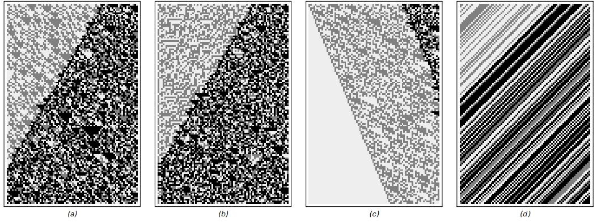

### 4.7  迭代映射和混沌现象

迭代映射的基本思想是取0到1之间的数字，然后按照固定规则或“映射”按照一系列步骤更新此数字。
我会考虑的许多映射可以用标准的数学函数来表示，但总的来说，
所需的一切就是映射采用0到1之间的任何可能的数字，并产生的也是0和1之间的某个确定数字。

接下来两页的图片显示了使用四种不同的映射选择获得的行为。

第一页上的例（a）和（b）显示了我们在本章的许多其他系统中看到的与数字序列和数字大小非常相似的复杂性。
情况（c）显示了数字序列的复杂性，但它产生的数字的大小很快趋向于0。
然而，情况（d）似乎基本上是微不足道的——在数字序列或数字大小中都没有显示复杂性。

在接下来的两页中的第一页中，所有示例都以数字1/2开始——它有一个简单的数字序列。
但接下来两页中第二页的例子却以数字π/ 4开始——它有一个看似随机的数字序列。

（a），（b）和（c）两个页面看起来非常相似，特别是在数字大小方面。
但情况（d）看起来完全不同。
对于第一页，它只是产生0。
但在第二页上，它产生的数字的大小以一种看似随机的方式不断变化。

如果我们看一下数字序列，那么为什么会发生这种情况是相当清楚的。
如图所示，在情况（d）中使用的所谓的移位映射仅用于在每个步骤将所有数字向左移动一位。
这意味着在系统演变的过程中，原始数字中进一步向右的数字将逐渐最终到达左侧——
因此，只要这些数字显示出随机性，就将导致生成的数字大小的随机性。

然而，认识到这一点非常重要，因为这个系统的发展实际上并没有产生任何随机性。
相反，只是插入到原始数字序列中的随机性显示在得到的结果中。

（p149）

>从简单的初始条件开始的迭代映射的例子。
每一步都有一个介于0和1之间的数字，通过应用固定映射进行更新。
这里考虑的四种映射在上面都以公式和图表的形式给出。
页面顶部的图片显示通过迭代此映射获得的连续数字的基本2位数字序列，而页面中间的图片绘制这些数字的大小。
在所有情况下，初始条件由数字1/2组成——具有非常简单的数字序列。
尽管如此简单，但情况（a）和（b）在数字序列和产生的数字大小方面都显示出相当大的复杂性（比较第122页）。
在情况（c）中，数字序列很复杂，但数字的大小趋向于零。
最后，在（d）的情况下，数字序列和数字的大小都不是微不足道的。
请注意，在上面的图片中，每个水平数字行对应于一个数字，左边的数字对这个数字的大小的影响越来越大。

（p150）

>与前一页同样的迭代映射，但现在初始条件是π/4——一个看似随意的数字序列。
经过相当少的步骤后，情况（a）和（b）产生的行为与面对页面上的简单初始条件几乎没有区别。
在情况（c）中，数字大小的指数衰减与之前相同。
但在（d）的情况下，行为要复杂得多。
事实上，如果仅仅考虑产生的数字的大小，那么就会看到与（a）和（b）情况相同的复杂性。
但是看数字序列，人们意识到这种复杂性实际上只是一个复杂性的直接转录，通过给出一个看似随机的数字序列的初始条件来引入。
情况（d）是所谓的位移映射——一个典型的系统示例，它表现出对通常称为混沌的初始条件的敏感依赖性。

（p151）

这与案例（a）和（b）中发生的情况非常不同。
因为在这些情况下，即使在前两页的第一页中也可以获得复杂且看似随机的结果——原始数字具有非常简单的数字序列。
关键是这些映射实际上本身就会产生复杂性和随机性; 当它们插入初始条件时，它们不会将其转录。

在本书中我开发的方法中，这种区分很容易理解。
但是用传统的数学方法，事情会变得很混乱。
在本章开头已经提到的主要问题是，在这种方法中，通常认为重要的数字的唯一属性是它们的大小。
这意味着任何基于讨论数字显式数字序列的问题——例如它们是简单的还是复杂的——往往看起来都是奇怪的。

事实上，从数量的角度来考虑数字，人们可能会想到，只要任何两个数字的大小足够接近，
就不可避免地导致结果在某种程度上也接近。
事实上，这就是例如传统数学中微积分形式主义的基础。

但是所谓的混沌现象的本质是，有一些系统对一个数字的大小进行极小的改变，但最终对产生的结果产生巨大的影响。
前面两页中作为情况（d）显示的转换图结果是这种情况的典型例子。

下一页顶部的图片显示，如果将这两个数字的大小相差仅十亿分之一，作为该系统的初始条件，会发生什么情况。
观察所产生的数字大小的情节，我们可以看到相当长的一段时间，这两种不同的初始条件导致无法区分的结果。
但在某种程度上他们产生分歧并且很快变得非常不同。

如果只看数字的大小，这似乎会相当神秘。
但只要看一下数字序列，它就会立即变得更加清晰。
正如在下一页显示的图片所示，用作初始条件的数字只有很小的数值才意味着它们的前几位数字是相同的。
有一段时间这些数字是重要的。
但是，由于系统的演变不断将数字向左移位，所以后面数字中存在的差异最终变得重要是不可避免的。

（p152）

>第150页和第151页上的情况（d）所示，对位移映射的初始条件进行小改动的效果。
第一张图显示了与第151页上相同的初始条件的结果。
第二张图显示了如果人们在这个初始条件下将数字的大小改变了十亿分之一。
左边的图表表明，在这两种情况下，通过系统演变获得的数字的大小是难以区分的。
但突然间结果出现分歧并变得完全不同。
看上面的数字序列显示了为什么发生这种情况。
重点是在初始条件下数字大小的小改变对应于右边数字的改变。
但是，系统的演变会逐渐将数字向左移位，以便最终不同的数字变得重要。
大量调查的混沌现象主要由这种效应组成。

初始条件的微小变化会导致结果发生较大变化的事实是一个有点有趣的现象。
但正如我将在第7章中详细讨论的那样，人们必须认识到，它本身无法解释为什么在任何特定情况下都会出现随机性或复杂性。
事实上，对于移位图，我们所看到的只是当给定的初始条件恰好是数字序列是随机的数字时才会出现随机性。

但在过去常常令人困惑的是，传统数学隐含地倾向于认为这种初始条件在某种意义上是不可避免的。
因为如果人们只是从数量的角度来考虑数字，人们就不应该区分足够接近的数字。
这意味着在选择像位移映射这样的系统的初始条件时，人们不应该将确切的数字1/2与尺寸足够接近1/2的数字区分开来。

（p153）

但事实证明，如果一个人随机抽取一个数字，但只限于其大小在一定范围内的约束条件，
那么数字得到的数字序列本质上是随机的。
如果使用这个数字作为换档映射的初始条件，那么结果也会相应随机，就像上一页中的结果一样。

在过去，这个事实有时被用来表明变换图以某种方式从根本上产生了随机性。
但正如我上面所讨论的那样，这样一个系统实际可以产生的唯一随机性是通过其初始条件的细节而明确加入的随机性。
这意味着任何声称系统产生随机性的主张都必须是关于通常为其提供初始条件细节的主张。

我想原则上可能是大自然会有效地遵循与传统数学相同的理想化，
并最终会根据它们的大小纯粹地选取数字。
如果是这样的话，那么这意味着像变换图这样的系统的初始条件自然会具有几乎总是随机的数字序列。

但是这种推理最终永远不会太有用。
因为它说的是我们看到的随机性来自已经存在的随机性——它并不能解释随机性来自哪里。
事实上，正如我将在第7章中讨论的那样——如果只看像变换图那样的系统，那么实际上就不会产生任何新的随机性。

但本书的一个重要发现是，像第150页和第151页上的（a）和（b）这样的系统可以表现出许多方面随机的行为，
即使它们的初始条件是非常简单的，没有任何随机性。

（p154）

然而，像（a）和（b）这样的系统即使从简单的初始条件也可以固有地产生随机性并不意味着它们也不显示对初始条件的敏感依赖性。
事实上，下面的图片说明，即使在这种情况下，数字序列的变化也会逐渐放大——就像在移位图（d）中一样。

>在本节中讨论的四个迭代映射的初始条件的小变化产生的数字序列的差异。
（a）（b）和（d）的情况表现出对初始条件的敏感依赖，
因为远离右侧的无意义数字的变化最终会影响所有数字。
情况（c）不显示对初始条件的敏感度，但总是发展为0，与其初始条件无关。

但是我将在第7章中讨论的关键点是，
在（a）和（b）这样的系统中敏感地依赖于初始条件决不意味着它是我们看到的随机性和复杂性的原因。
事实上，从数字序列的角度来看位移映射，这表明我们认为，这种现象本身对我们可以合理地考虑随机性的产生原因是没有贡献的。

