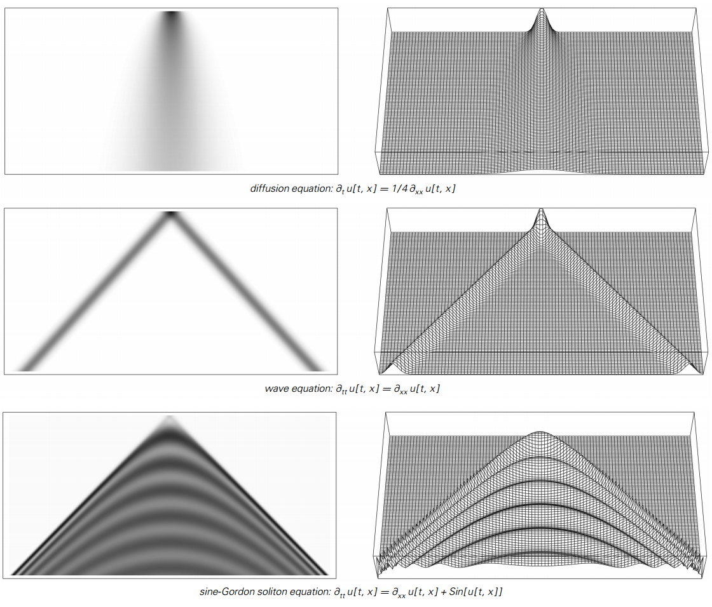
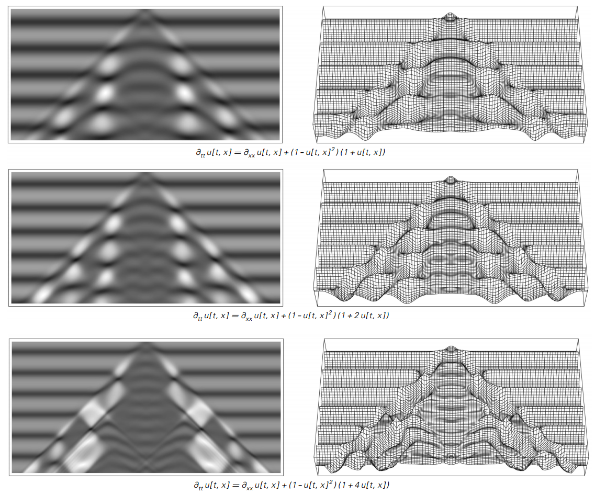
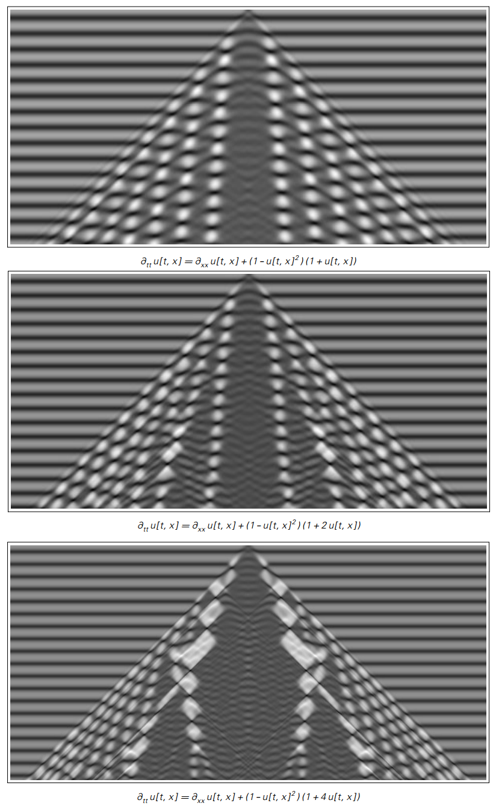

### 4.9  偏微分方程

通过引入具有连续范围的灰度级的连续元胞自动机，
我们成功地去除了普通元胞自动机中存在的一些离散性。
但是仍然存在很多离散性：因为连续的元胞自动机仍然由离散单元构成，
这些离散单元在离散时间步骤中被更新。

那么人们是否可以构建绝对没有这种离散性的系统呢？
事实证明，答案至少在原则上是可以的，尽管这样做需要比本书中迄今为止需要的更高水平的数学抽象。

其基本思想是想象一个数量如灰度级可以设置为在空间和时间上连续变化。
而这意味着，不是在离散的时间步中在离散单元格中具有灰度级，
而是假设在绝对空间中的每个点处以及时间上的每个时刻都存在确定的灰度级，
就好像一个人获得了无限的极限元胞和时间步骤的集合，每个细胞都是无限小的尺寸，
并且每个时间步长持续无穷小的时间。

但是，如何给这种系统的演变规则？ 没有明确的时间步骤来处理，我们必须指定灰度级在空间每个点随时间变化的速率。
通常我们将这个比率作为一个简单的公式，它取决于空间中每个点的灰度级，以及该灰度级随位置变化的速率。

这些规则在数学中被称为偏微分方程，事实上它们已经被广泛研究了大约两百年。
事实上，几乎所有在物理学和其他科学领域中使用的传统数学模型最终都是基于偏微分方程。
例如，电磁学的麦克斯韦方程，爱因斯坦的引力方程，
量子力学的薛定谔方程和神经细胞电化学的霍奇金-赫胥黎方程都是偏微分方程的例子。

从某种意义上说，涉及如此高水平数学抽象的系统应该在实践中得到如此广泛的应用。
正如我们将在本书后面看到的那样，从本质上讲，这些抽象并不是根本性的。

（p161）

而且我怀疑实际上目前偏微分方程的优势在很多方面都是历史事故——而且如果计算机技术是在数学史上较早开发的，
现在情况可能就会有很大的不同。

但特别是在计算机之前，偏微分方程的巨大吸引力在于，至少在简单的情况下，可以找到明确的数学公式来表明他们的行为。
这意味着仅仅通过评估一个单一的数学公式就可以计算出空间和时间特定点的灰度级，而不必遵循偏微分方程的完整演化。

下一页的图片显示了三年来一直在研究的常见偏微分方程。

第一张图片显示了扩散方程，它可以被看作是第156页上的连续元胞自动机的一种限制情况。
它的行为总是非常简单：任何初始灰度逐渐扩散开来，因此最后只剩下均匀的白色。

第二张照片显示波动方程。
通过这个等式，所显示的最初的灰色块可以分成两个相同的片段，它们左右传播而不改变。

第三张图片显示了sine-Gordon方程。
这会导致比其他方程略微更复杂的行为——尽管它产生的模式仍然具有简单的重复形式。

考虑到已经在偏微分方程上完成的数学工作量，人们可能会认为现在已经研究了大量不同的方程。
但事实上，几乎所有的工作——至少在一个方面——都集中在下一页上的三个特定方程式，
以及几个与它们基本相同的其他方面。

正如我们所看到的，这些方程只产生简单的行为。

（p162）

>三个历史广泛研究的偏微分方程。
就像本书中的其他图片一样，位置贯穿整个页面，并沿着页面延时。
在每个方程中，灰阶是某一点dt(u)的灰阶，是灰阶随时间的变化率dtt(u)（微分），是该变化率（二阶导数）的变化率。
同样，空间位置dx(u)的变化率是该变化率dxx(u)的变化率。
在这个页面上，遵循初始条件的是u=e^(-x^2)，dt(u)=0。

（p163）

那么事实上，在偏微分方程中可能会出现更复杂的行为吗？
本书关于其他类型系统的结果强烈表明它应该是。
但传统的数学方法对如何找到这种行为几乎没有提供指导。
事实上，似乎最好的方法本质上只是搜索许多不同的偏微分方程，寻找那些表现出复杂行为的方法。

但直接困难在于没有明显的方法来对可能的偏微分方程进行取样。
在诸如元胞自动机的离散系统中，总是存在一组离散的可能规则。
但是在偏微分方程中可以出现任何数学公式。

尽管如此，通过将公式表示为具有离散可能分量集的符号表达式，可以设计出至少一些用于采样偏微分方程的方案。

但即使给定一个特定的偏微分方程，也不能保证该方程将产生自洽的结果。
事实上，对于随机选择的偏微分方程的很大一部分，人们发现在短时间内，
灰度级变得无限大，或者开始在空间或时间上无限快速地变化。
每当发生这种现象时，原始方程就不能再用于确定未来的行为。

但是，尽管存在这些困难，我终于能够找到接下来两页中显示的偏微分方程。

这些方程的数学表达相当简单。 但正如照片所示，他们的行为非常复杂。

事实上，奇怪的是，即使基础方程是连续的，它们产生的模式似乎涉及具有不连续结构的补丁。

但是接下来两页的图片要说明的是，我们在本书中看到的那种复杂行为决不局限于基于离散元素的系统。
在这些离散系统中发现和研究这种行为肯定容易得多，但从我们在本节学到的知识中，
我们现在知道，在完全连续的系统中也会发生同样的行为，例如偏微分方程。

（p164）

>我发现有更复杂的行为的偏微分方程的例子。
每种情况下的背景纯粹是重复的，但是模式的主要部分是复杂的，
并且让人想起本书中讨论的连续元胞自动机和许多其他类型系统产生的东西。

（p165）

>在较长时间内解决与上一页相同的等式。
注意离散结构的外观。
特别是在最后的图片中，一些细节对用于计算等式的解的数值近似方案敏感。

（p166）
