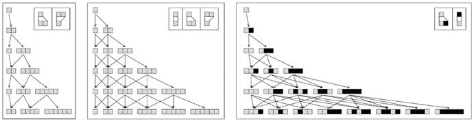
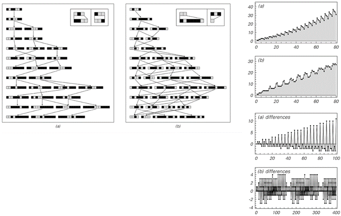

### 5.6  多向系统

我们在上一节中讨论的网络系统并没有在空间上形成任何基本的元素网格。但从某种意义上说，它们仍然具有简单的一维时间状态排列。事实上，本书到目前为止我们所考虑的所有系统都可以认为在时间上具有相同的简单结构，因为它们最终都是逐步从一个状态演化到下一个状态。

然而，多向系统的定义使得它们在任何给定的步骤中不仅可以有一个状态，而是可以有一系列可能的状态。

下面的图片显示了这种系统的一个非常简单的例子。

系统中的每个状态都由一系列元素组成，在图片所示的特定情况下，规则指定在每个步骤中，这些元素要么保持不变，要么被一对元素替换。从一个由单个元素组成的状态开始，图片显示应用这些规则会立即产生两种可能的状态：一种是包含一个元素的状态，另一种是包含两个元素的状态。

多向系统通常可以使用任何定义序列中元素块替换的规则集。当我们在第88页讨论顺序替换系统时，我们已经看到了这类规则的确切例子。但在顺序替换系统中，思想是在每个步骤中只进行一次替换。而在多向系统中，思想是在每个步骤中进行所有可能的替换——然后保留所有生成的可能的不同序列。

>一个非常简单的多向系统，其中每个序列中的一个元素在每个步骤中被一个或两个元素替换。多向系统的主要特征是保留所有产生的不同序列。

(p 204)

下面第一组图片展示了一些非常简单规则下的结果。在每个例子中，行为结果相当简单——例如，可能的序列数量总是从一步到下一步均匀增加。

然而，一般来说，这个数量不必表现出如此均匀的增长，下面第二组图片展示了出现波动的例子。

>简单多向系统的例子。在这三个系统中，第t步的不同序列数量分别是Ceiling[t/2]、t和Fibonacci[t+1]（它大约以1.618^t的速度增加）。

>行为稍微复杂一点的多向系统例子。右侧的图表显示了每一步获得的可能状态的总数，以及这些数字从一步到下一步的差异。在这两种情况下，都观察到了基本重复的行为，分别每40步和161步重复一次。请注意，在情况(a)中，第t步的可能状态总数大约以t^2的速度增加，而在情况(b)中，它只以t的速度增加。

(p 205)

但在这两种情况下，这些波动最终都会在不久之后重复出现。下面的图片展示了一个看起来更随机的例子。但即便如此，人们也会发现最终又出现了本质的重复——尽管现在只是每1071步重复一次。

>一个表现出一定随机性迹象的多向系统。这个系统的规则涉及三种可能的替换。请注意，第一种替换只移除元素而不插入新元素。因此，在图片中，有时会出现包含零个元素的序列。至少在使用这里给出的初始条件时，尽管早期看起来相当随机，但元素数量的差异（偏移1）确实每1071步重复一次。

(p 206)

如果观察许多多向系统，大多数要么迅速呈指数增长，要么根本不增长；像对面页面上所见的缓慢增长是相当罕见的。事实上，即使这种增长导致了一定程度的随机性，它最终也似乎会表现出某种形式的重复。然而，如果允许更快的增长，那么很可能开始出现各种永远不会表现出任何规律性的多向系统。但在实践中，研究这类多向系统往往相当困难——因为它们生成的状态数量很快就会变得太大而无法处理。

然而，只需观察早期步骤中出现的状态，就可以对这些系统的行为有所了解。下面的图片展示了一个例子——最终表现出相当简单的嵌套行为。

下一页的图片展示了更多例子。有时，在特定步骤生成的状态集合会表现出本质的重复——尽管周期往往很长。有时，这个集合实际上包含了大量给定长度的可能数字序列——因此本质上显示了嵌套。但在其他情况下，至少暗示了更加复杂的结构——尽管状态的总数可能仍然增长得相当平稳。 

第205页展示了一个简单多向系统连续步骤生成的状态集合，该系统具有快速增长的特点。这里使用的特定规则最终生成了所有以白色单元格开头的状态。在第t步，有Fibonacci[t+1]个状态；一个具有m个白色单元格和n个黑色单元格的给定状态出现在第2m+n-1步。

(p 207)

仔细查看前几页[204、205、206、207]上多向系统演化的图片，人们会注意到一个特点，即相同的序列经常出现在几个不同的步骤中。然而，多向系统基本设置的一个结果是，每当出现任何特定序列时，它都必须导致完全相同的行为。

因此，这意味着完整的演化可以用对面页面顶部的图片来表示，其中每个序列只明确显示一次，任何生成超过一次的序列仅通过指向其首次出现的箭头来表示。

>各种多向系统演化过程中特定步骤生成的状态集合。规则(k)已在上一页展示；规则(d)和(f)在第205页。

(p 208)

但无需如此安排图片：因为从某种意义上说，多向系统的整体行为只需通过给出什么序列导致什么其他序列的网络就可以被捕获。下面第二组图片展示了构建这样一个网络的不同阶段。我们看到的是，正如我们在上一节讨论的网络系统可以在空间中构建自己的连接模式一样，多向系统也可以在时间上有效地构建自己的连接模式——而且这个模式往往相当复杂。

>一个多向系统的演化过程，首先是每一步都明确显示每个序列，然后是每个序列只显示一次。

>多向系统从页面顶部开始演化所构建的网络。这个网络实际上代表了多向系统状态之间在时间上的连接网络。

