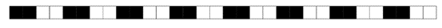
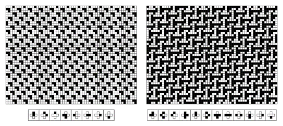

### 5.7  基于约束的系统

在本书中，我们探讨了许多不同类型的系统。但从一个方面来看，所有这些系统最终都是以相同的基本方式建立的：它们都是基于明确的规则，这些规则规定了系统如何从一步发展到下一步。

然而，在传统科学中，人们通常考虑以完全不同方式建立的系统：这些系统不是通过明确的规则来演化，而是被赋予了一些需要满足的约束条件。

以一个简单的例子来说明，设想有一排细胞，每个细胞都被染成黑色或白色，并且颜色的排列受到一个约束条件的限制，即每个细胞都必须恰好有一个黑色和一个白色的邻居。仅知道这个约束条件并不能给出确定每个细胞颜色的明确程序。事实上，最初可能并不清楚是否存在任何能够满足这个约束条件的颜色排列。但事实证明，确实存在这样的排列，如下图所示。

在看到这张图片后，人们可能会想象还有其他许多模式也能满足这个约束条件。毕竟，这个约束条件是针对相邻细胞的，所以人们可能会认为，足够远的模式部分应该是相互独立的。但事实并非如此，相反，这个系统的工作方式有点像拼图游戏，其中每块拼图只能以一种方式拼合。最终，只有下面显示的这种完全重复的模式才能在每个细胞上都满足所需的约束条件。

然而，其他约束条件可能会允许更多的自由度。例如，如果约束条件是每个细胞都必须至少有一个颜色与其不同的邻居，那么对面页面顶部的图片中的任何模式都是允许的，实际上，任何涉及不超过两个连续相同颜色细胞的模式也都是允许的。

>一个系统由一行黑白细胞组成，其形态由每个细胞必须恰好有一个黑色和一个白色邻居的约束条件决定。所示的模式是满足这一约束条件的唯一可能模式。在传统科学和数学中，通过给出系统必须满足的约束条件来隐式地确定系统行为的思想是很常见的。

(p 210)

但虽然下面显示的第一个颜色排列看起来有些随机，但最后两个则简单且纯粹重复。

那么，其他约束条件的选择又如何呢？我们在本书中看到了许多例子，其中简单的规则集导致了高度复杂的行为。但是基于约束的系统又如何呢？是否存在简单的约束集可以迫使形成复杂的模式？

事实证明，在一维系统中并不存在这样的约束集。因为在一维中，可以证明任何可能满足的局部约束集都可以通过某种简单且纯粹重复的颜色排列来满足。

但二维系统又如何呢？一维的证明在二维中不成立，因此至少可以想象简单的约束集可能会迫使形成复杂的模式。

作为二维系统的第一个例子，考虑一个黑白细胞阵列，其中施加了这样的约束：每个黑色细胞必须恰好有一个黑色邻居，而每个白色细胞必须恰好有两个白色邻居。

>一个系统由一行黑白细胞组成，其形态由每个细胞至少应有一个颜色与其不同的邻居的约束条件决定。有许多可能的颜色排列满足这一约束条件。其中一些，如上面的第一个排列，看起来相当随机。但其他排列，如上面的后两个排列，则简单且重复。事实证明，在一维系统中，没有一组局部约束能够迫使形成更复杂的排列。

>一个由黑白细胞网格组成的系统，其定义是每个黑色细胞在其四个邻居中必须恰好有一个黑色邻居，而每个白色细胞则必须恰好有两个白色邻居。这里展示的无限重复模式（及其旋转和反射）是唯一满足这一约束的模式。（假设图片在每个边缘都是环绕的。）该模式可以看作是5x5细胞块的镶嵌。

(p 211)

与一维系统类似，知道约束条件并不能立即提供一个满足该条件的模式搜索程序。但稍加实验就会发现，上面这个简单的重复模式满足约束条件，而且实际上是唯一满足条件的模式。

>满足约束条件的模式规定每个黑色细胞和每个白色细胞都必须有固定数量的黑色和白色邻居。右上方的空白矩形表示没有任何模式能满足的约束条件。大多数约束条件都可以通过单个模式（及其旋转和反射）来满足。在某些情况下，可能存在两种不同的模式，而在少数情况下，可能存在无限多种模式。在所有约束条件可以得到满足的情况下，一个简单的重复模式就足够了。

(p 212)

那么其他约束条件又如何呢？对面页面上的图片以示意图的方式展示了当约束条件要求每个细胞具有不同数量的黑色和白色邻居时会发生什么情况。

可以看到几种不同的结果。在右上角显示为空白矩形的两个案例中，没有任何模式能满足约束条件。但在其他所有情况下，虽然通常只有一个或有时两个简单的无限重复模式能满足约束条件，但这些约束条件都是可以得到满足的。在中间显示的三个案例中，存在一系列由不同重复模式混合而成的可能性。但最终，在所有能够形成某种模式的案例中，一个简单的重复模式就足够了。

那么更复杂的约束条件又如何呢？下面的图片展示了基于要求每个细胞周围的局部颜色排列必须与一组固定的可能模板相匹配的约束条件的示例。

总共有4,294,967,296种可能的模板组合。其中，有766,979,044种组合导致的约束条件无法被任何模式满足。但在剩余的3,527,988,252种组合中，每一种都可以通过一个简单的重复模式来满足。事实上，实际需要的不同重复模式的数量相当小：如果某个特定的约束条件能被任何模式满足，那么下一页[214, 215]上列出的171种重复模式中的一种就总是足够的。

>系统由约束条件指定，要求每个细胞周围的局部颜色排列必须与所示的一组固定可能模板相匹配。请注意，这些模板适用于每个细胞，并且相邻细胞的模板会重叠。模式（a）可以看作是由5x10个细胞块组成的镶嵌图案；模式（b）则是由24x24个细胞块组成的镶嵌图案。使用下一页[214, 215]上用于约束条件的编号方案，这里显示的案例分别对应于1384774和328778790。

(p 213)

>(p 214)

>这是所有171种模式的完整集合，用于满足上一页所示类型的约束条件。如果这171种模式中的任何一种都不能满足某个特定的约束条件，那么就没有任何模式能满足该约束条件。这些模式用数字进行标记，这些数字指定了需要给定模式的最小约束条件。没有展示通过整体反射、旋转或黑白互换而不同的模式。

(p 215)

那么，如何迫使更复杂的模式出现呢？

基本答案是，必须至少稍微扩展所考虑的约束类型的范围。实现这一点的方法之一是，不仅要求每个细胞周围的颜色与一组模板相匹配，还要求这组模板中的某个特定模板必须至少出现在细胞阵列的某个位置。

下面的图片展示了由这种类型的约束条件确定的一些模式示例。一个典型特征是，这些模式被分成几个独立的区域，通常是从某种中心散发出来的。但至少在以下所有示例中，每个单独区域中出现的模式仍然是简单且重复的。

那么，如何找到能迫使更复杂模式出现的约束条件呢？这相当困难，事实上，它几乎需要与本书中任何其他单一结果相同的计算量。

基本问题是，给定一个约束条件，要找出能满足该约束条件的模式（如果有的话）可能极为困难。

在像元胞自动机这样的基于明确规则的系统中，总是可以直接取规则并应用它来查看生成了什么模式。但在基于约束的系统中，没有这样的直接程序，相反，人们实际上必须跳出系统来找出可能出现的模式。

>这些例子展示了由系统产生的模式，其中不仅每个邻域中颜色的排列必须匹配一组固定模板中的一个，而且这组模板中的某个特定模板在模式中至少出现一次。约束条件像以前一样用数字编号，并且在每张图片中，必须出现的模板都显示在中心。约束条件1125528937产生了一个在98×98块中重复的模式。最后展示的模式也是重复的，在对角线上每56个单元格重复一次。

(p 216)

最直接的方法可能是枚举每一种可能的模式，然后查看哪些（如果有的话）满足特定的约束条件。但在包含多于几个单元格的系统中，可能模式的总数绝对是天文数字，因此枚举它们变得完全不切实际。

一个更实际的选择是迭代地构建模式，从小区域开始，然后在每个阶段以基本上所有可能的方式添加新的单元格，如果系统的约束条件最终没有得到满足，则回溯。

下一页的图片展示了通过这种方法产生的几个模式序列。在某些情况下，很快就会出现满足约束条件的简单重复模式。但在其他情况下，为了找到任何合适的模式，必须检查大量的可能性。

那么，如果根本没有模式可以满足特定的约束条件怎么办？人们可能会认为，为了证明这一点，实际上需要检查无限单元格网格上的每一个可以想象的模式。但事实上，如果能够证明在有限区域内没有满足约束条件的模式，那么就证明了在整个网格上也没有模式可以满足约束条件。事实上，对于许多约束条件，已经存在相当小的区域，可以证明在这些区域内找不到任何模式。

但偶尔，就像下一页的第三幅图所示，人们会遇到只能在包含数千个单元格的区域中满足，而无法在整个网格上满足的约束条件。分析这种情况不可避免地需要检查大量可能的模式。

但是，通过适当的一系列技巧，最终可以对几乎所有这里讨论的类型的系统进行分析，并确定是否存在满足其约束条件的模式，以及该模式是什么。

那么，可能需要哪些类型的模式呢？在绝大多数情况下，只有简单的重复模式或此类模式的混合是必需的。

(p 217)

但是，如果有人系统地按照第214页和第215页所示的顺序检查可能的约束条件，那么在检查了超过1800万个约束条件后，人们最终会发现对面页面上所示的系统。在这个系统中，与之前的所有系统不同，不存在重复的模式；唯一满足约束条件的模式是非重复嵌套模式，如图所示。

因此，在测试了数百万个约束条件和数十亿个候选模式后，最终可以确定，基于这里讨论的简单约束条件的系统可以被迫展现出比纯重复更复杂的行为。

>寻找满足约束条件的模式的阶段，(a) 4670324，(b) 373384574，(c) 387520105。灰色用于表示颜色尚未确定的单元格。在每个情况下，第一阶段对应的单元格的颜色可以立即从中心处特定模板的存在推断出来。在情况(a)中，可以直截了当地选择额外的单元格，并且可以在没有回溯的情况下构建出无限的正则模式。在情况(b)中，必须尝试许多额外的单元格选择，并进行大量回溯，最终自动程序未能找到重复模式。然而，如最后阶段所示，实际上确实存在一个重复模式。在情况(c)中，自动程序找到了一个相当大且几乎正则的模式来满足约束条件，但事实证明不存在无限模式。

(p 218)

>基于约束条件的最简单的非重复模式系统，该约束条件要求每个单元格周围的颜色排列必须与显示的12个模板之一匹配，并且在模式中的至少某个位置必须出现一个包含一对堆叠黑色单元格的模板。在之前页面上使用的编号方案中，该约束条件的编号为18762389。所示的模式是唯一的，因为除了微不足道的平移之外，其任何变体都无法满足约束条件。对角线上的嵌套结构基本上对应于正数和负数的二进制数字序列的进展。

(p 219)

关于更复杂的行为呢？

总共有137,438,953,472种类似于第216页上显示的约束条件。在我测试的数百万种约束条件中，没有任何一种能迫使系统产生比前一页上看到的嵌套行为更复杂的行为。但是，如果我们再次扩展所考虑的约束条件的类型，就有可能构造出迫使系统产生更复杂行为的例子。

基本思路是建立涉及完整3x3单元格块的模板，包括对角线邻居。下面的图片则展示了这样一个系统的例子，通过仅允许一组特定的33个模板，迫使系统产生一个嵌套模式。

关于更复杂的模式呢？ 搜索尚未成功找到任何结果。但是，基于与一维元胞自动机的对应关系进行的明确构造，得出了对面页面顶部的示例：一个包含56个允许模板的系统，其中唯一满足约束条件的模式是复杂且基本随机的模式，该模式源自规则30元胞自动机。

>基于涉及3x3单元格模板的约束条件的系统示例。在这个特定系统中，仅允许出现上面显示的33个模板（在512个可能的模板中）。这个约束条件，加上第一个模板必须在某处出现的要求，结果迫使系统产生一个嵌套模式。所示的系统是特别根据规则60基本一维元胞自动机构造的。

(p 220)

因此，这最终表明，在基于约束条件的系统中，确实有可能迫使复杂行为发生。但从我们在本节中所看到的情况来看，这种行为似乎相当罕见：与我们在这本书中讨论的许多简单规则不同，几乎所有简单的约束条件似乎都只会导致相当简单的模式。

任何基于规则的现象最终都可以从约束条件的角度来描述。但本节的结果表明，为了产生复杂行为，这些描述可能相当复杂。因此，传统科学和数学倾向于集中研究像约束条件一样起作用的方程，这又为它们未能识别出我在本书中讨论的复杂性这一基本现象提供了另一个原因。

>一个基于约束条件的系统，其中被迫产生一个复杂且基本随机的模式。该约束
条件规定，在模式中的任何位置，只能出现左侧所示的56个3x3模板，且第一
个模板至少出现一次。为了满足这一约束条件所需的模式，对应于由规则30基
本一维元胞自动机的演化所产生的模式的移位版本。

(p 221)
