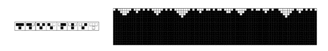
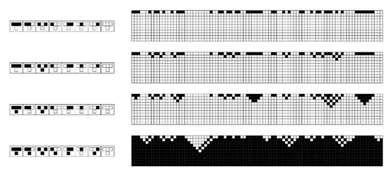
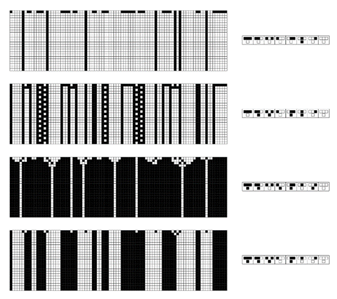
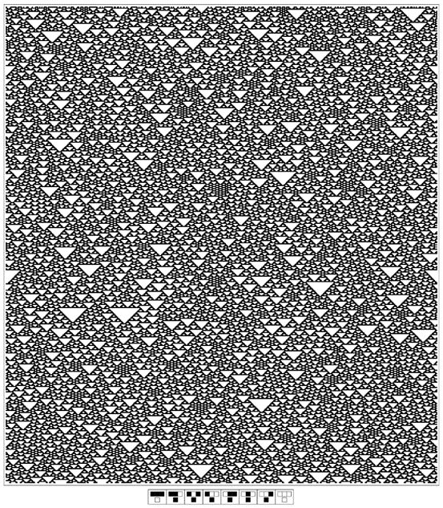
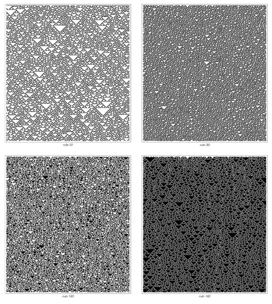
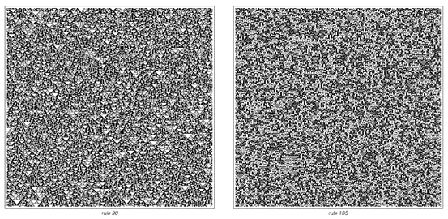
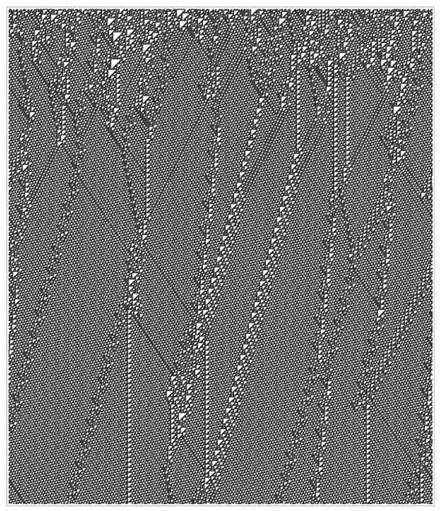
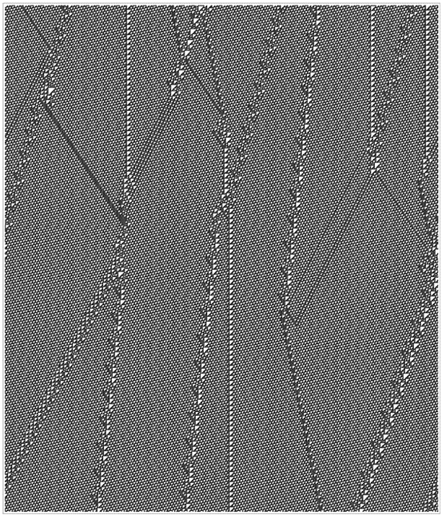

### 6.1  秩序的出现

在过去的几章中，我们已经见识了许多简单程序能够产生的行为实例。尽管我们讨论了一系列不同种类的底层规则，但大多数情况下，我们仅考虑了最简单的初始条件——例如，我们通常从只有一个黑色单元格开始。

本章的目的是走向另一个极端，并考虑完全随机的初始条件，例如，每个单元格都随机选择为黑色或白色。

人们可能会认为，从这种随机性出发，永远不会出现任何秩序。但事实上，我们将在本章中发现，许多系统都会自发地组织起来，即使初始条件是完全随机的，它们最终产生的行为也会具有许多非随机的特征。

下一页顶部的图片给出了一个简单的初步例子，这是一个元胞自动机，它从典型的随机初始条件开始，然后根据一个非常简单的规则沿页面向下演化：如果某个单元格的任何一个邻居是黑色的，则该单元格变为黑色。

图片随后显示的是，初始条件中存在的每一个白色区域都逐渐被黑色填充，最终只剩下所有单元格都是黑色的均匀状态。

(p 223)

下面第二组图片展示了其他元胞自动机表现出相同基本现象的示例。在每种情况下，初始条件都是随机的，但系统仍然会迅速自我组织，最终变成完全白色或完全黑色的统一状态。

对面页面展示的是表现出稍微复杂行为的元胞自动机。从随机初始条件开始，这些元胞自动机也会迅速稳定下来。但现在这些稳定状态不仅仅是颜色统一，而是涉及一系列确定的结构，这些结构要么在连续步骤中保持不变，要么周期性地重复。

那么，如果它们有简单的底层规则，是否所有从随机初始条件开始的元胞自动机最终都会稳定下来，并呈现出某种看似简单的状态呢？

 
> 当从任何随机初始条件开始时，一个元胞自动机会进化到一个简单的统一状态。这个规则首先在第24页展示过，在第53页描述的方案中编号为254。它规定，只要某个单元格的任何一个邻居已经是黑色的，该单元格就应该变成黑色。

 
>从随机初始条件演化到完全统一状态的四个元胞自动机示例。这里显示的规则分别对应编号0、32、160和250。

(p 224)

事实表明，并非所有元胞自动机都会如此。实际上，下一页的图片展示了众多示例之一，其中从随机初始条件开始，系统会持续表现出非常复杂的行为，且这种行为在许多方面看起来完全是随机的。但仔细观察图片，可以发现许多明确的白色三角形和其他小结构，这表明至少存在一定程度的组织性。

 
>从随机初始条件演化以产生一组确定简单结构的元胞自动机示例。对于任何特定的规则，这些结构的形式总是相同的。但它们的位置取决于给定的初始条件的细节，在许多情况下，最终的结构布局可以被视为初始条件的一种过滤版本。例如，在这里展示的第一个规则中，只要初始条件中存在孤立的黑色单元格，就会出现由黑色单元格组成的结构。显示的规则编号分别为4、108、218和232。

(p 225)

 
>一个元胞自动机永远不会稳定下来，而是继续表现出在许多方面看似随机的行为。该规则的编号是126。

(p 226)

 
>从随机初始条件开始，永远不会稳定下来的元胞自动机的其他示例。每幅图片总共包含300个单元格。请注意，在所有图片中都散布着三角形和其他小结构。

(p 227)

下面和前一页的图片展示了更多具有类似行为的元胞自动机示例。在每个情况下产生的模式中都有相当大的随机性。但尽管存在这种随机性，在系统的演化过程中总是会出现三角形和其他小结构。

那么，从随机初始条件开始的元胞自动机的行为可以有多复杂呢？我们已经看到了一些例子，其中行为很快稳定下来，而另一些则永远保持相当随机。但从某种意义上说，最大的复杂性在于这两个极端之间——在那些既不完全稳定，也不永远表现出接近均匀随机性的系统中。

对面页面和下一页展示了我们首先在第32页讨论的元胞自动机作为示例。使用的初始条件再次完全是随机的。但元胞自动机迅速自我组织成一组确定的局部结构。然而，现在这些结构不仅保持固定，而且还以复杂的方式移动并相互作用。其结果是形成了一种将有序和随机混合在一起的复杂模式——这是我们在本书中见过的最复杂的东西。

 
>另外两个元胞自动机生成了各种小结构，但继续表现出看似永远相当随机的行为。

(p 228)

 
>从随机初始条件开始的规则110元胞自动机的复杂行为。系统迅速自我组织以产生一组确定的局部结构，然后这些结构以复杂的方式移动并相互作用。

(p 229)

 
>这是前一页图案的延续。每页展示了元胞自动机演化过程中的700个步骤。

(p 230)	

 

