### 6.2  四类行为

在上一节中，我们了解了如果从随机初始条件开始，许多特定的元胞自动机会产生什么结果。但在本节中，我想提出一个更一般的问题：当从随机初始条件开始时，任意元胞自动机会产生什么结果?

人们可能首先会认为，这样一个一般性的问题永远不可能得到有用的答案。毕竟，毕竟每个元胞自动机最终都有一个不同的底层规则，具有不同的特性和潜在的不同结果。

但接下来的几页（第232、233、234页）展示了各种元胞自动机序列，都是从随机初始条件开始的。

虽然事实上，对于几乎每个规则产生的特定模式都至少有些不同，但当人们将所有规则放在一起看时，就会发现一些非常显著的事情：尽管每个模式在细节上都有所不同，但从根本上不同的模式类型的数量却非常有限。

事实上，在所有的元胞自动机中，似乎产生的模式几乎总是可以很容易地归入下面所示的四个基本类别之一。

这些类别按照复杂性的增加顺序进行编号，每个类别都有一些明显的独特特征。

在第一类中，行为非常简单，几乎所有的初始条件都会导致完全相同的均匀最终状态。

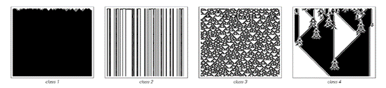
 
>在元胞自动机从随机初始条件演化的过程中，这四个基本行为类别的例子。我于1983年首次提出了这种分类方法。
(p 231)

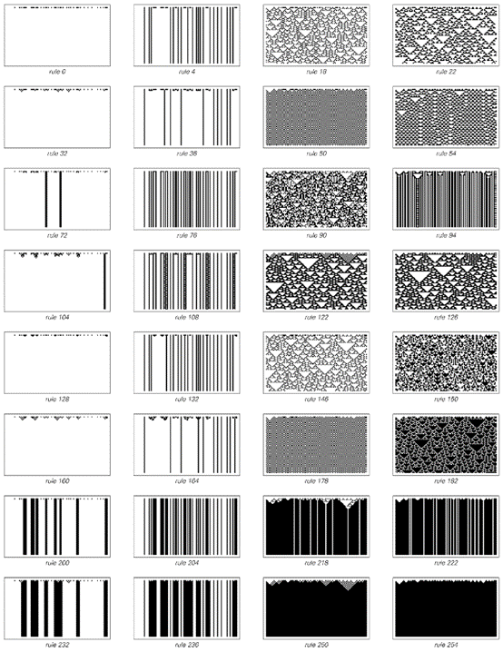

>所有只涉及对称的最近邻、每个单元格有两种可能的颜色且保持仅由白色单元格组成的状态不变的元胞自动机的行为。

(p 232)
 
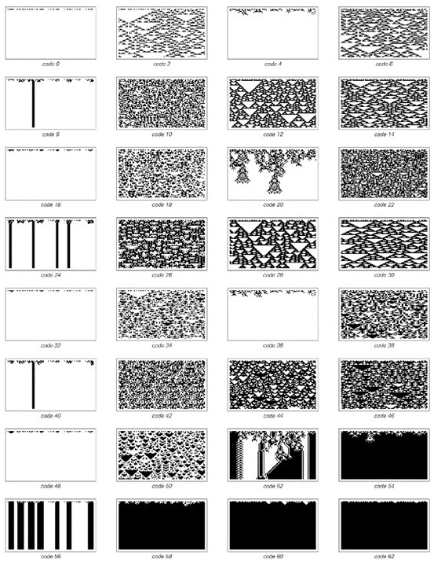

涉及最近邻和次近邻的全局性元胞自动机，其中每个单元格有两种可能的颜色。

(p 233)

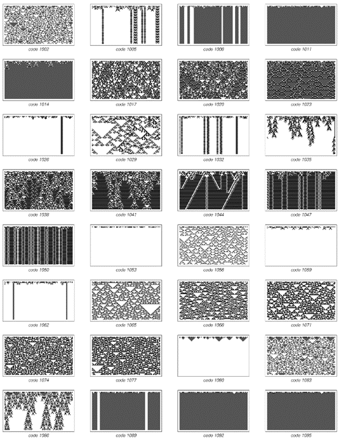
 
>一系列仅涉及最近邻的全局性元胞自动机，但每个单元格可以有三种可能的颜色。

(p 234)

在第二类中，有许多不同的可能的最终状态，但它们都只由一组简单的结构组成，这些结构要么永远保持不变，要么每隔几步就重复一次。

在第三类中，行为更为复杂，从许多方面来看似乎是随机的，尽管三角形和其他小规模结构在某种程度上总是存在的。

最后，正如接下来几页（第236、237、238、239页）所示，第四类涉及有序和无序的混合：产生的局部结构本身相当简单，但这些结构以非常复杂的方式移动并相互作用。

我最初是在大约十九年前通过查看数千张类似于最后几页（第232、233、234页）的图片来发现这四类行为的。起初，就像我在这里所做的那样，我纯粹是根据我所看到的模式的总体外观来进行分类的。

但是，当我研究元胞自动机的更详细属性时，我发现这些属性中的大多数与我已经确定的类别密切相关。事实上，在试图预测特定元胞自动机的详细属性时，通常只需要知道该元胞自动机属于哪个类别就足够了。

从某种意义上说，这种情况与将材料分为固体、液体和气体，或将生物分为植物和动物的情况类似。起初，分类纯粹是基于一般外观。但后来，当更详细的属性变得已知时，这些属性与已经确定的类别之间存在相关性。
通常，可以使用这些详细属性来对原始类别进行更精确的定义。然后，所有合理的定义通常都会将任何特定系统归入同一类别。

(p 235)

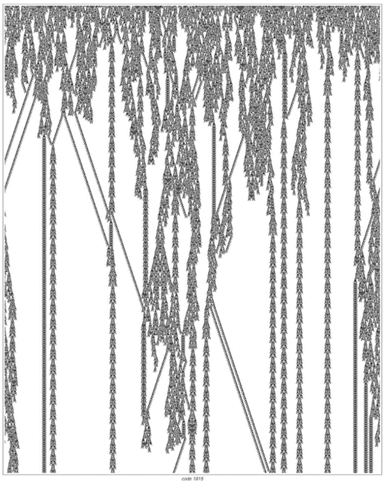
 
>以下是第四类元胞自动机的示例，其全局性规则涉及最近邻，且每个单元格有三种可能的颜色。每幅图片都展示了从随机初始条件开始的1500步演化。

(p 236)

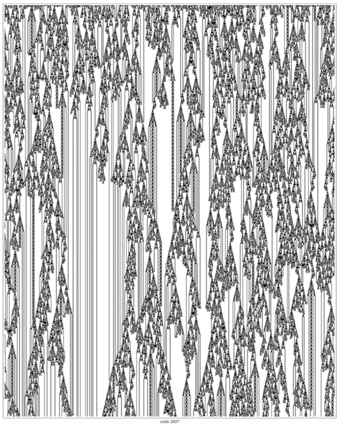
 
(p 237)

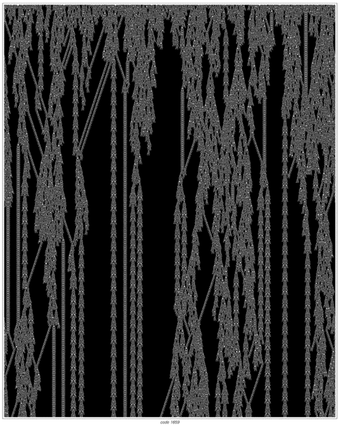
 
(p 238)

 
(p 239)

但是，几乎任何一般的分类方案都不可避免地会出现一些边界情况，这些情况根据一个定义被归入一个类别，而根据另一个定义则被归入另一个类别。元胞自动机也是如此：偶尔会有像下面图片中的规则那样，同时显示出一个类别和另一个类别的某些特征。

但这样的规则相当罕见，而在大多数情况下，所看到的行为完全属于上述四个类别之一。
那么，给定特定元胞自动机的基本规则，能否判断该元胞自动机将产生哪一类行为?

在大多数情况下，没有简单的方法可以做到这一点，事实上，除了运行元胞自动机并观察其行为之外，几乎没有其他选择。

但有时，至少可以从基本规则的形式中判断出一定的信息。例如，可以证明第232页前两列中的所有规则都无法产生除第一类或第二类行为之外的任何行为。

此外，即使从单个规则中很难看出什么，但经常出现的情况是，在某种顺序中相邻的规则具有相似的行为。这可以在对页的图片中看到。规则的第一行都具有第一类行为。但随后出现了第二类行为，接着是第四类，然后是第三类。之后，其余规则大多是第三类。

在对页的图片中，第四类出现在第二类和第三类之间的情况并不罕见。虽然从表面上看，第四类的复杂性高于第三类，但从人们可能认为的整体活动来看，它在某种程度上是第二类和第三类之间的中间状态。

 
>罕见的边界元胞自动机示例，它们不完全符合文本中描述的四个基本类别中的任何一个。基于不同特定属性的不同定义会将这些元胞自动机归入不同的类别。所显示的规则是全局性的，涉及最近邻，且每个单元格有四种可能的颜色。第一条规则可以是第二类或第四类，第二条是第三类或第四类，第三条是第二类或第三类，第四条是第一类、第二类或第三类。
(p 240)

 
>一系列全局性规则，涉及最近邻和每个单元格的四种可能颜色，用于展示具有不同行为类别的规则之间的转换。请注意，第四类似乎出现在第二类和第三类之间。

(p 241)

关键点是，第一类和第二类系统迅速稳定到基本上没有进一步活动的状态。但第三类系统继续有许多细胞在每个步骤中都发生变化，因此从某种意义上说，它们永远保持高水平的活动。然后，第四类系统处于中间状态：它们所表现出的活动既不会像第二类那样完全消失，也不会像第三类那样保持在高水平。

事实上，当观察一个特定的第四类系统时，它往往似乎在第二类和第三类行为之间摇摆不定，从未坚定地选择其中任何一种。

从某些方面来看，在所有可能的元胞自动机中，人们能够识别出一些实际上处于第二类和第三类之间的边界上的元胞自动机，这并不奇怪。但人们在实践中发现的实际第四类系统的显著之处在于，它们具有自己独特的特征——最显著的是局部结构的存在——这似乎与它们处于第二类和第三类之间的边界没有直接关系。

事实证明，具有相同一般特征的第四类系统不仅出现在普通的元胞自动机中，也出现在连续元胞自动机等系统中。

对页展示了我们在第155页讨论的连续元胞自动机序列。这些系统中的基本规则涉及一个参数，该参数可以平滑地从0变化到1。

对于这个参数的不同值，所观察到的行为是不同的。但似乎这种行为基本上属于我们在普通元胞自动机中已经看到的四个类别。事实上，甚至存在与我们在普通第三类元胞自动机中看到的三角形结构相当直接对应的结构。

但是，由于连续元胞自动机具有基于连续参数的底层规则，因此可以询问如果平滑地改变这个参数会发生什么，特别是可以询问最终会看到什么样的行为类别序列。

答案是，通常会有一些第一类或第二类行为的片段，以及一些第三类行为的片段。但在转换过程中，通常会出现第四类行为，如对页所示。特别值得注意的是，这种行为涉及与我们在普通离散第四类元胞自动机中看到的相同类型的局部结构和其他特征。

(p 242)

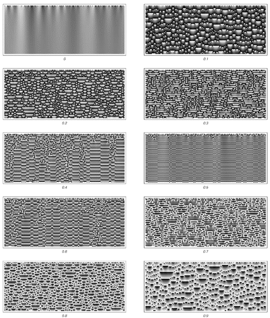
 
>从随机初始条件开始的连续元胞自动机的演化示例。如第155页所述，这里的每个单元格都可以具有0到1之间的任何灰度级，并且在每个步骤中，给定单元格的灰度级由该单元格及其两个相邻单元格的灰度级的平均值确定，加上指定的常数，然后仅保留结果的小数部分。所产生的行为再次分为不同的类别，这些类别与前面几页中普通元胞自动机中看到的四个类别相对应。

(p 243)
 
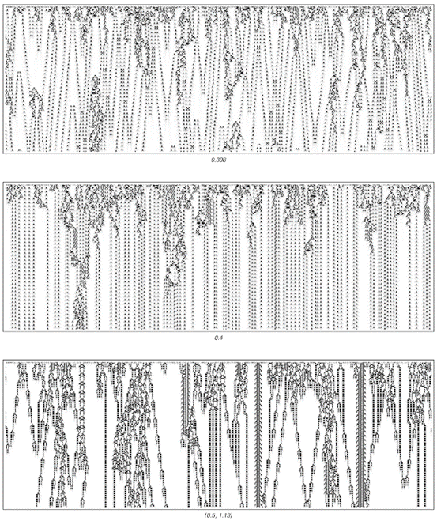

>展示第四类行为的连续元胞自动机示例。规则与上一幅图片中的相同，但在这里显示的第三个案例中，在计算平均值之前，每个相邻单元格的灰度级都乘以1.13。此外，这些图片中的实际灰度级是通过取每个单元格与其相邻单元格灰度级之间的差异获得的，从而去除了上一幅图片中可见的均匀条纹。值得注意的是，在这里展示的连续系统中，仍然可以出现具有离散局部结构的第四类行为。

(p 244)

那么二维元胞自动机呢?它们是否也表现出我们在一维中看到的相同四种行为类别?接下来两页（246、247）的图片展示了从随机初始条件开始的一些简单二维元胞自动机演化的各个步骤。就像在一维中一样，可以立即看到几种不同的行为类别。

但是，如果人们不是观察二维元胞自动机在几个特定步骤中的完整状态，而是观察系统在整个步骤序列中的一维切片，那么与一维的对应关系就会变得更加明显。

第248页的图片展示了这样的切片的例子。我们看到的是，这些切片中的模式与我们之前在一维普通元胞自动机中看到的模式惊人地相似。事实上，通过观察这样的切片，人们可以很容易地识别出一维元胞自动机中相同的四种行为类别。

特别是，人们可以看到第四类行为。然而，在第248页的例子中，这种行为似乎总是叠加在某种重复的背景上——就像在第229页的规则110一维元胞自动机中一样。

那么，人们能否在简单的白色背景下获得第四类行为呢?就像在一维中一样，这似乎不会发生在最简单的规则中。但是，一旦人们转向稍微复杂一点的规则（尽管仍然非常简单），就可以找到这样的例子。

因此，作为一个例子，第249页展示了一个二维元胞自动机，通常被称为“生命游戏”，在这个游戏中，即使在白色背景上也会出现各种局部结构。如果人们观看这个元胞自动机行为的电影，它与一维第四类系统的对应关系并不特别明显。但是，一旦人们观察到一个一维切片（如第249页所示），所看到的内容就会立即与我们在许多一维第四类元胞自动机中看到的内容惊人地相似。

(p 245)

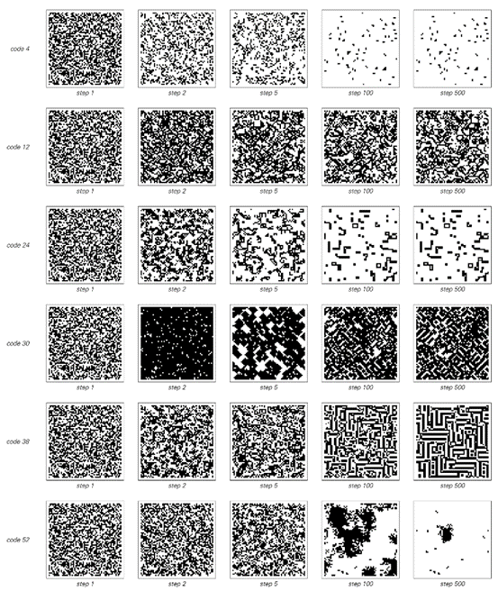
 
>从随机初始条件开始的具有各种总体规则的二维元胞自动机的演化示例。这些规则涉及一个单元格及其四个紧邻的单元格。规则代码号中的每个连续的二进制位给出了当单元格及其四个邻居的总和从5减少到0时的结果。

(p 246)

 
>从随机初始条件开始的二维元胞自动机序列在演化500步后产生的图案。所显示的规则与对页上的规则相同，并包括64种可能性中的大多数，这些可能性使仅包含白色单元格的状态保持不变。

(p 247)

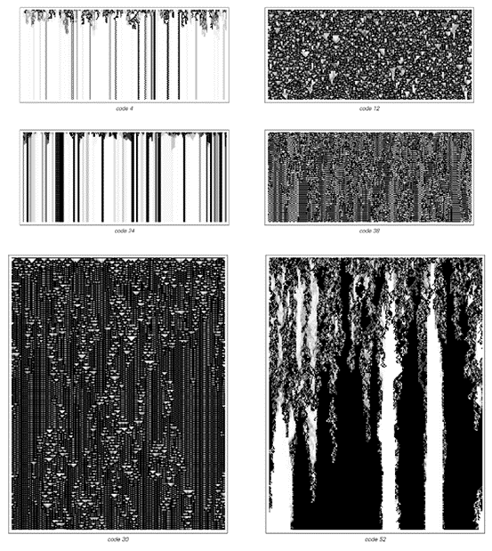
 
>穿过各种二维元胞自动机演化的一维切片。在每张图片中，切片位置后面的黑色单元格以逐渐变浅的灰色阴影显示，就像它们正在退入一种雾状状态一样。请注意，存在第三类和第四类行为的示例，它们与一维中的示例惊人地相似。

(p 248)

 
>在娱乐计算中，第四类二维元胞自动机的行为通常被称为“生命游戏”。在给出的图片中，移动的局部结构（所谓的滑翔机）以条纹的形式出现。这个元胞自动机的规则考虑了单元格的8个邻居（包括对角线）：如果其中两个邻居是黑色的，则单元格保持原来的颜色；如果三个是黑色的，则单元格变为黑色；如果其他任何数量的邻居是黑色的，则单元格变为白色。这个规则是外部总体9邻域代码224。右边的图片显示了在前一步骤中为黑色的单元格，它们以逐渐变浅的灰色阴影显示。

(p 249)

 

