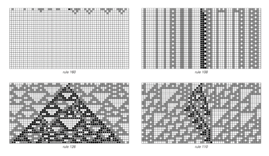
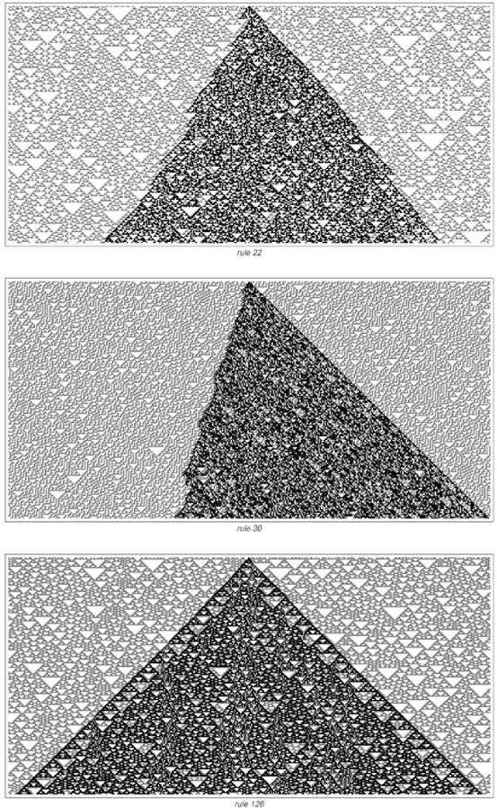
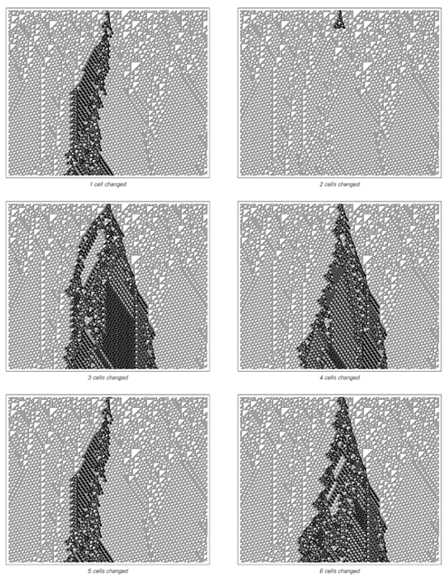
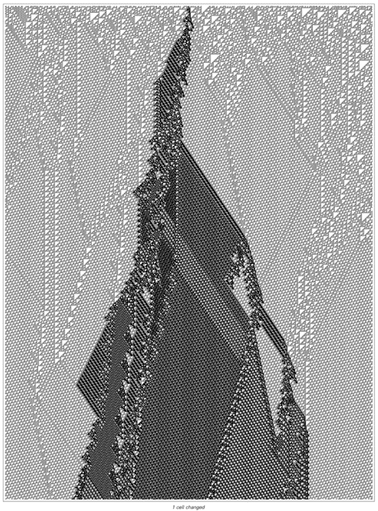

### 6.3  对初始条件的敏感性

在上一节中，我们通过观察元胞自动机产生的图案的总体外观，确定了四类基本的元胞自动机。但这四类元胞自动机还具有其他显著的区别特征，其中一个重要的例子就是它们对初始条件微小变化的敏感性。

下面的图片展示了在之前确定的四类元胞自动机中，改变单个细胞的初始颜色对典型元胞自动机的影响。

每类元胞自动机的结果都大相径庭。
在第一类中，变化总是逐渐消失，而且无论使用什么初始条件，最终都会达到完全相同的状态。在第二类中，变化可能持续存在，但它们总是局限于系统的一个小区域内。然而，在第三类中，行为却截然不同。正如对面页面所示，任何发生的变化通常会以均匀的速度传播，最终影响系统的每个部分。在第四类中，变化也可能传播，但只是以偶发的方式，如对面页面和随后页面所示。

 
>改变在之前确定的四类元胞自动机中典型元胞自动机的初始条件下单个细胞的颜色所产生的影响。黑点表示所有发生变化的细胞。这四类系统中此类变化的行为方式各具特色。

(p 250)

 
>在三个典型的第三类元胞自动机中，改变单个初始细胞颜色的效果。

(p 251)

这些对初始条件变化的不同响应的真正意义是什么？ 在某种程度上，它们揭示了每类系统在处理信息方式上的基本差异。

在第一类中，关于初始条件的信息总是被迅速遗忘——无论初始条件是什么，系统都会迅速演变到一个单一的最终状态，这个状态不会留下任何初始条件的痕迹。

在第二类中，初始条件的一些信息被保留在结构的最终配置中，但这些信息总是完全局限于某一区域，并且绝不会以任何方式在系统的不同部分之间传递。

另一方面，第三类系统的一个特征是它们能够进行远距离的信息通信——因此，系统中任何地方的任何变化几乎最终都会被传递到系统最遥远的部分。

第四类系统再次位于第二类和第三类之间。原则上，远距离的信息通信是可能的，但并不总是发生——因为任何特定的变化只有在影响到系统中移动的局部结构之一时，才会被传递到系统的其他部分。

我们在上一节中确定的四类系统之间存在许多特征性差异。但它们在信息处理上的差异在某些方面尤为重要。事实上，正如我们稍后在本书中将看到的，仅仅通过观察系统处理信息的方式与我们在基本系统类别中所看到的内容是否一致，我们就可以理解自然界中系统的一些最重要的特征。
(p 252)

 
>在规则110第四类元胞自动机中，初始条件的小变化只有在它们被系统中传播的局部结构携带时才会传播。

(p 253)
 

(p 254)

 

