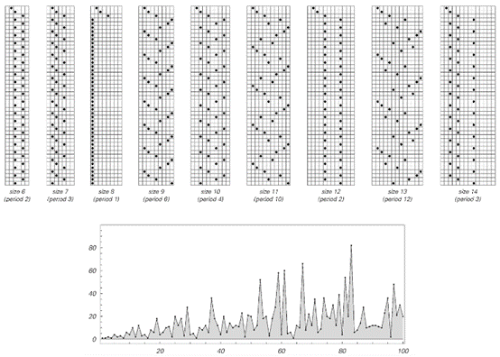
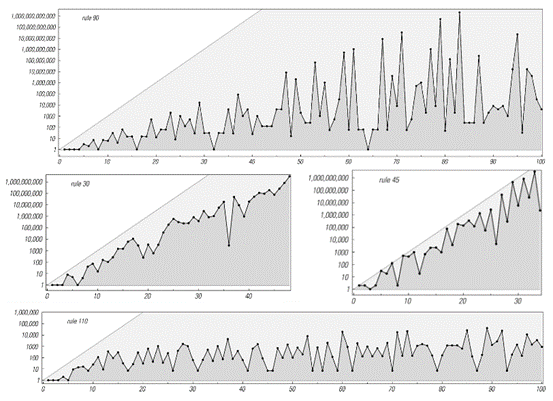

### 6.4  有限尺寸系统与第二类行为

在过去的两节中[2, 3]，我们了解了第二类系统的两个重要特征：首先，它们的行为最终总是重复的；其次，它们不支持任何形式的远距离通信。
那么，这两个特征之间有什么联系呢？
答案是，远距离通信的缺失实际上迫使第二类系统的每一部分表现得好像它是一个有限尺寸的系统。然后，一个普遍的结果是，任何包含离散元素并遵循明确规则的有限尺寸系统，最终都必然表现出重复行为。实际上，正如我们将在下一章中讨论的，正是这一现象最终导致了我们在自然界中看到的许多重复行为。

下面的图片展示了这一基本现象的一个非常简单的例子。在每种情况下，都有一个点可以处于六个可能位置中的一个。在每一步中，该点都向右移动固定数量的位置，一旦到达右端就立即绕回。

 
>一个简单的系统，包含一个可以在六个可能位置中的一个的点。在每一步中，该点向右移动一定数量的位置，一旦到达右端就立即绕回。这个系统的行为，就像其他有限尺寸的系统一样，总是重复的。

(p 255)

通过观察这些图片，我们可以看到所产生的行为总是纯粹的重复行为——尽管不同情况下重复的周期是不同的。重复行为的基本原因是，每当点最终处于特定位置时，它都必须重复它上次在该位置时所做的一切。

但是，由于总共只有六个可能的位置，因此在最多六个步骤之后，该点不可避免地会回到它之前已经到过的位置。这意味着该行为必须以最多六个步骤的周期重复。

下面的图片展示了相同设置的更多示例，但现在可能的位置数量是10和11。在所有情况下，行为都是重复的，并且最大重复周期等于可能的位置数量。

>这是上一页所示系统类型的更多示例，但现在点的可能位置数量为10和11。行为总是在最多10步或11步内重复。但每种情况下的确切步数取决于定义系统的数字的质因数。

(p 256)

有时，实际的重复周期等于这个最大值。但通常它会更小。实际上，有限尺寸系统的一个共同特征是，所看到的重复周期可以极大地依赖于系统的确切大小和它所遵循的确切规则。
在对面页面上所示的系统类型中，事实证明，每当每步移动的位置数与可能位置的总数没有公因数时，重复周期就是最大的——例如，当这两个量中的任何一个是质数时，就会出现这种情况。
下面的图片展示了另一个基于简单规则的有限尺寸系统的示例。特定的规则是在每一步中，表示点位置的数字加倍，一旦超过右端就立即绕回。

>一个系统，其中表示点位置的数字在每一步中加倍，一旦到达右端就立即绕回。（在t步之后，点因此在大小为n的系统中位于位置Mod[2^t, n]。）底部图给出了该系统重复周期作为其大小的函数；对于奇数n，该周期等于MultiplicativeOrder[2, n]。

(p 257)

再次强调，产生的行为始终是重复的，且重复周期永远不会大于点可能位置的总数。但如图所示，随着系统大小的改变，实际重复周期会有很大的波动。事实证明，重复周期再次与点可能位置的数量的因数有关——并且在该数量为质数的情况下往往达到最大。

那么，在像元胞自动机这样的系统中会发生什么呢？

对面页面上的图片展示了一些具有有限数量单元格的元胞自动机的示例。在每种情况下，单元格实际上都排列在一个圆圈周围，因此最右侧单元格的右侧邻居是最左侧单元格，反之亦然。

再次强调，这些系统的行为最终是重复的。但重复周期通常相当大。

对于任何系统，可能的最大重复周期始终等于系统可能状态的总数。

对于我们上面讨论的涉及单个点的系统，可能的状态仅对应于点的可能位置，因此状态的数量等于系统的大小。

但在元胞自动机中，黑白单元格的每种可能排列都对应于系统的一种可能状态。因此，对于n个单元格，有2^n种可能的状态。这个数字随着n的增加而迅速增加：对于5个单元格，已经有32种状态；对于10个单元格，有1024种状态；对于20个单元格，有1,048,576种状态；对于30个单元格，有1,073,741,824种状态。

下一页上的图片展示了各种元胞自动机的实际重复周期。一般来说，随着尺寸的增加而迅速增加是第三类行为的一个特征。然而，在基本规则中，似乎只有规则45产生的周期始终接近2^n的最大值。在所有情况下，随着尺寸的变化，周期都会发生相当大的波动。

那么这一切是如何与第二类行为相关联的呢？在我们刚刚讨论的例子中，我们明确地设置了有限大小的系统。但即使一个系统原则上包含无限数量的单元格，该系统中的一个特定模式也可能只会增长到占据有限数量的单元格。在任何这种情况下，该模式必须在最多2^n步的周期内重复自身，其中n是模式的大小。

(p 258)

 
>具有有限数量单元格的元胞自动机的行为。在每种情况下，最右侧单元格的右侧邻居都被视为最左侧单元格，反之亦然。产生的模式最终总是会重复，但重复周期会随着系统大小的增加而迅速增加。

(p 259)

在具有随机初始条件的第二类系统中，也会发生类似的情况：由于系统的不同部分之间不相互通信，它们都像独立的、有限大小的模式那样行为。事实上，在大多数第二类元胞自动机中，这些模式实际上只跨越了几个单元格，因此它们的重复周期必然相当短。

 
>各种元胞自动机的重复周期与大小的关系。每种情况下使用的初始条件都包含一个黑色单元格，如前一页的图片所示。虚线灰线表示最大可能的重复周期2^n。规则90的最大重复周期为2^((n-1)/2) - 1。对于规则30，峰值重复周期约为2^(0.63n)，而对于规则45，它们接近2^n（例如，当n=29时，周期为463,347,935，占最大可能值的86%）。对于规则110，峰值似乎大致按n^3增加。

(p 260)

 

