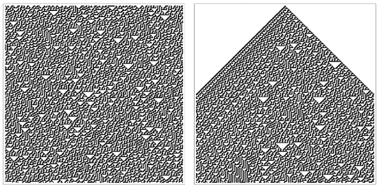
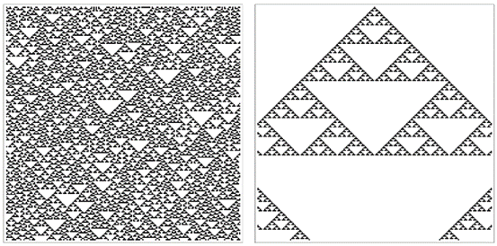
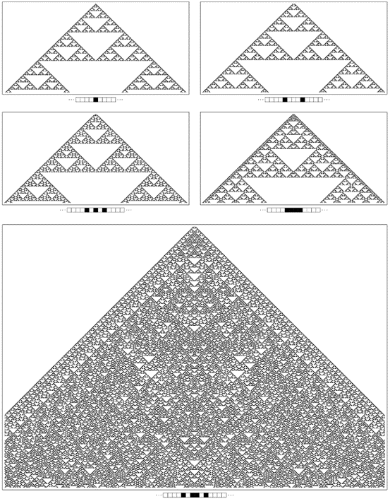
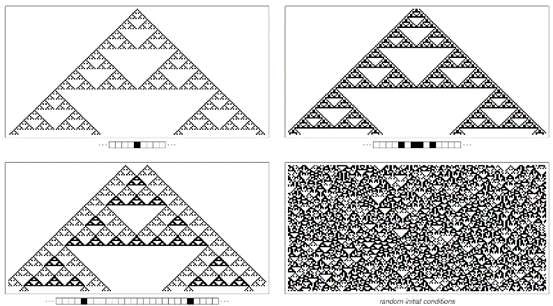
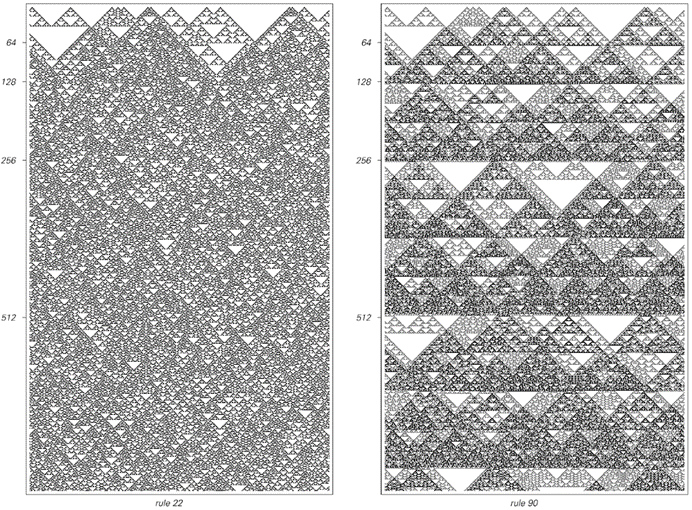

### 6.5  第三类系统中的随机性

当观察第三类系统的行为时，最明显的特征就是其表面的随机性。但这种随机性究竟源自何处？它是否仅仅是初始条件中随机性的某种反映？

初始条件中的随机性——以及对初始条件的敏感依赖性——确实意味着任何第三类系统的行为中至少存在一定程度的随机性。事实上，当我第一次看到第三类元胞自动机时，我认为这就是它们随机性的基本来源。

但我在后来才发现的关键点是，即使初始条件中没有随机性，随机行为也可能发生。事实上，在这本书前面的章节中，我们已经看到了这一基本现象的许多例子。

下面的图片现在比较了从随机初始条件和仅涉及单个黑色细胞的初始条件开始，规则30元胞自动机所发生的情况。

 
>比较从随机初始条件和仅涉及单个黑色细胞的简单初始条件开始的规则30元胞自动机产生的模式。在第二张图片的边缘之外，这些模式看起来惊人地相似。

(p 261)

我们在两种情况下看到的行为迅速变得几乎无法区分。在第一张图片中，随机初始条件确实影响了获得的详细模式。但关键点是，即使没有任何初始随机性，我们在第二张图片中看到的很多东西仍然看起来像典型的第三类随机行为。

那么其他第三类元胞自动机呢？这些系统是否总是在简单的初始条件下产生随机性？

下面的图片展示了一个例子，当初始条件是随机的时，得到了第三类的随机行为，但从一个黑色细胞开始产生的模式却只是简单的嵌套形式。

然而，对面页上的图片表明，如果使用虽然简单但略有不同的初始条件，仍然可以在这种特定的元胞自动机的行为中看到随机性。
 

>从随机初始条件和包含单个黑色细胞的初始条件开始的规则22元胞自动机产生的模式。在随机初始条件下，可以看到典型的第三类行为。但在右侧所示的特定初始条件下，产生了一个简单的嵌套模式。

(p 262)
 

>规则22与各种不同的简单初始条件。在上面的四个案例中，最终产生的模式具有简单的嵌套形式。但在下面的案例中，它在许多方面都表现出随机性，非常类似于规则30。

(p 263)

然而，有少数元胞自动机在随机初始条件下表现出第三类行为，但在简单初始条件下却从未产生显著的随机性。

下面的图片展示了其中一个例子。在这种情况下，事实证明，所有模式实际上都只是从单个黑色细胞开始获得的基本嵌套模式的简单叠加。

因此，当初始条件只涉及黑色细胞的有限区域时，产生的整体模式最终总是具有简单的嵌套形式。事实上，在每个新的白色三角形在中心开始出现的步骤中，整个模式仅由初始条件中黑色细胞区域的两份拷贝组成。

因此，获得随机模式的唯一方法是在初始条件中有无限数量的随机分布的黑色细胞。

 
>规则90在各种初始条件下生成的模式。这个特定的元胞自动机规则具有可加性这一特殊属性，这意味着无论初始条件如何，它产生的模式都可以作为上面显示的第一个模式的简单叠加来获得。因此，任何只在有限区域内包含黑色细胞的初始条件都会导致最终具有简单嵌套形式的模式。因此，与规则30或规则22不同，规则90不能从简单的初始条件中本质上产生随机性。这里显示的最后一张图片中的随机性纯粹是其初始条件中随机性的结果。请注意，上面的图片只显示了规则22在上一页上相应图片的一半进化步骤。

(p 264)

事实上，当使用随机初始条件时，规则90确实能够产生第三类中预期的随机行为。

但是，如果初始条件偏离了完全的随机性，那么这些偏差几乎不可避免地会在系统的进化中显现出来。因此，例如，如果初始黑色细胞的密度较低，那么在后续的各个步骤中也会再次出现相应的低密度，如下面第二张图片所示。

另一方面，对于规则22来说，则没有这样的效果，相反，在仅仅几步之后，初始黑色细胞低密度的可见痕迹就消失了。

 
>从低密度黑色细胞的随机初始条件开始的进化示例。在规则22中，低的初始密度没有长期影响。但在规则90中，其影响永远持续。造成这种差异的原因是，在规则22中，我们所看到的随机性是由系统自身的进化内在产生的，而在规则90中，随机性则来自初始条件的随机性。

(p 265)

在前面的几节中，我们看到所有第三类系统都具有这样的性质：它们产生的详细模式对初始条件的详细变化高度敏感。但是，尽管在细节层面上存在这种敏感性，但关键是像规则22或规则30这样的任何系统所产生的模式的整体性质都很少依赖于给定的初始条件的形式。

通过内在地产生随机性，这样的系统在某种意义上具有某种基本的稳定性：无论对其初始条件进行什么操作，它们仍然给出相同的整体随机行为，具有相同的大规模性质。正如我们将在接下来的几章中看到的那样，自然界中实际上有许多系统的表观稳定性最终正是这种现象的结果。

 

