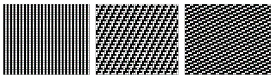
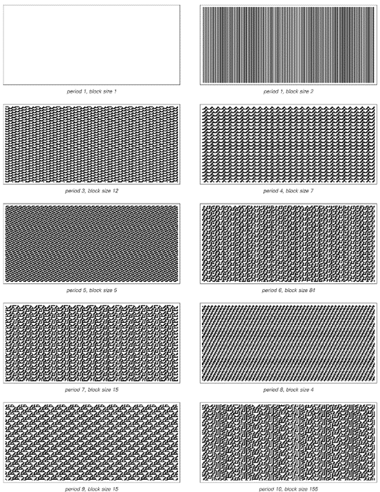
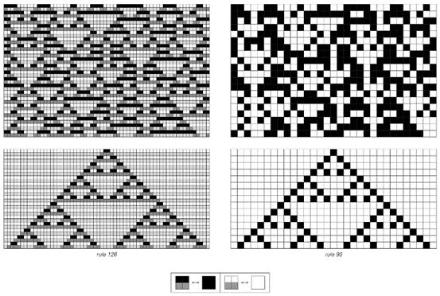
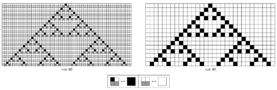
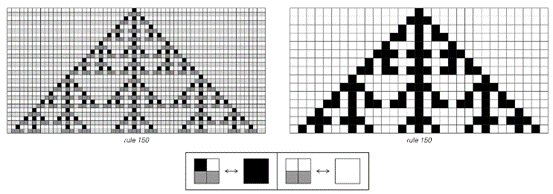
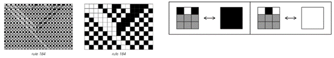
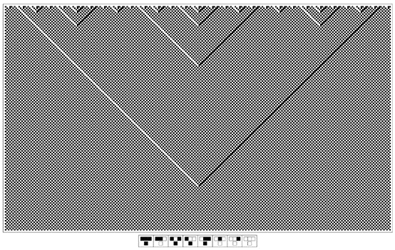
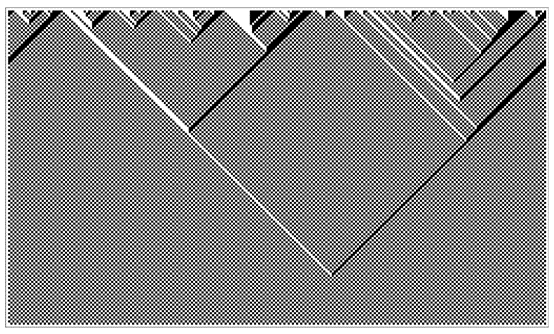
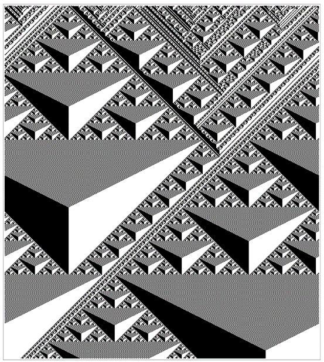

### 6.6  特殊初始条件

我们已经看到，像规则30这样的元胞自动机，无论是从随机初始条件还是从简单初始条件开始，都会产生看似随机的行为。因此，人们可能会想，是否存在某种初始条件，使得规则30的行为变得简单。
作为一个相当简单的例子，我们当然知道，如果其初始状态是完全白色的，那么规则30将永远产生完全白色的结果。但如下面的图片所示，也有可能找到不那么简单的初始条件，仍然使规则30以简单的方式运行。

 
>特殊初始条件的例子，使规则30元胞自动机产生简单的重复行为。在规则30产生的典型随机图案中，可以看到嵌入了与这里所示结构相同的小块。左边是规则30的表示。找到使元胞自动机以一定重复周期运行的初始条件与第210页讨论的满足约束条件的问题密切相关。

(p 266)

事实上，结果表明，在任何元胞自动机中，仅仅由无限重复的固定细胞块组成的初始条件，都不可避免地会导致简单的重复行为。

发生的情况是，每个块实际上都像一个有限大小的系统一样独立地运作。在任何特定块中，最右边细胞的右侧邻居是下一个块的最左边细胞，但由于所有块都是相同的，这个细胞的颜色总是与块本身最左边细胞的颜色相同。因此，该块的发展就像我们在第255页讨论过的有限大小系统之一。这意味着，给定一个宽度为n个细胞的块，所获得的重复周期最多为2n步。

但是，如果想要一个较短的重复周期，那么就会有一个问题，即是否存在任何大小的块可以产生这个周期。下一页的图片展示了在规则30中，为了获得最多十步的重复周期所需要的块。事实证明，没有任何大小的块能给出恰好两步的周期，但可以找到至少直到15步的所有更大周期的块。

但是，对于那些不仅仅由单个块无限重复的初始条件呢？事实证明，对于规则30来说，没有其他类型的初始条件能够产生重复行为。

但对于许多规则——包括相当数量的第三类规则——情况就不同了。例如，下面右侧的图片展示了规则126的一个初始条件，它涉及两个不同的块，但仍然产生了重复行为。

 
>规则126在典型的随机初始条件下，以及在一个由块 和块 的随机序列组成的初始条件下运行。通常，规则126表现出第三类的行为，如左侧所示。但在右侧的特殊初始条件下，它表现得像一个简单的第二类规则。请注意，即使在左侧的图片中，也有第二类行为的斑块。

(p 267)

 
所有根据规则30在10步或更少步数内重复的模式。在每种情况下，初始条件都由一个固定的细胞块组成，该块被反复重复。请注意，没有初始条件能产生恰好两步的重复周期。为了获得11步的周期，需要一个包含275个细胞的块。

(p 268)

从某种意义上说，这里发生的是，尽管规则126通常表现出第三类的行为，但有可能找到特殊的初始条件，使其表现得像一个简单的第二类规则。

事实上，事实证明，对于一个元胞自动机来说，存在使其表现得像另一个元胞自动机的特殊初始条件是相当常见的。

例如，如果从只包含由黑白细胞对组成的块的特殊初始条件开始，规则126的行为将与规则90完全相同。

下面的图片展示了这是如何工作的：在交替的步骤中，规则126中块的排列与规则90中单个细胞的排列完全一致。这解释了为什么在使用简单的初始条件时，规则126会产生与规则90完全相同的嵌套模式。
 

两个例子说明了在特殊初始条件下，规则126的行为与规则90完全相同。所使用的初始条件由细胞块组成，每个块包含两个黑色细胞或两个白色细胞。如果只查看每隔一步的情况，那么这些块的行为与规则90中的单个细胞完全相同。这种对应关系是规则126在简单初始条件下产生与规则90相同类型嵌套模式的基本原因。

(p 269)

关键是，这些初始条件实际上只包含使规则126表现得像规则90的块。因此，在这种情况下，规则126产生的整体模式不可避免地与规则90产生的模式完全相同。

那么，其他能产生类似模式的元胞自动机呢？在这本书中，每当获得像规则90那样的嵌套模式时，都会发现负责的基础规则可以设置为与规则90的行为完全相同。有时，这会发生在只有有限区域内存在黑色细胞的任何初始条件下。但在其他情况下，比如第263页的规则22的例子中，只有相当具体的初始条件才能获得规则90的行为。

那么规则90本身呢？为什么它会产生嵌套模式？

基本原因可以被认为是，正如其他规则在初始条件仅包含某些块时可以模拟规则90一样，规则90也能够以这种方式模拟自己。

下面的图片展示了这是如何工作的。想法是将初始条件视为不是单个细胞的序列，而是每个都包含两个相邻细胞的块的序列。并且，当这些块具有适当的形式时，人们会发现块的配置完全按照规则90进行演化。

单个细胞和整个细胞块都根据相同的规则进行演化，这意味着无论以单个细胞还是细胞块的形式来看，所产生的模式都必须具有完全相同的结构。这只能通过两种方式实现：要么模式本质上是均匀的，要么它必须具有嵌套结构——就像我们在规则90中看到的那样。

 
规则90中细胞块可以表现得像单个细胞一样的事实得到了证明。这其中的一个结果是，规则90产生的模式具有嵌套或自相似的形式。

(p 270)

那么其他规则呢？事实证明，在元胞自动机规则中，自我模拟的特性是相当罕见的。但另一个例子是规则150——如下面第一组图片所示。

那么规则90和规则150之间还有什么共同点呢？事实证明，它们都是加法规则，这意味着它们产生的模式可以像我们在第264页上讨论的那样进行叠加。事实上，人们可以证明任何加法规则都能够模拟自己，因此会产生嵌套模式。但是加法规则相当少，事实上，在两种颜色和最近邻的情况下，唯一根本不同的正是规则90和150。

然而，最终，能够模拟自己的规则并不仅仅是加法规则。另一种类型的例子是规则184，其中三个细胞的块可以像单个细胞一样工作，如第二组图片所示。

 
细胞块可以表现得像单个细胞的规则的另一个例子。规则90和规则150也是唯一从根本上不同的、具有加法特性的基本元胞自动机规则（参见第264页）。

 
一个不是加法规则，但细胞块可以再次表现得像单个细胞的规则。

(p 271)

使用我们到目前为止所使用的简单初始条件，该规则将始终产生基本上无关紧要的行为。但是，查看规则属性的一种方法是使用嵌套初始条件，例如从我们在第82页上讨论的替换系统中获得。

对于大多数规则（包括90和150），这样的嵌套初始条件通常会产生与典型随机初始条件获得的结果最终无法区分的结果。但对于规则184，适当选择嵌套初始条件会产生下面所示的高度规则的模式。
 

从嵌套初始条件演化而来的规则184产生的模式（显示在左侧）。所示的特定初始条件可以通过应用替换系统 -> , -> ，从一个单独的黑色元素 开始获得（参见第83页）。在此初始条件下，规则184表现出相同数量的黑色和白色条纹，它们成对地相互抵消，从而产生规则的嵌套模式。

(p 272)

这个模式中看到的嵌套结构可以看作是规则184能够模拟自己的结果。下面的图片显示，即使使用的初始条件是随机的，规则184——与任何加法规则都不同——仍然会产生可识别的嵌套模式。

正如我们将在第338页看到的那样，当初始条件中黑色和白色细胞的数量相等时，这种模式的存在尤为明显——但这些细胞的排列方式通常并不太重要。而且，一般来说，人们可以找到相当多的元胞自动机，它们即使从随机初始条件开始，也能像规则184那样产生嵌套模式。下一页的图片展示了一个特别引人注目的例子，其中形成了明确的区域，这些区域包含与规则90具有相同整体结构的模式。

 
规则184从随机初始条件开始演化。与之前图片中看到的类似，嵌套结构仍然可见。当初始条件中黑色和白色细胞的数量相等时，这种结构的存在最为明显，但它并不依赖于这些细胞排列的任何规律性。

(p 273)

 
另一个例子是，即使从随机初始条件开始，元胞自动机也能产生嵌套模式。所显示的特定规则涉及次近邻以及最近邻，其规则编号为4067213884。与规则184一样，当初始条件中黑色和白色细胞的密度相等时，这里看到的嵌套行为最为明显。

(p 274)

 

