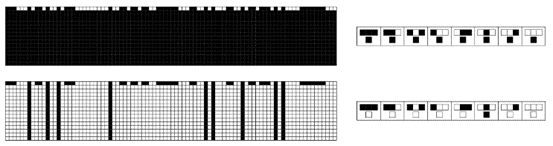
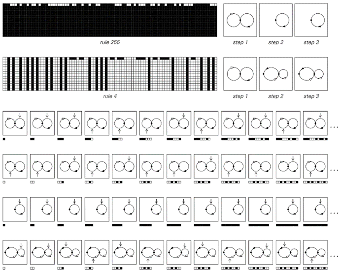
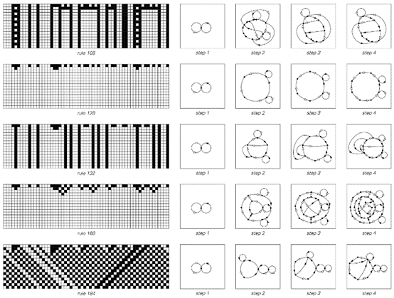
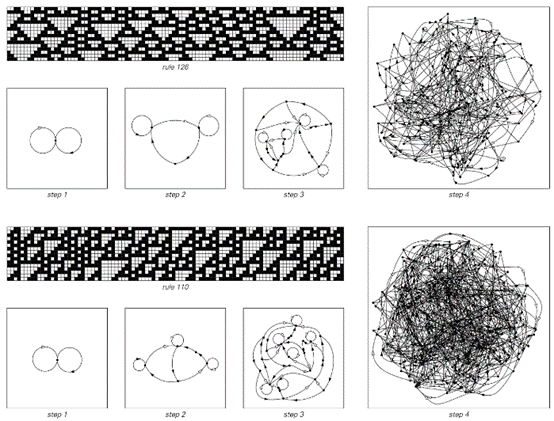
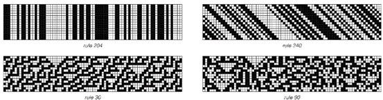
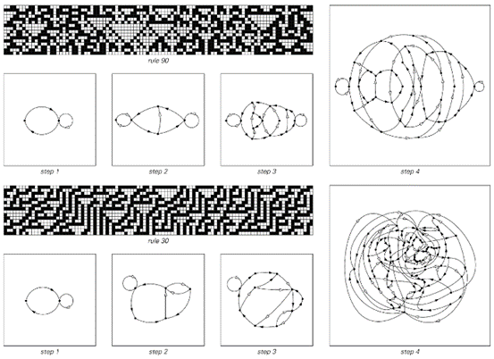

### 6.7  吸引子的概念

在本章中，我们已经看到了许多由随机初始条件开始，然后经过多步元胞自动机演化产生的模式示例。

但是，关于每一步出现的黑白细胞个体配置，我们可以说些什么呢？在随机初始条件下，绝对可以出现任何序列的黑白细胞。但是，大多数元胞自动机的一个特点是，在后续步骤中，可以产生的序列逐渐变得更加受限。

下面的第一张图显示了1类元胞自动机的一个极端示例，其中仅经过一步，能出现的唯一序列就是只包含黑色细胞的序列。

所得配置可以视为元胞自动机演化的所谓吸引子。无论从哪些初始条件开始，最终都会达到相同的全黑吸引子。这种情况与物理摆等机械系统中发生的情况有些相似。无论以何种配置启动摆锤，它总是会趋向于演化到垂直悬挂的配置。

下面的第二张图显示了2类元胞自动机，它在经过一步后再次演化到吸引子。但现在，吸引子不仅仅由单个配置组成，而是由所有配置组成，在这些配置中，黑色细胞只在其每一侧都至少被一个白色细胞包围时出现。

 
>示例中的简单元胞自动机在经过一步后演化到吸引子，其中只能出现特定序列的黑白细胞。在第一种情况下，能出现的序列是只涉及黑色细胞的序列。在第二种情况下，序列是每一个黑色细胞都被白色细胞包围的序列。所示规则编号为255和4。

(p 275)

下面的图片表明，对于这种特定配置，通常存在许多不同的初始条件可以导致它。在机械类比中，每个可能的最终配置都像一个盆地中的最低点——而盆地中任何地方的球都会滚向那个最低点。

对于一维元胞自动机，事实证明，有一种相当简洁的方法来总结在其演化的任何给定步骤中可能出现的所有黑白细胞序列。

基本思想是构建一个网络，其中每个这样的黑白细胞序列都对应一个可能的路径。

在对面页面顶部的图片中，每种情况下的第一个网络代表随机初始条件，其中任何可能的黑白细胞序列都可能出现。从中间的节点开始，你可以在网络中按任意顺序围绕左环或右环任意次数——这代表黑白细胞可以按任意顺序出现任意次数的事实。

然而，在对面页面规则255的例子中的第2步，网络只有一个环——这代表在这一步，使用此规则只能出现完全由黑色细胞组成的序列，正如我们在上一页看到的那样。

规则4的情况稍微复杂一些：在第2步，可能出现的序列现在由一个具有两个节点的网络表示。从右侧的节点开始，你可以围绕右侧的环任意次数，这对应于任意数量的白色细胞序列。在任何时候，你都可以沿着箭头向左移动以获得一个黑色细胞，但网络的形式意味着这个黑色细胞后面必须至少跟一个白色细胞。

四种不同的初始条件在规则4的元胞自动机中均导致相同的最终状态，如前一页所示。这个最终状态可以视为元胞自动机演化可能的一个吸引子；而所显示的初始条件则代表了这个吸引子的吸引域中的不同元素。

(p 276)

下一页的图片展示了更多1类和2类元胞自动机的例子。与下面的图片不同，这些规则不是在一步之后就达到最终状态，而是逐渐演化到这些状态。在这个演化的过程中，可能出现的序列集合逐渐变小。

例如，在规则128中，黑色区域在每一步都会在其两侧各缩小一个细胞的事实意味着，在t步之后仍然存在的任何黑色区域，在其两侧都必须至少有t个白色细胞。

下一页所示的网络捕获了所有这样的效果。为了做到这一点，我们看到在连续的步骤中，它们变得稍微复杂一些。但至少对于这些1类和2类的例子，网络的演进总是保持着一个相当简单的形式。

 
这些网络代表了在上述两个元胞自动机演化过程中，连续步骤中可能出现的黑白细胞序列。在每种情况下，可能的序列都对应着网络中可能的路径。两个规则都从第一步开始，以随机初始条件为起点，其中允许所有黑白细胞序列。在后续步骤中，规则255只允许包含黑色细胞的序列，而规则4允许包含黑色和白色细胞的序列，但要求每个黑色细胞都必须被白色细胞包围。

(p 277)

那么3类和4类系统会发生什么呢？对面页面的图片给出了几个例子。在规则126中，第2步的唯一效果是黑色细胞不能再单独出现：它们必须总是以两个或两个以上的组合形式出现。到了第3步，如果只看元胞自动机演化的明确图片，就很难看出任何变化。但从网络图来看，现在发现从长度为12的块 开始，其他无限多的块都被禁止了。在后续步骤中，允许的序列集合迅速变得更加复杂——这反映在相应网络复杂性的迅速增加上。
 

这些网络代表了几个1类和2类元胞自动机在连续步骤演化中可能出现的黑白细胞序列。这些网络在t步之后永远不会超过大约t²个节点。

(p 278)

事实上，这种网络复杂性的迅速增加是大多数3类和4类规则的一般特征。但事实证明，有几个规则最初看起来像是例外。

下一页顶部的图片显示了四个不同的规则，它们都具有这样的特性：如果从允许所有可能的细胞序列的初始条件开始，这些相同的序列在演化的任何后续步骤中仍然可以出现。
所显示的前两个规则表现出非常简单的2类行为。但最后两个则表现出典型的3类行为。

然而，正在发生的事情是，从某种意义上说，允许所有可能序列的特定初始条件对于这些规则来说是特殊的。

这些网络代表了典型3类和4类元胞自动机在连续步骤演化中可能出现的黑白细胞序列。这些网络中的节点数量似乎以至少是指数级的速度增加。

 
这些网络代表了典型3类和4类元胞自动机在连续步骤演化中可能出现的黑白细胞序列。这些网络中的节点数量似乎以至少是指数级的速度增加。

(p 279)

事实上，如果几乎从任何其他初始条件开始——比如说，不允许任何两个黑色细胞在一起的初始条件，那么正如下面第二组图片所示，同样会观察到允许的序列集合的复杂性迅速增加。
 

这些元胞自动机的例子在其演化的任何步骤中都继续允许所有可能的黑白细胞序列。这样的元胞自动机实际上定义了所谓的满射或到上映射。

 
这些网络代表了从只允许黑色细胞成对出现的初始条件开始，页面上方元胞自动机演化中可能出现的序列。

(p 280)

 

