### 6.8  四级系统中的结构

下一页展示了三个典型的四级元胞自动机示例。在每个示例中，所使用的初始条件都是完全随机的。但仅仅经过几步之后，系统就会自行组织，直至出现明显的结构。

这些结构中的大多数最终都会消亡，有时消亡的方式相当复杂。但四级系统的关键特征在于，其中必须始终存在某些能够永远持续存在的结构。

那么，如何确定特定元胞自动机中的这些结构是什么呢？一种方法是逐一尝试每种可能的初始条件，观察它是否会导致新的持续结构出现。以下一页顶部的代码20元胞自动机为例，接下来的页面展示了在这个系统中，每个前几百种可能的初始条件下所发生的情况。

在大多数情况下，所有结构都会消亡。但当我们达到第151个初始条件时，终于看到了一个持续存在的结构。

这个特定的结构相对简单：它只是固定在某个位置，并且每两步重复一次。但并不是所有持续存在的结构都这么简单。实际上，在第187个初始条件下，我们看到了一个复杂得多的结构，它并没有静止不动，而是系统地向右移动，并且其基本形式每9步重复一次。

移动结构的存在是四级系统的一个基本特征。正如我们在第252页所讨论的那样，正是这些结构使得信息能够在四级系统的不同部分之间传递——并最终使四级系统呈现出复杂的行为特征。

但是，在现在看到了使用初始条件187得到的结构之后，我们可能会假设，在代码20元胞自动机中随后出现的所有结构至少与这个一样复杂。然而，事实证明，初始条件189突然产生了一个更简单的结构——这个结构在每个步骤中都保持不变。

但是，当我们继续看到初始条件195时，我们再次发现了一个更复杂的结构——这次的结构每22步重复一次。

(p 281)

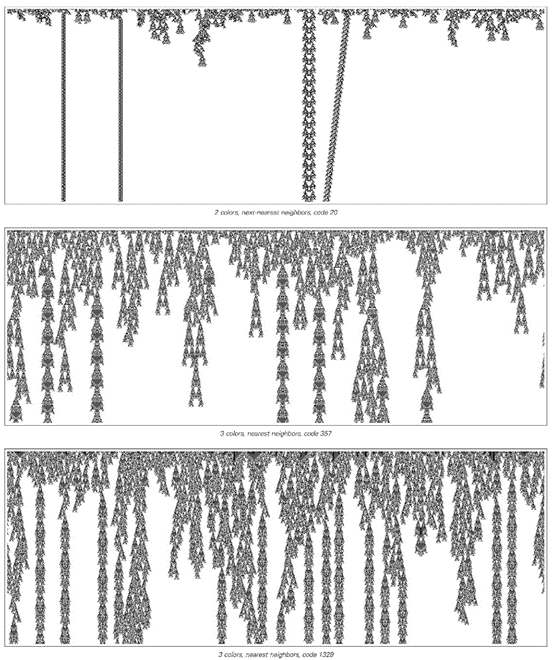
 
>这是三个典型的四级元胞自动机示例。在每个示例中，都可以看到各种持续存在的结构。

(p 282)
 
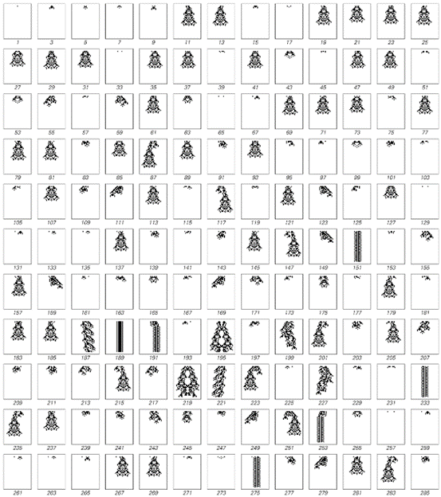

>对面页面顶部的代码20元胞自动机在所有初始条件下的行为，这些初始条件在小于9个单元格大小的区域内包含黑色单元格。在大多数情况下，产生的图案会简单地消亡。但在某些初始条件下，会形成持续存在的结构。每个初始条件都被分配了一个数字，其二进制数字序列给出了该初始条件下黑色和白色单元格的配置。请注意，初始条件195和219都产生了下一页所示的周期为22的持续结构。

(p 283)

那么，代码20元胞自动机最终支持哪些结构呢？似乎没有简单的方法来确定，但下面的图片显示了我通过明确查看前二十五亿个可能的初始条件的演化过程而发现的所有结构。
还有其他可能的结构吗？下面图片中最大的结构始于一个30个单元格宽的块。而在30到34个单元格宽之间的超过十亿个块中，完全没有出现新的结构。然而，事实上，其他结构是可能的。要确定这一点的方法是，对于小的重复周期，有一个系统的程序可以让人找到具有给定周期的所有结构。

对面页面的图片展示了使用此程序得到的重复周期长达15步的结果。对于所有重复周期（除了7之外）长达10步的情况，最终都至少存在一个固定或移动的结构。然而，对于给定的周期，最小的结构往往相当大，例如，在周期为6的情况下，最小的可能结构宽达64个单元格。

 
>上一页显示的代码20元胞自动机通过测试前二十五亿个可能的初始条件找到的持续存在结构。请注意，所显示结构的反射版本也是可能的。给出的数字的二进制数字序列与每个初始条件相对应，如上一页所示。

(p 284)

那么，其他四级元胞自动机（如本节开头我展示的那些）又如何呢？它们是否也最终会有复杂的可能持续存在的结构集？

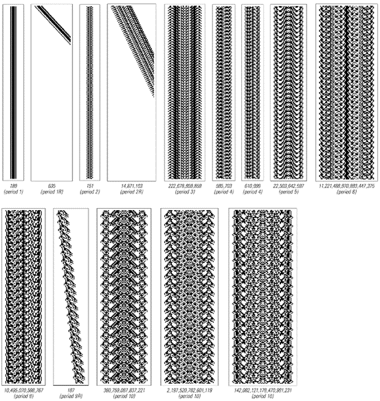
 
>代码20元胞自动机中所有重复周期长达15步的持续存在结构。所示结构是通过类似于在第268页上找到所有满足约束条件的序列所使用的系统方法找到的。

(p 285)

下面的图片显示了通过明确测试第282页上代码357元胞自动机的前二十亿个可能的初始条件所找到的结构。

仅在初始条件编号28时，就出现了一个相当复杂的周期为48的结构。但在前一百万个初始条件中，只产生了另一个结构，而且这个结构同样是不移动的。
那么，在代码357元胞自动机中，移动结构实际上是否可能呢？根据我使用许多不同规则的经验，每当出现足够复杂的持续存在结构时，最终都可以找到移动的结构。事实上，在代码357中，初始条件4,803,890就产生了这样一个结构。

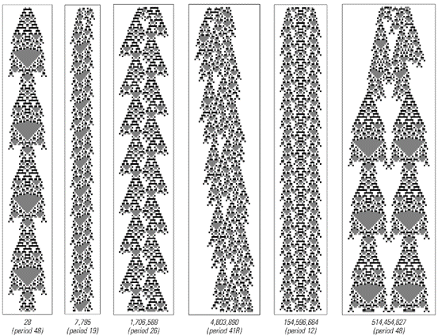

>第282页上的代码357元胞自动机中，通过测试前二十亿个可能的初始条件获得的持续存在结构。这个元胞自动机允许每个单元格有三种可能的颜色；因此，初始条件对应于给定数字的3进制数字。在这个元胞自动机中，重复周期小于5步的情况下，不存在任何大小的持续存在结构。

(p 286)

那么，如果四级系统中的移动结构是不可避免的，那么在查看足够多的大型初始条件时，我们可能会看到哪些其他根本不同类型的结构呢？

下面的图片展示了从第282页底部开始的代码1329元胞自动机中找到的前几个持续存在结构。最小的结构是静止的，但在初始条件916下，发现了一个移动的结构——这与我们刚刚讨论的其他两个四级元胞自动机中的情况非常相似。

但是，当达到初始条件54,889时，人们突然看到了下一页上展示的相当不同的结构类型。这个结构的右半部分以256步的周期重复，但随着这部分的移动，它留下了一系列其他持续存在的结构。结果是，整个结构继续无限增长，逐渐增加越来越多的单元格。
 
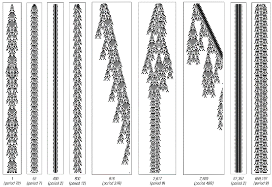

>第282页上显示的代码1329元胞自动机中的持续存在结构。

(p 287)

然而，看下面的图片，人们可能会认为，当发生无限增长时，产生的模式必须相当复杂。但代码1329再次带来了惊喜。因为对面页面显示，当达到初始条件97,439时，又发生了无限增长——但现在产生的模式非常简单。事实上，如果有人只看到这种模式，他们可能会认为它来自一个典型行为远比代码1329简单的规则。

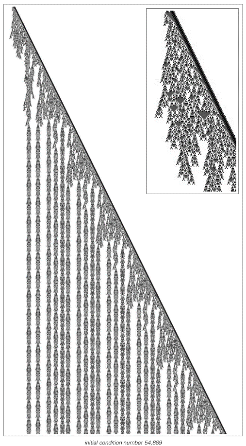
 
>代码1329中的无限增长。初始条件包含一个由10个单元格组成的块。该模式的右侧每256步重复一次，并且在移动时留下无限序列的持续存在结构。

(p 288)
 
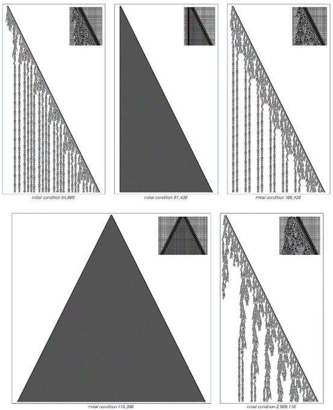

>代码1329中无限增长的更多示例。产生的模式大多很复杂，但也有一些很简单。

(p 289)

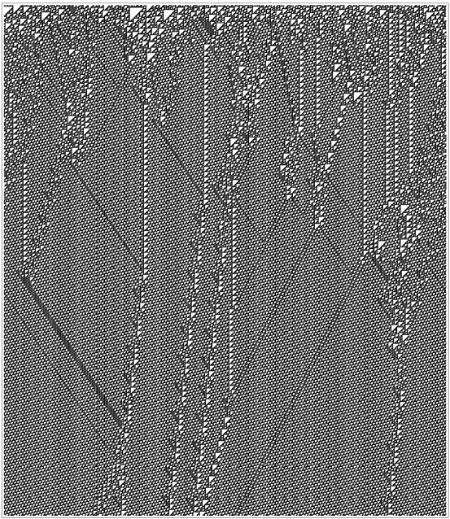
 
>规则110元胞自动机在随机初始条件下的典型行为示例。背景模式由每7步重复一次的14个单元格块组成。

(p 290)

实际上，四级元胞自动机的一个普遍特征是，在适当的初始条件下，它们可以模拟各种其他系统的行为。在第十一章讨论计算和通用性概念时，我们将看到这一结果的根本原因。但目前的主要观点是四级元胞自动机的行为可以多么多样化和复杂——即使它们的基本规则非常简单。

也许最引人注目的例子是我们首次在第32页上看到的规则110元胞自动机。它的规则极其简单——只涉及最近的邻居和两种颜色的单元格。但其整体行为与我们见过的任何系统一样复杂。

对面页面展示了在随机初始条件下的一个典型示例。与我们之前讨论的其他四级规则的一个立即的细微差别是，规则110中的结构不是存在于空白背景上，而是出现在由每7步重复一次的14个单元格块组成的规则重复模式中的中断处。

下一页展示了在规则110中，可以从宽度小于40个单元格的块中生成的持续存在结构的类型。就像其他四级规则一样，这里有静止结构和移动结构——以及可以通过重复它们包含的块来扩展的结构。

那么，在规则110中是否存在表现出无限增长的结构呢？当然，找到它们并不容易。但如果观察宽度为41的块，那么这样的结构最终会出现，正如第293页的图片所示。
那么，规则110中的各种结构是如何相互作用的呢？答案，如第294-296页所示，可能非常复杂。

在某些情况下，一个结构基本上只是稍微延迟地穿过另一个结构。但通常，两个结构之间的碰撞会产生一连串的新结构。有时，碰撞的结果在几步之后就显而易见。但往往需要经过非常大量的步骤之后，才能确定将要发生什么。

因此，尽管像规则110这样的四级系统中的单个结构可能以相当重复的方式表现，但这些结构之间的相互作用可能导致极其复杂的行为。

(p 291)
 
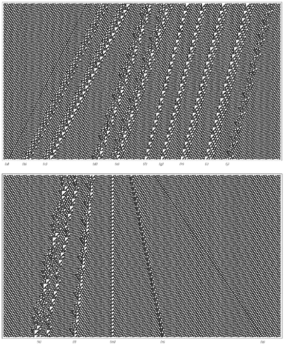

>在规则110中发现的持续存在结构。除了结构（a）和（j）之外，所有结构都存在扩展版本。结构（m）和（n）也存在相对于背景的偏移的替代形式。

(p 292)

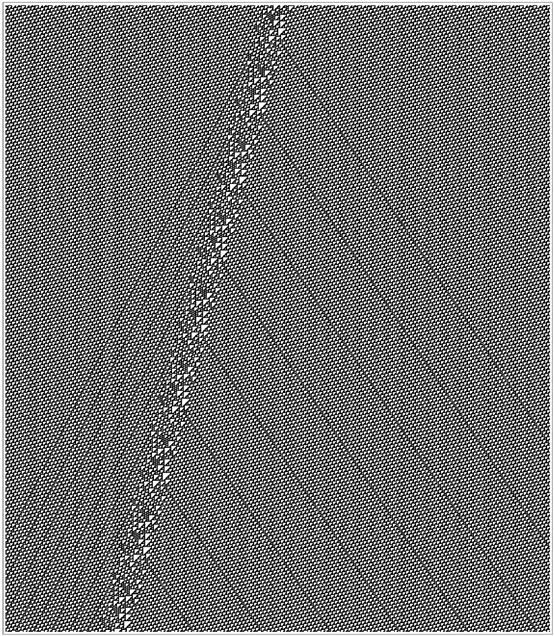
 
>规则110中无限增长的一个例子。初始条件由插入到背景块之间的长度为41的块组成。每77步，左右两侧都会产生新的结构；在每个周期中，中心结构向左移动20个单元格，使得左侧的结构相隔37步，而右侧的结构相隔107步。

(p 293)

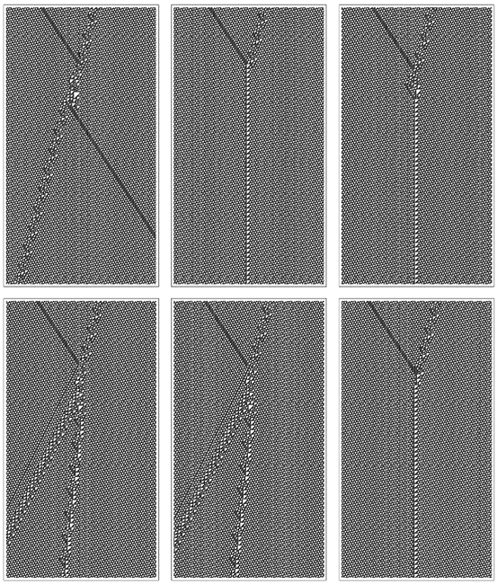
 
>来自第292页的持续存在结构（o）和（j）之间的碰撞。（第一个结构实际上是包含四个第292页结构（o）副本的扩展形式。）每一张连续的图片都展示了当原始结构开始逐渐远离时发生的情况。

(p 294)

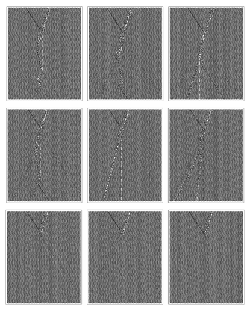
 
>来自第292页的结构（o）和（e）之间的碰撞。

(p 295)

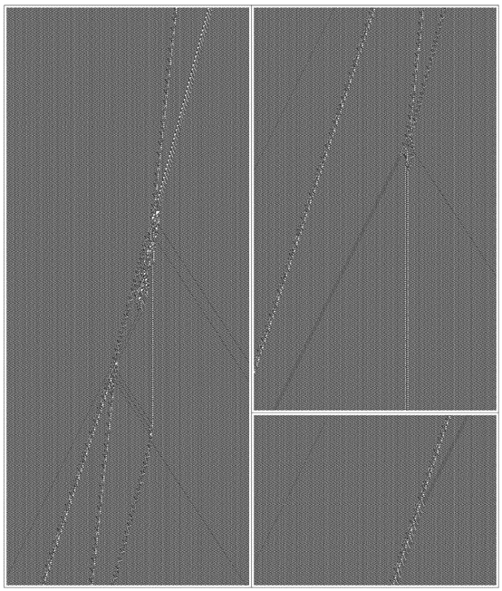
 
>来自第292页的结构（l）和（i）之间的碰撞。最终涉及8个独立结构的结果需要4000多步才能清晰显现。图片的高度对应于2000步，而第三张图片在第4300步时结束。

(p 296)
 

